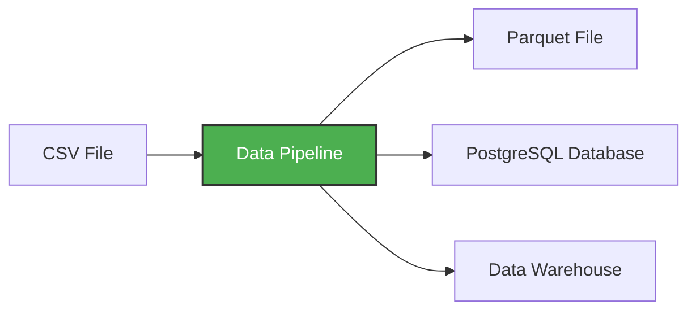

# Virtual Environments and Data Pipelines

**[↑ Up](README.md)** | **[← Previous](01-introduction.md)** | **[Next →](03-postgres-docker.md)**

A **data pipeline** is a service that receives data as input and outputs more data. For example, reading a CSV file, transforming the data somehow and storing it as a table in a PostgreSQL database.



In this workshop, we'll build pipelines that:
- Download CSV data from the web
- Transform and clean the data with pandas
- Load it into PostgreSQL for querying
- Process data in chunks to handle large files

## Creating a Simple Pipeline

Let's create an example pipeline. First, create a directory `pipeline` and inside, create a file  `pipeline.py`:

```python
import sys
print("arguments", sys.argv)

day = int(sys.argv[1])
print(f"Running pipeline for day {day}")
```

Now let's add pandas:

```python
import pandas as pd

df = pd.DataFrame({"A": [1, 2], "B": [3, 4]})
print(df.head())

df.to_parquet(f"output_day_{sys.argv[1]}.parquet")
```

## Why Virtual Environments?

We need pandas, but we don't have it. We want to test it before we run things in a container.

We can install it with `pip`:

```bash
pip install pandas pyarrow
```

But this installs it globally on your system. This can cause conflicts if different projects need different versions of the same package.

Instead, we want to use a **virtual environment** - an isolated Python environment that keeps dependencies for this project separate from other projects and from your system Python.

## Using uv - Modern Python Package Manager

We'll use `uv` - a modern, fast Python package and project manager written in Rust. It's much faster than pip and handles virtual environments automatically.

```bash
pip install uv
```

Now initialize a Python project with uv:

```bash
uv init --python=3.13
```

This creates a `pyproject.toml` file for managing dependencies and a `.python-version` file.

### Comparing Python Versions

```bash
uv run which python  # Python in the virtual environment
uv run python -V

which python        # System Python
python -V
```

You'll see they're different - `uv run` uses the isolated environment.

### Adding Dependencies

Now let's add pandas:

```bash
uv add pandas pyarrow
```

This adds pandas to your `pyproject.toml` and installs it in the virtual environment.

### Running the Pipeline

Now we can execute the file:

```bash
uv run python pipeline.py 10
```

We will see:

* `['pipeline.py', '10']`
* `job finished successfully for day = 10`

## Git Configuration

This script produces a binary (parquet) file, so let's make sure we don't accidentally commit it to git by adding parquet extensions to `.gitignore`:

```
*.parquet
```

**[↑ Up](README.md)** | **[← Previous](01-introduction.md)** | **[Next →](03-postgres-docker.md)**
