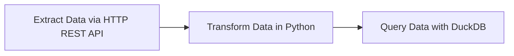

# Getting Started Pipeline

This introductory flow is added just to demonstrate a simple data pipeline which extracts data via HTTP REST API, transforms that data in Python and then queries it using DuckDB. For this stage, a new separate Postgres database is created for the exercises.

Add the flow [`03_getting_started_data_pipeline.yaml`](flows/03_getting_started_data_pipeline.yaml) from the UI if you haven't already and execute it to see the results. Inspect the Gantt and Logs tabs to understand the flow execution.

## Resources
- [ETL Tutorial Video](https://go.kestra.io/de-zoomcamp/etl-tutorial)
- [ETL in 3 Minutes](https://go.kestra.io/de-zoomcamp/etl-get-started)
