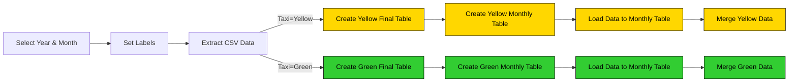

# Local DB: Load Taxi Data to Postgres

Before we start loading data to GCP, we'll first play with the Yellow and Green Taxi data using a local Postgres database running in a Docker container. We will use the same database from Module 1 which should be in the same Docker Compose file as Kestra.

The flow will extract CSV data partitioned by year and month, create tables, load data to the monthly table, and finally merge the data to the final destination table.

The flow code: [`04_postgres_taxi.yaml`](flows/04_postgres_taxi.yaml).

> [!NOTE]
> The NYC Taxi and Limousine Commission (TLC) Trip Record Data provided on the [nyc.gov](https://www.nyc.gov/site/tlc/about/tlc-trip-record-data.page) website is currently available only in a Parquet format, but this is NOT the dataset we're going to use in this course. For the purpose of this course, we'll use the **CSV files** available [here on GitHub](https://github.com/DataTalksClub/nyc-tlc-data/releases). This is because the Parquet format can be challenging to understand by newcomers, and we want to make the course as accessible as possible — the CSV format can be easily introspected using tools like Excel or Google Sheets, or even a simple text editor.

## Resources
- [Docker Compose with Kestra, Postgres and pgAdmin](docker-compose.yml)
