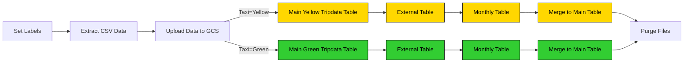

# GCP Workflow: Load Taxi Data to BigQuery

Now that Google Cloud is set up with a storage bucket, we can start the ELT process.

```mermaid
graph LR
  SetLabel[Set Labels] --> Extract[Extract CSV Data]
  Extract --> UploadToGCS[Upload Data to GCS]
  UploadToGCS -->|Taxi=Yellow| BQYellowTripdata[Main Yellow Tripdata Table]:::yellow
  UploadToGCS -->|Taxi=Green| BQGreenTripdata[Main Green Tripdata Table]:::green
  BQYellowTripdata --> BQYellowTableExt[External Table]:::yellow
  BQGreenTripdata --> BQGreenTableExt[External Table]:::green
  BQYellowTableExt --> BQYellowTableTmp[Monthly Table]:::yellow
  BQGreenTableExt --> BQGreenTableTmp[Monthly Table]:::green
  BQYellowTableTmp --> BQYellowMerge[Merge to Main Table]:::yellow
  BQGreenTableTmp --> BQGreenMerge[Merge to Main Table]:::green
  BQYellowMerge --> PurgeFiles[Purge Files]
  BQGreenMerge --> PurgeFiles[Purge Files]

  classDef yellow fill:#FFD700,stroke:#000,stroke-width:1px,color:#000
  classDef green fill:#32CD32,stroke:#000,stroke-width:1px,color:#000
```

The flow code: [`08_gcp_taxi.yaml`](flows/08_gcp_taxi.yaml).
