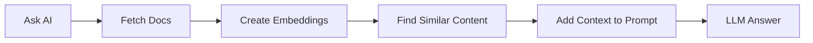

# Bonus: Retrieval Augmented Generation (RAG)

To further learn how to provide context to your prompts, this bonus section demonstrates how to use RAG.

## What is RAG?
**RAG (Retrieval Augmented Generation)** is a technique that:
1. **Retrieves** relevant information from your data sources
2. **Augments** the AI prompt with this context
3. **Generates** a response grounded in real data

This solves the hallucination problem by ensuring the AI has access to current, accurate information at query time.

*RAG adds a retrieval path between the question and the model so answers can be grounded in current source material.*

## How RAG Works in Kestra

**The Process:**
1. **Ingest documents**: Load documentation, release notes, or other data sources
2. **Create embeddings**: Convert text into vector representations using an LLM
3. **Store embeddings**: Save vectors in Kestra's KV Store (or a vector database)
4. **Query with context**: When you ask a question, retrieve relevant embeddings and include them in the prompt
5. **Generate response**: The LLM has real context and provides accurate answers

## Exercise: Retrieval With vs Without Context
**Objective:** Understand how RAG eliminates hallucinations by grounding LLM responses in real data.

**Part A: Without RAG**
1. Navigate to the [`10_chat_without_rag.yaml`](flows/10_chat_without_rag.yaml) flow in your Kestra UI
2. Click **Execute**
3. Wait for the execution to complete
4. Open the **Logs** tab
5. Read the output - notice how the response about "Kestra 1.1 features" is:
   - Vague or generic
   - Potentially incorrect
   - Missing specific details
   - Based only on the model's training data (which may be outdated)

**Part B: With RAG**
1. Navigate to the [`11_chat_with_rag.yaml`](flows/11_chat_with_rag.yaml) flow
2. Click **Execute**
3. Watch the execution:
   - First task: **Ingests** Kestra 1.1 release documentation, creates **embeddings** and stores them
   - Second task: **Prompts LLM** with context retrieved from stored embeddings
4. Open the **Logs** tab
5. Compare this output with the previous one - notice how it's:
   - ✅ Specific and detailed
   - ✅ Accurate with real features from the release
   - ✅ Grounded in actual documentation

**Key Learning:** RAG (Retrieval Augmented Generation) grounds AI responses in current documentation, eliminating hallucinations and providing accurate, context-aware answers.

## RAG Best Practices
1. **Keep documents updated**: Regularly re-ingest to ensure current information
2. **Chunk appropriately**: Break large documents into meaningful chunks
3. **Test retrieval quality**: Verify that the right documents are retrieved

## Additional AI Resources
Kestra Documentation:
- [AI Tools Overview](https://go.kestra.io/de-zoomcamp/ai-tools)
- [AI Copilot](https://go.kestra.io/de-zoomcamp/ai-copilot)
- [RAG Workflows](https://go.kestra.io/de-zoomcamp/rag-workflows)
- [AI Workflows](https://go.kestra.io/de-zoomcamp/ai-workflows)
- [Kestra Blueprints](https://go.kestra.io/de-zoomcamp/blueprints) - Pre-built workflow examples

Kestra Plugin Documentation:
- [AI Plugin](https://go.kestra.io/de-zoomcamp/ai-plugin)
- [RAG Tasks](https://go.kestra.io/de-zoomcamp/ai-rag-task)

External Documentation:
- [Google Gemini](https://go.kestra.io/de-zoomcamp/gemini-docs)
- [Google AI Studio](https://go.kestra.io/de-zoomcamp/ai-studio)
