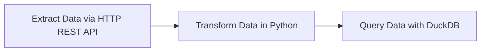
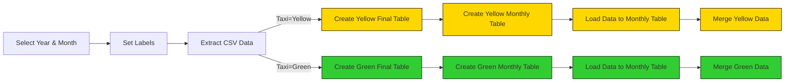
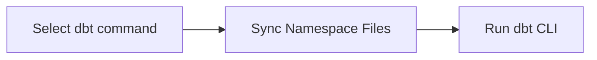
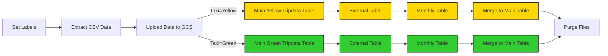
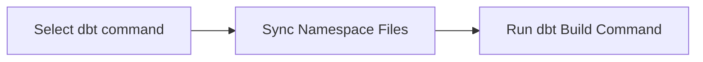

# Workflow Orchestration

Welcome to Module 2 of the Data Engineering Zoomcamp! This week, we’ll dive into workflow orchestration using [Kestra](https://go.kestra.io/de-zoomcamp/github). 

Kestra is an open-source, event-driven orchestration platform that simplifies building both scheduled and event-driven workflows. By adopting Infrastructure as Code practices for data and process orchestration, Kestra enables you to build reliable workflows with just a few lines of YAML.

> [!NOTE]  
>You can find all videos for this week in this [YouTube Playlist](https://go.kestra.io/de-zoomcamp/yt-playlist).

---

# Course Structure

## 1. Conceptual Material: Introduction to Orchestration and Kestra

In this section, you’ll learn the foundations of workflow orchestration, its importance, and how Kestra fits into the orchestration landscape.

### Videos
- **2.2.1 - Introduction to Workflow Orchestration**  
  [](https://youtu.be/Np6QmmcgLCs)

- **2.2.2 - Learn the Concepts of Kestra**  
  [](https://youtu.be/o79n-EVpics)

### Resources
- [Quickstart Guide](https://go.kestra.io/de-zoomcamp/quickstart)
- [Install Kestra with Docker Compose](https://go.kestra.io/de-zoomcamp/docker-compose)
- [Tutorial](https://go.kestra.io/de-zoomcamp/tutorial)
- [What is an Orchestrator?](https://go.kestra.io/de-zoomcamp/what-is-an-orchestrator)

---

## 2. Hands-On Coding Project: Build Data Pipelines with Kestra

This week, we're gonna build ETL pipelines for Yellow and Green Taxi data from NYC’s Taxi and Limousine Commission (TLC). You will:
1. Extract data from [CSV files](https://github.com/DataTalksClub/nyc-tlc-data/releases).
2. Load it into Postgres or Google Cloud (GCS + BigQuery).
3. Explore scheduling and backfilling workflows.

>[!NOTE] 
If you’re using the PostgreSQL and PgAdmin docker setup from Module 1 for this week’s Kestra Workflow Orchestration exercise, ensure your PostgreSQL image version is 15 or later (preferably the latest). The MERGE statement, introduced in PostgreSQL 15, won’t work on earlier versions and will likely cause syntax errors in your kestra flows.

### File Structure

The project is organized as follows:
```
.
├── flows/
│   ├── 01_getting_started_data_pipeline.yaml
│   ├── 02_postgres_taxi.yaml
│   ├── 02_postgres_taxi_scheduled.yaml
│   ├── 03_postgres_dbt.yaml
│   ├── 04_gcp_kv.yaml
│   ├── 05_gcp_setup.yaml
│   ├── 06_gcp_taxi.yaml
│   ├── 06_gcp_taxi_scheduled.yaml
│   └── 07_gcp_dbt.yaml
```

### Setup Kestra

We'll set up Kestra using Docker Compose containing one container for the Kestra server and another for the Postgres database:

```bash
cd 02-workflow-orchestration/
docker compose up -d
```

Once the container starts, you can access the Kestra UI at [http://localhost:8080](http://localhost:8080).

If you prefer to add flows programmatically using Kestra's API, run the following commands:

```bash
curl -X POST http://localhost:8080/api/v1/flows/import -F fileUpload=@flows/01_getting_started_data_pipeline.yaml
curl -X POST http://localhost:8080/api/v1/flows/import -F fileUpload=@flows/02_postgres_taxi.yaml
curl -X POST http://localhost:8080/api/v1/flows/import -F fileUpload=@flows/02_postgres_taxi_scheduled.yaml
curl -X POST http://localhost:8080/api/v1/flows/import -F fileUpload=@flows/03_postgres_dbt.yaml
curl -X POST http://localhost:8080/api/v1/flows/import -F fileUpload=@flows/04_gcp_kv.yaml
curl -X POST http://localhost:8080/api/v1/flows/import -F fileUpload=@flows/05_gcp_setup.yaml
curl -X POST http://localhost:8080/api/v1/flows/import -F fileUpload=@flows/06_gcp_taxi.yaml
curl -X POST http://localhost:8080/api/v1/flows/import -F fileUpload=@flows/06_gcp_taxi_scheduled.yaml
curl -X POST http://localhost:8080/api/v1/flows/import -F fileUpload=@flows/07_gcp_dbt.yaml
```

---

## 3. ETL Pipelines in Kestra: Detailed Walkthrough

### Getting Started Pipeline

This introductory flow is added just to demonstrate a simple data pipeline which extracts data via HTTP REST API, transforms that data in Python and then queries it using DuckDB. For this stage, a new separate Postgres database is created for the exercises. 

**Note:** Check that `pgAdmin` isn't running on the same ports as Kestra. If so, check out the [FAQ](#troubleshooting-tips) at the bottom of the README.

### Videos

- **2.2.3 - Create an ETL Pipeline with Postgres in Kestra**   
  [](https://youtu.be/OkfLX28Ecjg?si=vKbIyWo1TtjpNnvt)
- **2.2.4 - Manage Scheduling and Backfills using Postgres in Kestra**  
  [](https://youtu.be/_-li_z97zog?si=G6jZbkfJb3GAyqrd)
- **2.2.5 - Transform Data with dbt and Postgres in Kestra**  
  [](https://youtu.be/ZLp2N6p2JjE?si=tWhcvq5w4lO8v1_p)




Add the flow [`01_getting_started_data_pipeline.yaml`](flows/01_getting_started_data_pipeline.yaml) from the UI if you haven't already and execute it to see the results. Inspect the Gantt and Logs tabs to understand the flow execution.

### Local DB: Load Taxi Data to Postgres

Before we start loading data to GCP, we'll first play with the Yellow and Green Taxi data using a local Postgres database running in a Docker container. We'll create a new Postgres database for these examples using this [Docker Compose file](docker/postgres/docker-compose.yml). Download it into a new directory, navigate to it and run the following command to start it:

```bash
docker compose up -d
```

The flow will extract CSV data partitioned by year and month, create tables, load data to the monthly table, and finally merge the data to the final destination table.



The flow code: [`02_postgres_taxi.yaml`](flows/02_postgres_taxi.yaml).


> [!NOTE]  
> The NYC Taxi and Limousine Commission (TLC) Trip Record Data provided on the [nyc.gov](https://www.nyc.gov/site/tlc/about/tlc-trip-record-data.page) website is currently available only in a Parquet format, but this is NOT the dataset we're going to use in this course. For the purpose of this course, we'll use the **CSV files** available [here on GitHub](https://github.com/DataTalksClub/nyc-tlc-data/releases). This is because the Parquet format can be challenging to understand by newcomers, and we want to make the course as accessible as possible — the CSV format can be easily introspected using tools like Excel or Google Sheets, or even a simple text editor.

### Local DB: Learn Scheduling and Backfills

We can now schedule the same pipeline shown above to run daily at 9 AM UTC. We'll also demonstrate how to backfill the data pipeline to run on historical data.

Note: given the large dataset, we'll backfill only data for the green taxi dataset for the year 2019.

The flow code: [`02_postgres_taxi_scheduled.yaml`](flows/02_postgres_taxi_scheduled.yaml).

### Local DB: Orchestrate dbt Models (Optional)

Now that we have raw data ingested into a local Postgres database, we can use dbt to transform the data into meaningful insights. The flow will sync the dbt models from Git to Kestra and run the `dbt build` command to build the models.



This gives you a quick showcase of dbt inside of Kestra so the homework tasks do not depend on it. The course will go into more detail of dbt in [Week 4](../04-analytics-engineering).

The flow code: [`03_postgres_dbt.yaml`](flows/03_postgres_dbt.yaml).

### Resources
- [pgAdmin Download](https://www.pgadmin.org/download/)
- [Postgres DB Docker Compose](docker/postgres/docker-compose.yml)

---

## 4. ETL Pipelines in Kestra: Google Cloud Platform

Now that you've learned how to build ETL pipelines locally using Postgres, we are ready to move to the cloud. In this section, we'll load the same Yellow and Green Taxi data to Google Cloud Platform (GCP) using: 
1. Google Cloud Storage (GCS) as a data lake  
2. BigQuery as a data warehouse.

### Videos

- **2.2.6 - Create an ETL Pipeline with GCS and BigQuery in Kestra**  
  [](https://youtu.be/nKqjjLJ7YXs)
- **2.2.7 - Manage Scheduling and Backfills using BigQuery in Kestra**   
  [](https://youtu.be/DoaZ5JWEkH0)
- **2.2.8 - Transform Data with dbt and BigQuery in Kestra**   
  [](https://youtu.be/eF_EdV4A1Wk)

### Setup Google Cloud Platform (GCP)

Before we start loading data to GCP, we need to set up the Google Cloud Platform. 

First, adjust the following flow [`04_gcp_kv.yaml`](flows/04_gcp_kv.yaml) to include your service account, GCP project ID, BigQuery dataset and GCS bucket name (_along with their location_) as KV Store values:
- GCP_CREDS
- GCP_PROJECT_ID
- GCP_LOCATION
- GCP_BUCKET_NAME
- GCP_DATASET.


> [!WARNING]  
> The `GCP_CREDS` service account contains sensitive information. Ensure you keep it secure and do not commit it to Git. Keep it as secure as your passwords.

### Create GCP Resources

If you haven't already created the GCS bucket and BigQuery dataset in the first week of the course, you can use this flow to create them: [`05_gcp_setup.yaml`](flows/05_gcp_setup.yaml).


### GCP Workflow: Load Taxi Data to BigQuery



The flow code: [`06_gcp_taxi.yaml`](flows/06_gcp_taxi.yaml).

### GCP Workflow: Schedule and Backfill Full Dataset

We can now schedule the same pipeline shown above to run daily at 9 AM UTC for the green dataset and at 10 AM UTC for the yellow dataset. You can backfill historical data directly from the Kestra UI.

Since we now process data in a cloud environment with infinitely scalable storage and compute, we can backfill the entire dataset for both the yellow and green taxi data without the risk of running out of resources on our local machine.

The flow code: [`06_gcp_taxi_scheduled.yaml`](flows/06_gcp_taxi_scheduled.yaml).

### GCP Workflow: Orchestrate dbt Models (Optional)

Now that we have raw data ingested into BigQuery, we can use dbt to transform that data. The flow will sync the dbt models from Git to Kestra and run the `dbt build` command to build the models:



This gives you a quick showcase of dbt inside of Kestra so the homework tasks do not depend on it. The course will go into more detail of dbt in [Week 4](../04-analytics-engineering).

The flow code: [`07_gcp_dbt.yaml`](flows/07_gcp_dbt.yaml).

---

## 5. Bonus: Deploy to the Cloud (Optional)

Now that we've got our ETL pipeline working both locally and in the cloud, we can deploy Kestra to the cloud so it can continue to orchestrate our ETL pipelines monthly with our configured schedules, We'll cover how you can install Kestra on Google Cloud in Production, and automatically sync and deploy your workflows from a Git repository.

Note: When committing your workflows to Kestra, make sure your workflow doesn't contain any sensitive information. You can use [Secrets](https://go.kestra.io/de-zoomcamp/secret) and the [KV Store](https://go.kestra.io/de-zoomcamp/kv-store) to keep sensitive data out of your workflow logic.

### Videos

- **2.2.9 - Deploy Workflows to the Cloud with Git**   
  [](https://youtu.be/l-wC71tI3co)

Resources

- [Install Kestra on Google Cloud](https://go.kestra.io/de-zoomcamp/gcp-install)
- [Moving from Development to Production](https://go.kestra.io/de-zoomcamp/dev-to-prod)
- [Using Git in Kestra](https://go.kestra.io/de-zoomcamp/git)
- [Deploy Flows with GitHub Actions](https://go.kestra.io/de-zoomcamp/deploy-github-actions)

## 6. Additional Resources 📚

- Check [Kestra Docs](https://go.kestra.io/de-zoomcamp/docs)
- Explore our [Blueprints](https://go.kestra.io/de-zoomcamp/blueprints) library
- Browse over 600 [plugins](https://go.kestra.io/de-zoomcamp/plugins) available in Kestra
- Give us a star on [GitHub](https://go.kestra.io/de-zoomcamp/github)
- Join our [Slack community](https://go.kestra.io/de-zoomcamp/slack) if you have any questions
- Find all the videos in this [YouTube Playlist](https://go.kestra.io/de-zoomcamp/yt-playlist)


### Troubleshooting tips

If you face any issues with Kestra flows in Module 2, make sure to use the following Docker images/ports:
- `kestra/kestra:latest` is correct = latest stable release, while `kestra/kestra:develop` is incorrect as this is a bleeding-edge development version that might contain bugs
- `postgres:latest` — make sure to use Postgres image, which uses **PostgreSQL 15** or higher
- If you run `pgAdmin` or something else on port 8080, you can adjust Kestra docker-compose to use a different port, e.g. change port mapping to 18080 instead of 8080, and then access Kestra UI in your browser from http://localhost:18080/ instead of from http://localhost:8080/

If you're using Linux, you might encounter `Connection Refused` errors when connecting to the Postgres DB from within Kestra. This is because `host.docker.internal` works differently on Linux. Using the modified Docker Compose file below, you can run both Kestra and its dedicated Postgres DB, as well as the Postgres DB for the exercises all together. You can access it within Kestra by referring to the container name `postgres_zoomcamp` instead of `host.docker.internal` in `pluginDefaults`. This applies to pgAdmin as well. If you'd prefer to keep it in separate Docker Compose files, you'll need to setup a Docker network so that they can communicate with each other.

<details>
<summary>Docker Compose Example</summary>

This Docker Compose has the Zoomcamp DB container and pgAdmin container added to it, so it's all in one file.

Changes include:
- New `volume` for the Zoomcamp DB container
- Zoomcamp DB container is added and renamed to prevent clashes with the Kestra DB container
- Depends on condition is added to make sure Kestra is running before it starts
- pgAdmin is added and running on Port 8085 so it doesn't clash wit Kestra which uses 8080 and 8081

```yaml
volumes:
  postgres-data:
    driver: local
  kestra-data:
    driver: local
  zoomcamp-data:
    driver: local

services:
  postgres:
    image: postgres
    volumes:
      - postgres-data:/var/lib/postgresql/data
    environment:
      POSTGRES_DB: kestra
      POSTGRES_USER: kestra
      POSTGRES_PASSWORD: k3str4
    healthcheck:
      test: ["CMD-SHELL", "pg_isready -d $${POSTGRES_DB} -U $${POSTGRES_USER}"]
      interval: 30s
      timeout: 10s
      retries: 10

  kestra:
    image: kestra/kestra:latest
    pull_policy: always
    # Note that this setup with a root user is intended for development purpose.
    # Our base image runs without root, but the Docker Compose implementation needs root to access the Docker socket
    # To run Kestra in a rootless mode in production, see: https://kestra.io/docs/installation/podman-compose
    user: "root"
    command: server standalone
    volumes:
      - kestra-data:/app/storage
      - /var/run/docker.sock:/var/run/docker.sock
      - /tmp/kestra-wd:/tmp/kestra-wd
    environment:
      KESTRA_CONFIGURATION: |
        datasources:
          postgres:
            url: jdbc:postgresql://postgres:5432/kestra
            driverClassName: org.postgresql.Driver
            username: kestra
            password: k3str4
        kestra:
          server:
            basicAuth:
              enabled: false
              username: "admin@kestra.io" # it must be a valid email address
              password: kestra
          repository:
            type: postgres
          storage:
            type: local
            local:
              basePath: "/app/storage"
          queue:
            type: postgres
          tasks:
            tmpDir:
              path: /tmp/kestra-wd/tmp
          url: http://localhost:8080/
    ports:
      - "8080:8080"
      - "8081:8081"
    depends_on:
      postgres:
        condition: service_started
    
  postgres_zoomcamp:
    image: postgres
    environment:
      POSTGRES_USER: kestra
      POSTGRES_PASSWORD: k3str4
      POSTGRES_DB: postgres-zoomcamp
    ports:
      - "5432:5432"
    volumes:
      - zoomcamp-data:/var/lib/postgresql/data
    depends_on:
      kestra:
        condition: service_started

  pgadmin:
    image: dpage/pgadmin4
    environment:
      - PGADMIN_DEFAULT_EMAIL=admin@admin.com
      - PGADMIN_DEFAULT_PASSWORD=root
    ports:
      - "8085:80"
    depends_on:
      postgres_zoomcamp:
        condition: service_started
```

</details>

If you are still facing any issues, stop and remove your existing Kestra + Postgres containers and start them again using `docker-compose up -d`. If this doesn't help, post your question on the DataTalksClub Slack or on Kestra's Slack http://kestra.io/slack.

- **DE Zoomcamp FAQ - PostgresDB Setup and Installing pgAdmin**   
  [](https://youtu.be/ywAPYNYFaB4?si=5X9AD0nFAT2WLWgS)
- **DE Zoomcamp FAQ - Port and Images**  
  [](https://youtu.be/l2M2mW76RIU?si=oqyZ7KUaI27vi90V)
- **DE Zoomcamp FAQ - Docker Setup**  
  [](https://youtu.be/73g6qJN0HcM)


If you encounter similar errors to:
```
BigQueryError{reason=invalid, location=null, 
message=Error while reading table: kestra-sandbox.zooomcamp.yellow_tripdata_2020_01, 
error message: CSV table references column position 17, but line contains only 14 columns.; 
line_number: 2103925 byte_offset_to_start_of_line: 194863028 
column_index: 17 column_name: "congestion_surcharge" column_type: NUMERIC 
File: gs://anna-geller/yellow_tripdata_2020-01.csv}
```

It means that the CSV file you're trying to load into BigQuery has a mismatch in the number of columns between the external source table (i.e. file in GCS) and the destination table in BigQuery. This can happen when for due to network/transfer issues, the file is not fully downloaded from GitHub or not correctly uploaded to GCS. The error suggests schema issues but that's not the case. Simply rerun the entire execution including redownloading the CSV file and reuploading it to GCS. This should resolve the issue.

---

## Homework 

See the [2025 cohort folder](../cohorts/2025/02-workflow-orchestration/homework.md)


---

# Community notes

Did you take notes? You can share them by creating a PR to this file! 

* [Notes from Manuel Guerra)](https://github.com/ManuelGuerra1987/data-engineering-zoomcamp-notes/blob/main/2_Workflow-Orchestration-(Kestra)/README.md)
* [Notes from Horeb Seidou](https://spotted-hardhat-eea.notion.site/Week-2-Workflow-Orchestration-17129780dc4a80148debf61e6453fffe)
* [Notes from Livia](https://docs.google.com/document/d/1Y_QMonvEtFPbXIzmdpCSVsKNC1BWAHFBA1mpK9qaZko/edit?usp=sharing)
* [2025 Gitbook Notes from Tinker0425](https://data-engineering-zoomcamp-2025-t.gitbook.io/tinker0425/module-2/introduction-to-module-2)
* [Notes from Mercy Markus: Linux/Fedora Tweaks and Tips](https://mercymarkus.com/posts/2025/series/dtc-dez-jan-2025/dtc-dez-2025-module-2/)
* Add your notes above this line

---

# Previous Cohorts

* 2022: [notes](../cohorts/2022/week_2_data_ingestion#community-notes) and [videos](../cohorts/2022/week_2_data_ingestion)
* 2023: [notes](../cohorts/2023/week_2_workflow_orchestration#community-notes) and [videos](../cohorts/2023/week_2_workflow_orchestration)
* 2024: [notes](../cohorts/2024/02-workflow-orchestration#community-notes) and [videos](../cohorts/2024/02-workflow-orchestration)

