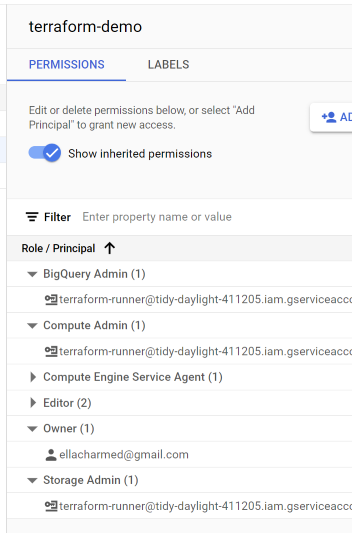

> [!NOTE]  
>If you're looking for Airflow videos from the 2022 edition, check the [2022 cohort folder](../cohorts/2022/week_2_data_ingestion/). 
>
>If you're looking for Prefect videos from the 2023 edition, check the [2023 cohort folder](../cohorts/2023/week_2_data_ingestion/).

# Week 2: Workflow Orchestration

Welcome to Week 2 of the Data Engineering Zoomcamp! 🚀😤 This week, we'll be covering workflow orchestration with Mage.

Mage is an open-source, hybrid framework for transforming and integrating data. ✨

This week, you'll learn how to use the Mage platform to author and share _magical_ data pipelines. This will all be covered in the course, but if you'd like to learn a bit more about Mage, check out our docs [here](https://docs.mage.ai/introduction/overview). 

- [Week 2: Workflow Orchestration](#week-2-workflow-orchestration)
  - [📕 Course Resources](#-course-resources)
    - [2.2.1 - 📯 Intro to Orchestration](#221----intro-to-orchestration)
    - [2.2.2 - 🧙‍♂️ Intro to Mage](#222---️-intro-to-mage)
    - [--- EllaNotes ---](#----ellanotes----)
    - [2.2.3 - 🐘 ETL: API to Postgres](#223----etl-api-to-postgres)
    - [--- EllaNotes ---](#----ellanotes-----1)
      - [Assumed knowledge](#assumed-knowledge)
    - [2.2.4 - 🤓 ETL: API to GCS](#224----etl-api-to-gcs)
    - [2.2.5 - 🔍 ETL: GCS to BigQuery](#225----etl-gcs-to-bigquery)
    - [--- EllaNotes ---](#----ellanotes-----2)
    - [2.2.6 - 👨‍💻 Parameterized Execution](#226----parameterized-execution)
    - [--- EllaNotes ---](#----ellanotes-----3)
    - [2.2.7 - 🤖 Deployment (Optional)](#227----deployment-optional)
    - [--- EllaNotes ---](#----ellanotes-----4)
    - [2.2.8 - 🗒️ Homework](#228---️-homework)
    - [--- EllaNotes ---](#----ellanotes-----5)
    - [2.2.9 - 👣 Next Steps](#229----next-steps)
    - [📑 Additional Resources](#-additional-resources)
    - [--- EllaNotes ---](#----ellanotes-----6)
- [Community notes](#community-notes)
  - [2024 notes](#2024-notes)
  - [2023 notes](#2023-notes)
  - [2022 notes](#2022-notes)
  - [Credits](#credits)

## 📕 Course Resources

### 2.2.1 - 📯 Intro to Orchestration

In this section, we'll cover the basics of workflow orchestration. We'll discuss what it is, why it's important, and how it can be used to build data pipelines.

Videos
- 2.2.1a - What is Orchestration?

[](https://youtu.be/Li8-MWHhTbo&list=PL3MmuxUbc_hJed7dXYoJw8DoCuVHhGEQb&index=17)

Resources
- [Slides](https://docs.google.com/presentation/d/17zSxG5Z-tidmgY-9l7Al1cPmz4Slh4VPK6o2sryFYvw/)

### 2.2.2 - 🧙‍♂️ Intro to Mage

In this section, we'll introduce the Mage platform. We'll cover what makes Mage different from other orchestrators, the fundamental concepts behind Mage, and how to get started. To cap it off, we'll spin Mage up via Docker 🐳 and run a simple pipeline.

Videos
- 2.2.2a - What is Mage?

[](https://youtu.be/AicKRcK3pa4&list=PL3MmuxUbc_hJed7dXYoJw8DoCuVHhGEQb&index=18)

- 2.2.2b - Configuring Mage

[](https://youtu.be/tNiV7Wp08XE&list=PL3MmuxUbc_hJed7dXYoJw8DoCuVHhGEQb&index=19)

- 2.2.2c - A Simple Pipeline

[](https://youtu.be/stI-gg4QBnI&list=PL3MmuxUbc_hJed7dXYoJw8DoCuVHhGEQb&index=20)

Resources
- [Getting Started Repo](https://github.com/mage-ai/mage-zoomcamp)
- [Slides](https://docs.google.com/presentation/d/1y_5p3sxr6Xh1RqE6N8o2280gUzAdiic2hPhYUUD6l88/)

### --- EllaNotes ---

In this demo, Matt showed how to connect to Mage and see the default `example-pipeline`. Make sure you have setup the GCP service accounts and project in GCP.

Also see [README-mage](README-mage.md) for guides from Matt Palmer. [Original repo](https://github.com/mage-ai/mage-zoomcamp) has a `solution` branch. Handy to copy over the code if we forgot to rename pipelines or data blocks.

> [!INFO]
>
>
>
>If you see that mage-ai has an update like in the picture above, after completing your work and you have exited, just do a `docker pull mageai/mageai:latest` to update mage-ai image and then re`build` docker, or rerun the `up` again for the next session.

> [!CAUTION]
>
>Yet another reminder: ***DO NOT COPY CODE BLINDLY!*** 
>
>EACH TIME you do copy+paste, ask yourself
>1. are you violating DRY principle? 
>1. should I put this code block in a function for re-use?
>1. is this a SECRET?! should I have this in an .env? 
>1. is this info supposed to be in .gitignore, too?
>1. is this universal code, or specific to an environment and OS configs, meaning I need to edit it to suit mine?

Recall that (in video 1.3.2 Terraform Basics), we created `terraform-runner` in module-01 in GCP to run `terraform-init` etc. Go rewatch that if cannot remember.

> Service accounts are programmatically accessed from our code and not meant to be logged into. It is to restrict the activities and permissions this project can do for that service. 
> 
> *It is dangerous to give broad permissions to all GCP services* as **Account Owner** at project level, or any levels.

This `terraform-runner` was created under project-id `terraform-demo` (with gcp unique identifier `tidy-daylight-411205` in mine) selected in the top drop-down.

> We wouldn't give broad Admin access to the 3 services that we do here, generally either. This is just for convenience for this course.

For this module, `nyc-rides-ella` was created as project-name and it has identical project-id of `nyc-rides-ella` (project-id must be unique GCP-wide globally, *let's hope there's no other Ella doing this course in 2024*). To add/remove services to the `taxi-runner` (the one I created for this module-02 Mage lesson), make sure the project is the one selected, then go to `IAM` and `Create Service accounts` or `Edit Principle`. 

And add Service Accounts for the 3 Services we're using,

- BigQuery Admin
- Compute Admin
- Storage Admin



Then, create a new key as a JSON file to authenticate ourselves so that our code has permissions to access this GCP project and services.

> [!IMPORTANT]  
>
>Be sure to edit the `docker-compose.yml` file `env_file:` and `volumes:` sections to suit your environment. 

### 2.2.3 - 🐘 ETL: API to Postgres

Hooray! Mage is up and running. Now, let's build a _real_ pipeline. In this section, we'll build a simple ETL pipeline that loads data from an API into a Postgres database. Our database will be built using Docker— it will be running locally, but it's the same as if it were running in the cloud.

Videos
- 2.2.3a - Configuring Postgres

[](https://youtu.be/pmhI-ezd3BE&list=PL3MmuxUbc_hJed7dXYoJw8DoCuVHhGEQb&index=21)

- 2.2.3b - Writing an ETL Pipeline : API to postgres

[](https://youtu.be/Maidfe7oKLs&list=PL3MmuxUbc_hJed7dXYoJw8DoCuVHhGEQb&index=22)

### --- EllaNotes ---

#### Assumed knowledge

- brush up on passing return values and OOP principles. We're using a lot of functions and returns to pass from one block to the next in **mage pipelines**.

So, after we have setup mage-ai in 2.2.2, in this chapter, Matt demo the postgres setup and creating a pipeline for our Taxi Dataset that we're using throughout the course.

This is why I again recommend watching ALL videos in a module before doing any coding-along sessions.

Notice how the `docker-compose.yaml` file differs from the module-01's contents. In module-01, we used `postgres` + `pgadmin` services. In module-02, we used `magic` + `postgres` services. We don't need `pgadmin` services anymore, as mage-ai is acting as the interface client we are interacting to our database with. And we're writing all our code in the mage-ai interface called blocks instead of in jupyter notebook cells.

The following string and other information like the `taxi_dtypes` can be copied from the [`solution` branch](https://github.com/mage-ai/mage-zoomcamp/blob/solutions/magic-zoomcamp/data_loaders/load_nyc_taxi_data.py)

```
URL="https://github.com/DataTalksClub/nyc-tlc-data/releases/download/yellow/yellow_tripdata_2021-01.csv.gz"
```

In chapters 2 (2.2.2) and 3 (2.2.3), we're saving the csv.gz file into a local postgres `mage-ai.db`. Next chapter, we're gonna repeat the steps here but connecting to postgres in the cloud. Google Cloud Storage, to be specific.

### 2.2.4 - 🤓 ETL: API to GCS

Ok, so we've written data _locally_ to a database, but what about the cloud? In this tutorial, we'll walk through the process of using Mage to extract, transform, and load data from an API to Google Cloud Storage (GCS). 

We'll cover both writing _partitioned_ and _unpartitioned_ data to GCS and discuss _why_ you might want to do one over the other. Many data teams start with extracting data from a source and writing it to a data lake _before_ loading it to a structured data source, like a database.

Videos
- 2.2.4a - Configuring GCP

[](https://youtu.be/00LP360iYvE&list=PL3MmuxUbc_hJed7dXYoJw8DoCuVHhGEQb&index=23)

- 2.2.4b - Writing an ETL Pipeline : API to GCS

[](https://youtu.be/w0XmcASRUnc&list=PL3MmuxUbc_hJed7dXYoJw8DoCuVHhGEQb&index=24)

Resources
- [DTC Zoomcamp GCP Setup](../01-docker-terraform/1_terraform_gcp/2_gcp_overview.md)

### 2.2.5 - 🔍 ETL: GCS to BigQuery

Now that we've written data to GCS, let's load it into BigQuery. In this section, we'll walk through the process of using Mage to load our data from GCS to BigQuery. This closely mirrors a very common data engineering workflow: loading data from a data lake into a data warehouse.

Videos

- 2.2.5a - Writing an ETL Pipeline : GCS to BigQuery

[](https://youtu.be/JKp_uzM-XsM&list=PL3MmuxUbc_hJed7dXYoJw8DoCuVHhGEQb&index=25)

### --- EllaNotes ---

If you never heard of the terms `oltp` versus `olap`, I suggest you go research that before completing this lesson. What does it mean for a database to be *relational* or *unstructured*?

Other terms mentioned are `data lake` and `data warehouse`.

Just drag+drop previous data blocks

- load_api_data
- transform_taxi_data

and connect the blocks with the right parent-child hierarchy.

Then add another `data exporter` block, add the bucket_name `mage-zoomcamp-ellacharmed` and object_key `nyc_taxi_data.parquet`, click on `Execute with all upstream blocks` and finally refresh your Buckers page on GCS.

Next we do a partitioned export by date. Makes it easier to query data as dates is a natural conditional usually used.

We also exported our (unpartitioned) data to BigQuery.

Scheduling `pipelines` is done from the `Triggers` tab. If there are dependencies, triggers can also be chained, just like the Pipeline tree.


### 2.2.6 - 👨‍💻 Parameterized Execution

By now you're familiar with building pipelines, but what about adding parameters? In this video, we'll discuss some built-in runtime variables that exist in Mage and show you how to define your own! We'll also cover how to use these variables to parameterize your pipelines. Finally, we'll talk about what it means to *backfill* a pipeline and how to do it in Mage.

Videos
- 2.2.6a - Parameterized Execution

[](https://youtu.be/H0hWjWxB-rg&list=PL3MmuxUbc_hJed7dXYoJw8DoCuVHhGEQb&index=26)


- 2.2.6b - Backfills

[](https://youtu.be/ZoeC6Ag5gQc&list=PL3MmuxUbc_hJed7dXYoJw8DoCuVHhGEQb&index=27)

Resources
- [Mage Variables Overview](https://docs.mage.ai/development/variables/overview)
- [Mage Runtime Variables](https://docs.mage.ai/getting-started/runtime-variable)

### --- EllaNotes ---

Partial loading of dataset is called `[parameterized]`, for example to partioned into daily subfolders or by location. Try on time_series!

Backfill means to rerun pipeline on newly acquired data for eg missing dates or other data, not loaded/transformed/exported in previous runs. Needs more reading up.

### 2.2.7 - 🤖 Deployment (Optional)

In this section, we'll cover deploying Mage using Terraform and Google Cloud. This section is optional— it's not *necessary* to learn Mage, but it might be helpful if you're interested in creating a fully deployed project. If you're using Mage in your final project, you'll need to deploy it to the cloud.

Videos
- 2.2.7a - Deployment Prerequisites

[](https://youtu.be/zAwAX5sxqsg&list=PL3MmuxUbc_hJed7dXYoJw8DoCuVHhGEQb&index=28)

- 2.2.7b - Google Cloud Permissions

[](https://youtu.be/O_H7DCmq2rA&list=PL3MmuxUbc_hJed7dXYoJw8DoCuVHhGEQb&index=29)

- 2.2.7c - Deploying to Google Cloud - Part 1

[](https://youtu.be/9A872B5hb_0&list=PL3MmuxUbc_hJed7dXYoJw8DoCuVHhGEQb&index=30)

- 2.2.7d - Deploying to Google Cloud - Part 2

[](https://youtu.be/0YExsb2HgLI&list=PL3MmuxUbc_hJed7dXYoJw8DoCuVHhGEQb&index=31)

Resources
- [Installing Terraform](https://developer.hashicorp.com/terraform/tutorials/aws-get-started/install-cli)
- [Installing `gcloud` CLI](https://cloud.google.com/sdk/docs/install)
- [Mage Terraform Templates](https://github.com/mage-ai/mage-ai-terraform-templates)

Additional Mage Guides
- [Terraform](https://docs.mage.ai/production/deploying-to-cloud/using-terraform)
- [Deploying to GCP with Terraform](https://docs.mage.ai/production/deploying-to-cloud/gcp/setup)

### --- EllaNotes ---


All the above chapters 1-6 were done locally.
Chapter 7 for deployment, I'm trying in a GCP VM.

What it means? Using Terraform to *programmatically* create resources that Mage needs to run, as Matt puts it *in one fell swoop*:
- Google Cloud Run
- backend database as persistent storage
  - which means that when we stop our containers or VMs, we can resume our work as the data is still there ie mage pipelines and the database we create
- benefits: the setup configuration is version-controlled

What it needs? The pre-requisites are: 
- Terraform installed on local (from module#01)
- gcloud cli installed on local (from module#01)
- gcloud permissions 
  - project --> IAM --> Edit Principal
  - add these Roles:
    - Artifact Registry Reader
    - Artifact Registry Writer
    - Cloud Run Developer
    - Cloud Run Service Agent
    - Cloud SQL Admin
    - Service Account Token Creator
    - Serverless VPC Access Admin
  - remove the Owner Role entry
  - Save
- [mage terraform templates](https://github.com/mage-ai/mage-ai-terraform-templates)

> [!TIP]
> Use lowercase for any variable entries in the  *.tf files for things like project-id and bucket-name, etc.

The steps:

1. first verify `gcloud` is recognized, `gcloud auth list`. This would list the authenticated IDs. 
   output:
   ```bash
                      Credentialed Accounts
    ACTIVE  ACCOUNT
    *       152484696885-compute@developer.gserviceaccount.com

    To set the active account, run:
    $ gcloud config set account `ACCOUNT`
   ```
1. also verify buckets `gcloud storage ls`
   output:
    ```bash
    gs://mage-zoomcamp-ellacharmed/
    ```
1. clone the [Mage Terraform Templates](https://github.com/mage-ai/mage-ai-terraform-templates), and copy the 5 *.tf files to your `cohorts/2024/02-workflow-orchestration/` homework folder. You may want to create a `terraform` subfolder.
1. edit `variables.tf` to have your GCP `project-id`, which in my case is still `nyc-rides-ella`
1. verify the region, zones and location are in same locations, unless multi-regions was selected. Still need to be in same geographical area, though.
1. on GCP web page, search for `Cloud Filestore API` and click on the blue `Enable` button. So now we have been introduced to 3 types of storages: **Buckets**, **BigQuery**, **Filestore**. TODO research the diff.
1. Go to [API Library](https://console.cloud.google.com/apis/library?project=nyc-rides-ella), replace URL `project=` with your `project-id` of course. search for these services and make sure these APIs are enabled
   - `sqladmin`
   - `vpcaccess`
   - `cloud run`
1. run `terraform fmt` (optional), `terraform init` and then `terraform plan` to verify no errors or typos in our `main.tf` and `variables.tf`
   - database password is `postgres` from our `.env` file
1. if no errors from above, then proceed with `terraform apply`
   - database password is `postgres` from our `.env` file
   - and `yes` to approve
   - process would take about 8-15 mins or so, depending on your connection (when I used the default "US" location)
     - `google_sql_database_instance.instance` took about 11mins (US) / 9mins (SG) for me
     - `google_cloud_run_service.run_service` took about 3mins (US) / 2mins (SG)
     - ``
1. encountered below error
    ```bash
    │ Error: Error applying IAM policy for cloudrun service "v1/projects/nyc-rides-ella/locations/us-west2/services/mage-data-prep": Error setting IAM policy for cloudrun service "v1/projects/nyc-rides-ella/locations/us-west2/services/mage-data-prep": googleapi: Error 403: Permission 'run.services.setIamPolicy' denied on resource 'projects/nyc-rides-ella/locations/us-west2/services/mage-data-prep' (or resource may not exist).
    │ 
    │   with google_cloud_run_service_iam_member.run_all_users,
    │   on main.tf line 158, in resource "google_cloud_run_service_iam_member" "run_all_users":
    │  158: resource "google_cloud_run_service_iam_member" "run_all_users" {
    ```
1. Used [secrets manager](https://cloud.google.com/secret-manager/docs/authentication). remember to change the project-id `nyc-rides-ella` to your own.
    ```bash
    curl -X GET \
        -H "Authorization: Bearer $(gcloud auth print-access-token)" \
        "https://iam.googleapis.com/v1/projects/nyc-rides-ella/serviceAccounts"
    ```
1. changed region= "asia-southeast1", zone= "asia-southeast1-a" and location = "Singapore", and `apply` appears to run a tad faster but still getting errors.
    ```bash
    google_compute_region_network_endpoint_group.cloudrun_neg: Destroying... [id=projects/nyc-rides-ella/regions/us-west2/networkEndpointGroups/mage-data-prep-neg]
    ╷
    │ Error: Error when reading or editing RegionNetworkEndpointGroup: googleapi: Error 400: The network_endpoint_group resource 'projects/nyc-rides-ella/regions/us-west2/networkEndpointGroups/mage-data-prep-neg' is already being used by 'projects/nyc-rides-ella/global/backendServices/mage-data-prep-urlmap-backend-default', resourceInUseByAnotherResource
    ```
1. remove .tfstate and .plan files and started over from `terraform init`. new error encountered.
    ```bash
    │ Error: Error waiting to create Connector: Error waiting for Creating Connector: Error code 3, message: Operation failed: Invalid IP CIDR range was provided. It conflicts with an existing subnetwork. Please delete the connector manually.
    │ 
    │   with google_vpc_access_connector.connector,
    │   on fs.tf line 19, in resource "google_vpc_access_connector" "connector":
    │   19: resource "google_vpc_access_connector" "connector" {
    ```
1. search for `vpc connector` on GCP and remove all
1. commented `resource "google_cloud_run_service_iam_member" "run_all_users"` in main.tf and finally successful
output:
    ```bash
    Apply complete! Resources: 0 added, 1 changed, 0 destroyed.

    Outputs:

    service_ip = "34.149.15.172"
    ```
1. on GCP web page, go to `Cloud Run`. Cannot access Mage. Shall `terraform destroy`, shut down VM and try again, on clean slate.
    ```bash
    │ Error: Error, failed to deleteuser mageuser in instance mage-data-vm-db-instance: googleapi: Error 400: Invalid request: failed to delete user mageuser: . role "mageuser" cannot be dropped because some objects depend on it Details: 43 objects in database mage-data-vm-db., invalid
    ```
1. received notice that destory not succcessful, as per @konrad: 
> In my case, the deletion of a PostgreSQL database requires manual intervention. `terraform destroy` is not able to delete it
run below to manually remove the db-instance, yours might be using the default `mage-data-prep-db-instance`
> gcloud sql instances delete mage-data-vm-db-instance


New session, new IP on VM. Hopefully no lingering bad resources.

1. created a separate service `mage-data-vm` with the principal of the nyc-rides-ella service account, following [this guide](https://docs.mage.ai/production/deploying-to-cloud/gcp/setup)
2. also uncommented the section on `"run_all_users"` 
3. success! But not started via docker-compose, so no .env and json files. Also it is a brand new Mage `default_repo`. Did a quick down&dirty copy+paste from `hmwk-02` folder from WSL instance
4. TODO without the json file, need to look into using SECRETS to have access to SQL and BigQuery

> [!NOTE]
> ***Results***: can provision VM and deploy mage via Terraform. But pipeline fails, at Data Exporter blocks, bacause the contents are not from docker-compose.yaml i.e missing the json credentials in io_config.yaml from completing hmwk-02 tasks, and new json need to be FTP'd anyway to VM due to using new service `mage-data-vm` instead of `mage-zoomcamp`. 

```bash
root@localhost:/home/src# ls -la
total 0
```

### 2.2.8 - 🗒️ Homework 

We've prepared a short exercise to test you on what you've learned this week. You can find the homework [here](../cohorts/2024/02-workflow-orchestration/homework.md). This follows closely from the contents of the course and shouldn't take more than an hour or two to complete. 😄

### --- EllaNotes ---

Done on Sun, setup Trigger to schedule daily run at 5am UTC. Missed it by 2 hours 3pm SGT / 7am UTC, so have to check back in next day.

Triggers need to have the containers up to run.

### 2.2.9 - 👣 Next Steps

Congratulations! You've completed Week 2 of the Data Engineering Zoomcamp. We hope you've enjoyed learning about Mage and that you're excited to use it in your final project. If you have any questions, feel free to reach out to us on Slack. Be sure to check out our "Next Steps" video for some inspiration for the rest of your journey 😄.

Videos
- 2.2.9 - Next Steps

[](https://youtu.be/uUtj7N0TleQ&list=PL3MmuxUbc_hJed7dXYoJw8DoCuVHhGEQb&index=32)

Resources
- [Slides](https://docs.google.com/presentation/d/1yN-e22VNwezmPfKrZkgXQVrX5owDb285I2HxHWgmAEQ/edit#slide=id.g262fb0d2905_0_12)

### 📑 Additional Resources

- [Mage Docs](https://docs.mage.ai/)
- [Mage Guides](https://docs.mage.ai/guides)
- [Mage Slack](https://www.mage.ai/chat)

### --- EllaNotes ---

- Mage AI Pipeline - API to BigQuery by Data Slinger (aka Michael Shoemaker)

  [](https://youtu.be/C0fNc8ZOpSI)

- Simple Mage-ai Pipeline from API to Google Cloud Storage by Data Slinger (aka Michael Shoemaker)

  [](https://youtu.be/c3ZppKdSG5A)

- Data Plumbing without the 💩 - Tommy Dang (aka DANGerous on Slack)

  [](https://youtu.be/nUfAqM2Sguc)


- Setting up a VM (Compute Instance) and Big Query Dataset on GCP with Terraform by Data Slinger (aka Michael Shoemaker)

  [](https://youtu.be/vw-j8Tm3OmM)

- [Convo with BingAI on "DLT with Mage-AI"](https://sl.bing.net/iZxzJuaAdTE) KIV! Also check on Bard's and ChatGPT's answers

# Community notes

Did you take notes? You can share them here:

## 2024 notes

* [2024 Videos transcripts week 2](https://drive.google.com/drive/folders/1yxT0uMMYKa6YOxanh91wGqmQUMS7yYW7?usp=sharing) by Maria Fisher
* [Notes from Jonah Oliver](https://www.jonahboliver.com/blog/de-zc-w2)
* [Notes from Linda](https://github.com/inner-outer-space/de-zoomcamp-2024/blob/main/2-workflow-orchestration/readme.md)
* [Notes from Kirill](https://github.com/kirill505/data-engineering-zoomcamp/blob/main/02-workflow-orchestration/README.md)
* Add your notes above this line

## 2023 notes

See [here](../cohorts/2023/week_2_workflow_orchestration#community-notes)


## 2022 notes

See [here](../cohorts/2022/week_2_data_ingestion#community-notes)

## Credits

- Youtube embed open source API made by [Jørgen Kalsnes Hagen](https://markdown-videos-api.jorgenkh.no/docs#/)
- [blockquote highlights](https://github.com/orgs/community/discussions/16925)