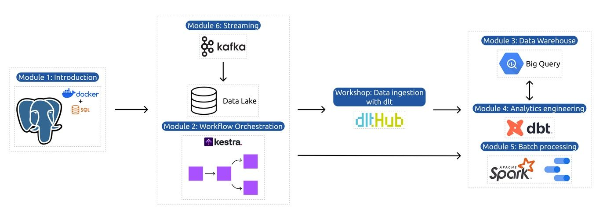
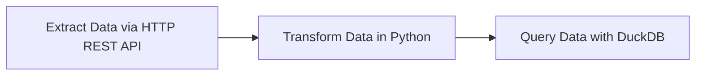
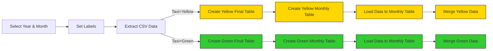
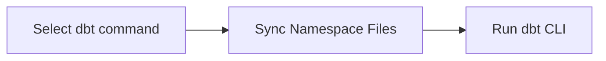
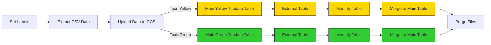
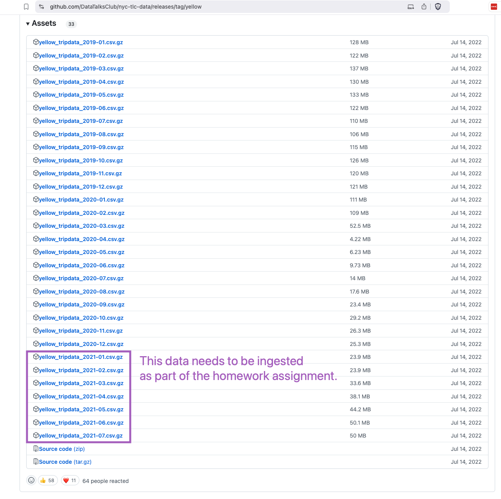
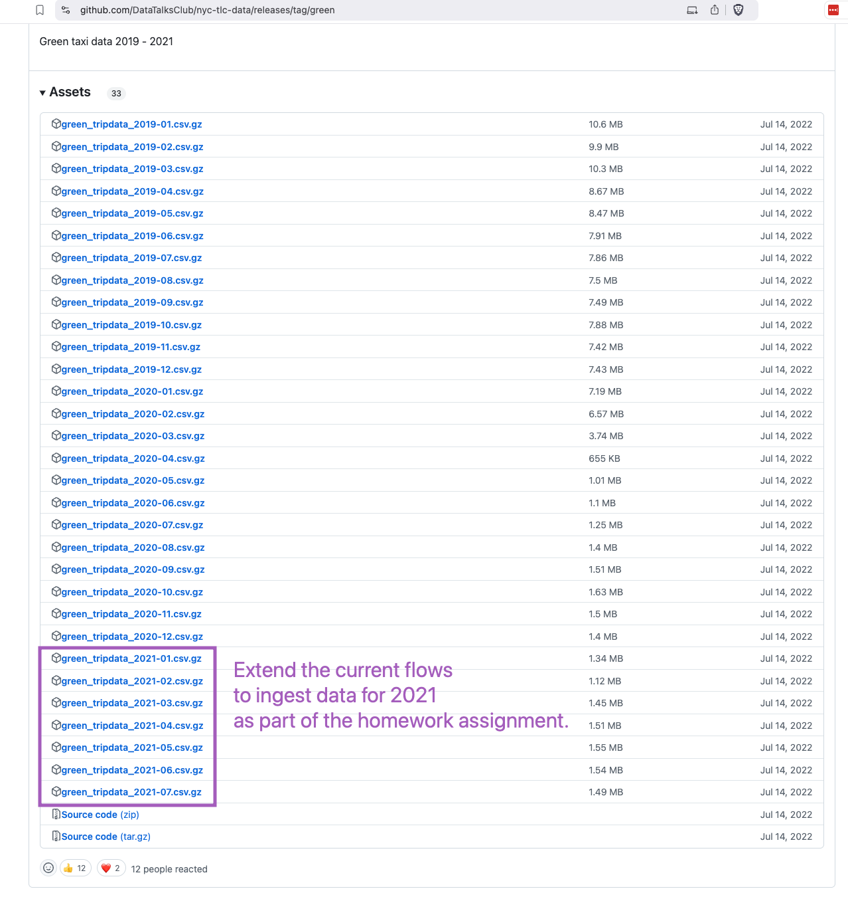

# Week 2: Workflow Orchestration

Welcome to Week 2 of the Data Engineering Zoomcamp! This week, we’ll dive into workflow orchestration using [Kestra](https://go.kestra.io/de-zoomcamp/github). 

Kestra is an open-source, event-driven orchestration platform that simplifies building both scheduled and event-driven workflows. By adopting Infrastructure as Code practices for data and process orchestration, Kestra enables you to build reliable workflows with just a few lines of YAML.



> [!NOTE]  
>You can find all videos for this week in this [YouTube Playlist](https://go.kestra.io/de-zoomcamp/yt-playlist).

---

# Course Structure

## 1. Conceptual Material: Introduction to Orchestration and Kestra

In this section, you’ll learn the foundations of workflow orchestration, its importance, and how Kestra fits into the orchestration landscape.

### Videos
- **Introduction to Workflow Orchestration**  
  [](https://youtu.be/ZV6CPZDiJFA?si=nd3mW_VydPByu4D4)

- **Introduction to Kestra**  
  [](https://youtu.be/a2BZ7vOihjg?si=XoJY8vt61LPumTed)

- **Launch Kestra using Docker Compose**  
  [](https://youtu.be/SGL8ywf3OJQ?si=aY2_NFpYLaOlKEaZ)

- **Kestra Fundamentals**  
  [](https://youtu.be/HR47SY2RkPQ?si=S7ic1ASWhmi_O0oN)

### Resources
- [Quickstart Guide](https://kestra.io/docs/getting-started/quickstart)
- [Tutorial](https://kestra.io/docs/getting-started/tutorial)

---

## 2. Hands-On Coding Project: Build Data Pipelines with Kestra

This week’s coding project revolves around building ETL pipelines for Yellow and Green Taxi data from NYC’s Taxi and Limousine Commission (TLC). You will:
1. Extract data from [CSV files](https://github.com/DataTalksClub/nyc-tlc-data/releases).
2. Load it into Postgres or Google Cloud (GCS + BigQuery).
3. Explore scheduling and backfilling workflows.

### File Structure

The project is organized as follows:
```
.
├── flows/
│   ├── 01_getting_started_data_pipeline.yaml
│   ├── 02_postgres_taxi.yaml
│   ├── 02_postgres_taxi_scheduled.yaml
│   ├── 03_postgres_dbt.yaml
│   ├── 04_gcp_kv.yaml
│   ├── 05_gcp_setup.yaml
│   ├── 06_gcp_taxi.yaml
│   ├── 06_gcp_taxi_scheduled.yaml
│   └── 07_gcp_dbt.yaml
```

### Setup Kestra

We'll set up Kestra using Docker Compose containing one container for the Kestra server and another for the Postgres database:

```bash
cd cohorts/2025/02-workflow-orchestration
docker-compose up -d
```

Once the container starts, you can access the Kestra UI at [http://localhost:8080](http://localhost:8080).

If you prefer to add flows programmatically using Kestra's API, run the following commands:

```bash
curl -X POST http://localhost:8080/api/v1/flows/import -F fileUpload=@flows/01_getting_started_data_pipeline.yaml
curl -X POST http://localhost:8080/api/v1/flows/import -F fileUpload=@flows/02_postgres_taxi.yaml
curl -X POST http://localhost:8080/api/v1/flows/import -F fileUpload=@flows/02_postgres_taxi_scheduled.yaml
curl -X POST http://localhost:8080/api/v1/flows/import -F fileUpload=@flows/03_postgres_dbt.yaml
curl -X POST http://localhost:8080/api/v1/flows/import -F fileUpload=@flows/04_gcp_kv.yaml
curl -X POST http://localhost:8080/api/v1/flows/import -F fileUpload=@flows/05_gcp_setup.yaml
curl -X POST http://localhost:8080/api/v1/flows/import -F fileUpload=@flows/06_gcp_taxi.yaml
curl -X POST http://localhost:8080/api/v1/flows/import -F fileUpload=@flows/06_gcp_taxi_scheduled.yaml
curl -X POST http://localhost:8080/api/v1/flows/import -F fileUpload=@flows/07_gcp_dbt.yaml
```

---

## 3. ETL Pipelines in Kestra: Detailed Walkthrough

### Getting Started Pipeline

This introductory flow is added just to demonstrate a simple data pipeline which extracts data via HTTP REST API, transforms that data in Python and then queries it using DuckDB.



The workflow code: [`01_getting_started_data_pipeline.yaml`](flows/01_getting_started_data_pipeline.yaml). Add this flow from the UI if you haven't already and run it to see the results. Inspect the Gantt and Logs tabs to understand the flow execution.

### Local DB: Load Taxi Data to Postgres

Before we start loading data to GCP, we'll first play with the Yellow and Green Taxi data using a local Postgres database running in a Docker container. To keep things simple, we'll use the same database as the one we set up for Kestra in Docker Compose.

The flow will extract CSV data partitioned by year and month, create final and monthly tables, load data to the monthly table, and finally merge the data to the final destination table.



The flow code: [`02_postgres_taxi.yaml`](flows/02_postgres_taxi.yaml).


> [!NOTE]  
> The NYC Taxi and Limousine Commission (TLC) Trip Record Data provided on the [nyc.gov](https://www.nyc.gov/site/tlc/about/tlc-trip-record-data.page) website is currently available only in a Parquet format, but this is NOT the dataset we're going to use in this course. For the purpose of this course, we'll use the **CSV files** available [here on GitHub](https://github.com/DataTalksClub/nyc-tlc-data/releases). This is because the Parquet format can be challenging to understand by newcomers, and we want to make the course as accessible as possible — the CSV format can be easily introspected using tools like Excel or Google Sheets, or even a simple text editor.


### Local DB: Learn Scheduling and Backfills

We can now schedule the same pipeline shown above to run daily at 9 AM UTC. We'll also demonstrate how to backfill the data pipeline to run on historical data.

Note: given the large dataset, we'll backfill only data for the green taxi dataset for the year 2019.

The flow code: [`02_postgres_taxi_scheduled.yaml`](flows/02_postgres_taxi_scheduled.yaml).

### Local DB: Orchestrate dbt Models

Now that we have raw data ingested into a local Postgres database, we can use dbt to transform the data into meaningful insights. The flow will sync the dbt models from Git to Kestra and run the `dbt build` command to build the models.



The flow code: [`03_postgres_dbt.yaml`](flows/03_postgres_dbt.yaml).

---

## 4. ETL Pipelines in Kestra: Google Cloud Platform

Now that you've learned how to build ETL pipelines locally using Postgres, we are ready to move to the cloud. In this section, we'll load the same Yellow and Green Taxi data to Google Cloud Platform (GCP) using: 
1. Google Cloud Storage (GCS) as a data lake  
2. BigQuery as a data warehouse.

### Setup Google Cloud Platform (GCP)

Before we start loading data to GCP, we need to set up the Google Cloud Platform. 

First, adjust the following flow to include your GCP project ID, service account, BigQuery dataset and GCS bucket name as KV Store values:
- GCP_CREDS
- GCP_PROJECT_ID
- GCP_LOCATION
- GCP_BUCKET_NAME
- GCP_DATASET

The flow code: [`04_gcp_kv.yaml`](flows/04_gcp_kv.yaml).

> [!WARNING]  
> The `GCP_CREDS` service account contains sensitive information. Ensure you keep it secure and do not commit it to Git version control. Keep it as secure as your passwords.

### Create GCP Resources

If you haven't already created the GCS bucket and BigQuery dataset in the first week of the course, you can use this flow to create them: [`05_gcp_setup.yaml`](flows/05_gcp_setup.yaml).


### GCP Workflow: Load Taxi Data to BigQuery



The flow code: [`06_gcp_taxi.yaml`](flows/06_gcp_taxi.yaml).

### GCP Workflow: Schedule and Backfill Full Dataset

We can now schedule the same pipeline shown above to run daily at 9 AM UTC for the green dataset and at 10 AM UTC for the yellow dataset. We'll also demonstrate how to backfill the data pipeline to run on historical data.

Since we now process data in a cloud environment with infinitely scalable storage and compute, we can backfill the entire dataset for both the yellow and green taxi data without the risk of running out of resources on our local machine.

The flow code: [`06_gcp_taxi_scheduled.yaml`](flows/06_gcp_taxi_scheduled.yaml).

### GCP Workflow: Orchestrate dbt Models

Now that we have raw data ingested into BigQuery, we can use dbt to transform that data. The flow will sync the dbt models from Git to Kestra and run the `dbt build` command to build the models:


The flow code: [`07_gcp_dbt.yaml`](flows/07_gcp_dbt.yaml).

---

## 5. Homework

### Assignment

So far in the course, we processed data for the year 2019 and 2020. Your task is to extend the existing flow to include data for the year 2021.





As a hint, Kestra makes that process really easy:
1. You can leverage the backfill functionality in the [scheduled flow](../flows/07_gcp_taxi_scheduled.yaml) to backfill the data for the year 2021. Just make sure to select the time period for which data exists i.e. from `2021-01-01` to `2021-07-31`. Also, make sure to do the same for both `yellow` and `green` taxi data (select the right service in the `taxi` input).
2. Alternatively, run the flow manually for each of the seven months of 2021 for both `yellow` and `green` taxi data. Challenge for you: find out how to loop over the combination of Year-Month and `taxi`-type using `ForEach` task which triggers the flow for each combination using a `Subflow` task.

### Quiz Questions

Complete the Quiz shown below. It’s a set of 6 multiple-choice questions to test your understanding of workflow orchestration, kestra and ETL pipelines for data lakes and warehouses.

1) Within the execution for `Yellow` Taxi data for the year `2020` and month `12`: what is the uncompressed file size (i.e. the output file `yellow_tripdata_2020-12.csv` of the `extract` task)?
- 128.3 MB
- 134.5 MB
- 364.7 MB
- 692.6 MB

2) What is the task run state of tasks bq_green_tripdata, bq_green_tmp_table and bq_merge_green when you run the flow with the `taxi` input set to value `yellow`?
- `SUCCESS`
- `FAILED`
- `SKIPPED`
- `CANCELED`

3) How do we deal with table schema in the Google Cloud ingestion pipeline?
- We don't define the schema at all because this is a data lake after all
- We let BigQuery autodetect the schema
- Kestra automatically infers the schema from the extracted data
- We explicitly define the schema in the tasks that create external source tables and final target tables

4) How does Kestra handles backfills in the scheduled flow?
- You need to define backfill properties in the flow configuration
- You have to run CLI commands to backfill the data
- You can run backfills directly from the UI from the Flow Triggers tab by selecting the time period
- Kestra doesn't support backfills

5) Which of the following CRON expressions schedules a flow to run at 09:00 UTC on the first day of every month?
- `0 9 1 * *`
- `0 1 9 * *`
- `0 9 * * *`
- `1 9 * * *`

6) How would you configure the timezone to New York in a Schedule trigger?
- Add a `timezone` property set to `EST` in the `Schedule` trigger configuration  
- Add a `timezone` property set to `America/New_York` in the `Schedule` trigger configuration
- Add a `timezone` property set to `UTC-5` in the `Schedule` trigger configuration
- Add a `location` property set to `New_York` in the `Schedule` trigger configuration  

---

## 6. Additional Resources 📚

- Check [Kestra Docs](https://go.kestra.io/de-zoomcamp/docs)
- Explore our [Blueprints](https://go.kestra.io/de-zoomcamp/blueprints) library
- Browse over 600 [plugins](https://go.kestra.io/de-zoomcamp/plugins) available in Kestra
- Give us a star on [GitHub](https://go.kestra.io/de-zoomcamp/github)
- Join our [Slack community](https://go.kestra.io/de-zoomcamp/slack) if you have any questions
- Find all the videos in this [YouTube Playlist](https://go.kestra.io/de-zoomcamp/yt-playlist)


### Troubleshooting tips

If you encounter similar errors to:

```
BigQueryError{reason=invalid, location=null, 
message=Error while reading table: kestra-sandbox.zooomcamp.yellow_tripdata_2020_01, 
error message: CSV table references column position 17, but line contains only 14 columns.; 
line_number: 2103925 byte_offset_to_start_of_line: 194863028 
column_index: 17 column_name: "congestion_surcharge" column_type: NUMERIC 
File: gs://anna-geller/yellow_tripdata_2020-01.csv}
```

It means that the CSV file you're trying to load into BigQuery has a mismatch in the number of columns between the external source table (i.e. file in GCS) and the destination table in BigQuery. This can happen when for due to network/transfer issues, the file is not fully downloaded from GitHub or not correctly uploaded to GCS. The error suggests schema issues but that's not the case. Simply rerun the entire execution including redownloading the CSV file and reuploading it to GCS. This should resolve the issue.


---

# Community notes

Did you take notes? You can share them by creating a PR to this file! 

## 2024 notes

See [here](../../2024/02-workflow-orchestration#community-notes)

## 2023 notes

See [here](../../2023/week_2_workflow_orchestration#community-notes)


## 2022 notes

See [here](../../2022/week_2_data_ingestion#community-notes)

---

# Previous Cohorts

> [!NOTE]  
>If you're looking for Airflow videos from the 2022 edition, check the [2022 cohort folder](../../2022/week_2_data_ingestion/). 
>
>If you're looking for Prefect videos from the 2023 edition, check the [2023 cohort folder](../../2023/week_2_workflow_orchestration/).
>
>If you're looking for Mage videos from the 2024 edition, check the [2024 cohort folder](../../2024/02-workflow-orchestration/).
