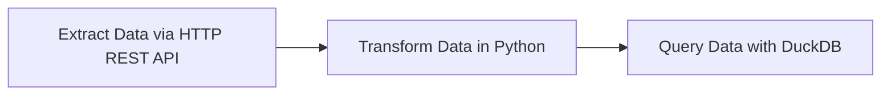
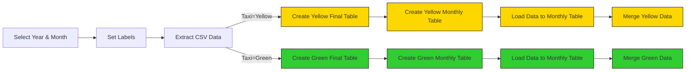
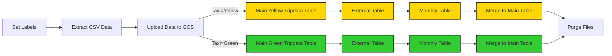
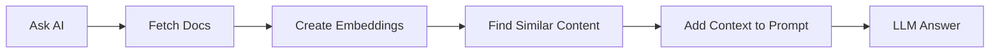

# Workflow Orchestration

Welcome to Module 2 of the Data Engineering Zoomcamp! This week, we’ll dive into workflow orchestration using [Kestra](https://go.kestra.io/de-zoomcamp/github). 

Kestra is an open-source, event-driven orchestration platform that simplifies building both scheduled and event-driven workflows. By adopting Infrastructure as Code practices for data and process orchestration, Kestra enables you to build reliable workflows with just a few lines of YAML.

> [!NOTE]  
>You can find all videos for this week in this [YouTube Playlist](https://go.kestra.io/de-zoomcamp/yt-playlist).

---

# Course Structure

## 1. Conceptual Material: Introduction to Orchestration and Kestra

In this section, you’ll learn the foundations of workflow orchestration, its importance, and how Kestra fits into the orchestration landscape.

### Videos
- **2.2.1 - Introduction to Workflow Orchestration**  
  [](https://youtu.be/Np6QmmcgLCs)

- **2.2.2 - Learn the Concepts of Kestra**  
  [](https://youtu.be/o79n-EVpics)

### Resources
- [Quickstart Guide](https://go.kestra.io/de-zoomcamp/quickstart)
- [Install Kestra with Docker Compose](https://go.kestra.io/de-zoomcamp/docker-compose)
- [Tutorial](https://go.kestra.io/de-zoomcamp/tutorial)
- [What is an Orchestrator?](https://go.kestra.io/de-zoomcamp/what-is-an-orchestrator)

---

## 2. Hands-On Coding Project: Build Data Pipelines with Kestra

This week, we're gonna build ETL pipelines for Yellow and Green Taxi data from NYC’s Taxi and Limousine Commission (TLC). You will:
1. Extract data from [CSV files](https://github.com/DataTalksClub/nyc-tlc-data/releases).
2. Load it into Postgres or Google Cloud (GCS + BigQuery).
3. Explore scheduling and backfilling workflows.

>[!NOTE] 
If you’re using the PostgreSQL and PgAdmin docker setup from Module 1 for this week’s Kestra Workflow Orchestration exercise, ensure your PostgreSQL image version is 15 or later (preferably the latest). The MERGE statement, introduced in PostgreSQL 15, won’t work on earlier versions and will likely cause syntax errors in your kestra flows.

### File Structure

The project is organized as follows:
```
.
├── flows/
│   ├── 01_getting_started_data_pipeline.yaml
│   ├── 02_postgres_taxi.yaml
│   ├── 02_postgres_taxi_scheduled.yaml
│   ├── 03_gcp_kv.yaml
│   ├── 04_gcp_setup.yaml
│   ├── 05_gcp_taxi.yaml
│   ├── 05_gcp_taxi_scheduled.yaml
│   ├── 06_chat_without_rag.yaml
│   ├── 07_chat_with_rag.yaml
│   ├── 08_simple_agent.yaml
│   ├── 09_web_research_agent.yaml
│   └── 10_multi_agent_research.yaml
```

### Setup Kestra

We'll set up Kestra using Docker Compose containing one container for the Kestra server and another for the Postgres database:

```bash
cd 02-workflow-orchestration/docker/combined
docker compose up -d
```

Once the container starts, you can access the Kestra UI at [http://localhost:8080](http://localhost:8080).

If you prefer to add flows programmatically using Kestra's API, run the following commands:

```bash
# Import all flows: assuming username admin@kestra.io and password Admin1234 (adjust to match your username and password)
curl -X POST -u 'admin@kestra.io:Admin1234' http://localhost:8080/api/v1/flows/import -F fileUpload=@flows/01_getting_started_data_pipeline.yaml
curl -X POST -u 'admin@kestra.io:Admin1234' http://localhost:8080/api/v1/flows/import -F fileUpload=@flows/02_postgres_taxi.yaml
curl -X POST -u 'admin@kestra.io:Admin1234' http://localhost:8080/api/v1/flows/import -F fileUpload=@flows/02_postgres_taxi_scheduled.yaml
curl -X POST -u 'admin@kestra.io:Admin1234' http://localhost:8080/api/v1/flows/import -F fileUpload=@flows/03_gcp_kv.yaml
curl -X POST -u 'admin@kestra.io:Admin1234' http://localhost:8080/api/v1/flows/import -F fileUpload=@flows/04_gcp_setup.yaml
curl -X POST -u 'admin@kestra.io:Admin1234' http://localhost:8080/api/v1/flows/import -F fileUpload=@flows/05_gcp_taxi.yaml
curl -X POST -u 'admin@kestra.io:Admin1234' http://localhost:8080/api/v1/flows/import -F fileUpload=@flows/05_gcp_taxi_scheduled.yaml
curl -X POST -u 'admin@kestra.io:Admin1234' http://localhost:8080/api/v1/flows/import -F fileUpload=@flows/06_chat_without_rag.yaml
curl -X POST -u 'admin@kestra.io:Admin1234' http://localhost:8080/api/v1/flows/import -F fileUpload=@flows/07_chat_with_rag.yaml
curl -X POST -u 'admin@kestra.io:Admin1234' http://localhost:8080/api/v1/flows/import -F fileUpload=@flows/08_simple_agent.yaml
curl -X POST -u 'admin@kestra.io:Admin1234' http://localhost:8080/api/v1/flows/import -F fileUpload=@flows/09_web_research_agent.yaml
curl -X POST -u 'admin@kestra.io:Admin1234' http://localhost:8080/api/v1/flows/import -F fileUpload=@flows/10_multi_agent_research.yaml
```

---

## 3. ETL Pipelines in Kestra: Detailed Walkthrough

### Getting Started Pipeline

This introductory flow is added just to demonstrate a simple data pipeline which extracts data via HTTP REST API, transforms that data in Python and then queries it using DuckDB. For this stage, a new separate Postgres database is created for the exercises. 

**Note:** Check that `pgAdmin` isn't running on the same ports as Kestra. If so, check out the [FAQ](#troubleshooting-tips) at the bottom of the README.

### Videos

- **2.2.3 - Create an ETL Pipeline with Postgres in Kestra**   
  [](https://youtu.be/OkfLX28Ecjg?si=vKbIyWo1TtjpNnvt)
- **2.2.4 - Manage Scheduling and Backfills using Postgres in Kestra**  
  [](https://youtu.be/_-li_z97zog?si=G6jZbkfJb3GAyqrd)




Add the flow [`01_getting_started_data_pipeline.yaml`](flows/01_getting_started_data_pipeline.yaml) from the UI if you haven't already and execute it to see the results. Inspect the Gantt and Logs tabs to understand the flow execution.

### Local DB: Load Taxi Data to Postgres

Before we start loading data to GCP, we'll first play with the Yellow and Green Taxi data using a local Postgres database running in a Docker container. We'll create a new Postgres database for these examples using this [Docker Compose file](docker/postgres/docker-compose.yml). Download it into a new directory, navigate to it and run the following command to start it:

```bash
docker compose up -d
```

The flow will extract CSV data partitioned by year and month, create tables, load data to the monthly table, and finally merge the data to the final destination table.



The flow code: [`02_postgres_taxi.yaml`](flows/02_postgres_taxi.yaml).


> [!NOTE]  
> The NYC Taxi and Limousine Commission (TLC) Trip Record Data provided on the [nyc.gov](https://www.nyc.gov/site/tlc/about/tlc-trip-record-data.page) website is currently available only in a Parquet format, but this is NOT the dataset we're going to use in this course. For the purpose of this course, we'll use the **CSV files** available [here on GitHub](https://github.com/DataTalksClub/nyc-tlc-data/releases). This is because the Parquet format can be challenging to understand by newcomers, and we want to make the course as accessible as possible — the CSV format can be easily introspected using tools like Excel or Google Sheets, or even a simple text editor.

### Local DB: Learn Scheduling and Backfills

We can now schedule the same pipeline shown above to run daily at 9 AM UTC. We'll also demonstrate how to backfill the data pipeline to run on historical data.

Note: given the large dataset, we'll backfill only data for the green taxi dataset for the year 2019.

The flow code: [`02_postgres_taxi_scheduled.yaml`](flows/02_postgres_taxi_scheduled.yaml).

### Resources
- [pgAdmin Download](https://www.pgadmin.org/download/)
- [Postgres DB Docker Compose](docker/postgres/docker-compose.yml)

---

## 4. ETL Pipelines in Kestra: Google Cloud Platform

Now that you've learned how to build ETL pipelines locally using Postgres, we are ready to move to the cloud. In this section, we'll load the same Yellow and Green Taxi data to Google Cloud Platform (GCP) using: 
1. Google Cloud Storage (GCS) as a data lake  
2. BigQuery as a data warehouse.

### Videos

- **2.2.5 - Create an ETL Pipeline with GCS and BigQuery in Kestra**  
  [](https://youtu.be/nKqjjLJ7YXs)
- **2.2.6 - Manage Scheduling and Backfills using BigQuery in Kestra**   
  [](https://youtu.be/DoaZ5JWEkH0)

### Setup Google Cloud Platform (GCP)

Before we start loading data to GCP, we need to set up the Google Cloud Platform. 

First, adjust the following flow [`03_gcp_kv.yaml`](flows/03_gcp_kv.yaml) to include your service account, GCP project ID, BigQuery dataset and GCS bucket name (_along with their location_) as KV Store values:
- GCP_CREDS
- GCP_PROJECT_ID
- GCP_LOCATION
- GCP_BUCKET_NAME
- GCP_DATASET.


> [!WARNING]  
> The `GCP_CREDS` service account contains sensitive information. Ensure you keep it secure and do not commit it to Git. Keep it as secure as your passwords.

### Create GCP Resources

If you haven't already created the GCS bucket and BigQuery dataset in the first week of the course, you can use this flow to create them: [`04_gcp_setup.yaml`](flows/04_gcp_setup.yaml).


### GCP Workflow: Load Taxi Data to BigQuery



The flow code: [`05_gcp_taxi.yaml`](flows/05_gcp_taxi.yaml).

### GCP Workflow: Schedule and Backfill Full Dataset

We can now schedule the same pipeline shown above to run daily at 9 AM UTC for the green dataset and at 10 AM UTC for the yellow dataset. You can backfill historical data directly from the Kestra UI.

Since we now process data in a cloud environment with infinitely scalable storage and compute, we can backfill the entire dataset for both the yellow and green taxi data without the risk of running out of resources on our local machine.

The flow code: [`05_gcp_taxi_scheduled.yaml`](flows/05_gcp_taxi_scheduled.yaml).

---

## 5. AI Workflows & AI Agents

This section builds on what you learned earlier in Module 2 to show you how AI can accelerate workflow development and enable autonomous task automation.

### Videos

- **2.2.7 - AI Workflows and Agents**  
  [](https://youtu.be/PLACEHOLDER)

### Learning Objectives

By the end of this section, you will:
- Understand the importance of context engineering in AI applications
- Use AI Copilot to build Kestra flows faster and more accurately
- Implement Retrieval Augmented Generation (RAG) to ground AI responses in real data
- Build autonomous AI agents that can make decisions and use tools dynamically
- Design multi-agent systems where specialized agents collaborate to solve complex tasks
- Apply best practices for using AI in production data workflows

### Prerequisites

- Completion of earlier sections in Module 2 (Workflow Orchestration with Kestra)
- Kestra running locally 
- Google Cloud account with access to Gemini API
- Basic understanding of YAML and workflow concepts

---

### Introduction: Why AI for Workflows?

As data engineers, we spend significant time writing boilerplate code, searching documentation, and structuring data pipelines. AI tools can help us:

- **Generate workflows faster**: Describe what you want in natural language instead of writing YAML from scratch
- **Avoid errors**: Get syntax-correct, up-to-date code that follows best practices
- **Automate complex decisions**: Let AI agents dynamically orchestrate tasks based on changing conditions
- **Ground responses in data**: Use RAG to ensure AI provides accurate, contextual information

However, AI is only as good as the context we provide. This section teaches you how to engineer that context for reliable, production-ready workflows.

#### What Makes This Different from AI Assistants?

Traditional AI assistants (like ChatGPT or Gemini in a browser) don't have context about:
- Your codebase and workflow patterns
- Real-time data from your systems
- Latest documentation and best practices

By integrating AI directly into Kestra and using techniques like RAG and specialized agents, we can provide this context and get much better results.

---

### Context Engineering with ChatGPT

Let's start by seeing what happens when AI lacks proper context.

#### Experiment: ChatGPT Without Context

1. **Open ChatGPT in a private browser window** (to avoid any existing chat context): https://chatgpt.com

2. **Enter this prompt:**
   ```
   Create a Kestra flow that loads NYC taxi data from a CSV file to BigQuery. The flow should extract data, upload to GCS, and load to BigQuery.
   ```

3. **Observe the results:**
   - ChatGPT will generate a Kestra flow, but it likely contains:
     - **Outdated plugin syntax** (e.g., old task types that have been renamed)
     - **Incorrect property names** (e.g., properties that don't exist in current versions)
     - **Hallucinated features** (e.g., tasks, triggers or properties that never existed)

#### Why Does This Happen?

Large Language Models (LLMs) like GPT models from OpenAI are trained on data up to a specific point in time (knowledge cutoff). They don't automatically know about:
- Software updates and new releases
- Renamed plugins or changed APIs
- New best practices in your organization
- Specific configurations for your infrastructure

This is the fundamental challenge of using AI: **the model can only work with information it has access to.**

#### Key Learning: Context is Everything

Without proper context:
- ❌ Generic AI assistants hallucinate outdated or incorrect code
- ❌ You can't trust the output for production use

With proper context:
- ✅ AI generates accurate, current, production-ready code
- ✅ You can iterate faster and focus on business logic

In the next section, we'll see how Kestra's AI Copilot solves this problem.

---

### AI Copilot in Kestra

Kestra's AI Copilot is specifically designed to generate and modify Kestra flows with full context about the latest plugins, syntax, and best practices.

#### Setup AI Copilot

Before using AI Copilot, you need to configure Gemini API access in your Kestra instance.

**Step 1: Get Your Gemini API Key**

1. Visit Google AI Studio: https://aistudio.google.com/app/apikey
2. Sign in with your Google account
3. Click "Create API Key"
4. Copy the generated key (keep it secure!)

> [!WARNING]  
> Never commit API keys to Git. Always use environment variables or Kestra's KV Store.

**Step 2: Configure Kestra**

Add the following to your Kestra configuration. You can do this by modifying your `docker-compose.yml` file from Module 2:

```yaml
services:
  kestra:
    environment:
      KESTRA_CONFIGURATION: |
        kestra:
          ai:
            type: gemini
            gemini:
              model-name: gemini-2.5-flash
              api-key: ${GEMINI_API_KEY}
```

Then restart Kestra:
```bash
cd 02-workflow-orchestration/docker/combined
export GEMINI_API_KEY="your-api-key-here"
docker compose up -d
```

Alternatively, you can store the API key in Kestra's KV Store for better security.

**Step 3: Access AI Copilot**

1. Open Kestra UI: http://localhost:8080
2. Create a new flow or open an existing one
3. Look for the **AI Copilot** button (sparkle icon ✨) in the top-right corner of the Flow Editor

#### Hands-On: Compare Copilot vs. Raw ChatGPT

Now let's use the same prompt from the previous section, but with AI Copilot:

1. **Click the AI Copilot button** in Kestra's Flow Editor
2. **Enter the same prompt:**
   ```
   Create a Kestra flow that loads NYC taxi data from a CSV file to BigQuery. The flow should extract data, upload to GCS, and load to BigQuery.
   ```
3. **Observe the results:**
   - ✅ Correct, up-to-date plugin types 
   - ✅ Valid property names and configurations
   - ✅ Working, executable YAML

#### Why Does Copilot Work Better?

Kestra's AI Copilot has access to:
- **Current plugin documentation**: All available plugins and their exact syntax
- **Flow context**: If you're editing an existing flow, it knows what's already there
- **Best practices**: Patterns and configurations recommended by Kestra
- **Version-specific details**: Exact task types, properties, and requirements for your Kestra version

This is **context engineering** in action: by giving the AI the right context, we get reliable, production-ready results.

#### Iterative Refinement with Copilot

AI Copilot helps with both creating new flows and refining existing ones.

**Example conversation with Copilot:**

1. **You:** "Create a flow that downloads a CSV file and loads it to BigQuery"
   - Copilot generates basic flow

2. **You:** "Add a task that checks data quality of the data in BigQuery"
   - Copilot adds a data quality validation task with SQL queries to verify record counts, null checks, and data freshness

3. **You:** "Schedule the flow to run daily at 9 AM UTC"
   - Copilot adds a `Schedule` trigger

4. **You:** "Send a Slack notification if it fails"
   - Copilot adds a `SlackIncomingWebhook` task in an `errors` branch

Each iteration preserves the existing flow structure and only modifies what's needed. You're collaborating with AI, not starting from scratch each time.

#### Example Use Cases for AI Copilot

- **Generate new flows**: "Create a flow that syncs data from Postgres to GCS"
- **Add tasks**: "Add an If-task performing conditional branching to determine whether to run a given list of tasks"
- **Configure triggers**: "Add a webhook trigger"
- **Add error handling**: "Add retry logic with exponential backoff"

---

### Retrieval Augmented Generation (RAG)

Now let's explore how to provide dynamic context to AI using Retrieval Augmented Generation (RAG).

#### What is RAG?

**RAG (Retrieval Augmented Generation)** is a technique that:
1. **Retrieves** relevant information from your data sources
2. **Augments** the AI prompt with this context
3. **Generates** a response grounded in real data

This solves the hallucination problem by ensuring the AI has access to current, accurate information at query time.

#### How RAG Works in Kestra



**The Process:**
1. **Ingest documents**: Load documentation, release notes, or other data sources
2. **Create embeddings**: Convert text into vector representations using an LLM
3. **Store embeddings**: Save vectors in Kestra's KV Store (or a vector database)
4. **Query with context**: When you ask a question, retrieve relevant embeddings and include them in the prompt
5. **Generate response**: The LLM has real context and provides accurate answers

#### RAG Example: Kestra Release Features

Let's demonstrate RAG with a practical example: asking about features in a specific Kestra release.

**Step 1: Without RAG (The Problem)**

Flow: [`06_chat_without_rag.yaml`](flows/06_chat_without_rag.yaml)

This flow asks Gemini: **"Which features were released in Kestra 1.1?"**

Without RAG, the model might:
- Hallucinate features that don't exist
- Provide outdated information
- Miss important features
- Give vague or generic answers

**Try it yourself:**
1. Import and run `06_chat_without_rag.yaml`
2. Check the output and confirm the response isn't accurate

**Step 2: With RAG (The Solution)**

Flow: [`07_chat_with_rag.yaml`](flows/07_chat_with_rag.yaml)

This flow:
1. **Ingests** Kestra 1.1 release blog post from GitHub
2. **Creates embeddings** using Gemini's embedding model
3. **Stores** embeddings in Kestra KV Store
4. **Asks LLM** the same question but with RAG enabled
5. **Returns** accurate response with features from that release

**Try it yourself:**
1. Import and run `07_chat_with_rag.yaml` and 
2. Confirm the accuracy of this output compared to `06_chat_without_rag.yaml`

#### RAG Best Practices

1. **Keep documents updated**: Regularly re-ingest to ensure current information
2. **Chunk appropriately**: Break large documents into meaningful sections
3. **Test retrieval quality**: Verify that the right documents are retrieved
4. **Consider costs**: Embedding and storage have costs, so balance accuracy vs. budget

---

### AI Agents: Autonomous Task Execution

While AI Copilot helps you *build* workflows faster, AI Agents help you *run* workflows that can make autonomous decisions.

#### What is an AI Agent?

An **AI Agent** is an autonomous system that:
- Uses an LLM to reason and make decisions
- Has access to tools (web search, task execution, etc.)
- Can remember context across executions (with memory)
- Dynamically decides which actions to take and in what order

**Traditional Workflow:** → Fixed sequence, predetermined logic

Pseudo-code:

```yaml
tasks:
  - id: step1
    type: Task1
  - id: step2
    type: Task2
  - id: step3
    type: Task3
```


**AI Agent Workflow:** → Agent decides what to do, in what order, based on the goal

Pseudo-code:

```yaml
tasks:
  - id: agent
    type: io.kestra.plugin.ai.agent.AIAgent
    prompt: "Research data engineering trends and create a report"
    tools:
      - WebSearch
      - TaskExecution
```

#### When to Use AI Agents

**Use AI Agents when:**
- ✅ The exact sequence of steps isn't known in advance
- ✅ Decisions depend on dynamic, changing information
- ✅ You need to adapt to unexpected conditions

**Use Traditional Workflows when:**
- ✅ Steps are deterministic and repeatable
- ✅ Compliance requires exact, auditable processes
- ✅ Cost and latency must be minimized

#### Anatomy of an AI Agent

```yaml
id: example_agent
namespace: zoomcamp

tasks:
  - id: agent
    type: io.kestra.plugin.ai.agent.AIAgent
    
    # Defines the agent's role and behavior
    systemMessage: |
      You are a data analyst. Analyze data and provide insights.
    
    # The actual task or question
    prompt: "What are the top 3 trends in this data?"
    
    # LLM provider configuration
    provider:
      type: io.kestra.plugin.ai.provider.GoogleGemini
      modelName: gemini-2.5-flash
      apiKey: "{{ kv('GEMINI_API_KEY') }}"
    
    # Tools the agent can use
    tools:
      - type: io.kestra.plugin.ai.tool.TavilyWebSearch
        apiKey: "{{ kv('TAVILY_API_KEY') }}"
    
    # Memory for context across executions
    memory:
      type: io.kestra.plugin.ai.memory.KestraKVStore
      memoryId: analyst_001
```

#### Simple Agent Example

Flow: [`08_simple_agent.yaml`](flows/08_simple_agent.yaml)

This flow demonstrates a basic AI agent that summarizes text with controllable length and language:

**Features:**
- **Inputs** for summary length (short/medium/long) and language
- **System message** defining the agent's role
- **Two agent tasks** demonstrating sequential execution
- **Token usage output** for cost monitoring

**This flow demonstrates:**
- How to structure agent prompts
- How to chain agent tasks
- How to use `pluginDefaults` to avoid repetition
- How to track token usage

#### Advanced Agent Example: Web Research

Flow: [`09_web_research_agent.yaml`](flows/09_web_research_agent.yaml)

This flow demonstrates an agent with autonomous tool usage:

**What the agent does:**
1. Receives a research **prompt** (e.g., "Latest trends in workflow orchestration")
2. Decides to use the **web search tool** to gather information
3. **Evaluates search results** and determines if more searches are needed
4. **Synthesizes findings** into a structured markdown report
5. Saves the **report** to a file using the **filesystem tool**

**Key concepts:**
- The agent **autonomously decides** when to use tools
- It can loop (search → evaluate → search again) until satisfied
- You only specify the goal, not the exact steps

**This flow demonstrates:**
- How agents use tools
- How to guide agent behavior with system messages
- Trade-offs between autonomy and control

#### Agent Tools Available in Kestra

| Tool | Purpose | Example Use |
|------|---------|-------------|
| `TavilyWebSearch` | Search the web for current information | Market research, news monitoring |
| `GoogleCustomWebSearch` | Search with Google Custom Search API | Google search |
| `CodeExecution` | Run code safely via Judge0 | Math calculations, data validation |
| `KestraTask` | Execute any Kestra task | Run tasks based on +1000 Kestra plugins, e.g. query databases |
| `KestraFlow` | Trigger other Kestra flows | Call other flows, great for modularity |
| `StreamableHttpMcpClient` | Use MCP servers via HTTP/SSE | Connect to remote MCP servers |
| `DockerMcpClient` | Use MCP servers in Docker | Connect to MCP servers spun up on-demand via Docker e.g. for file operations and custom tools |
| `StdioMcpClient` | Use MCP servers via stdio | Integration with external systems via a local process |
| `AIAgent` | Use another agent as a tool | Multi-agent systems, specialized sub-agents |

#### Agent Observability

Kestra provides full observability for agent executions:

- **Token usage**: Track input/output tokens to monitor cost
- **Tool executions**: Track which tools were executed by the agent and with what parameters
- **Request and response logs**: Track LLM's reasoning and decisions
- **Outputs**: Access agent outputs
- **Execution time**: Monitor agent performance

You can enable detailed logging via the `configuration` property:
```yaml
provider:
  type: io.kestra.plugin.ai.provider.GoogleGemini
  modelName: gemini-2.5-flash
  apiKey: "{{ kv('GEMINI_API_KEY') }}"
  configuration:
    logRequests: true
    logResponses: true
```

---

### Multi-Agent Systems

For complex tasks, you can design systems where multiple specialized agents collaborate.

**Multi-Agent System** involves:
- **Agents** with different specializations
- **Coordination** between agents (one agent uses another as a tool)
- **Modular design** where each agent has a clear responsibility

**Benefits of using multiple agents:**
- **Separation of concerns**: Each agent focuses on one thing
- **Debugging**: Easier to isolate issues in specific agents

#### Multi-Agent Example: Company Research

Flow: [`10_multi_agent_research.yaml`](flows/10_multi_agent_research.yaml)

This flow demonstrates a two-agent system for competitor research:

| Agent | Specialization | Tools | Responsibility |
|-------|---------------|-------|----------------|
| **Research Agent** | Web research and data gathering | Tavily web search | Find factual, current information |
| **Main Analyst Agent** | Analysis and synthesis | Research agent (used as a tool) | Create structured reports |

**How it works:**

1. **Input**: Company name (e.g., "kestra.io")
2. **Main agent** receives prompt: "Research this company"
3. **Main agent** calls research agent tool: "Find information about kestra.io"
4. **Research agent** searches the web: Uses Tavily to gather data
5. **Research agent** returns findings: Raw data about the company
6. **Main agent** structures findings: Final JSON output.

**This flow demonstrates:**
- How to use agents as tools for other agents
- How to structure multi-agent systems
- How to get structured JSON output

#### Best Practices for Multi-Agent Systems

1. **Define clear responsibilities**: Each agent should have a specific role
2. **Monitor token usage**: Multiple agents = multiple LLM calls
3. **Document agent purposes**: Make the system maintainable

---

### Getting Started

Here's how to set up everything you need to run the example flows.

#### Step 1: Ensure Kestra is Running

From Module 2, you should have Kestra running. 

If not running, start it:
```bash
cd 02-workflow-orchestration/docker/combined
docker compose up -d
```

#### Step 2: Obtain API Keys

**Gemini API Key (Required)**

1. Visit: https://aistudio.google.com/app/apikey
2. Sign in with your Google account
3. Click "Create API Key"
4. Copy your key

**Free Tier:** Generous quota suitable for learning (rate limits apply)

**Tavily API Key (Optional, for web search examples)**

1. Visit: https://tavily.com/
2. Sign up for free tier
3. Get API key from dashboard

**Free Tier:** 1,000 searches/month

#### Step 3: Configure API Keys in Kestra

Store your API keys securely using Kestra's KV Store via the UI:

1. **Navigate to KV Store**:
   - In Kestra UI, click on **KV Store** in the left sidebar
   - Click **New Key-Value** button in the top right

2. **Add your Gemini API key**:
   - **Namespace**: `zoomcamp`
   - **Key**: `GEMINI_API_KEY`
   - **Type**: Select `STRING` from dropdown
   - **Value**: `your-gemini-api-key-here`
   - Click **Save**

3. **Add your Tavily API key** (for agent examples):
   - Click **New Key-Value** again
   - **Namespace**: `zoomcamp`
   - **Key**: `TAVILY_API_KEY`
   - **Type**: Select `STRING` from dropdown
   - **Value**: `your-tavily-api-key-here`
   - Click **Save**

> [!WARNING]  
> Never commit API keys to Git! Always use Kestra's KV Store (OSS) or Secrets (Enterprise) to store sensitive credentials.

#### Step 4: Import Flows

```bash
# Import flows: assuming username admin@kestra.io and password Admin1234 (adjust to match your username and password)
curl -X POST -u 'admin@kestra.io:Admin1234' http://localhost:8080/api/v1/flows/import -F fileUpload=@flows/06_chat_without_rag.yaml
curl -X POST -u 'admin@kestra.io:Admin1234' http://localhost:8080/api/v1/flows/import -F fileUpload=@flows/07_chat_with_rag.yaml
curl -X POST -u 'admin@kestra.io:Admin1234' http://localhost:8080/api/v1/flows/import -F fileUpload=@flows/08_simple_agent.yaml
curl -X POST -u 'admin@kestra.io:Admin1234' http://localhost:8080/api/v1/flows/import -F fileUpload=@flows/09_web_research_agent.yaml
curl -X POST -u 'admin@kestra.io:Admin1234' http://localhost:8080/api/v1/flows/import -F fileUpload=@flows/10_multi_agent_research.yaml
```

Alternatively, copy-paste the flow YAML directly into Kestra's UI.

#### Step 5: Configure AI Copilot

To enable AI Copilot in the UI, edit your `docker-compose.yml`:

```yaml
services:
  kestra:
    environment:
      KESTRA_CONFIGURATION: |
        kestra:
          ai:
            type: gemini
            gemini:
              model-name: gemini-2.5-flash
              api-key: ${GEMINI_API_KEY}
```

Then restart Kestra:

```bash
cd 02-workflow-orchestration/docker/combined
export GEMINI_API_KEY="your-api-key-here"
docker compose up -d
```

#### Step 6: Hands-On Exercises

Now that you have everything set up, let's run through a series of exercises to understand how AI workflows work in practice.

##### Exercise 1: ChatGPT vs AI Copilot Comparison

**Objective:** Experience firsthand why context engineering matters.

**Steps:**

1. **Open ChatGPT in a private/incognito browser window** (to avoid any existing chat history context): https://chatgpt.com

2. **Enter this exact prompt:**
   ```
   Create a Kestra flow that loads NYC taxi data from a CSV file to BigQuery. The flow should extract data, upload to GCS, and load to BigQuery.
   ```

3. **Observe the output** and note common issues:
   - Outdated plugin syntax (e.g., old task types)
   - Incorrect property names
   - Hallucinated features that don't exist in Kestra
   - Generic, non-working YAML

4. **Now open Kestra UI** at http://localhost:8080

5. **Create a new flow** and open the Code editor panel

6. **Click the AI Copilot button** (sparkle icon ✨) in the top-right corner

7. **Enter the same exact prompt** and watch Copilot generate accurate, current YAML

8. **Compare the outputs:**
   - ✅ Copilot uses correct plugin types and properties
   - ✅ Copilot follows current Kestra best practices
   - ✅ Copilot generates executable, working YAML

**Key Learning:** Context matters! AI Copilot has access to current Kestra documentation, generating Kestra flows better than a generic ChatGPT assistant.

##### Exercise 2: RAG (Retrieval With vs Without Context)

**Objective:** Understand how RAG eliminates hallucinations by grounding AI in real data.

**Part A: Without RAG**

1. Navigate to the `06_chat_without_rag` flow in your Kestra UI
2. Click **Execute**
3. Wait for the execution to complete
4. Open the **Logs** tab
5. Read the output - notice how the response about "Kestra 1.1 features" is:
   - Vague or generic
   - Potentially incorrect
   - Missing specific details
   - Based only on the model's training data (which may be outdated)

**Part B: With RAG**

1. Navigate to the `07_chat_with_rag` flow
2. Click **Execute**
3. Watch the execution:
   - First task: **Ingests** Kestra 1.1 release documentation
   - Creates **embeddings** and stores them
   - Second task: **Queries** with the same question but includes retrieved context
4. Open the **Logs** tab
5. Compare this output with the previous one - notice how it's:
   - ✅ Specific and detailed
   - ✅ Accurate with real features from the release
   - ✅ Grounded in actual documentation

**Key Learning:** RAG (Retrieval Augmented Generation) grounds AI responses in real, current documentation, eliminating hallucinations and providing accurate, context-aware answers.

##### Exercise 3: Simple Agent Exploration

**Objective:** See how agent parameters affect behavior and costs.

**Run the same flow with different parameters:**

1. **First execution: Short English summary**
   - Navigate to `08_simple_agent` flow
   - Click Execute
   - Set `summary_length` = **"short"**
   - Set `language` = **"en"**
   - Leave default text or use your own
   - Click **Execute**
   - Check the **Logs** for token usage

2. **Second execution: Long English summary**
   - Click Execute again
   - Set `summary_length` = **"long"**
   - Set `language` = **"en"**
   - Execute and compare token usage

3. **Third execution: Medium French summary**
   - Execute once more
   - Set `summary_length` = **"medium"**
   - Set `language` = **"fr"**
   - Compare results and token counts

**Observations to make:**
- LLMs have multilingual capabilities
- Length parameter significantly affects output tokens (and thus cost)
- Token usage is logged for cost monitoring

**Key Learning:** Input parameters directly affect agent behavior, output quality, and cost. Monitor token usage to optimize for your use case.

##### Exercise 4: Autonomous Agent with Tools

**Objective:** Watch an agent make autonomous decisions and use tools.

**Steps:**

1. Navigate to the `09_web_research_agent` flow
2. Click **Execute** (leave default research topic or customize)
3. **Watch the execution in real-time** - observe:
   - Agent reading the prompt and system message
   - Agent **deciding** to use the `TavilyWebSearch` tool
   - Agent evaluating results and determining if more searches are needed
   - Agent synthesizing findings into a structured report
   - Agent saving the report using the filesystem tool

4. **Review the Logs tab** to see:
   - Tool execution details
   - Agent reasoning process
   - Token usage

5. **Check the Outputs tab** to find `research_report.md`
   - Download and read the generated research report
   - Note the structure: Executive Summary, Key Findings, Detailed Analysis, Sources

**Key Learning:** AI Agents can make autonomous decisions about which tools to use, when to use them, and how many times. You specify the **goal**, the agent figures out the **how**.

##### Exercise 5: Multi-Agent Collaboration

**Objective:** Understand how specialized agents work together.

**Steps:**
1. Navigate to the `10_multi_agent_research` flow
2. Click **Execute**
3. Use default company name ("kestra.io") or enter your own
4. **Watch the execution** - observe the multi-agent pattern:
   - **Main Analyst Agent** receives the research request
   - Main agent **calls the Research Agent** (as a tool)
   - **Research Agent** uses `TavilyWebSearch` tool to gather data
   - Research Agent **returns findings** to Main Agent
   - Main Agent **structures** the findings into JSON format

5. **Review the Logs** to see:
   - Inter-agent communication
   - Research agent tool execution
   - Final structured output

6. **Check the output** - you should see structured JSON with:
   - Company summary
   - Recent news
   - Competitors list

**Key Learning:** Multi-agent systems enable **separation of concerns**. Each agent has a specialized role (research vs analysis), making the system more debuggable.

##### What You've Learned

After completing these exercises, you now understand:

✅ **Context Engineering is Critical** - AI Copilot with current documentation >> Generic ChatGPT  
✅ **RAG Eliminates Hallucinations** - Grounding responses in real data ensures accuracy  
✅ **Agents Make Autonomous Decisions** - You define the goal, agents determine the steps  
✅ **Parameters Affect Behavior and Cost** - Token usage varies with output length and complexity  
✅ **Multi-Agent Systems Enable Specialization** - Different agents for different responsibilities  
✅ **Observability Matters** - Monitor logs, token usage, and outputs for production readiness

##### Troubleshooting Common Issues

**Issue: Authentication errors**
- Solution: Verify your API key is stored in KV Store under the `zoomcamp` namespace
- Check the key name matches exactly: `GEMINI_API_KEY` (case-sensitive)
- Ensure you clicked "Save" after adding the key

**Issue: Rate limiting / "429 Too Many Requests"**
- Solution: You've hit the free tier rate limit
- Wait a few minutes before retrying
- Check Gemini API quotas at https://aistudio.google.com/

**Issue: "Missing Tavily API key" for exercises 4-5**
- Solution: Web search examples require a Tavily API key
- Get one free at https://tavily.com/
- Add it to KV Store as `TAVILY_API_KEY` in the `zoomcamp` namespace
- Or skip these exercises if you don't need web search functionality

**Still having issues?**
- Check [Kestra Documentation](https://kestra.io/docs/ai-tools)
- Join [Kestra Slack](https://kestra.io/slack) for community support
- Review the [AI Plugin Docs](https://kestra.io/plugins/plugin-ai)

---

### Best Practices

#### When to Use What

| Scenario                            | Use This | Why                                          |
|-------------------------------------|----------|----------------------------------------------|
| Creating/editing flows              | AI Copilot | Fastest way to generate YAML flow code       |
| Answering questions about your data | RAG | Grounds responses in real data               |
| Fixed, repeatable ETL pipelines     | Traditional workflows | Deterministic, predictable, compliant        |
| Research and analysis tasks         | AI Agents | Can adapt to findings and make decisions     |
| Complex, multi-step objectives      | Multi-agent systems | Specialized agents working together |

#### Cost Considerations

AI features use LLM APIs, which have costs based on token usage:

**Gemini 2.5 Flash Pricing (as of late 2025):**
- **Free Tier**: Free for both input and output (with rate limits)
- **Paid Tier** (per 1M tokens):
  - Input tokens: $0.30
  - Output tokens: $2.50

**Cost-Saving Tips:**
1. Start with the **free tier** for learning and development
2. Use smaller/cheaper models for simple tasks - check the pricing page: https://ai.google.dev/gemini-api/docs/pricing
3. Set `maxOutputTokens` to limit response size
4. Monitor token usage in execution outputs
5. Use traditional workflows when determinism is needed

#### Security Best Practices

1. **Never commit API keys to Git**
   ```yaml
   # ❌ WRONG
   apiKey: "sk-abc123def456"
   
   # ✅ CORRECT
   apiKey: "{{ kv('GEMINI_API_KEY') }}"
   ```
2. **Use KV Store in open-source Kestra** - Store keys in the namespace of your flows
3. **Rotate keys regularly** - change API keys e.g. every 90 days
4. **Monitor usage** - Review token consumption regularly

#### Observability and Debugging

**Enable detailed logging:**
```yaml
provider:
  configuration:
    logRequests: true
    logResponses: true
```

**What to monitor:**
- Token usage per execution
- Agent tool calls and decisions
- Execution time and costs
- Output quality

**Debugging tips:**
1. Start with simple prompts and iterate
2. Check logs for LLM reasoning
3. Verify tool execution outputs

#### Production Readiness

**Before deploying AI workflows to production:**

1. **Test thoroughly**
   - Run multiple times with different inputs
   - Verify outputs are consistent and accurate
2. **Add fallbacks**
   - Handle API failures e.g. by adding retries
   - Configure alerts on failure
3. **Set limits** e.g. max output tokens
4. **Document behavior** - Explain what the agent does in your flow and task descriptions

---

### Additional AI Resources

Kestra Documentation:
- [AI Tools Overview](https://kestra.io/docs/ai-tools)
- [AI Copilot](https://kestra.io/docs/ai-tools/ai-copilot)
- [AI Agents](https://kestra.io/docs/ai-tools/ai-agents)
- [RAG Workflows](https://kestra.io/docs/ai-tools/ai-rag-workflows)
- [AI Workflows](https://kestra.io/docs/ai-tools/ai-workflows)
- [Kestra Blueprints](https://kestra.io/blueprints) - Pre-built workflow examples

Kestra Plugin Documentation:
- [AI Plugin](https://kestra.io/plugins/plugin-ai)
- [AI Agent Task](https://kestra.io/plugins/plugin-ai/agent)
- [RAG Tasks](https://kestra.io/plugins/plugin-ai/rag)

External Documentation:
- [Google Gemini](https://ai.google.dev/docs)
- [Google AI Studio](https://aistudio.google.com/)
- [Tavily Web Search](https://docs.tavily.com/)

---

## 6. Bonus: Deploy to the Cloud (Optional)

Now that we've got our ETL pipeline working both locally and in the cloud, we can deploy Kestra to the cloud so it can continue to orchestrate our ETL pipelines monthly with our configured schedules, We'll cover how you can install Kestra on Google Cloud in Production, and automatically sync and deploy your workflows from a Git repository.

Note: When committing your workflows to Kestra, make sure your workflow doesn't contain any sensitive information. You can use [Secrets](https://go.kestra.io/de-zoomcamp/secret) and the [KV Store](https://go.kestra.io/de-zoomcamp/kv-store) to keep sensitive data out of your workflow logic.

### Videos

- **2.2.8 - Deploy Workflows to the Cloud with Git**   
  [](https://youtu.be/l-wC71tI3co)

Resources

- [Install Kestra on Google Cloud](https://go.kestra.io/de-zoomcamp/gcp-install)
- [Moving from Development to Production](https://go.kestra.io/de-zoomcamp/dev-to-prod)
- [Using Git in Kestra](https://go.kestra.io/de-zoomcamp/git)
- [Deploy Flows with GitHub Actions](https://go.kestra.io/de-zoomcamp/deploy-github-actions)

## 7. Additional Resources 📚

- Check [Kestra Docs](https://go.kestra.io/de-zoomcamp/docs)
- Explore our [Blueprints](https://go.kestra.io/de-zoomcamp/blueprints) library
- Browse over 600 [plugins](https://go.kestra.io/de-zoomcamp/plugins) available in Kestra
- Give us a star on [GitHub](https://go.kestra.io/de-zoomcamp/github)
- Join our [Slack community](https://go.kestra.io/de-zoomcamp/slack) if you have any questions
- Find all the videos in this [YouTube Playlist](https://go.kestra.io/de-zoomcamp/yt-playlist)


### Troubleshooting tips

If you face any issues with Kestra flows in Module 2, make sure to use the following Docker images/ports:
- `image: kestra/kestra:v1.1` - pin your Kestra Docker image to this version so we can ensure reproducibility; do NOT use `kestra/kestra:develop` as this is a bleeding-edge development version that might contain bugs
- `postgres:18` — make sure to pin your Postgres image to version 18
- If you run `pgAdmin` or something else on port 8080, you can adjust Kestra docker-compose to use a different port, e.g. change port mapping to 18080 instead of 8080, and then access Kestra UI in your browser from http://localhost:18080/ instead of from http://localhost:8080/

If you're using Linux, you might encounter `Connection Refused` errors when connecting to the Postgres DB from within Kestra. This is because `host.docker.internal` works differently on Linux. Using the modified Docker Compose file below, you can run both Kestra and its dedicated Postgres DB, as well as the Postgres DB for the exercises all together. You can access it within Kestra by referring to the container name `postgres_zoomcamp` instead of `host.docker.internal` in `pluginDefaults`. This applies to pgAdmin as well. If you'd prefer to keep it in separate Docker Compose files, you'll need to setup a Docker network so that they can communicate with each other.

<details>
<summary>Docker Compose Example</summary>

This Docker Compose has the Zoomcamp DB container and pgAdmin container added to it, so it's all in one file.

Changes include:
- New `volume` for the Zoomcamp DB container
- Zoomcamp DB container is added and renamed to prevent clashes with the Kestra DB container
- Depends on condition is added to make sure Kestra is running before it starts
- pgAdmin is added and running on Port 8085 so it doesn't clash wit Kestra which uses 8080 and 8081

```yaml
volumes:
  postgres-data:
    driver: local
  kestra-data:
    driver: local
  zoomcamp-data:
    driver: local

services:
  postgres:
    image: postgres:18
    volumes:
      - postgres-data:/var/lib/postgresql/data
    environment:
      POSTGRES_DB: kestra
      POSTGRES_USER: kestra
      POSTGRES_PASSWORD: k3str4
    healthcheck:
      test: ["CMD-SHELL", "pg_isready -d $${POSTGRES_DB} -U $${POSTGRES_USER}"]
      interval: 30s
      timeout: 10s
      retries: 10

  kestra:
    image: kestra/kestra:v1.1
    pull_policy: always
    # Note that this setup with a root user is intended for development purpose.
    # Our base image runs without root, but the Docker Compose implementation needs root to access the Docker socket
    # To run Kestra in a rootless mode in production, see: https://kestra.io/docs/installation/podman-compose
    user: "root"
    command: server standalone
    volumes:
      - kestra-data:/app/storage
      - /var/run/docker.sock:/var/run/docker.sock
      - /tmp/kestra-wd:/tmp/kestra-wd
    environment:
      KESTRA_CONFIGURATION: |
        datasources:
          postgres:
            url: jdbc:postgresql://postgres:5432/kestra
            driverClassName: org.postgresql.Driver
            username: kestra
            password: k3str4
        kestra:
          server:
            basicAuth:
              username: "admin@kestra.io" # it must be a valid email address
              password: Admin1234
          repository:
            type: postgres
          storage:
            type: local
            local:
              basePath: "/app/storage"
          queue:
            type: postgres
          tasks:
            tmpDir:
              path: /tmp/kestra-wd/tmp
          url: http://localhost:8080/
    ports:
      - "8080:8080"
      - "8081:8081"
    depends_on:
      postgres:
        condition: service_started
    
  postgres_zoomcamp:
    image: postgres:18
    environment:
      POSTGRES_USER: kestra
      POSTGRES_PASSWORD: k3str4
      POSTGRES_DB: postgres-zoomcamp
    ports:
      - "5432:5432"
    volumes:
      - zoomcamp-data:/var/lib/postgresql/data
    depends_on:
      kestra:
        condition: service_started

  pgadmin:
    image: dpage/pgadmin4
    environment:
      - PGADMIN_DEFAULT_EMAIL=admin@admin.com
      - PGADMIN_DEFAULT_PASSWORD=root
    ports:
      - "8085:80"
    depends_on:
      postgres_zoomcamp:
        condition: service_started
```

</details>

If you are still facing any issues, stop and remove your existing Kestra + Postgres containers and start them again using `docker-compose up -d`. If this doesn't help, post your question on the DataTalksClub Slack or on Kestra's Slack http://kestra.io/slack.

- **DE Zoomcamp FAQ - PostgresDB Setup and Installing pgAdmin**   
  [](https://youtu.be/ywAPYNYFaB4?si=5X9AD0nFAT2WLWgS)
- **DE Zoomcamp FAQ - Port and Images**  
  [](https://youtu.be/l2M2mW76RIU?si=oqyZ7KUaI27vi90V)
- **DE Zoomcamp FAQ - Docker Setup**  
  [](https://youtu.be/73g6qJN0HcM)


If you encounter similar errors to:
```
BigQueryError{reason=invalid, location=null, 
message=Error while reading table: kestra-sandbox.zooomcamp.yellow_tripdata_2020_01, 
error message: CSV table references column position 17, but line contains only 14 columns.; 
line_number: 2103925 byte_offset_to_start_of_line: 194863028 
column_index: 17 column_name: "congestion_surcharge" column_type: NUMERIC 
File: gs://anna-geller/yellow_tripdata_2020-01.csv}
```

It means that the CSV file you're trying to load into BigQuery has a mismatch in the number of columns between the external source table (i.e. file in GCS) and the destination table in BigQuery. This can happen when for due to network/transfer issues, the file is not fully downloaded from GitHub or not correctly uploaded to GCS. The error suggests schema issues but that's not the case. Simply rerun the entire execution including redownloading the CSV file and reuploading it to GCS. This should resolve the issue.

---

## Homework 

See the [2025 cohort folder](../cohorts/2025/02-workflow-orchestration/homework.md)


---

# Community notes

Did you take notes? You can share them by creating a PR to this file! 

* [Notes from Manuel Guerra)](https://github.com/ManuelGuerra1987/data-engineering-zoomcamp-notes/blob/main/2_Workflow-Orchestration-(Kestra)/README.md)
* [Notes from Horeb Seidou](https://spotted-hardhat-eea.notion.site/Week-2-Workflow-Orchestration-17129780dc4a80148debf61e6453fffe)
* [Notes from Livia](https://docs.google.com/document/d/1Y_QMonvEtFPbXIzmdpCSVsKNC1BWAHFBA1mpK9qaZko/edit?usp=sharing)
* [2025 Gitbook Notes from Tinker0425](https://data-engineering-zoomcamp-2025-t.gitbook.io/tinker0425/module-2/introduction-to-module-2)
* [Notes from Mercy Markus: Linux/Fedora Tweaks and Tips](https://mercymarkus.com/posts/2025/series/dtc-dez-jan-2025/dtc-dez-2025-module-2/)
* Add your notes above this line

---

# Previous Cohorts

* 2022: [notes](../cohorts/2022/week_2_data_ingestion#community-notes) and [videos](../cohorts/2022/week_2_data_ingestion)
* 2023: [notes](../cohorts/2023/week_2_workflow_orchestration#community-notes) and [videos](../cohorts/2023/week_2_workflow_orchestration)
* 2024: [notes](../cohorts/2024/02-workflow-orchestration#community-notes) and [videos](../cohorts/2024/02-workflow-orchestration)
* 2025: [notes](../cohorts/2025/02-workflow-orchestration/README.md#community-notes) and [videos](../cohorts/2025/02-workflow-orchestration)

