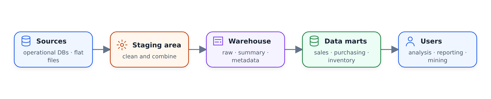
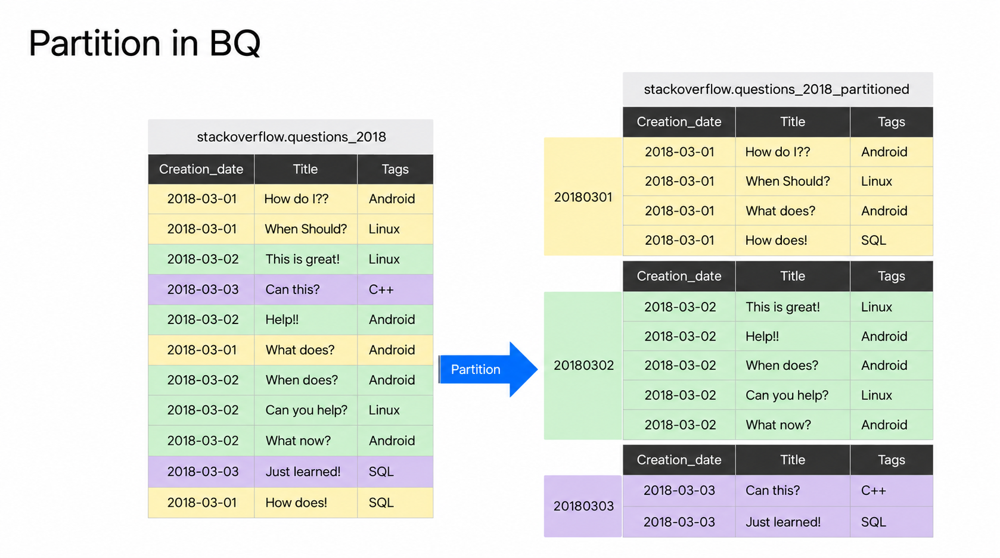
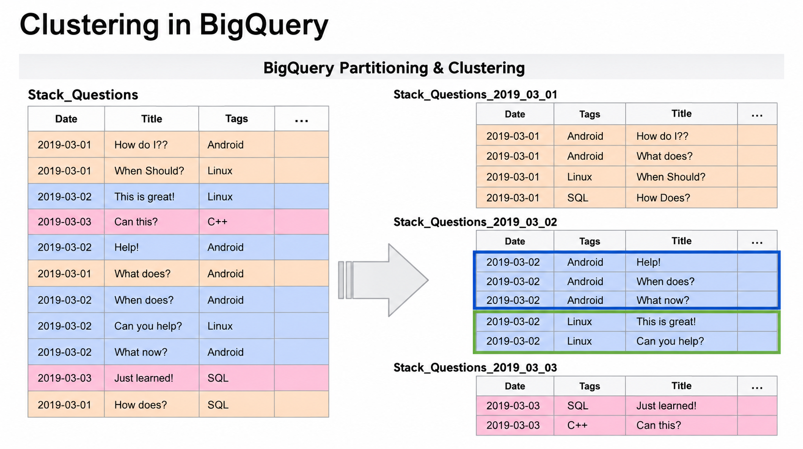

# Data Warehouse and BigQuery

In this unit we talk about data warehouses in general and BigQuery as
our example: how analytical databases differ from the transactional
ones behind everyday apps, what a data warehouse looks like
architecturally, and a first hands-on tour of BigQuery — the interface,
public datasets, external tables, pricing, partitioning and clustering.

## OLTP vs OLAP

Databases come in two flavors, and the difference starts with the use
case.

OLTP stands for online transaction processing. This is the kind of
database you use in backend services, where you group a couple of SQL
queries together into one transaction and roll back in case one of them
fails. A classic example is a shop: the order, the payment and the
inventory update either all happen or none of them do.

OLAP stands for online analytical processing. These databases are
designed for a different purpose: putting a lot of data in and
discovering hidden insights. They are mainly used for analytical work
by data analysts and data scientists.

The two types differ in almost every aspect:

- In OLTP the updates are fast but small. In OLAP the data is
  periodically refreshed, and the data size is generally way larger.
- OLTP databases are normalized for efficiency. OLAP databases are
  denormalized for analysis.
- OLTP increases productivity for the end user. OLAP increases
  productivity for data analysts and executives.
- OLTP users are customer-facing personnel, clerks and online shoppers.
  OLAP users are knowledge workers: data analysts, business analysts
  and executives.

| | OLTP | OLAP |
| --- | --- | --- |
| Purpose | Control and run essential business operations in real time | Plan, solve problems, support decisions, discover hidden insights |
| Data updates | Short, fast updates initiated by user | Data periodically refreshed with scheduled, long-running batch jobs |
| Database design | Normalized databases for efficiency | Denormalized databases for analysis |
| Space requirements | Generally small if historical data is archived | Generally large due to aggregating large datasets |

## What is a data warehouse

A data warehouse is an OLAP solution used for reporting and data
analysis.

A warehouse generally consists of raw data, metadata and summary data.
It has many data sources — operational systems, flat files, maybe an
OLTP database — and all these systems report to a staging area, which
is then written to the data warehouse.

As an output, a data warehouse can be transformed into data marts:
smaller, subject-specific slices such as purchasing, sales and
inventory, which different users can access directly. For analysts,
using data marts as an interface is the ideal situation. But in certain
use cases, especially for data scientists, it makes sense to look at
the raw data directly from the warehouse. A data warehouse provides all
these possibilities.



## BigQuery

BigQuery is a data warehouse solution, and its biggest advantage is
that it is serverless: there are no servers to manage and no database
software to install.

This matters because when a company starts its data warehouse journey,
a huge chunk of time normally goes into creating and maintaining the
warehouse. BigQuery removes that pain: it provides the software as well
as the infrastructure, with scalability and high availability in mind.
You can start with a couple of gigabytes of data and scale easily to
petabytes without issues.

Some of the built-in features that really outshine:

- machine learning via the SQL interface of BigQuery
- handling of geospatial data
- business intelligence queries

Another big advantage is the flexibility of how it stores data. In a
classic setup one big server holds storage and compute together, so
once your data size increases, the machine has to grow with it.
BigQuery separates the compute engine from storage and analyzes your
data on a storage of your choice. That is a huge win in terms of cost.

## How much BigQuery costs

BigQuery has two pricing models.

On-demand pricing is based on the amount of data you scan or process:
every terabyte processed costs around $5.

Flat rate pricing is based on the number of pre-requested slots —
BigQuery's units of processing capacity. 100 slots cost roughly
$2,000 per month, which converts to about 400 TB of data processed
under on-demand pricing. So flat rate does not make sense unless you
are scanning way above 200 TB of data.

Slots also change how the system behaves under load. If you have 50
queries running and all your 100 slots are full, the 51st query has to
wait. That would not happen on demand: there BigQuery gives you more
slots based on the requirements of a query.

## Public datasets

Before working with BigQuery, two things worth knowing. First, BigQuery
generally caches query results — for the demos in this module caching
was disabled to get consistent results. Second, BigQuery ships a lot of
open source public data you can query out of the box.

One example is the New York City Citi Bike stations data. You can
search any dataset by table name in the search bar, and open the table
to see its columns: station id, name, short name, latitude, longitude
and others. This table has only 1,584 rows and its size is just a few
KB — a very small dataset. You can also do a quick preview to
see how the data is arranged.

Let's query it:

```sql
SELECT
    station_id,
    name
FROM bigquery-public-data.new_york_citibike.citibike_stations
LIMIT 100;
```

The station ids and names show up in the query results panel at the
bottom. From there you can save the results as CSV, or explore them
further in Data Studio.

## External tables

For this module we use the NYC taxi trip data, which was already
uploaded to Google Cloud Storage. BigQuery lets you create an external
table over such files: the data itself stays in Cloud Storage, and
BigQuery keeps only the metadata.

The interface organizes everything into projects, datasets and tables:
`taxi-rides-ny` is the project, `nytaxi` is the dataset, and
`external_yellow_tripdata` is a table in it. The bucket holds trip data
CSVs for 2019, 2020 and so on, and the external table points at the
2019 and 2020 files:

```sql
CREATE OR REPLACE EXTERNAL TABLE `taxi-rides-ny.nytaxi.external_yellow_tripdata`
OPTIONS (
    format = 'CSV',
    uris = [
        'gs://nyc-tl-data/trip data/yellow_tripdata_2019-*.csv',
        'gs://nyc-tl-data/trip data/yellow_tripdata_2020-*.csv'
    ]
);
```

Once the table is created, open it: BigQuery has read the column names
of the CSVs and already understands the types, and it figures out which
columns are nullable. You do not have to define the schema — though you
can if you want to.

Now look at the details of the table: long-term storage is 0 bytes, the
table size is 0 bytes, and the number of rows is 0. When you create an
external table, BigQuery cannot determine its rows or size — the data
is not inside BigQuery, it is in an external system, Google Cloud
Storage.

The resulting external table has the following details:

| Field | Value |
| --- | --- |
| Table ID | `taxi-rides-ny.nytaxi.external_yellow_tripdata` |
| Table size | 0 B |
| Long-term storage size | 0 B |
| Number of rows | 0 |
| Table expiration | Never |
| Data location | `europe-west3` |
| Source URI | `gs://nyc-tlc/data/trip_data/yellow_tripdata_2019-*.csv` |
| Source URI | `gs://nyc-tlc/data/trip_data/yellow_tripdata_2020-*.csv` |
| Auto-detect schema | `true` |
| Source format | CSV |

Querying it works like any other table:

```sql
SELECT *
FROM taxi-rides-ny.nytaxi.external_yellow_tripdata
LIMIT 10;
```

You get the vendor id, pickup and dropoff datetimes, passenger count,
trip distance, location information, and the fare and total amounts.

## Partitioning

Partitioning is a very useful BigQuery feature. Take a dataset of Stack
Overflow questions from 2018 with columns like creation date, title and
tags. Suppose most of your queries filter on date — give me the count
of questions asked only in March, or only in the first week of March.
Partitioning by the creation date can really improve performance.

When you partition the table by creation date, each date becomes its
own partition: all rows created on 1 March 2018 go into the first
partition, 2 March into the second, and so on. This is powerful because
once BigQuery understands it only needs the data for 2 March 2018, it
will not read or process the data for 1 March or 3 March. Processing
less data reduces cost.



Back to the taxi data. Until now we only had the external table, which
is not partitioned. First let's create a plain, non-partitioned table
by copying the external table's content:

```sql
CREATE OR REPLACE TABLE taxi-rides-ny.nytaxi.yellow_tripdata_non_partitioned AS
SELECT *
FROM taxi-rides-ny.nytaxi.external_yellow_tripdata;
```

This takes some time, because the data is copied from Google Cloud
Storage into actual BigQuery storage. The partitioned version adds only
one line, `PARTITION BY`:

```sql
CREATE OR REPLACE TABLE taxi-rides-ny.nytaxi.yellow_tripdata_partitioned
PARTITION BY DATE(tpep_pickup_datetime) AS
SELECT *
FROM taxi-rides-ny.nytaxi.external_yellow_tripdata;
```

The partitioned table knows its size — around 13-14 GB — and the
details show it is partitioned by day on `tpep_pickup_datetime`. In the
schema view you can also spot the difference: a non-partitioned table
is one solid block of columns, while a partitioned table has a break in
between. That is a quick way to tell which tables are partitioned.

Now the payoff. Run the same query against both tables — the distinct
vendor ids for June 2019:

```sql
SELECT DISTINCT(VendorID)
FROM taxi-rides-ny.nytaxi.yellow_tripdata_non_partitioned
WHERE DATE(tpep_pickup_datetime) BETWEEN '2019-06-01' AND '2019-06-30';
```

On the non-partitioned table, BigQuery estimates it will process 1.6 GB
— almost all the data in the table. Change only the table name to the
partitioned one, and the estimate drops to about 106 MB. If you run
this query over and over, you process 106 MB each time instead of
1.6 GB, which directly reduces your cost.

The partitioned query's estimate and actual processed bytes are:

| Query | Bytes processed |
| --- | ---: |
| Estimate before running | 105.9 MiB |
| Actual after running | 105.9 MiB |

You can also inspect the partitions themselves. Every dataset has an
`INFORMATION_SCHEMA` with a `PARTITIONS` view:

```sql
SELECT
    table_name,
    partition_id,
    total_rows
FROM `nytaxi.INFORMATION_SCHEMA.PARTITIONS`
WHERE table_name = 'yellow_tripdata_partitioned'
ORDER BY total_rows DESC;
```

This shows how many rows fall into which partition: in our table,
1 February 2019 has the most rows, and 5 April 2019 has around 292,000
rows. It is also a quick check for bias — whether some partitions are
getting much more data than others.

## Clustering

From partitioning we move to another interesting concept: clustering.

Back to the Stack Overflow example. We partitioned the table by date.
Now we also cluster it by tag. Within each partition, rows with the
same tag are stored together: in the second partition, the android rows
come first, then the linux rows; in the first partition, android is
grouped together, linux comes after, and sql after that.

Because related rows sit next to each other, BigQuery can skip data
inside a partition too. This improves cost as well as query
performance.



For the taxi data, we create a table that is both partitioned and
clustered:

```sql
CREATE OR REPLACE TABLE taxi-rides-ny.nytaxi.yellow_tripdata_partitioned_clustered
PARTITION BY DATE(tpep_pickup_datetime)
CLUSTER BY VendorID AS
SELECT * 
FROM taxi-rides-ny.nytaxi.external_yellow_tripdata;
```

Why `VendorID`? Because of how the data will be queried: in this use
case the data is always filtered on vendor id and pickup date, and this
partitioning and clustering targets exactly those filters. The details
view confirms it: partitioned by day on `tpep_pickup_datetime`, and
clustered by `VendorID`.

Now compare the two tables by counting all trips from vendor 1 between
1 June 2019 and 31 December 2020:

```sql
SELECT count(*) as trips
FROM taxi-rides-ny.nytaxi.yellow_tripdata_partitioned
WHERE DATE(tpep_pickup_datetime) BETWEEN '2019-06-01' AND '2020-12-31'
  AND VendorID=1;
```

Before running, BigQuery estimates 1.1 GB. After running: 0.7 seconds,
and 1.1 GB of data actually processed. Here is a rule to remember:
whatever BigQuery shows before the run is an approximation — the actual
processed bytes only appear after the run.

Run the same query on the partitioned and clustered table. The estimate
still says 1.1 GB — the approximation cannot know what clustering will
skip. But the actual run processes less: 843.5 MB instead of 1.1 GB.
That is the clustering effect.

The comparison between the partitioned and clustered queries is:

| Table | Estimated bytes | Actual bytes |
| --- | ---: | ---: |
| Partitioned | 1.1 GB | 1.1 GB |
| Partitioned and clustered | 1.1 GB | 843.5 MB |

When to prefer partitioning, when clustering, and when both — that is
the topic of [the next unit](02-partitioning-vs-clustering.md).

## Materials

- [Slides](https://docs.google.com/presentation/d/1a3ZoBAXFk8-EhUsd7rAZd-5p_HpltkzSeujjRGB2TAI/edit?usp=sharing)
  for the whole module
- [`big_query.sql`](big_query.sql) — the SQL used through the module. The first
  statements belong to this unit: querying a BigQuery public dataset, and
  creating an external table over the taxi CSVs in Cloud Storage.
