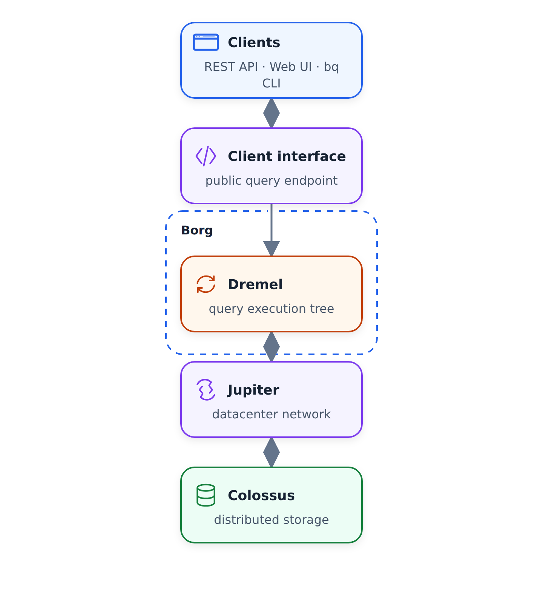
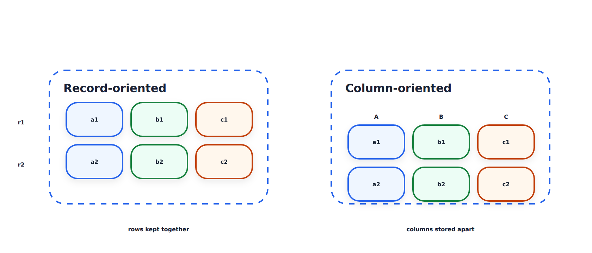
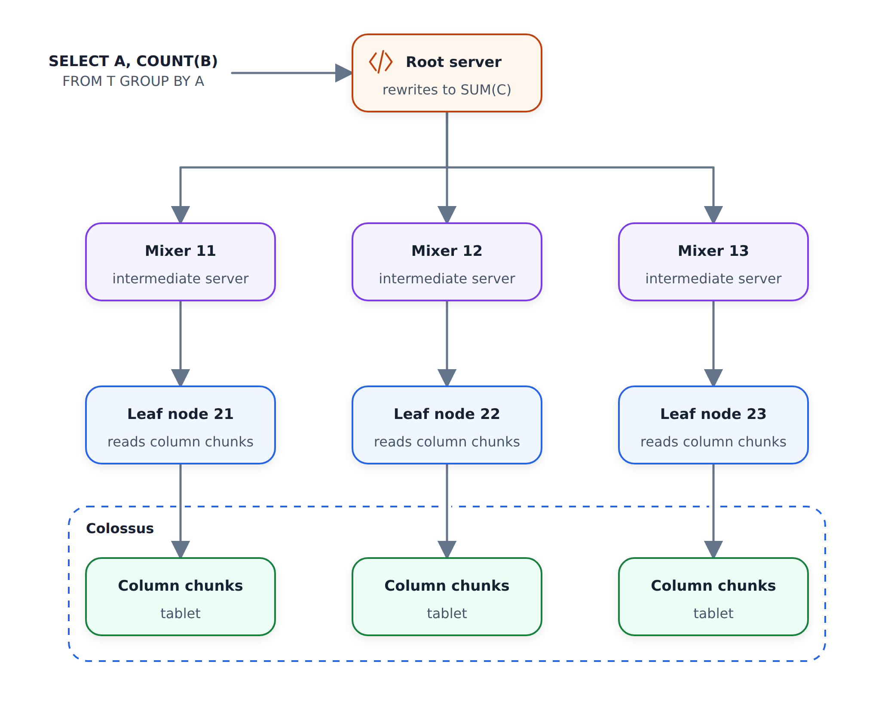

# Internals of BigQuery

In this unit we look inside BigQuery: how it stores data, how storage and
compute talk to each other, and how a query gets executed. You don't need
the internals to use BigQuery — the [best practices](03-bigquery-best-practices.md)
and partitioning and clustering are enough for day-to-day work. But
understanding how a data warehouse like this is built will help you when
you design data products of your own.

The diagram above is the high-level architecture. Three names to remember:

- Colossus — the storage
- Jupiter — the network between storage and compute
- Dremel — the query execution engine

## Colossus: storage and compute are separate

BigQuery stores your data in a separate storage system called Colossus.
Colossus is cheap storage that keeps data in a columnar format — each
column stored on its own, which we'll see more of below.

This separation of storage from compute is the big design decision, and it
significantly reduces cost. If your data size grows tomorrow, you only pay
for storing it in Colossus, which is very cheap. The expensive part is
reading the data and running queries — that's compute, and it only happens
when you actually run something.

## Jupiter: the network in between

The separation raises an obvious question. Compute and storage sit on
different hardware — how do they communicate? If the network between them
were slow, every query would spend its time waiting for data, and query
times would suffer.

That's what the Jupiter network solves. Jupiter is the network inside
BigQuery data centers, and it provides approximately one terabyte per
second. With that much bandwidth, compute and storage can live on separate
hardware and still talk to each other without any delays.

## Column-oriented storage

Before we get to how queries execute, a quick look at how the data itself
is laid out. The video calls this part Polymer — the component on the
storage side — and compares record-oriented storage with column-oriented
storage.

On the left is record-oriented storage: each record (row `r1`, `r2`) is
stored as one piece. This is very similar to structures like CSV, and it's
easy to process and understand.

On the right is column-oriented storage. There, a row appears in multiple
places: each column is stored separately from the others.

BigQuery uses the column-oriented structure, and it gives a huge gain.
Column-oriented storage makes aggregations over columns much faster, and
in a warehouse we rarely query all the columns at once anyway. The typical
requirement is to read a few columns and filter and aggregate on others —
with columns stored separately, the rest of the table is never touched.
That's also why `SELECT *` is so expensive.

## Dremel: executing a query as a tree

Dremel is the query execution engine. It takes your query and divides it
into a tree structure, in such a way that each node executes an individual
subset of the query.

Let's walk through the example in the diagram. Assume a query like
`SELECT A, COUNT(B) FROM T GROUP BY A` — count the rows per group of
column A.

- The root server receives the query. It understands what the query wants
  and knows how to divide it into smaller sub-modules. In our case,
  `SELECT A, COUNT(B)` becomes `SELECT A, SUM(C)`: instead of counting,
  we'll sum up partial counts that the lower levels produce. The rewritten
  query is divided further and sent down as slices `R1` to `R1+n`.
- The mixers (the intermediate level) receive the modified query, divide
  it further into subsets, and pass those to the leaf nodes.
- The leaf nodes are the ones that actually talk to the Colossus database.
  They fetch the data, execute the appropriate operations on their slice,
  and return the result to the mixers.
- The mixers return their results to the root server, where everything is
  aggregated and returned to you as the final result.

This distribution of workers is the reason BigQuery is so fast. If all the
work had to be done on a single node, query time would grow very badly as
data sizes increase. Because BigQuery divides the query into smaller
chunks and pushes them down to the leaf nodes, it scales.

## References

The video ends with a reference slide, and the links there are worth
reading — some cover Dremel internals, others BigQuery internals in
general:

- [BigQuery documentation: how-to](https://cloud.google.com/bigquery/docs/how-to)
- [Dremel paper on Google Research](https://research.google/pubs/pub36632/)
- [BigQuery architecture guide on Panoply](https://panoply.io/data-warehouse-guide/bigquery-architecture/)
- [A look at Dremel](http://www.goldsborough.me/distributed-systems/2019/05/18/21-09-00-a_look_at_dremel/)
