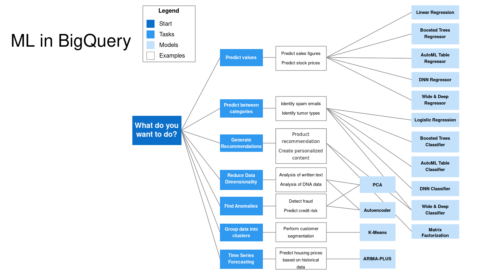

# Machine Learning in BigQuery

In this unit we train, evaluate and explain a machine learning model without
leaving BigQuery. We build a linear regression model that predicts taxi tip
amounts - all in SQL - and finish with hyperparameter tuning. In the
[next unit](06-deploying-a-machine-learning-model.md) we export this model
and run it inside Docker.

The queries we run are collected in [`big_query_ml.sql`](big_query_ml.sql),
so you don't need to copy them from the video.

## Why machine learning in BigQuery

BigQuery ML targets data analysts and managers. You don't have to know Python
or Java: SQL plus some knowledge of machine learning algorithms is enough.

The other advantage is that the data stays in the warehouse. Normally you
would export the data from the data warehouse, build and train a model in a
separate system, and then deploy it. BigQuery lets us build the model inside
the warehouse itself, so the extra export step disappears.

One warning before we start: this and the next video are advanced steps for
BigQuery. If you are not familiar with machine learning, feel free to skip
them.

## Pricing

Pricing is a real condition when you choose between using machine learning in
BigQuery and building a model separately. At the time of recording:

- Gigabytes of data storage are free.
- One terabyte of queries processed per month is free.
- When using the `CREATE MODEL` step, the first 10 gigabytes per month are
  also free.

After the free tier you pay around 250 dollars per terabyte for creating
logistic regression, linear regression, clustering and time series models,
and around 5 dollars per terabyte for AutoML, DNN and boosted tree models,
with extra Vertex AI training costs on top. These are US prices - if you are
in a different region, check the costs for your region.

## The machine learning workflow

Before creating a model, it helps to recall the steps of machine learning
development. First we collect data - that part is done, we loaded the taxi
data into BigQuery in the previous units. Then we process the data and do
feature engineering, split it into training and test sets, build a model
with a suitable algorithm, optimize its parameters (hyperparameter tuning),
and validate it against error metrics. Once we are satisfied with the model,
we deploy it.

BigQuery helps with every step. It does feature engineering, including
automatic feature preprocessing. It splits the data into training and
evaluation sets by itself. It offers a choice of algorithms, hyperparameter
tuning, and many error metrics to validate against. And it lets us deploy
the trained model using a Docker image - that is the next unit.

## Choosing an algorithm

Which algorithm fits which use case? The BigQuery documentation answers this
with a decision diagram:



Predicting a number - sales figures, stock prices - calls for linear
regression, boosted trees, AutoML, a DNN regressor or wide-and-deep
regression. Customer segmentation is a job for k-means. Predicting a
category - identifying spam, for example - calls for logistic regression,
boosted tree classifiers or AutoML tables. You can always come back to this
diagram, find the use case you are trying to solve, and pick the algorithms
suggested for it.

In this video we build a linear regression model: we predict the tip amount
of a taxi ride, which is a number.

## Picking the features

Our dataset is `yellow_tripdata_partitioned` from the previous units. The
label - the thing we want to predict - is `tip_amount`, the tip paid to the
driver at the end of the journey.

For the features, we select a handful of columns from the ride:

```sql
SELECT passenger_count, trip_distance, PULocationID, DOLocationID, payment_type, fare_amount, tolls_amount, tip_amount
FROM `taxi-rides-ny.nytaxi.yellow_tripdata_partitioned` WHERE fare_amount != 0;
```

The `WHERE fare_amount != 0` filter is there because a lot of rides have a
fare amount of zero, and those rides almost always have a tip amount of zero
too - they would teach the model the wrong thing.

## Feature preprocessing

BigQuery ML does feature preprocessing in two ways: automatic and manual.

Automatic preprocessing applies standard transformations for us:
standardization of numeric fields, one-hot encoding of categorical fields,
and multi-hot encoding of arrays. One-hot encoding turns a category feature
into a sparse vector - one position per category, with a 1 in the position
of the value at hand.

Manual preprocessing covers bucketization, polynomial expansion, feature
crossing, n-grams, min-max scaling and more. Our example needs no manual
preprocessing - the automatic one is enough.

But there is a catch. `PULocationID`, `DOLocationID` and `payment_type` are
stored as integers, yet they are not really numbers - they are categories.
`payment_type` stands for a payment method like card or cash, and location
ID 264 does not mean the location is "264 times" anything. Left as integers,
BigQuery would standardize them like numbers instead of one-hot encoding
them.

## Preparing the feature table

So we create a separate table with the same columns, but cast the three
category columns to `STRING`. A string column is treated as a categorical
feature, and BigQuery will one-hot encode it automatically:

```sql
CREATE OR REPLACE TABLE `taxi-rides-ny.nytaxi.yellow_tripdata_ml` (
`passenger_count` INTEGER,
`trip_distance` FLOAT64,
`PULocationID` STRING,
`DOLocationID` STRING,
`payment_type` STRING,
`fare_amount` FLOAT64,
`tolls_amount` FLOAT64,
`tip_amount` FLOAT64
) AS (
SELECT passenger_count, trip_distance, cast(PULocationID AS STRING), CAST(DOLocationID AS STRING),
CAST(payment_type AS STRING), fare_amount, tolls_amount, tip_amount
FROM `taxi-rides-ny.nytaxi.yellow_tripdata_partitioned` WHERE fare_amount != 0
);
```

Running this processed about 6.5 GB of data and produced a table with the
correct types for our machine learning model:

## Creating the model

Now the actual model. We name it `tip_model` and use linear regression as
the algorithm. The label column is `tip_amount`, and the data split method
`'AUTO_SPLIT'` tells BigQuery to split the data into training and evaluation
sets for us - the evaluation set will be used later:

```sql
CREATE OR REPLACE MODEL `taxi-rides-ny.nytaxi.tip_model`
OPTIONS
(model_type='linear_reg',
input_label_cols=['tip_amount'],
DATA_SPLIT_METHOD='AUTO_SPLIT') AS
SELECT
*
FROM
`taxi-rides-ny.nytaxi.yellow_tripdata_ml`
WHERE
tip_amount IS NOT NULL;
```

Training took around five minutes. Opening the model in the Explorer shows
what BigQuery did: the model type is linear regression, and it trained on a
temporary training dataset with a temporary evaluation dataset. The
evaluation tab shows the error metrics of the training run - the mean
squared error is around 8 and the mean absolute error is around 1:

That is not very optimal, but for a simple model and dataset it is perfectly
fine - the aim here is the workflow, not the most optimal model.

## Checking the features

`ML.FEATURE_INFO` shows how BigQuery sees each feature:

```sql
SELECT * FROM ML.FEATURE_INFO(MODEL `taxi-rides-ny.nytaxi.tip_model`);
```

The numeric columns - passenger count, trip distance, fare amount, tolls
amount - come with min, max and mean values, which are used for
standardization. The three columns we cast to strings - pickup location,
dropoff location and payment type - show up as categorical features with
their category counts.

## Evaluating the model

`ML.EVALUATE` scores the model against a dataset:

```sql
SELECT
*
FROM
ML.EVALUATE(MODEL `taxi-rides-ny.nytaxi.tip_model`,
(
SELECT
*
FROM
`taxi-rides-ny.nytaxi.yellow_tripdata_ml`
WHERE
tip_amount IS NOT NULL
));
```

Here we see the mean absolute error is 1 and the mean squared error is
around 150. These evaluation metrics are what we would use for optimizing
the model later on.

## Predicting

`ML.PREDICT` applies the model to the dataset and adds the prediction as an
extra column:

```sql
SELECT
*
FROM
ML.PREDICT(MODEL `taxi-rides-ny.nytaxi.tip_model`,
(
SELECT
*
FROM
`taxi-rides-ny.nytaxi.yellow_tripdata_ml`
WHERE
tip_amount IS NOT NULL
));
```

Every row now carries a `predicted_tip_amount` column next to the actual
`tip_amount`. With both side by side, we can also do a manual evaluation of
the model if we want to.

## Explaining predictions

BigQuery can also tell us which features drive a prediction.
`ML.EXPLAIN_PREDICT` with `top_k_features` set to 3 lists the top three
features used for each prediction - you could just as well ask for the top
four:

```sql
SELECT
*
FROM
ML.EXPLAIN_PREDICT(MODEL `taxi-rides-ny.nytaxi.tip_model`,
(
SELECT
*
FROM
`taxi-rides-ny.nytaxi.yellow_tripdata_ml`
WHERE
tip_amount IS NOT NULL
), STRUCT(3 as top_k_features));
```

Looking at the top three features, all our categorical features are there -
pickup location, dropoff location and payment type are what the model relies
on most, and the same pattern repeats in the second row and so on.

## Hyperparameter tuning

We saw the model was not optimal. The standard way to improve it is
hyperparameter tuning. For linear regression, BigQuery lets us run several
trials (`num_trials`), execute some of them in parallel so the query runs
faster (`max_parallel_trials`), and try a range and candidate values for the
L1 and L2 regularization hyperparameters:

```sql
CREATE OR REPLACE MODEL `taxi-rides-ny.nytaxi.tip_hyperparam_model`
OPTIONS
(model_type='linear_reg',
input_label_cols=['tip_amount'],
DATA_SPLIT_METHOD='AUTO_SPLIT',
num_trials=5,
max_parallel_trials=2,
l1_reg=hparam_range(0, 20),
l2_reg=hparam_candidates([0, 0.1, 1, 10])) AS
SELECT
*
FROM
`taxi-rides-ny.nytaxi.yellow_tripdata_ml`
WHERE
tip_amount IS NOT NULL;
```

This is a rich set. The same `CREATE MODEL` documentation lists many more
options - learning rate strategy, early stopping, minimum relative progress,
the learning rate itself. If you are familiar with machine learning, you can
use all these parameters to tune your model.

That is the full loop in BigQuery: the model is built, evaluated, explained
and tuned, all in SQL. In the
[next unit](06-deploying-a-machine-learning-model.md) we export it and serve
it from a Docker container.

## Materials

- [`big_query_ml.sql`](big_query_ml.sql) — building the ML feature table,
  creating and evaluating a `linear_reg` tip model, predicting, explaining
  predictions, and the hyperparameter-tuning variant.

## Reference

- [BigQuery ML Tutorials](https://cloud.google.com/bigquery-ml/docs/tutorials)
- [BigQuery ML Reference Parameter](https://cloud.google.com/bigquery-ml/docs/analytics-reference-patterns)
- [Hyper Parameter tuning](https://cloud.google.com/bigquery-ml/docs/reference/standard-sql/bigqueryml-syntax-create-glm)
- [Feature preprocessing](https://cloud.google.com/bigquery-ml/docs/reference/standard-sql/bigqueryml-syntax-preprocess-overview)
