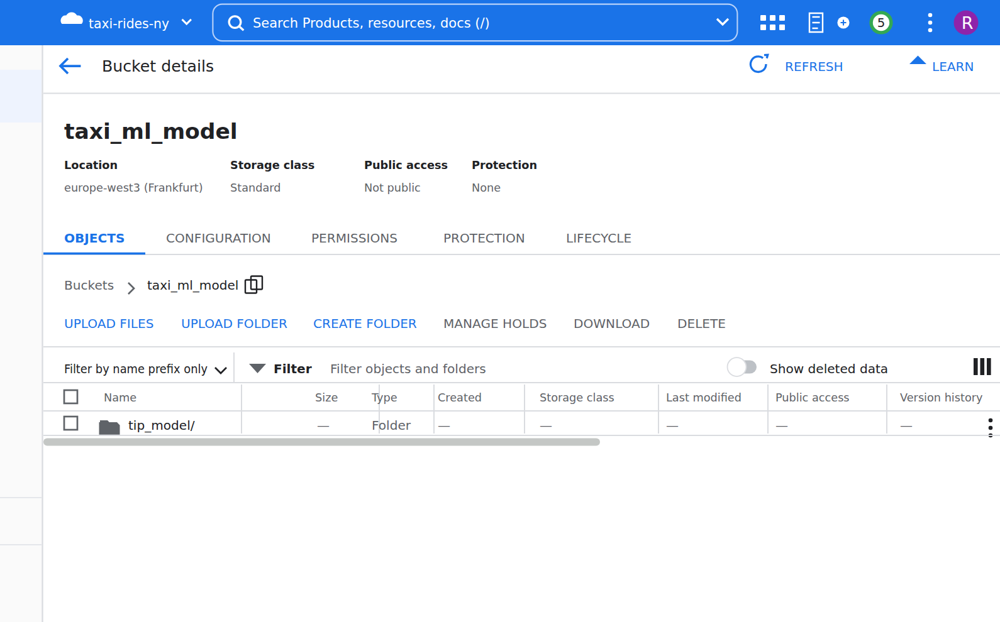
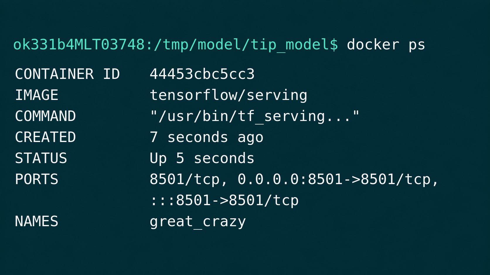
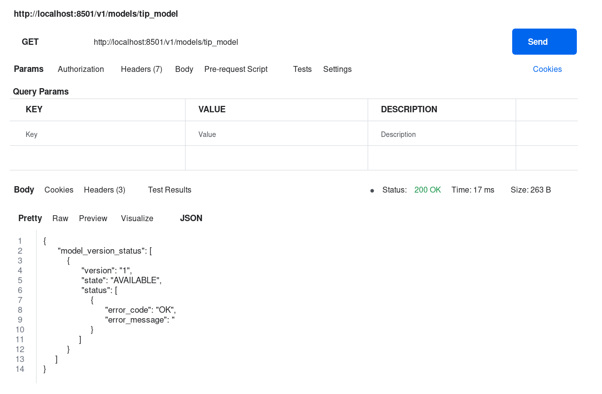
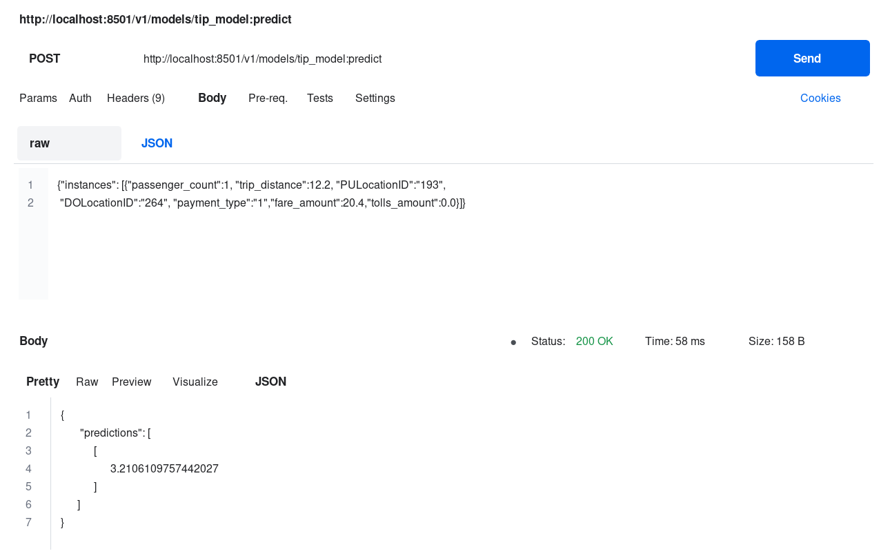
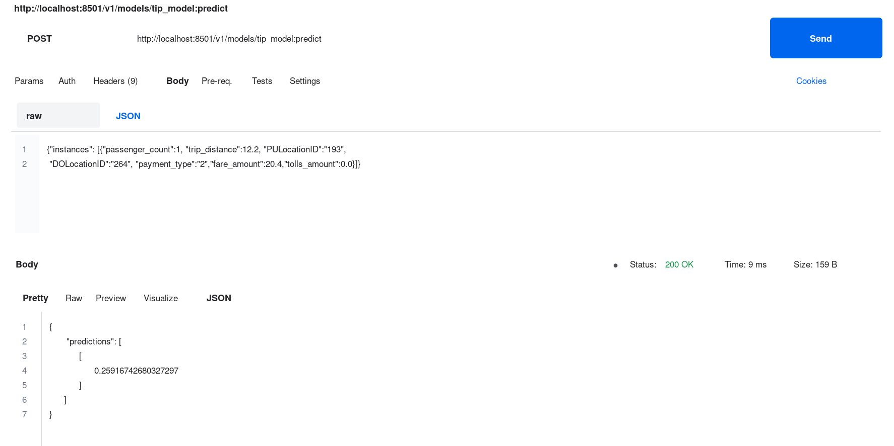

# Deploying a Machine Learning Model from BigQuery

In the [previous unit](05-machine-learning-in-bigquery.md) we trained a model
in BigQuery that predicts taxi tips. Here we take that model out of BigQuery:
we export it to Cloud Storage, serve it locally with TensorFlow Serving in a
Docker container, and call it over HTTP to get predictions.

The steps follow [Google's export model
tutorial](https://cloud.google.com/bigquery-ml/docs/export-model-tutorial).

## Exporting the model to Cloud Storage

After `gcloud auth login` (already done in the video), we use the `bq`
command-line tool to extract the model into a Cloud Storage bucket:

```bash
bq --project_id taxi-rides-ny extract -m nytaxi.tip_model gs://taxi_ml_model/tip_model
```

Once the export finishes, the `tip_model` folder shows up in the
`taxi_ml_model` bucket:



## Copying the model locally

Next we pull the model down to our machine with `gsutil`:

```bash
mkdir /tmp/model
gsutil cp -r gs://taxi_ml_model/tip_model /tmp/model
```

The copy output shows what an exported BigQuery model is made of - it is a
TensorFlow model: `assets`, `variables`, and a few metadata files:

## Serving the model with Docker

TensorFlow Serving expects a particular layout: a directory named after the
model, with one subdirectory per version, numbered. So we create
`serving_dir/tip_model/1` and copy the model files into the version folder.
The serving directory can live anywhere - in the project or in a temp
directory:

```bash
mkdir -p serving_dir/tip_model/1
cp -r /tmp/model/tip_model/* serving_dir/tip_model/1
docker pull tensorflow/serving
docker run -p 8501:8501 \
  --mount type=bind,source=`pwd`/serving_dir/tip_model,target=/models/tip_model \
  -e MODEL_NAME=tip_model -t tensorflow/serving &
```

This maps port 8501 of the container to port 8501 on our machine, mounts our
serving directory into the container, and tells TensorFlow Serving which
model to serve through the `MODEL_NAME` environment variable.

With `docker ps` we can check that the container is running:



## Checking the model

TensorFlow Serving exposes a REST API. The model metadata lives at
`http://localhost:8501/v1/models/tip_model` - a GET there (in the video, with
Postman) should tell us the model is fine:



Indeed, the response says the tip model, version 1, is available - no error.

## Predicting over HTTP

Now the actual prediction. We POST a JSON body with the same columns the
model was trained on - passenger count, trip distance, pickup and dropoff
location IDs, payment type, fare amount and tolls amount - to
`http://localhost:8501/v1/models/tip_model:predict`:

```bash
curl -d '{"instances": [{"passenger_count":1, "trip_distance":12.2, "PULocationID":"193", "DOLocationID":"264", "payment_type":"1","fare_amount":20.4,"tolls_amount":0.0}]}' \
  -X POST http://localhost:8501/v1/models/tip_model:predict
```

For this ride, the model predicts a tip of around 3.2 dollars:



If we change the payment type to 2 and send the request again, the predicted
tip amount goes drastically down - to about 0.26 dollars:



And that is the whole loop: a model trained with SQL inside BigQuery,
exported, and served as a REST service from a Docker container on our own
machine.
