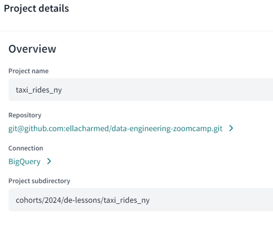
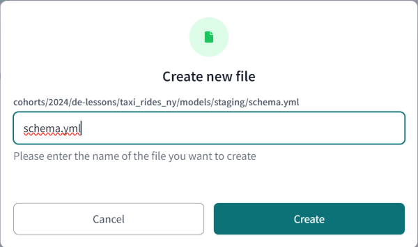
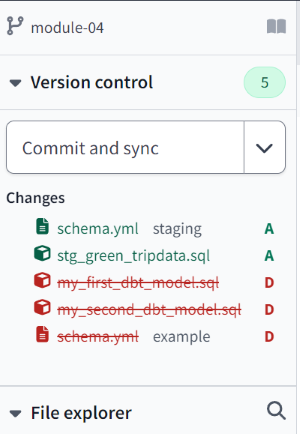
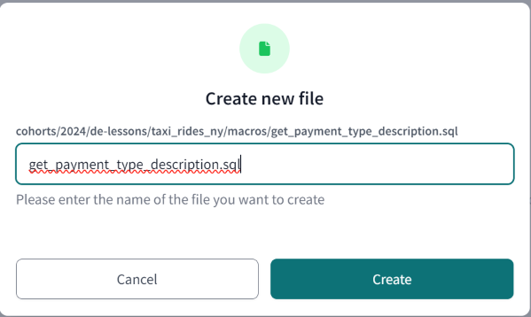
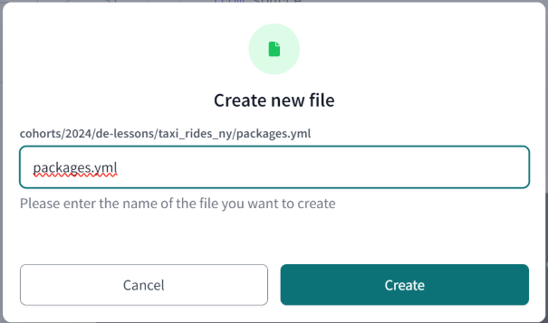
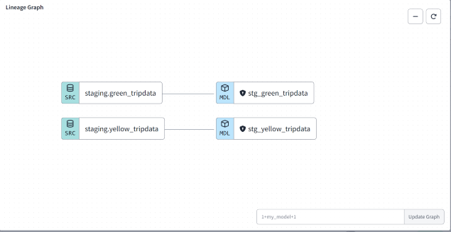
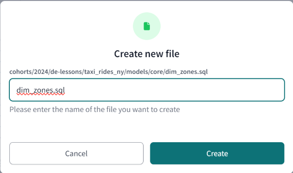
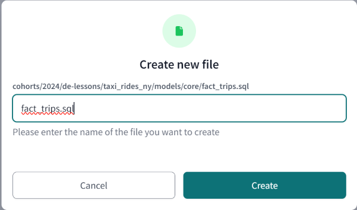
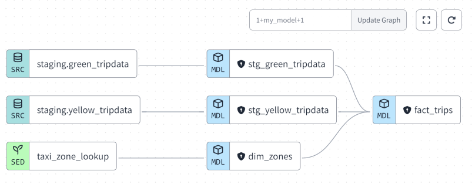

# Week 4: Analytics Engineering 
Goal: Transforming the data loaded in DWH into Analytical Views developing a [dbt project](taxi_rides_ny/README.md).

### Prerequisites
By this stage of the course you should have already: 

- A running warehouse (BigQuery or postgres) 
- A set of running pipelines ingesting the project dataset (week 3 completed)
- The following datasets ingested from the course [Datasets list](https://github.com/DataTalksClub/nyc-tlc-data/): 
  * Yellow taxi data - Years 2019 and 2020
  * Green taxi data - Years 2019 and 2020 
  * fhv data - Year 2019. 

> [!NOTE]  
> * We have two quick hack to load that data quicker, follow [this video](https://www.youtube.com/watch?v=Mork172sK_c&list=PLaNLNpjZpzwgneiI-Gl8df8GCsPYp_6Bs) for option 1 or check instructions in [week3/extras](../03-data-warehouse/extras) for option 2

## Setting up your environment 
  
> [!NOTE]  
>  the *cloud* setup is the preferred option.
>
> the *local* setup does not require a cloud database.

| Alternative A | Alternative B |
---|---|
| Setting up dbt for using BigQuery (cloud) | Setting up dbt for using Postgres locally  |
|- Open a free developer dbt cloud account following [this link](https://www.getdbt.com/signup/)|- Open a free developer dbt cloud account following [this link](https://www.getdbt.com/signup/)<br><br> |
| - [Following these instructions to connect to your BigQuery instance]([https://docs.getdbt.com/docs/dbt-cloud/cloud-configuring-dbt-cloud/cloud-setting-up-bigquery-oauth](https://docs.getdbt.com/guides/bigquery?step=4)) | - follow the [official dbt documentation]([https://docs.getdbt.com/dbt-cli/installation](https://docs.getdbt.com/docs/core/installation-overview)) or <br>- follow the [dbt core with BigQuery on Docker](docker_setup/README.md) guide to setup dbt locally on docker or <br>- use a docker image from oficial [Install with Docker](https://docs.getdbt.com/docs/core/docker-install). |
|- More detailed instructions in [dbt_cloud_setup.md](dbt_cloud_setup.md)  | - You will need to install the latest version with the BigQuery adapter (dbt-bigquery).|
| | - You will need to install the latest version with the postgres adapter (dbt-postgres).|
| | After local installation you will have to set up the connection to PG in the `profiles.yml`, you can find the templates [here](https://docs.getdbt.com/docs/core/connect-data-platform/postgres-setup) |

### --- EllaNotes ---

#### From BigQuery public dataset

* BQ has 
  * fhv data from 2015-2017
  * green data from 2014-2023
  * yellow data from 2011-2023
* project-id: `nyc-rides-ella`
* dataset schema: `trips_data_all`
  * multi region (US)
* table names: `yellow_tripdata`, `green_tripdata`, `fhv_tripdata`
  * native table
  ```sql
  CREATE TABLE AS {project-id}.{schema}.{yellow_tripdata} as
  SELECT FROM `bigquery-public-data.new_york_taxi_trips.tlc_yellow_trips_2019`; 
  INSERT INTO AS {project-id}.{schema}.{yellow_tripdata}
  SELECT FROM `bigquery-public-data.new_york_taxi_trips.tlc_yellow_trips_2020`;

  CREATE TABLE AS {project-id}.{schema}.{green_tripdata} as
  SELECT FROM `bigquery-public-data.new_york_taxi_trips.tlc_green_trips_2019`;
  INSERT INTO AS {project-id}.{schema}.{green_tripdata}
  SELECT FROM `bigquery-public-data.new_york_taxi_trips.tlc_green_trips_2020`;
  ```
* Need to do cleanup with Vic's `hack-load-data.sql` from [this page](https://github.com/DataTalksClub/data-engineering-zoomcamp/blob/main/04-analytics-engineering/taxi_rides_ny/analyses/hack-load-data.sql), because the BigQuery's schema and our DTC source's schema is different. Follow DTC's schema.
* fhv data has to be loaded from elsewhere since BQ's public dataset do not have it

#### From DTC `nyc-tlc-data` repo

* https://github.com/DataTalksClub/nyc-tlc-data/tree/main
* using tweaked `web_to_gcs.py`
* brute force TIMESTAMP conversion, and lots of repeats of CASE and others
  * BAD! not DRY-compliant
* disadvantages:
  * slow
  * `.csv.gz` files are downloaded to local filesystem
  * '.parquet' files created in local filesystem and then uploaded to GCS Buckets

#### TODO Via Mage


#### TODO Via dlt

## Content

### Introduction to analytics engineering

* What is analytics engineering?
* ETL vs ELT 
* Data modeling concepts (fact and dim tables)
* video: 4.1.1 - Analytics Engineering Basics

[](https://youtu.be/uF76d5EmdtU&list=PL3MmuxUbc_hJed7dXYoJw8DoCuVHhGEQb&index=40)

### What is dbt? 

* Introduction to dbt 
* video: 4.1.2 - What is dbt?

[](https://www.youtube.com/watch?v=gsKuETFJr54&list=PLaNLNpjZpzwgneiI-Gl8df8GCsPYp_6Bs&index=5)

### --- EllaNotes ---

#### Definitions

ddl
: data definition language
  sql statements that manage objects - tables, views

dml
: data manipulation language
  the CRUD sql statements to SELECT, INSERT, DELETE & UPDATE

---

- master data (like zone-lookup table) are called `seed files`
- dbt is a transformational workflow, ie manage sql and allow for code versioning of sql, testing and documentation and deploy via CI/CD
- orchestrate code from dev to deployment
- record data sources details like schema and their lineage
- follows best practices in SWE workflow
  - modularity, DRY, testable and documented code and tests
- 2 main ways: 
  - cloud (web IDE/CLI, SaaS, depends on core, requires (free) Dev account on getdbt.com) and 
  - core (local, open source)
- because the free Dev account only allows for one project per (team) account (not Dev account?), need to do lessons and homework within this same project
- sign up on dbt website for a free developer account, the company name is the Team-name (limited to 1 per dev account); cannot be changed after profile created. Not explained!
  - Vic's is 'analytics-engineering-workshop'
  - mine is 'a company'
- TODO is it really one team account per developer account?
  - can create multiple accounts, test how to transfer `a company/taxi_rides_ny` to `de-zoomcamp/taxi_rides_ny`
  - bad UX though: no feedback that the account has been created? unless I missed it in status bar or something
  -  I now have 2 de-zoomcamps, so duplications is allowed? 
  - then how to remove accounts? to ensure have clean settings


## Starting a dbt project

| Alternative A  | Alternative B   |
|-----------------------------|--------------------------------|
| Using BigQuery + dbt cloud | Using Postgres + dbt core (locally) |
| - Starting a new project with dbt init (dbt cloud and core)<br>- dbt cloud setup<br>- project.yml<br><br> | - Starting a new project with dbt init (dbt cloud and core)<br>- dbt core local setup<br>- profiles.yml<br>- project.yml                                  |
| video: 4.2.1 - Start Your dbt Project BigQuery and dbt Cloud (Alternative A) | video: 4.2.2 - Start Your dbt Project: Postgres and dbt Core Locally (Alternative B) |
| [](https://www.youtube.com/watch?v=J0XCDyKiU64&list=PLaNLNpjZpzwgneiI-Gl8df8GCsPYp_6Bs&index=4) | [](https://youtu.be/1HmL63e-vRs&list=PL3MmuxUbc_hJed7dXYoJw8DoCuVHhGEQb&index=43) |

### --- EllaNotes ---

Setting up your new project on dbt cloud's IDE.

1.  `model` in dbt refers to SQL queries in dbt code yml format
2. sign up on dbt website for a free developer account, the company name is the Team-name (limited to 1 per dev account); cannot be changed after profile created. Not explained!
    - Vic's is 'analytics-engineering-workshop'
    - mine is 'a company'
3.  setup your project like so
   
    - explicitly specify the path if want to create the dbt-project in a subfolder like shown here and not in the root of `data-engineering-zoomcamp`


### dbt models

* Anatomy of a dbt model: written code vs compiled Sources
* Materialisations: table, view, incremental, ephemeral  
* Seeds, sources and ref  
* Jinja and Macros 
* Packages 
* Variables
* video: 4.3.1 - Build the First dbt Models

[](https://www.youtube.com/watch?v=ueVy2N54lyc&list=PLaNLNpjZpzwgneiI-Gl8df8GCsPYp_6Bs&index=3)

> [!NOTE]  
> *This video is shown entirely on dbt cloud IDE but the same steps can be followed locally on the IDE of your choice*

> [!TIP] 
>If you recieve an error stating "Permission denied while globbing file pattern." when attempting to run `fact_trips.sql` this video may be helpful in resolving the issue
>
>[](https://youtu.be/kL3ZVNL9Y4A&list=PL3MmuxUbc_hJed7dXYoJw8DoCuVHhGEQb&index=34)

### --- EllaNotes ---


1.  master data aka seeds aka lookups ie our zones data
2.  fact tables (), dimensional tables (sources: trip data)
3.  sql scripts are called `models` in dbt
4.  dbt generates the ddl and dml for us when we `compile` our model code with `dbt build`, and `dbt run` then uses this compiled code
5.  materialization types: ephemeral, view, table, incremental (drop & re-create, or insert new data in same table)
6.  dependencies coded into the model and follows from dev to staging to production, and also in version control
7.  to start our dbt project, first create a `staging` folder under `model` folder
   
8.  and then create `schema.yml` in this folder
   
    - change the `database` entry to the `dataset` value from your BigQuery instance and mine is `nyc-rides-ella`, which for me I've set it to be the same as my `project-id` (maybe I shouldn't have done this? well hindsight 20/20 and all that)
    - input `tables` names of `green_tripdata` and `yellow_tripdata`
    - once you typed in the tables names, dbt would prompt you to `generate model`, click on this and new tab pops open with model `stg_staging__green_tripdata.sql` in another `staging` subfolder
9.  `Save` this yml file and move it one level up, we don't want it nested `/model/staging/staging` but just `model/staging`
10. also remove the folder after you've moved the yml file
11. and finally rename the yml file to remove that extra `staging` so final filename is `taxi_rides_ny/models/staging/stg_green_tripdata.sql`
12. test `dbt build` in the console CLI and it should fail as it is starting from the `example` models subfolder, and due to this failed step, all the subsequent steps are skipped because these are dependencies
13. we're going to remove these `example` models and tests, simply by removing the folder under `models` and continue 



---

1. `macros`: uses templating language `jinja`
    - is applicable project-wide
    - akin to utilities/helper functions & .env/config code in Python
    - it's common code that can be used repeatedly in all our models throughout the project
    - create `get_payment_type_description.sql` under the `macros` folder
    
    - copy contents from [dtc repo](../04-analytics-engineering/taxi_rides_ny/macros/get_payment_type_description.sql)
    - add this `{{ get_payment_type_description('payment_type') }}`
  in line#30 in `/models/staging/stg_green_tripdata.sql as payment_type_descripted`
    - just like Python's UDF, macros can also be packaged and reused in other projects
    - and similarly just like [*PyPi.org*](https://pypi.org) hosting packages others have made, dbt also has a *[dbt package hub](https://hub.getdbt.com/)* and we declare the import statements in a `packages.yml` file
    - the syntax is similar to how we add images in a `docker-compose.yml` file for Docker containers
1. create `packages.yml` file in your root dbt project folder, ie in the same path as the `dbt_project.yml` file
    
    - once file is saved, it would trigger the install and you'll see in the command line that it's doing just that and then building 
    - if it does not gets triggered, you can manually kick off the process by doing a `dpt deps` in the CLI
    - you'll see the packages imported once it is done and new `dbt_packages` folder appear in your File Explorer tree
    - find the usage guide in the docs or gh repo
    - for our case, we want to declare a new primary key `tripid` that combines these 2 columns `vendorid` + `lpep_pickup_datetime`, because one cab can only have a unique trip at a particular time
    - at the beginning of our SELECT statement in the `stg_green_tripdata.sql` file, add this:
    ```sql
    {{ dbt_utils.generate_surrogate_key(['vendorid', 'lpep_pickup_datetime']) }} as tripid,
    ```
    - we should be able to verify the output in our `nyc-rides-ella.dbt_ellacharmed` dataset in BigQuery    
> [!TIP] 
> if you get `dbt build failed` check for commas in the 2 lines we added

---

1. after the above thorough walkthrough, we can now just copy+paste the model code from DTC repository and learn what else Vic has added for the final output
2. we can explicitly use the `__config` shortcut to declare the config to materialize all this as a `view`, but it is the default anyway. It could be best practice if you want to be very clear of which model would materialize a `view` or a `table` or something else
3. the model code now checks for
    -  duplicated rows, we only bring in row data that has `rn`=1 ie 1 count of each row, no duplication
    -  exclude rows with null `vendorid`
    -  lots of CASTing of data types so the schema is consistent with yellow table
    -  renaming column names

---

1. `variables` can also be defined at the project level in dbt
   - we used this var `dbt build --vars '{'is_test_run': 'true'}'` in our code for this project to `limit 100` when we're just testing our code builds, by declaring ``
   - so we're performing faster and cheaper queries in BQ while in dev mode
2. at this time, our lineage graph looks like this
    
3. now, we're going to add our zones data. Create a new folder under `/models`, call it `core`
4. in this folder, create a new model called `dim_zones.sql` so our zones master data lives in the path `/models/core/dim_zones.sql`
   
5. copy+paste the contents of the lookup table in the raw data file from [DTC repo taxi_zone_lookup.csv](04-analytics-engineering/taxi_rides_ny/seeds/taxi_zone_lookup.csv) and save it into the path `/taxi_rides_ny/seeds/taxi_zone_lookup.csv`
    -  perform a `Build` while in the csv tab, and you should be able to refresh your dataset in BQ and the seed lookup file would appear there
    -  need to edit and add exclusion `!seeds/taxi_zone_lookup.csv` to the `.gitignore` file so this .csv file would be tracked by version control, else the Nightly scheduled runs would fail
6. we next create the `fact_trips.sql` under `core` folder, contents is at [DTC repo fact_trips.sql](https://github.com/DataTalksClub/data-engineering-zoomcamp/blob/main/04-analytics-engineering/taxi_rides_ny/models/core/fact_trips.sql)
    
    - at this point of time, our lineage graph now looks like this
     
    - we also exclude any records from green and yellow trips if the zones are `Unknown`
7.  due to `ehail_fee` issues below, dropped all tables (previously uploaded by `web_to_gcs.py` script) and regenerate bucket storage using Vic's [hack-load-data.sql](../04-analytics-engineering/taxi_rides_ny/analyses/hack-load-data.sql). `ehail_fee` does not occur with this method

<code>Error on building fact_trips.sql: Parquet column 'ehail_fee' has type DOUBLE which does not match the target cpp_type INT64. File: "gs://{gcs bucket}/{table}green_taxi_2019-07.parquet"</code>


<code>12:42:22 BigQuery adapter: Retry attempt 1 of 1 after error: BadRequest('CREATE VIEW has columns with duplicate name ehail_fee at [7:1]; reason: invalidQuery, location: query, message: CREATE VIEW has columns with duplicate name ehail_fee at [7:1]')</code>

7.  make sure to do a final `dbt build` with below flags for homework, because otherwise the data is limited to first 100 records
```sql
dbt build --select +fact_trips+ --vars '{'is_test_run': 'false'}'
```  

---

### Testing and documenting dbt models

* Tests  
* Documentation 
* video: 4.3.2 - Testing and Documenting the Project

[](https://www.youtube.com/watch?v=2dNJXHFCHaY&list=PLaNLNpjZpzwgneiI-Gl8df8GCsPYp_6Bs&index=2)


>[!NOTE]  
> This video is shown entirely on dbt cloud IDE but the same steps can be followed locally on the IDE of your choice*

### --- EllaNotes ---

1.  video: 4.3.2 - Testing and Documenting the Project
1.  basic tests includes
    -  unique values
    -  not null values
    -  accepted values
    -  foreign key to other tables
1.  create `dm_monthly_zone_revenue.sql` from [dtc repo](../04-analytics-engineering/taxi_rides_ny/models/core/dm_monthly_zone_revenue.sql) under `/models/core/`
    
    -  the `dbt.date_trunc` is referred to 'cross database macros'
1.  another package we had used unconsciously is the `Generate model` command when we created our tables
1.  we're using the [generate_model_yaml-source](https://github.com/dbt-labs/dbt-codegen/tree/0.12.1/?tab=readme-ov-file#generate_model_yaml-source) code generator. 
    -  paste this block into a new file (it's temporary), we want the code it generates, so this code need not be saved
    -  what this does is to generate the boilerplate code to have docstrings and our models' data types
    -  we can then add some test blocks to ensure our code meet the standards of the basics test above

```sql

{{ codegen.generate_model_yaml(
    model_names = models_to_generate) }}


{{ codegen.generate_model_yaml(
    model_names = models_to_generate) }}
```

1. can also look at `dbt_expectations` package for more tests   
2. can generate docs to be hosted on the project website to show docstrings for the project, tables or columns
3. create a `schema.yml` for tables under `core` by `compile selection` on below code block
4. then in cloud CLI, run `dbt docs generate` 
   - if locally run `dbt docs serve`


## Deployment

| Alternative A  | Alternative B   |
|----------------|-----------------|
| Using BigQuery + dbt cloud | Using Postgres + dbt core (locally) |
| - Deployment: development environment vs production<br>- dbt cloud: scheduler, sources and hosted documentation  | - Deployment: development environment vs production<br>-  dbt cloud: scheduler, sources and hosted documentation |
| 4.4.1 - Deployment Using dbt Cloud (Alternative A) | 4.4.2 - Deployment Using dbt Locally (Alternative B) | 
| [](https://www.youtube.com/watch?v=V2m5C0n8Gro&list=PLaNLNpjZpzwgneiI-Gl8df8GCsPYp_6Bs&index=6) | [](https://youtu.be/Cs9Od1pcrzM&list=PL3MmuxUbc_hJed7dXYoJw8DoCuVHhGEQb&index=47) |


### --- EllaNotes ---

1. set `PROD` to look at `ella2024` branch instead of default `main`
2. initial issue was the `seeds/*.csv` is in .gitignore and the `Nightly` jobs won't run to a `Success` status
3. edited `.gitignore` to add exclusion 
4. solution from [drux's slack thread](https://datatalks-club.slack.com/archives/C01FABYF2RG/p1708002206775409)
  
> [!CAUTION]
> ---
>  Invoke dbt Command
> ---
> dbt build
>
> 17:03:59  Running with dbt=1.7.7<br>
> 17:04:01  Registered adapter: bigquery=1.7.4<br>
> 17:04:01  Unable to do partial parsing because saved manifest not found. Starting full parse.<br>
> 17:04:02  Encountered an error:
> Compilation Error
>  Model 'model.taxi_rides_ny.dim_zones' (models/core/dim_zones.sql) depends on a node named 'taxi_zone_lookup' which was not found

1. create a PR from `module-04` (subsequently `dbt-deploy`) to merge to `ella2024`, Nightly job now picks up the commitId `bb7d29e` but hit the same error. turns out the exclusion is still in `module-04` and not `dbt-deploy`
2. `CI checks` demo for CI jobs is not possible? Also see [slack chat on Trial acct and CI jobs](https://datatalks-club.slack.com/archives/C01FABYF2RG/p1707972535660619)
  


## Visualising the transformed data

:movie_camera: Google data studio Video (Now renamed to Looker studio)

[](https://youtu.be/39nLTs74A3E&list=PL3MmuxUbc_hJed7dXYoJw8DoCuVHhGEQb&index=48)

:movie_camera: Metabase Video

[](https://youtu.be/BnLkrA7a6gM&list=PL3MmuxUbc_hJed7dXYoJw8DoCuVHhGEQb&index=49)

### --- EllaNotes ---

- Google data studio is now renamed to [Looker Studio](https://lookerstudio.google.com/); works like the ususal Google shareable apps such as G-Docs and G-Sheets
- Metabase Docker image `docker run -d -p 3000:3000 --name metabase metabase/metabase`
- TODO test with Power BI to BQ
- TODO test with Tableau to BQ
- free and open-source alternatives to Power BI and Tableau that can connect to private BigQuery datasets according to BingCoPilot
  - Apache Superset
  - PopSQL
  - LinceBi
- the same question to Gemini, only adds one more to the list above
  - Redash
 
## Advanced concepts

 * [Make a model Incremental](https://docs.getdbt.com/docs/building-a-dbt-project/building-models/configuring-incremental-models)
 * [Use of tags](https://docs.getdbt.com/reference/resource-configs/tags)
 * [Hooks](https://docs.getdbt.com/docs/building-a-dbt-project/hooks-operations)
 * [Analysis](https://docs.getdbt.com/docs/building-a-dbt-project/analyses)
 * [Snapshots](https://docs.getdbt.com/docs/building-a-dbt-project/snapshots)
 * [Exposure](https://docs.getdbt.com/docs/building-a-dbt-project/exposures)
 * [Metrics](https://docs.getdbt.com/docs/building-a-dbt-project/metrics)


## Community notes

Did you take notes? You can share them here.

* [Notes by Alvaro Navas](https://github.com/ziritrion/dataeng-zoomcamp/blob/main/notes/4_analytics.md)
* [Sandy's DE learning blog](https://learningdataengineering540969211.wordpress.com/2022/02/17/week-4-setting-up-dbt-cloud-with-bigquery/)
* [Notes by Victor Padilha](https://github.com/padilha/de-zoomcamp/tree/master/week4)
* [Marcos Torregrosa's blog (spanish)](https://www.n4gash.com/2023/data-engineering-zoomcamp-semana-4/)
* [Notes by froukje](https://github.com/froukje/de-zoomcamp/blob/main/week_4_analytics_engineering/notes/notes_week_04.md)
* [Notes by Alain Boisvert](https://github.com/boisalai/de-zoomcamp-2023/blob/main/week4.md)
* [Setting up Prefect with dbt by Vera](https://medium.com/@verazabeida/zoomcamp-week-5-5b6a9d53a3a0)
* [Blog by Xia He-Bleinagel](https://xiahe-bleinagel.com/2023/02/week-4-data-engineering-zoomcamp-notes-analytics-engineering-and-dbt/)
* [Setting up DBT with BigQuery by Tofag](https://medium.com/@fagbuyit/setting-up-your-dbt-cloud-dej-9-d18e5b7c96ba)
* [Blog post by Dewi Oktaviani](https://medium.com/@oktavianidewi/de-zoomcamp-2023-learning-week-4-analytics-engineering-with-dbt-53f781803d3e)
* [Notes from Vincenzo Galante](https://binchentso.notion.site/Data-Talks-Club-Data-Engineering-Zoomcamp-8699af8e7ff94ec49e6f9bdec8eb69fd)
* [Notes from Balaji](https://github.com/Balajirvp/DE-Zoomcamp/blob/main/Week%204/Data%20Engineering%20Zoomcamp%20Week%204.ipynb)
* [Notes by Linda](https://github.com/inner-outer-space/de-zoomcamp-2024/blob/main/4-analytics-engineering/readme.md)
* [2024 - Videos transcript week4](https://drive.google.com/drive/folders/1V2sHWOotPEMQTdMT4IMki1fbMPTn3jOP?usp=drive)
* Add your notes here (above this line)

## Useful links
- [Slides used in the videos](https://docs.google.com/presentation/d/1xSll_jv0T8JF4rYZvLHfkJXYqUjPtThA/edit?usp=sharing&ouid=114544032874539580154&rtpof=true&sd=true)
- [Visualizing data with Metabase course](https://www.metabase.com/learn/visualization/)
- [dbt free courses](https://courses.getdbt.com/collections)
