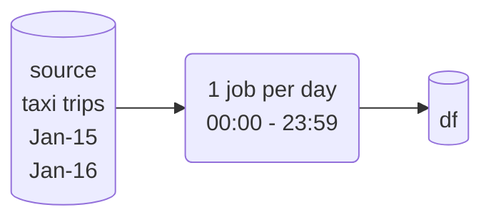
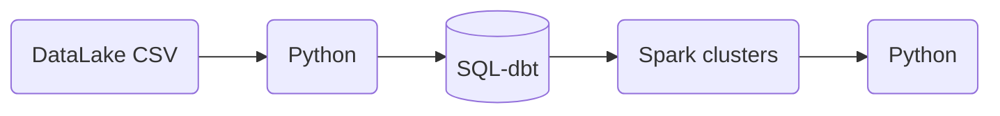
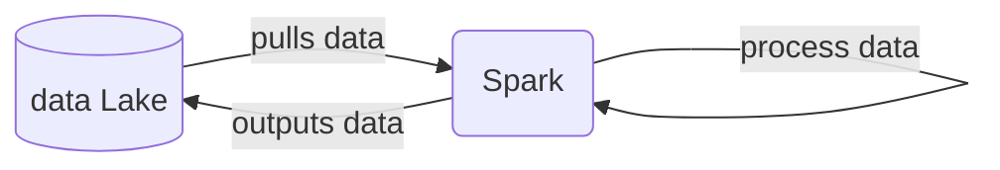
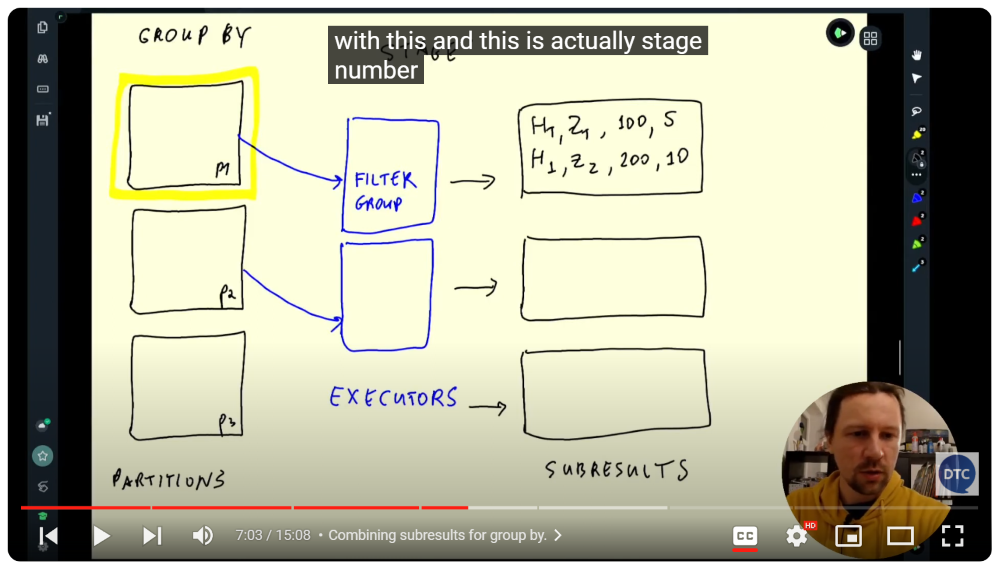
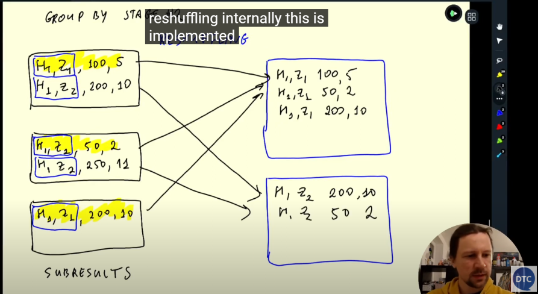
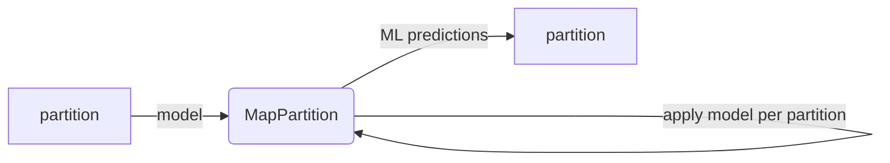

# Week 5: Batch Processing

## 5.1 Introduction

### 5.1.1 Introduction to Batch Processing

* :movie_camera: 5.1.1 Introduction to Batch Processing

[](https://youtu.be/dcHe5Fl3MF8&list=PL3MmuxUbc_hJed7dXYoJw8DoCuVHhGEQb&index=51)


#### --- EllaNotes ---

Lecture outline:
- What is batch processing?
- What is Spark?
- Features of Spark: Spark DataFrames, and Spark SQL
  - Joins in Spark
  - Resilient Distributed Datasets (RDDs)
  - Spark internals
- Spark with Docker
- Running Spark in the Cloud
- Connecting Spark to a Data Warehouse (DWH)


What is batch processing?

1. Processing in groups (by frequency or other measure)
2. Batch vs Streaming
  - Batch: processing a chunk of data at regular intervals, maybe 80% is batch jobs.



  - Stream: processing data on the fly (covered in next module), covers rest of 20% od data jobs.


1. Batch jobs frequency:
   - weekly
   - daily *most common
   - hourly *most common
   - 3 times per hour
   - every 5 minutes

1. Techonoly types of batch jobs:
   - SQL
   - Python scripts: in kubernetes, aws-batch, airflow as orchestrator 
   - Spark
   - Flink
  


1. Orchestrating batch jobs: airflow, prefect, mage

1. Advantages and disadvantages of batch jobs
  - Advantages: easy to manage, retries, easier to scale (get bigger Compute, more clusters)
  - Disadvantages: delay, not real-time if hourly need to await next hour to get past hour's data
  -  most times, stakeholders/users don't need up to the minute fresh data unless it is time-sensitive like severe weather or stocks trading
  -  

* :movie_camera: 5.1.2 Introduction to Spark

### 5.1.2 Introduction to Spark

[](https://youtu.be/FhaqbEOuQ8U&list=PL3MmuxUbc_hJed7dXYoJw8DoCuVHhGEQb&index=52)

#### --- EllaNotes ---

1. Apache Spark
- large scale data-processing
- distributed in clusters
- multilanguage: java, scala (native), python (pyspark), R, etc




2. When to use it?
   - data is in a data lake (S3, GCS), most usually in .parquet
   - 


## 5.2 Installation

Follow [these intructions](setup/) to install Spark:

* [Windows](setup/windows.md)
* [Linux](setup/linux.md)
* [MacOS](setup/macos.md)

And follow [this](setup/pyspark.md) to run PySpark in Jupyter

### 5.2.1 (Optional) Installing Spark (Linux)
* :movie_camera: 5.2.1 (Optional) Installing Spark (Linux)

[](https://youtu.be/hqUbB9c8sKg&list=PL3MmuxUbc_hJed7dXYoJw8DoCuVHhGEQb&index=53)

#### --- EllaNotes ---

lecture outline:
- 
- notebook: 03_test.ipynb

#### Install in windows 11 + WSL2

1. Installed java in Windows OS and downloaded winutils via Michael's video:

[](https://youtu.be/WxhPDK4ffq4)

1. Download and install Spark in WSL2. 
   - [Slack Arben's thread](https://datatalks-club.slack.com/archives/C01FABYF2RG/p1708691129314739) showed he used the combo of:
     - jdk-11.0.2
     - Python: 3.8.0
     - pyspark: 3.4.0
     - pandas: 2.0.3
   - At the time of this download, [spark download page](https://spark.apache.org/downloads.html) offers 2 versions, I opted for the 3.5.1 version as when I installed PySpark, that's the version micromamba installed. 
   - If there are issues with my Python 3.11.x install, I'll try the older version. 
   - It is essential to go to the download page so `apache.org` will recommend the closest CDN for you to download the 300MB++ file. 
   - I'd initially use the `wget` link from the [setup folder](../05-batch/setup/linux.md) and it projected to take 6-8 hours to download the 300MB++ file!
   - Using these link(s) took about 10sec
   - [spark-3.4.2 (Nov 30 2023)](https://dlcdn.apache.org/spark/spark-3.4.2/spark-3.4.2-bin-hadoop3.tgz)
   - [spark-3.5.1 (Feb 23 2024)](https://dlcdn.apache.org/spark/spark-3.5.1/spark-3.5.1-bin-hadoop3.tgz) 
   
```bash
wget https://dlcdn.apache.org/spark/spark-3.5.1/spark-3.5.1-bin-hadoop3.tgz
```
1. unpack with `tar xzfv spark-3.5.1-bin-hadoop3.tgz`
1. Add it to `PATH`:
```bash
export SPARK_HOME="${HOME}/spark/tar xzfv spark-3.5.1-bin-hadoop3.tgz"
export PATH="${SPARK_HOME}/bin:${PATH}"
```
1. Close wsl2 Ubuntu terminal or re-execute bash/zsh with `source ~/.zshrc`
1.  remove installer files
```bash
rm spark-3.5.1-bin-hadoop3.tgz
```
1. `pyspark` installed in `dezoomcamp` venv in WSL2 using `pip install pyspark==3.5.1`
   - as of this editing, `conda-forge` channel does not have pyspark==3.5.1, 
     - last available version via `conda-forge` channel is `pyspark==3.5.0`
     - - last available version via `pyspark` channel is `pyspark==3.4.1`
1. Environment variables, in Windows:

```
HADOOP_HOME C:\Utilities\hadoop
JAVA_HOME C:\Utilities\jre-8
JAVA_PATH C:\Utilities\jre-8\bin
PATH C:\Utilities\jre-8\bin
```

1. Confirm installation by `spark-shell --version` and `pip show pyspark` below. What we want to see is the spark version matches the tgz file we used.
1. `03_test` & `04_pyspark` notebooks run without issues. Other than the [warnings about resolution which can be ignored](https://unix.stackexchange.com/questions/259529/your-screen-size-is-bogus-expect-trouble) that has something to do with `ps` and `*tty` [not playing nice together](https://unix.stackexchange.com/questions/284375/tilda-complains-of-bogus-screen-size-at-startup), and I'm not gonna be messing with any settings as long as the package works with `df.show()`
   
   ```bash
   your 131072x1 screen size is bogus. expect trouble
   ```
1. expected outputs

```bash
Welcome to
      ____              __
     / __/__  ___ _____/ /__
    _\ \/ _ \/ _ `/ __/  '_/
   /___/ .__/\_,_/_/ /_/\_\   version 3.5.1
      /_/
                        
Using Scala version 2.12.18, OpenJDK 64-Bit Server VM, 11.0.22
```

```bash
pip show pyspark

Name: pyspark
Version: 3.5.1
Summary: Apache Spark Python API
Home-page: https://github.com/apache/spark/tree/master/python
Author: Spark Developers
Author-email: dev@spark.apache.org
License: http://www.apache.org/licenses/LICENSE-2.0
Location: /home/ellabelle/micromamba/envs/dezoomcamp/lib/python3.11/site-packages
Requires: py4j
Required-by: 
```

#### Install in GCP VM, Ubuntu 22.04

1. install into `~/spark`, so first `mkdir spark`
2. verify java is not installed `java --version` 
3. `wget https://download.java.net/java/GA/jdk11/9/GPL/openjdk-11.0.2_linux-x64_bin.tar.gz`
4. unpack with `tar xzfv openjdk-11.0.2_linux-x64_bin.tar.gz`
5. define `JAVA_HOME` and add it to `PATH`:

```bash
export JAVA_HOME="${HOME}/spark/jdk-11.0.2"
export PATH="${JAVA_HOME}/bin:${PATH}"
```
6. verify installation `java --version`
   - output:

```bash
openjdk 11.0.2 2019-01-15
OpenJDK Runtime Environment 18.9 (build 11.0.2+9)
OpenJDK 64-Bit Server VM 18.9 (build 11.0.2+9, mixed mode)
``` 

```
1.  Execute `spark-shell` 
    - output:
```bash
Setting default log level to "WARN".
To adjust logging level use sc.setLogLevel(newLevel). For SparkR, use setLogLevel(newLevel).
24/02/28 12:57:10 WARN NativeCodeLoader: Unable to load native-hadoop library for your platform... using builtin-java classes where applicable
Spark context Web UI available at http://vm-dezoomcamp.us-west1-b.c.nyc-rides-ella.internal:4040
Spark context available as 'sc' (master = local[*], app id = local-1709125031715).
Spark session available as 'spark'.
Welcome to
      ____              __
     / __/__  ___ _____/ /__
    _\ \/ _ \/ _ `/ __/  '_/
   /___/ .__/\_,_/_/ /_/\_\   version 3.4.0
      /_/

Using Scala version 2.12.17 (OpenJDK 64-Bit Server VM, Java 11.0.2)
Type in expressions to have them evaluated.
Type :help for more information.

scala>
```
12. and run the following `scala` code:

```scala
val data = 1 to 10000
val distData = sc.parallelize(data)
distData.filter(_ < 10).collect()
```


## 5.3 Spark SQL and DataFrames

### 5.3.1 First Look at Spark/PySpark

* :movie_camera: 5.3.1 First Look at Spark/PySpark

[](https://youtu.be/r_Sf6fCB40c&list=PL3MmuxUbc_hJed7dXYoJw8DoCuVHhGEQb&index=54)

#### --- EllaNotes ---

lecture outline:
- reading CSV files
- partitions
- saving data to parquet format for local experimentations
- spark master UI
- notebook: 04_pyspark.ipynb
- dataset: 'fhvhv_tripdata_2021-01.csv.gz'

> [!NOTE]
> [Official documentation](https://spark.apache.org/docs/latest/api/python/getting_started/quickstart_df.html)

1. PySpark DataFrames are lazily evaluated, similar to `polars`, or the polars dev took inspiration from spark, not sure who is first (might be interesting to read their histories)
2. results are not shown until we execute `actions` like
   - collect()
   - show()
3. partitions so more executors can work concurrently instea od

### 5.3.2 Spark Dataframes

* :movie_camera: 5.3.2 Spark Dataframes

[](https://youtu.be/ti3aC1m3rE8&list=PL3MmuxUbc_hJed7dXYoJw8DoCuVHhGEQb&index=55)

#### --- EllaNotes ---

lecture outline:
- actions vs transformations
- partitions
- functions and UDFs

### 5.3.3 (Optional) Preparing Yellow and Green Taxi Data

* :movie_camera: 5.3.3 (Optional) Preparing Yellow and Green Taxi Data

[](https://youtu.be/CI3P4tAtru4&list=PL3MmuxUbc_hJed7dXYoJw8DoCuVHhGEQb&index=56)

Script to prepare the Dataset [download_data.sh](code/download_data.sh)

> [!NOTE]  
> The other way to infer the schema (apart from pandas) for the csv files, is to set the `inferSchema` option to `true` while reading the files in Spark.

#### --- EllaNotes ---

lecture outline:
- downloading data files from DTC repo for 2021 & 2021, green & yellow services
- for each service we get the schema inferred by pd.read_csv() and tidy it up and rewrite it to spark schema format
- using this tidied schema, write to parquet format with 4 partitions
- notebook: 05_taxi_schema.ipynb

### 5.3.4 SQL with Spark
* :movie_camera: 5.3.4 SQL with Spark

[](https://youtu.be/uAlp2VuZZPY&list=PL3MmuxUbc_hJed7dXYoJw8DoCuVHhGEQb&index=57)

#### --- EllaNotes ---

lecture outline:
- take query from  [module-04 on revenue calculation](../04-analytics-engineering/taxi_rides_ny/models/core/dm_monthly_zone_revenue.sql)
- translate to spark SQL
- notebook: 06_spark_sql.ipynb

## 5.4 Spark Internals

### 5.4.1 Anatomy of a Spark Cluster

* :movie_camera: 5.4.1 Anatomy of a Spark Cluster

[](https://youtu.be/68CipcZt7ZA&list=PL3MmuxUbc_hJed7dXYoJw8DoCuVHhGEQb&index=58)

#### --- EllaNotes ---

lecture outline:
- spark driver, master and executors
- spark clusters
- clusters from AWS S3 or GCS
  - previously clusters on hadoop/hdfs before the introduction of cloud computing
  - hadoop/hdfs *pull* data from storage and run code on each data pull
  - spark + S3/GCS *push* code (@ 10mb) to executor instead of pulling partition data (@ 100mb) per partition seems to be more efficient
- notebook: --; just theory

### 5.4.2 GroupBy in Spark

* :movie_camera: 5.4.2 GroupBy in Spark

[](https://youtu.be/9qrDsY_2COo&list=PL3MmuxUbc_hJed7dXYoJw8DoCuVHhGEQb&index=59)

#### --- EllaNotes ---

lecture outline:
- how groupBy works internally 
  - copy code from 06_spark_sql.ipynb
  - changed from grouping by monthly to hourly revenue
  - executors processed one partition at a time
- shuffling
  - sub-results are in a "stage 1", and then results from this grouped partition goes through the grouping process again --> called reshuffling
  
  
  - so stage 2 reshuffle and group into final partitions
  
  
- then a final groupBy where records with the same key has its values summed up
- typically we want the reshuffling to be for as small number as possible (the Shuffle Read/Write in Stages tab)
- notebook: 07_groupby_join.ipynb

### 5.4.3 Joins in Spark

* :movie_camera: 5.4.3 Joins in Spark

[](https://youtu.be/lu7TrqAWuH4&list=PL3MmuxUbc_hJed7dXYoJw8DoCuVHhGEQb&index=60)

#### --- EllaNotes ---

lecture outline:
- Joining 2 large tables, with how=outer/inner same like other SQLs
- merge sort join
- Joining one large and one small
- Broadcasting
  - the s mall table gets broadcasted to all executors 
- notebook: 07_groupby_join.ipynb

## 5.5 (Optional) Resilient Distributed Datasets

### 5.5.1 Operations on Spark RDDs

* :movie_camera: 5.5.1 Operations on Spark RDDs

[](https://youtu.be/Bdu-xIrF3OM&list=PL3MmuxUbc_hJed7dXYoJw8DoCuVHhGEQb&index=61)

#### --- EllaNotes ---

lecture outline:
- What is RDD and how is it related to dataframes
  - low-level operations, older spark versions 
  - current operations are wrappers on top of RDDs
- From dataframe to RDD
  - dataframes: have schema
  - RDDs: collection of objects 
- Operations on RDDs: map, mapPartition, reduceByKey
- From RDD to dataframe
- notebook: 08_rdds.ipynb

### 5.5.2 Spark RDD mapPartition

* :movie_camera: 5.5.2 Spark RDD mapPartition

[](https://youtu.be/k3uB2K99roI&list=PL3MmuxUbc_hJed7dXYoJw8DoCuVHhGEQb&index=62)


#### --- EllaNotes ---

lecture outline:
- mapPartition

- pd.DataFrame(rows, columns=columns) is the whole DF, might result in memory issues. but I'd changed the default to 10g in conf file, taken from `spark-defaults.conf.template`

path to config file: `\spark\spark-3.5.1-bin-hadoop3\conf`

uncomment the `driver` line and add the `executor` line

```
spark.driver.memory              10g
spark.executor.memory            10g
```

- notebook: 08_rdds.ipynb

## 5.6 Running Spark in the Cloud

### 5.6.1 Connecting to Google Cloud Storage

* :movie_camera: 5.6.1 Connecting to Google Cloud Storage

[](https://youtu.be/Yyz293hBVcQ&list=PL3MmuxUbc_hJed7dXYoJw8DoCuVHhGEQb&index=63)

#### --- EllaNotes ---

lecture outline:
- uploading data to GCS
- create bucket `dezoomcamp-spark-ellacharmed` in GCS
- copy from `data/pq/` to `gs://dezoomcamp-spark-ellacharmed/pq`
```bash
cd data
gsutil -m cp -r pq/ gs://dezoomcamp-spark-ellacharmed/pq
```

- connecting spark jobs to GCS
- mkdir /lib in root `data-engineering-zoomcamp`
- download [jar file](https://storage.googleapis.com/hadoop-lib/gcs/gcs-connector-hadoop3-latest.jar) `gcs-connector-hadoop3-latest.jar` to this path
- notebook: 09_spark_gcs.ipynb

### 5.6.2 Creating a Local Spark Cluster

* :movie_camera: 5.6.2 Creating a Local Spark Cluster

[](https://youtu.be/HXBwSlXo5IA&list=PL3MmuxUbc_hJed7dXYoJw8DoCuVHhGEQb&index=64)

#### --- EllaNotes ---

lecture outline:
- creating the spark `master` with `./sbin/start-master.sh` in your $SPARK_HOME path which for me is at `/home/ellabelle/spark/spark-3.5.1-bin-hadoop3`
- output:
```bash
starting org.apache.spark.deploy.master.Master, logging to /home/ellabelle/spark/spark-3.5.1-bin-hadoop3/logs/spark-ellabelle-org.apache.spark.deploy.master.Master-1-Cinders.out
```
- ensure port forward 8080 is set and open a browser page at `http://localhost:8080/` and you'd see the Application ID
- but if we try to read.parquet() now, you'd get a `WARN TaskScheduleImpl: ... ensure that workers are registered...`; that's because we don't have any executors yet
- creating the spark `worker` with `./sbin/start-worker.sh spark://Cinders.:7077` at the same path in terminal
- output:
```bash
starting org.apache.spark.deploy.worker.Worker, logging to /home/ellabelle/spark/spark-3.5.1-bin-hadoop3/logs/spark-ellabelle-org.apache.spark.deploy.worker.Worker-1-Cinders.out
```
- refresh the Spark Master UI browser and you'll see the worker
- turning the notebook into a script
  - from the terminal in the path where the .py is located, run the script with `python 09_spark_sql.py`
  - change the paths if necessary
  - after adding argparse, use following command 
```bash
python 09_spark_sql.py \
 --input_green='/data/pq/green/2020/*/*' \
 --input_yellow='/data/pq/yellow/2020/*/*' \
 --output='/data/report-2020'
```
- script file: 09_spark_sql.py

### 5.6.3 Setting up a Dataproc Cluster

* :movie_camera: 5.6.3 Setting up a Dataproc Cluster

[](https://youtu.be/osAiAYahvh8&list=PL3MmuxUbc_hJed7dXYoJw8DoCuVHhGEQb&index=65)

#### --- EllaNotes ---

lecture outline:
- creating cluster in GCP
  - search for dataproc, `Enable` the API first time loading the page 
  - create in same region as `gs://dezoomcamp-spark-ellacharmed` bucket, see image for other settings
  - ensure it is for right project
  - the Optional components are not covered in this series, it is just in case we want to explore for future or for project, it is already enable and need no re-create
  - edit Principle on the service-account for  `152484696885-compute@developer.gserviceaccount.com` (it tells you when you load the page) to add the 
  - `DataProc Admin`, most likely `DataProc Editor` is also sufficient
  - `Storage Object Creator`
  - `Storage Object Viewer`
- running a job with DataProc
  - DataProc: Manages Hadoop-based clusters and jobs on Google Cloud Platform.
- submitting jobs with cloud SDK
  - comment the `base_path` and remove from the args line: line#30, line#38, line#128 
  - upload our code first using cloud CLI: `gsutil cp 09_spark_sql.py
 gs://dezoomcamp-spark-ellacharmed/code/09_spark_sql.py` 
  - after successful copy step, paste the path to the `Main python file` field
  - and the arguments: copy line-by-line, press `ENTER`, note there should NOT be quotes for the strings unlike in our local
```bash
--input_green=gs://dezoomcamp-spark-ellacharmed/pq/green/2020/*/
--input_yellow=gs://dezoomcamp-spark-ellacharmed/pq/yellow/2020/*/
--output=gs://dezoomcamp-spark-ellacharmed/report-2020/
```
  - click `Submit`
- then check your Bucket for the code and report(s)
- this method is not convenient as we're submitting from Web UI
  - that's the first method
  - second is via gcloud SDK
  - and third is [REST API docs](https://cloud.google.com/dataproc/docs/guides/submit-job#dataproc-submit-job-gcloud)
- using spark-submit for submitting spark jobs
- using gcloud REST API, take the input from `EQUIVALENT REST` link after the successful Job run
```bash
gcloud dataproc jobs submit pyspark \
    --cluster=dezoomcamp-cluster \
    --region=us-central1 \
    gs://dezoomcamp-spark-ellacharmed/code/09_spark_sql.py \
    -- \
        --input_green='gs://dezoomcamp-spark-ellacharmed/pq/green/2021/*/' \
        --input_yellow='gs://dezoomcamp-spark-ellacharmed/pq/yellow/2021/*/' \
        --output=gs://dezoomcamp-spark-ellacharmed/report-2021
```
- note terminal need '' because otherwise it would not expand the '*' instead of taking it as wildcard
- if you've set the permissions correctly, you'd see these lines:
```bash
Job [aa90c14cf89a4910b9a1b79432efcf06] submitted.
Waiting for job output...
```
- script file: 09_spark_sql.py

### 5.6.4 Connecting Spark to Big Query

* :movie_camera: 5.6.4 Connecting Spark to Big Query

[](https://youtu.be/HIm2BOj8C0Q&list=PL3MmuxUbc_hJed7dXYoJw8DoCuVHhGEQb&index=66)

#### --- EllaNotes ---

lecture outline:
- writing spark job results to BigQuery
- add these lines after creating SparkSession
- the temp bucket name is in [gcs bucket](https://console.cloud.google.com/storage/browser?hl=en&project=nyc-rides-ella)
- take the one that says `*temp*` and not `*staging*`
```python
bucket = "dataproc-temp-us-central1-152484696885-hgkokkpu"
spark.conf.set('temporaryGcsBucket', bucket)
```
- edit the write statement, at the end, from using `output` to bigquery, taking the `--output` args
- upload this code `10_spark_sql_bigquery.py` to bucket `dezoomcamp-spark-ellacharmed/code` using `gsutil`
```bash

```
- edit the submit command to include the `--jars` args and change out the `--output` args to our BigQuery dataset `trips_data_all` we used for module-04
```bash
gcloud dataproc jobs submit pyspark \
    --cluster=dezoomcamp-cluster \
    --region=us-central1 \
    --jars=gs://spark-lib/bigquery/spark-bigquery-latest.jar \
    gs://dezoomcamp-spark-ellacharmed/code/10_spark_sql_bigquery.py \
    -- \
        --input_green='gs://dezoomcamp-spark-ellacharmed/pq/green/2021/*/' \
        --input_yellow='gs://dezoomcamp-spark-ellacharmed/pq/yellow/2021/*/' \
        --output=trips_data_all.reports-2021
```
- script file: 10_spark_sql_bigquery.py


# Homework

* [2024 Homework](../cohorts/2024/05-batch/homework.md)


# Community notes

Did you take notes? You can share them here.

* [Notes by Alvaro Navas](https://github.com/ziritrion/dataeng-zoomcamp/blob/main/notes/5_batch_processing.md)
* [Sandy's DE Learning Blog](https://learningdataengineering540969211.wordpress.com/2022/02/24/week-5-de-zoomcamp-5-2-1-installing-spark-on-linux/)
* [Notes by Alain Boisvert](https://github.com/boisalai/de-zoomcamp-2023/blob/main/week5.md)
* [Alternative : Using docker-compose to launch spark by rafik](https://gist.github.com/rafik-rahoui/f98df941c4ccced9c46e9ccbdef63a03) 
* [Marcos Torregrosa's blog (spanish)](https://www.n4gash.com/2023/data-engineering-zoomcamp-semana-5-batch-spark)
* [Notes by Victor Padilha](https://github.com/padilha/de-zoomcamp/tree/master/week5)
* [Notes by Oscar Garcia](https://github.com/ozkary/Data-Engineering-Bootcamp/tree/main/Step5-Batch-Processing)
* [Notes by HongWei](https://github.com/hwchua0209/data-engineering-zoomcamp-submission/blob/main/05-batch-processing/README.md)
* Add your notes here (above this line)

##### Credits

* Origins of mermaid graph from "Notes by Alvaro Navas" above, might have been further tweaked a little per my understanding
