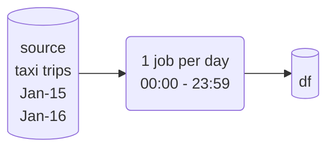
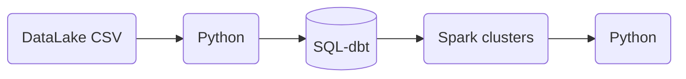
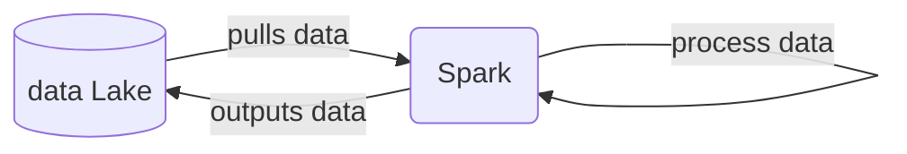

# Week 5: Batch Processing

## 5.1 Introduction

* :movie_camera: 5.1.1 Introduction to Batch Processing

[](https://youtu.be/dcHe5Fl3MF8&list=PL3MmuxUbc_hJed7dXYoJw8DoCuVHhGEQb&index=51)


### --- EllaNotes ---

### Goal

Plan:
- What is batch processing?
- What is Spark?
- Features of Spark: Spark DataFrames, and Spark SQL
  - Joins in Spark
  - Resilient Distributed Datasets (RDDs)
  - Spark internals
- Spark with Docker
- Running Spark in the Cloud
- Connecting Spark to a Data Warehouse (DWH)

### Introduction to Batch Processing

What is batch processing?

1. Processing in groups (by frequency or other measure)
1. Batch vs Streaming
  - Batch: processing a chunk of data at regular intervals, maybe 80% is batch jobs.



  - Stream: processing data on the fly (covered in next module), covers rest of 20% od data jobs.


1. Batch jobs frequency:
   - weekly
   - daily *most common
   - hourly *most common
   - 3 times per hour
   - every 5 minutes

1. Techonoly types of batch jobs:
   - SQL
   - Python scripts: in kubernetes, aws-batch, airflow as orchestrator 
   - Spark
   - Flink
  


1. Orchestrating batch jobs: airflow, prefect, mage

1. Advantages and disadvantages of batch jobs
  - Advantages: easy to manage, retries, easier to scale (get bigger Compute, more clusters)
  - Disadvantages: delay, not real-time if hourly need to await next hour to get past hour's data
  -  most times, stakeholders/users don't need up to the minute fresh data unless it is time-sensitive like severe weather or stocks trading
  -  

* :movie_camera: 5.1.2 Introduction to Spark

[](https://youtu.be/FhaqbEOuQ8U&list=PL3MmuxUbc_hJed7dXYoJw8DoCuVHhGEQb&index=52)

### --- EllaNotes ---

1. Apache Spark
- large scale data-processing
- distributed in clusters
- multilanguage: java, scala (native), python (pyspark), R, etc




2. When to use it?
   - data is in a data lake (S3, GCS), most usually in .parquet
   - 


## 5.2 Installation

Follow [these intructions](setup/) to install Spark:

* [Windows](setup/windows.md)
* [Linux](setup/linux.md)
* [MacOS](setup/macos.md)

And follow [this](setup/pyspark.md) to run PySpark in Jupyter

* :movie_camera: 5.2.1 (Optional) Installing Spark (Linux)

[](https://youtu.be/hqUbB9c8sKg&list=PL3MmuxUbc_hJed7dXYoJw8DoCuVHhGEQb&index=53)

### --- EllaNotes ---

lecture outline:
- 
- notebook: 03_test.ipynb

1. Installed java and downloaded winutils via Michael's video:

[](https://youtu.be/WxhPDK4ffq4)

2. `pyspark` installed in `dezoomcamp` venv in WSL2
3. Environment variables, in Windows:

```
HADOOP_HOME C:\Utilities\hadoop
JAVA_HOME C:\Utilities\jre-8
JAVA_PATH C:\Utilities\jre-8\bin
PATH C:\Utilities\jre-8\bin
```

4. Confirm installation by `spark-shell --version` and `pip show pyspark` below
5. `03_test` & `04_pyspark` notebooks run without issues. Other than the [warnings about resolution which can be ignored](https://unix.stackexchange.com/questions/259529/your-screen-size-is-bogus-expect-trouble) that has something to do with `ps` and `*tty` [not playing nice together](https://unix.stackexchange.com/questions/284375/tilda-complains-of-bogus-screen-size-at-startup), and I'm not gonna be messing with any settings as long as the package works with `df.show()`
   
   ```bash
   your 131072x1 screen size is bogus. expect trouble
   ```

```bash
spark-shell --version

24/02/28 13:16:24 WARN Utils: Your hostname, Cinders resolves to a loopback address: 127.0.1.1; using 172.17.156.62 instead (on interface eth0)
24/02/28 13:16:24 WARN Utils: Set SPARK_LOCAL_IP if you need to bind to another address
Welcome to
      ____              __
     / __/__  ___ _____/ /__
    _\ \/ _ \/ _ `/ __/  '_/
   /___/ .__/\_,_/_/ /_/\_\   version 3.5.1
      /_/
                        
Using Scala version 2.12.18, OpenJDK 64-Bit Server VM, 11.0.22
Branch HEAD
Compiled by user heartsavior on 2024-02-15T11:24:58Z
Revision fd86f85e181fc2dc0f50a096855acf83a6cc5d9c
Url https://github.com/apache/spark
Type --help for more information.
```

```bash
pip show pyspark

Name: pyspark
Version: 3.5.1
Summary: Apache Spark Python API
Home-page: https://github.com/apache/spark/tree/master/python
Author: Spark Developers
Author-email: dev@spark.apache.org
License: http://www.apache.org/licenses/LICENSE-2.0
Location: /home/ellabelle/micromamba/envs/dezoomcamp/lib/python3.11/site-packages
Requires: py4j
Required-by: 
```


## 5.3 Spark SQL and DataFrames

* :movie_camera: 5.3.1 First Look at Spark/PySpark

[](https://youtu.be/r_Sf6fCB40c&list=PL3MmuxUbc_hJed7dXYoJw8DoCuVHhGEQb&index=54)

### --- EllaNotes ---

lecture outline:
- reading CSV files
- partitions
- saving data to parquet format for local experimentations
- spark master UI
- notebook: 04_pyspark.ipynb
- dataset: 'fhvhv_tripdata_2021-01.csv.gz'

> [!NOTE]
> [Official documentation](https://spark.apache.org/docs/latest/api/python/getting_started/quickstart_df.html)

1. PySpark DataFrames are lazily evaluated, similar to `polars`, or the polars dev took inspiration from spark, not sure who is first (might be interesting to read their histories)
2. results are not shown until we execute `actions` like
   - collect()
   - show()
3. partitions so more executors can work concurrently instea od


* :movie_camera: 5.3.2 Spark Dataframes

[](https://youtu.be/ti3aC1m3rE8&list=PL3MmuxUbc_hJed7dXYoJw8DoCuVHhGEQb&index=55)

### --- EllaNotes ---

lecture outline:
- actions vs transformations
- partitions
- functions and UDFs

* :movie_camera: 5.3.3 (Optional) Preparing Yellow and Green Taxi Data

[](https://youtu.be/CI3P4tAtru4&list=PL3MmuxUbc_hJed7dXYoJw8DoCuVHhGEQb&index=56)

Script to prepare the Dataset [download_data.sh](code/download_data.sh)

> [!NOTE]  
> The other way to infer the schema (apart from pandas) for the csv files, is to set the `inferSchema` option to `true` while reading the files in Spark.

* :movie_camera: 5.3.4 SQL with Spark

[](https://youtu.be/uAlp2VuZZPY&list=PL3MmuxUbc_hJed7dXYoJw8DoCuVHhGEQb&index=57)


## 5.4 Spark Internals

* :movie_camera: 5.4.1 Anatomy of a Spark Cluster

[](https://youtu.be/68CipcZt7ZA&list=PL3MmuxUbc_hJed7dXYoJw8DoCuVHhGEQb&index=58)

* :movie_camera: 5.4.2 GroupBy in Spark

[](https://youtu.be/9qrDsY_2COo&list=PL3MmuxUbc_hJed7dXYoJw8DoCuVHhGEQb&index=59)

* :movie_camera: 5.4.3 Joins in Spark

[](https://youtu.be/lu7TrqAWuH4&list=PL3MmuxUbc_hJed7dXYoJw8DoCuVHhGEQb&index=60)

## 5.5 (Optional) Resilient Distributed Datasets

* :movie_camera: 5.5.1 Operations on Spark RDDs

[](https://youtu.be/Bdu-xIrF3OM&list=PL3MmuxUbc_hJed7dXYoJw8DoCuVHhGEQb&index=61)

* :movie_camera: 5.5.2 Spark RDD mapPartition

[](https://youtu.be/k3uB2K99roI&list=PL3MmuxUbc_hJed7dXYoJw8DoCuVHhGEQb&index=62)


## 5.6 Running Spark in the Cloud

* :movie_camera: 5.6.1 Connecting to Google Cloud Storage

[](https://youtu.be/Yyz293hBVcQ&list=PL3MmuxUbc_hJed7dXYoJw8DoCuVHhGEQb&index=63)

* :movie_camera: 5.6.2 Creating a Local Spark Cluster

[](https://youtu.be/HXBwSlXo5IA&list=PL3MmuxUbc_hJed7dXYoJw8DoCuVHhGEQb&index=64)

* :movie_camera: 5.6.3 Setting up a Dataproc Cluster

[](https://youtu.be/osAiAYahvh8&list=PL3MmuxUbc_hJed7dXYoJw8DoCuVHhGEQb&index=65)

* :movie_camera: 5.6.4 Connecting Spark to Big Query

[](https://youtu.be/HIm2BOj8C0Q&list=PL3MmuxUbc_hJed7dXYoJw8DoCuVHhGEQb&index=66)


# Homework

* [2024 Homework](../cohorts/2024/05-batch/homework.md)


# Community notes

Did you take notes? You can share them here.

* [Notes by Alvaro Navas](https://github.com/ziritrion/dataeng-zoomcamp/blob/main/notes/5_batch_processing.md)
* [Sandy's DE Learning Blog](https://learningdataengineering540969211.wordpress.com/2022/02/24/week-5-de-zoomcamp-5-2-1-installing-spark-on-linux/)
* [Notes by Alain Boisvert](https://github.com/boisalai/de-zoomcamp-2023/blob/main/week5.md)
* [Alternative : Using docker-compose to launch spark by rafik](https://gist.github.com/rafik-rahoui/f98df941c4ccced9c46e9ccbdef63a03) 
* [Marcos Torregrosa's blog (spanish)](https://www.n4gash.com/2023/data-engineering-zoomcamp-semana-5-batch-spark)
* [Notes by Victor Padilha](https://github.com/padilha/de-zoomcamp/tree/master/week5)
* [Notes by Oscar Garcia](https://github.com/ozkary/Data-Engineering-Bootcamp/tree/main/Step5-Batch-Processing)
* [Notes by HongWei](https://github.com/hwchua0209/data-engineering-zoomcamp-submission/blob/main/05-batch-processing/README.md)
* Add your notes here (above this line)

##### Credits

* Origins of mermaid graph from "Notes by Alvaro Navas" above, might have been further tweaked a little per my understanding