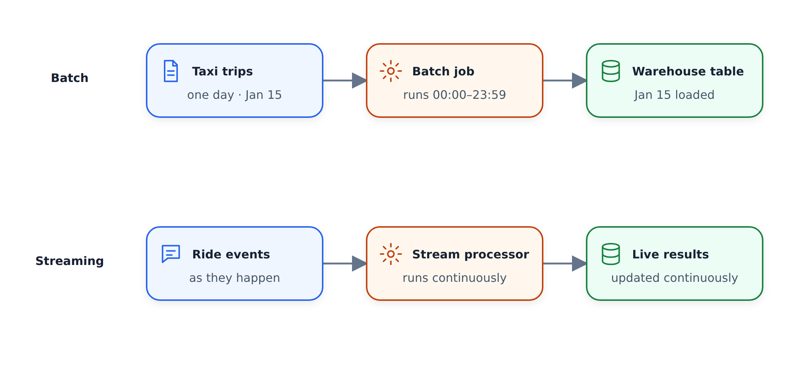
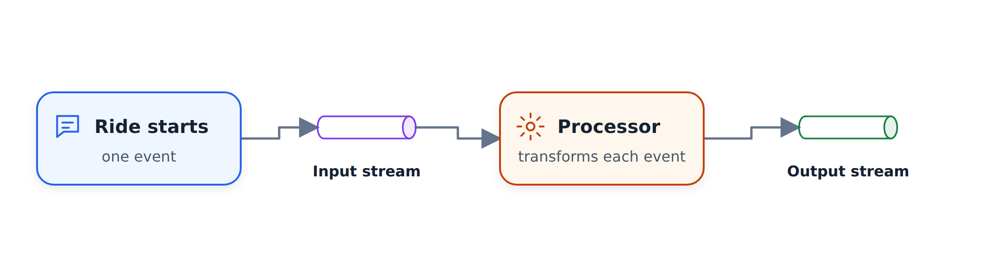
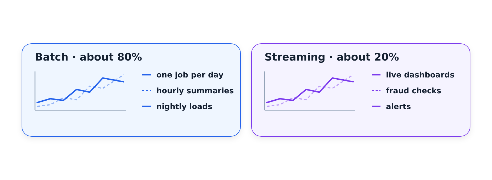

# Introduction to Batch Processing

This is the first lesson of the batch processing module. We define batch
processing, contrast it with streaming, and see where Spark fits among the
other tools we already used for batch jobs.

## The module plan

Before diving into batch processing, here is what we cover this week:

- What batch processing is
- Spark: what it is and why we need it
- Installing Spark on Linux (on a virtual machine from Google Cloud)
- A first look at Spark with PySpark - we use Python, not Scala
- Spark features: DataFrames, SQL, joins
- RDDs (Resilient Distributed Datasets), a relatively old Spark concept,
  and how they differ from DataFrames
- Some Spark internals
- Running Spark jobs with Docker
- Finally, deploying Spark jobs to the cloud and connecting them to a
  data warehouse

## Batch vs streaming

There are multiple ways of processing data. The two main ones are batch
processing and streaming. This week is about batch; streaming is the
next module.

With batch, imagine we have a database with our taxi trip data. We take
the entire dataset for one day - say, all of January 15, from 00:00 to
23:59 - and one single job takes all of this data and produces some
other dataset. That is a batch job: we accumulate a chunk of data and
process it all in one go.

Streaming is different. Imagine I'm in New York and I hail a yellow
taxi. When the ride starts, the device inside the taxi sends an event
with some metadata to a data stream. Something - a stream processor -
reads events from this stream, processes them, and puts the results to
another stream. All of this happens on the fly, in real time.

## When do batch jobs run

Batch jobs usually run on a schedule:

- Weekly: process all the data collected during the week
- Daily: probably the most common - once the day is over, process
  everything from yesterday
- Hourly: once an hour is over, process everything from the previous
  hour

You can go to a finer granularity - three times per hour, or every five
minutes - but these are less typical. Daily and hourly are what you
will see most of the time.

## Technologies for batch jobs

The tools we use for batch jobs are often just Python scripts. Remember
the data pipeline we wrote in week one? It took a CSV file and ingested
it into a database. That was a batch script, and we executed it once
per month, one run for each month of taxi data.

SQL is very common too. In week four we used SQL to define
transformations: we get a huge chunk of data and process it in one go.
SQL is popular for this because it is convenient and people know it.

Then there is Spark, which is the topic of this week, and other tools
like Flink.

A note on Python scripts: they can run anywhere - in Kubernetes, in a
batch service, wherever. For orchestrating all these jobs we use
workflow tools like Airflow. A typical workflow could look like this:

- Some data lands in a data lake, say CSV files
- A Python script takes these files, does something, and puts the
  results to a database or a warehouse
- A SQL job (you might use dbt or similar tools) does data preparation
- Then maybe Spark runs, and then Python again

Each step is a batch job. They use different technologies, and Airflow
orchestrates the whole pipeline.

## Advantages and disadvantages of batch

Batch jobs are convenient and easy to manage. Workflow tools let us
define all the steps, parameterize them, and easily retry them. A
workflow has a parameter for the time interval it processes, so if
something fails we can simply execute it again. Retrying is quite safe
because nothing happens in real time.

Batch is also easier to scale. If a Python script struggles with a
bigger file, we get a bigger machine. If Spark struggles, we get a
bigger cluster or add more machines to the existing one. We can scale
up and down when we need to.

The main disadvantage is delay. Because we run things at regular
intervals, we always wait. Say we process data hourly, and executing
each step of our workflow takes five minutes, with the last step taking
three. That is roughly twenty minutes in total. The hour ends, the
workflow starts, and only after those twenty minutes is the data ready.
In the worst case we wait almost 90 minutes before we can do something
with data that arrived at the beginning of the previous hour.

Streaming solves this, but often you don't need to react that fast. For
many metrics it is fine to wait an hour, a day, or even a week before
they show up on a dashboard. Because batch is so convenient, the
majority of data processing jobs - in my experience, 80% or more - are
batch. The remaining 10-20% are streaming.

We already saw how to do batch transformations with SQL in the previous
module, and we touched Python scripts in week one. So the rest of this
module is about Spark. See you in the next video.
