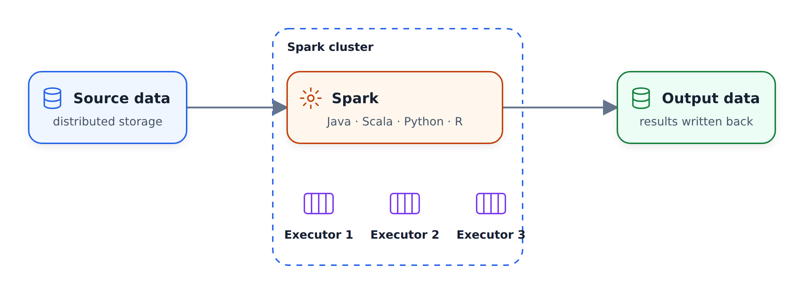
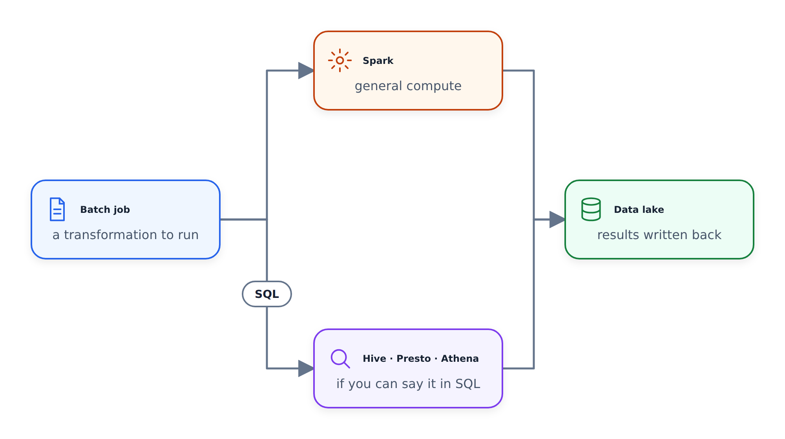
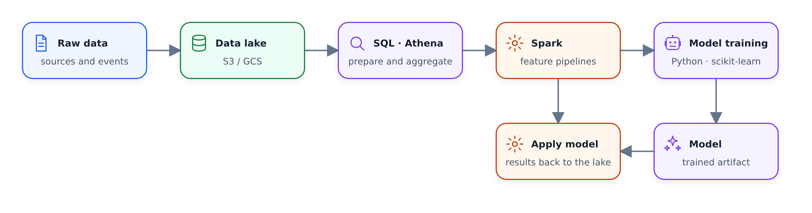

# Introduction to Spark

In this lesson we look at Apache Spark: what it is, which languages you
can use with it, and when you should reach for it instead of plain SQL.

## What is Spark

If you google "Apache Spark", you get this overloaded sentence: a
multi-language engine for executing data engineering, data science and
machine learning on single-node machines or clusters. The simpler way
to think about it: Spark is an engine for large-scale data processing.

Engine is the important word here. Say we have data in a database or a
data lake. Spark pulls this data to its own machines - the executors -
does something with it, and writes the result back to a data lake or a
data warehouse. The processing happens inside Spark. That is why it is
an engine.

It is also distributed. We can have a cluster with tens, hundreds or
thousands of machines, and all of them pull the data, process it, and
save the results somewhere.

## Languages

Spark is written in Scala, so Scala is the native way of talking to it.
Java works too. On top of these there are wrappers for other languages:
there is one for R (I don't know how popular it is), and there is the
Python wrapper, PySpark, which is very popular. In many companies
PySpark is the preferred way of writing Spark jobs: data engineers
write Python code, and sometimes, when they need more flexibility, they
rewrite parts of it in Scala. Some companies use only Scala, and in
some, data engineers write only Java - but PySpark is quite common.

Spark is used for executing batch jobs, but it can also do streaming.
The idea there is that you can see a stream of data as a sequence of
small batches, and apply similar techniques as with batch processing.
We will not cover streaming in this course - we focus on batch.

## When to use Spark

Typically you use Spark when your data is in a data lake. A data lake
is usually just a location in S3 or Google Cloud Storage with a bunch
of files - parquet files, most often. Spark pulls this data in, does
some processing, and puts the results back into the lake.

This is in contrast with a data warehouse. If our data lives in a
warehouse like BigQuery, we would just use SQL. But when we only have a
bunch of files in S3 or Google Cloud Storage, running SQL is not always
easy - and this is where Spark comes in.

These days you actually can run SQL directly on a data lake, using
tools like Hive or Presto - Spark itself can do it too. On AWS there is
a managed version of Presto called Athena. So the rule of thumb is: if
you can express your job as a SQL query, use Presto, Athena, or
BigQuery with external tables over your lake.

Sometimes you cannot express the job with SQL. Maybe you need more
flexibility, maybe the code becomes too difficult to manage as one big
query - you want to split it into modules and cover it with unit tests.
Or the functionality simply does not exist in SQL. This is exactly
when you want to use Spark.

From my experience as a data scientist, the things I cannot express
with SQL are usually related to machine learning: both training a model
and applying it to data.

## A typical workflow

Here is a typical workflow I see at work. We start with raw data on a
data lake. First we run a bunch of SQL transformations - aggregations,
joins, data preparation - using something like Athena or Presto. Once
the data is prepared, we need to do something more complex that SQL
cannot express, and this is where Spark comes in: a Spark job trains a
machine learning model, or a Python job runs after it.

Then there is often another flow: a second Spark job takes the trained
model and applies it to the data. The results go back to the data lake,
and from there they can make it into a data warehouse.

So the recommendation is: use SQL when you can, and use Spark for the
cases where you cannot. In the next video we install Spark locally and
run our first experiments with it.
