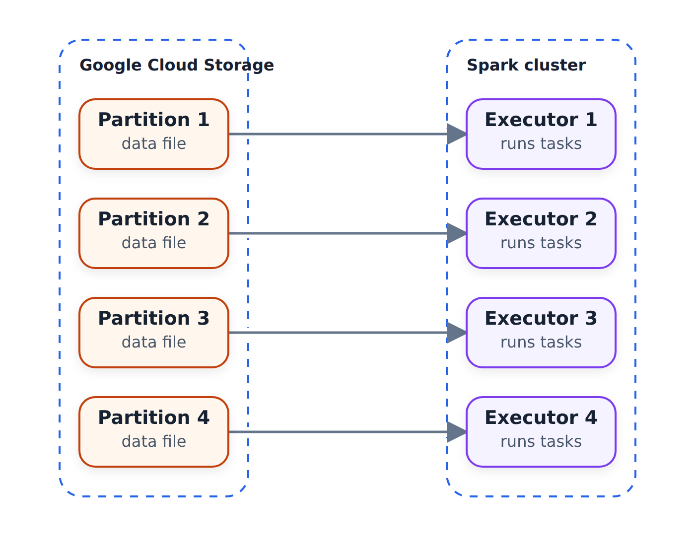

# First Look at Spark/PySpark

In this unit we take a first real look at PySpark: we read a large CSV
file, talk about partitions, save the data as parquet, and watch
everything in the Spark master UI.

## The dataset

Instead of the yellow or green taxi data we used before, we take the
high-volume FHV (for-hire vehicle) trip records for January 2021 -
Spark is supposed to process high-volume data, so let's feed it a
bigger file. It is still not a very large dataset, but it is not
small: around 700 MB of CSV and almost 12 million records.

## Reading the CSV

As in the previous unit, we execute the `PYTHONPATH` exports first and
start Jupyter on the remote machine. We also forward port 4040 - more
on that later.

We copy the imports from the previous notebook. The `SparkSession` is
the object we use for interacting with Spark - our main entry point.
It is what we use for reading things:

```python
df = spark.read \
    .option("header", "true") \
    .csv('fhvhv_tripdata_2021-01.csv')
```

If we run `df.show()`, Spark correctly gets the names of the columns.
And if we open localhost:4040 and refresh, we see the Spark application's
Jobs page. After a notebook action runs, it appears here as a job.

Before the first action, the page is empty:

| Spark UI page | Initial state |
| --- | --- |
| `localhost:4040` → Jobs | No job has run yet |

## The schema problem

Instead of `show()`, let's take `df.head(5)` to get the first five
records. Now we can see a problem: Spark reads the timestamps as
strings, and even `PULocationID` - which is supposed to be a number -
is a string.

Unlike pandas, Spark doesn't try to infer the types of these fields.
If we look at `df.schema`, everything is `StringType`.

Remember the trick we used in week one: we used pandas to infer the
types, and then created a schema for our database from them. Let's do
something similar here.

First we take a small sample of the file - we don't want to open a 700
MB file with pandas:

```bash
head -n 101 fhvhv_tripdata_2021-01.csv > head.csv
wc -l head.csv
```

`wc -l` shows that `head.csv` has only 101 rows (with the header). The
full file, remember, has almost 12 million of them. (These are Linux
commands; on Windows you can get them with Git Bash or similar.)

Then let pandas infer the types on the small file:

```python
import pandas as pd

df_pandas = pd.read_csv('head.csv')
df_pandas.dtypes
```

Pandas does a decent job: `PULocationID` and `DOLocationID` are
`int64`, the rest are strings. The pickup and dropoff datetimes stay
objects too - pandas is not smart enough to see they are timestamps.

```python
df.schema
```

The original Spark schema therefore has seven nullable string columns:

| Column | Type | Nullable |
| --- | --- | --- |
| `hvfhs_license_num` | `StringType` | `true` |
| `dispatching_base_num` | `StringType` | `true` |
| `pickup_datetime` | `StringType` | `true` |
| `dropoff_datetime` | `StringType` | `true` |
| `PULocationID` | `StringType` | `true` |
| `DOLocationID` | `StringType` | `true` |
| `SR_Flag` | `StringType` | `true` |

Now we turn this pandas DataFrame into a Spark DataFrame:

```python
spark.createDataFrame(df_pandas).schema
```

Spark mapped pandas `int64` to `LongType` and made `SR_Flag` a
`DoubleType` - in the sample file `SR_Flag` is mostly empty, and pandas
uses NaN for empty values, which is a float. I don't think it is
actually a double, so we'll use `StringType` for it and make it
nullable.

One more change: I don't want to keep the IDs as long. Long takes 8
bytes per value, integer takes 4 - integer is more memory-efficient.
So we declare the schema ourselves instead of using the inferred one.

## Declaring the schema explicitly

Schemas live in `pyspark.sql.types`. Instead of importing every type
separately, import the whole package:

```python
from pyspark.sql import types
```

Now the schema, as a list of `StructField`s:

```python
schema = types.StructType([
    types.StructField('hvfhs_license_num', types.StringType(), True),
    types.StructField('dispatching_base_num', types.StringType(), True),
    types.StructField('pickup_datetime', types.TimestampType(), True),
    types.StructField('dropoff_datetime', types.TimestampType(), True),
    types.StructField('PULocationID', types.IntegerType(), True),
    types.StructField('DOLocationID', types.IntegerType(), True),
    types.StructField('SR_Flag', types.StringType(), True)
])
```

The `True` at the end means the column can be null - `SR_Flag` is
definitely nullable. And in Python `True` starts with a capital T.

Now we read the CSV again, telling Spark that this file must have this
schema:

```python
df = spark.read \
    .option("header", "true") \
    .schema(schema) \
    .csv('fhvhv_tripdata_2021-01.csv')
```

With `df.head(10)` we see that the datetimes are properly parsed now,
the location IDs are numbers without quotes, and `SR_Flag` is null
where it is empty. This is how you define a schema.

## Partitions

Right now we have one huge CSV file, and having just one file is not
good. To explain why, a bit about Spark internals - we will cover this
in more detail later.

Imagine a Spark cluster. Inside it there are executors - the machines
that actually do the computational work. They pull files from a data
lake, say a folder in a Google Cloud Storage bucket, and process them.



If we have more files than executors, each file goes to an executor.
When an executor finishes its file, it picks the next unclaimed one.
But if we have only one big file, only one executor can take it, and
all the others sit idle, waiting. That is not what we want: we want a
bunch of smaller files instead of one large file.

These chunks are called partitions. When we read a folder, the
DataFrame gets as many partitions as there are files in it. Since we
have one big CSV, we want to break it into multiple partitions - say,
24. The command for that is `repartition`:

```python
df = df.repartition(24)
```

Note something interesting: if we look at the Spark UI after running
this, nothing was executed. `repartition` is a lazy command - it
doesn't trigger the repartitioning yet. The DataFrame will be
repartitioned in the future, when we actually do something with it.

## Writing parquet

So let's do the thing that triggers it - saving the data as parquet:

```python
df.write.parquet('fhvhv/2021/01/')
```

Now something is happening. In the Spark UI there is a job called
`parquet`; opening it shows what Spark is actually doing. There is a
step called exchange - this is where the partitioning happens - and we
can see different executors running tasks. This takes a while:
repartitioning is a quite expensive operation.

While it runs, a peek at the output directory shows only a temporary
folder - the executors are still reading the CSV and turning it into
24 partitions.

In the video, the job took about four minutes and had two stages. The
first stage had 7 tasks - these read the input. It turns out Spark had
already split the big CSV internally: earlier in the job we could see
6 partitions, because the machine has 8 cores and 8 executors doing
the work. The second stage had 24 tasks - that is when the results
were written, one per output partition.

Now the folder contains a bunch of files named
`part-<partition number>-...snappy.parquet` - one per partition, and
snappy is the compression algorithm parquet uses. There is also the
`_SUCCESS` file, size zero. It indicates the job finished successfully:
without it we cannot be sure the files are complete and not corrupted.
Think of it as a commit marker at the end of a Spark job.

If we try to run the write again, Spark complains that the path
already exists. To overwrite, add `.mode("overwrite")` before the
`parquet` call.

Parquet is also a lot smaller than the original CSV - we saw this
before, the compression is around four times. That, plus the schema
being stored in the files, is why we prefer it for storing data in the
lake.

That's the first look at PySpark: we read a CSV with an explicit
schema, split it into 24 partitions, saved it as parquet, and used the
Spark UI to watch the job. In the next video we talk about Spark
DataFrames - these `df` things - which are similar to pandas
DataFrames, but not quite.

## Materials

* [`code/03_test.ipynb`](code/03_test.ipynb) - starting a local `SparkSession`,
  reading the taxi zone lookup CSV, and writing it back out as parquet.
