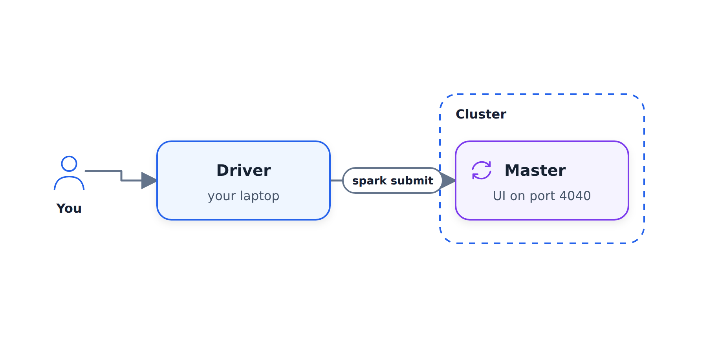
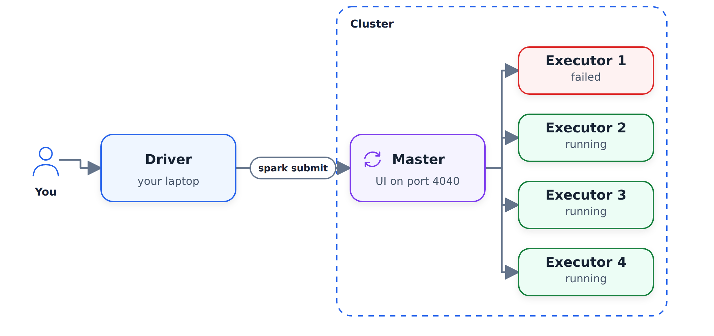
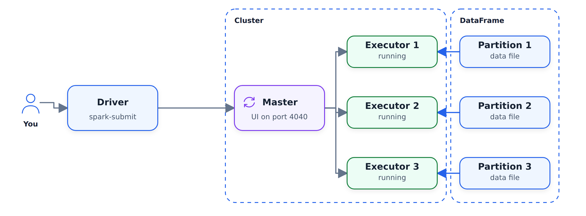
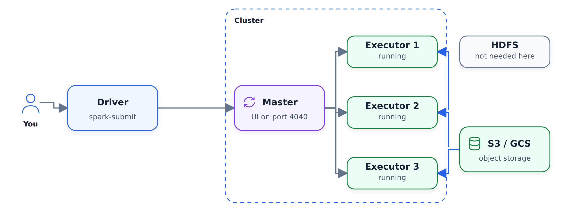

# Anatomy of a Spark Cluster

In this unit we look at what a real Spark cluster consists of: the driver
that submits the job, the master that coordinates the work, and the
executors that do the actual computation. So far we ran Spark locally, and
this is the picture behind the master URL and `spark-submit` that we will
use later in the module.

## Local setup

Everything we did so far was local: we had a local environment, and in this
environment our executor - the thing that executes Spark jobs - ran on the
same computer. This is called a local setup.

When we set up Spark, we specify the master:

```python
spark = SparkSession.builder \
    .master("local[*]") \
    .appName('test') \
    .getOrCreate()
```

`local[*]` means that we create a local cluster using all available cores.

## Driver, master and executors

With a real cluster the setup looks different. You create a script in
Python (or Scala, or Java) with some Spark code - usually from your laptop,
or from Airflow, if you use Airflow for scheduling Spark jobs.

The cluster has a computer that we call the Spark master. Its role is
coordination: it knows what jobs are running. The master has a web UI on
port 4040 - the same UI we opened at localhost:4040 when we ran Spark
locally. You can think of it as an entry point to the Spark cluster: you
connect to it and see what is actually being executed.

To send a package with our code to the master, we use a special command
called `spark-submit`. Along with the code we specify what kind of
resources we need for this job.

On the cluster we also have the computers that actually execute the jobs.
They are called executors. When we submit a job to the Spark master, it
coordinates between the executors: it decides which of them will work on
our job and sends them instructions.



The master needs to be up and running all the time. If one of the executors
goes away for whatever reason, the master knows about it and assigns the
tasks that this executor had to some other executor.



## How executors get the data

Imagine we have a DataFrame that consists of many partitions - as you
remember, a partition is nothing else but a parquet file. When we submit a
job, Spark sends some information to the executors, and each executor pulls
a partition, works through it, and marks the task as completed
successfully. Then it gets another task. This way the executors process the
partitions of the DataFrame one by one and save the results somewhere.



These days the DataFrames usually live in S3 or Google Cloud Storage.

## Why not HDFS

It was not always like this. Previously Hadoop and HDFS were pretty
popular. In Hadoop, the files of the data lake were stored on the
executors themselves, with some redundancy: for example, the same partition
could be stored on three different nodes, so if one node goes away, the
files are still preserved.

The idea behind Hadoop and HDFS: instead of downloading the data to the
machine, you download the code to the machine that already has the data.
This concept is called data locality. It made a lot of sense because the
files are typically quite large - say 100 MB per partition - while the code
is relatively small, say 10 MB. It is cheaper to send the code to the
executors that already have the data than to pull a lot of data over the
network.

These days, because of cloud providers, the Spark cluster and the cloud
storage usually live in the same data center. Downloading 100 MB for an
executor is very fast - a little bit slower than reading from local disk,
but not significantly slower. So instead of keeping the data on the
executors, they can just pull it from S3 or Google Cloud Storage, process
it, and save the results back to the data lake.



This is why Hadoop and HDFS became less popular: they add overhead, and the
preferred way now is simply keeping the files on S3. You don't need HDFS,
you don't need Hadoop - you just have a Spark cluster and your data in
cloud storage.

## Summary

- The driver is the thing that submits the job: an Airflow task that runs
  `spark-submit`, your laptop, or something else.
- The master is the thing that coordinates everything. Spark keeps track of
  which machines are healthy, and if some machine becomes unhealthy, it
  reassigns the work.
- Executors are the machines that do the actual computation.
- The data lives in cloud storage: we read from it and write the results
  back to it.
