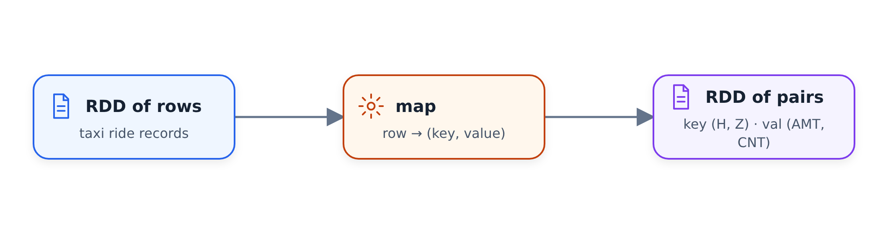

# Operations on Spark RDDs

In this (optional) unit we drop from DataFrames to RDDs - the lower-level
structure DataFrames are built on - and reimplement the green revenue query
with `filter`, `map` and `reduceByKey`. Most of the time you don't need
RDDs, but seeing them shows how things were done before DataFrames and how
group by works underneath.

## What is an RDD

RDD stands for resilient distributed dataset. It is very internal to Spark:
the first versions of Spark were built on RDDs, and DataFrames appeared
later as another layer of abstraction on top of them, with a nice API.

The difference: a DataFrame follows a specific structure - it has a schema.
An RDD is just a distributed collection of objects. Like a DataFrame, it is
partitioned, and each executor takes a partition and executes it - we saw
this already.

Let's create a notebook, start a local Spark session and read the green
data. Our goal is to express this query with RDD operations:

```sql
SELECT
    date_trunc('hour', lpep_pickup_datetime) AS hour,
    PULocationID AS zone,

    SUM(total_amount) AS amount,
    COUNT(1) AS number_records
FROM
    green
WHERE
    lpep_pickup_datetime >= '2020-01-01 00:00:00'
GROUP BY
    1, 2
```

## From DataFrame to RDD

A DataFrame has a field called `rdd` - the underlying RDD of rows. `Row`
is the special object used for building DataFrames:

```python
df_green.rdd.take(5)
```

This returns a list of rows, the same way `df_green.take(5)` does. Each row
has quite a lot of columns, and we only need three of them for this query -
we don't need the count, because it simply counts the records:

```python
rdd = df_green \
    .select('lpep_pickup_datetime', 'PULocationID', 'total_amount') \
    .rdd
```

## filter: the WHERE clause

The first RDD operation is `filter`. It takes a function that returns true
or false for every record, and keeps the records where the function returns
true. To see it in action:

```python
rdd.filter(lambda row: True).take(1)
```

This keeps everything. If instead the lambda returns `False` for every
record, we filter out the entire dataset and get an empty list.

For our query we want to discard the outliers from before 2020. Internally
Spark uses Python datetime objects, so we compare against a datetime:

```python
from datetime import datetime

start = datetime(year=2020, month=1, day=1)

def filter_outliers(row):
    return row.lpep_pickup_datetime >= start
```

Putting it in a named function is a good idea - lambdas can get messy
quite fast.

## map: preparing for grouping

Next we need the `GROUP BY` part. Remember how group by works: each
partition produces subresults - a key (hour, zone) with the intermediate
amount and count - and then those subresults are reduced.

To produce such intermediate records we use `map`. While `filter` decides
whether to keep a record, `map` is applied to every element of the RDD and
transforms it into something else: we put a row in and get some other
object out.



For grouping, the output needs to be a key/value pair. In our case the key
is the composite of hour and zone, and the value is the composite of amount
and count - where the count is simply 1 for every record, to be summed
later.

Let's experiment with one row before writing the function. We take the
first row of the RDD:

```python
rows = rdd.take(10)
row = rows[0]
```

which gives us

```text
Row(lpep_pickup_datetime=datetime.datetime(2020, 1, 16, 19, 49, 27),
    PULocationID=260, total_amount=14.3)
```

The hour is the pickup time truncated to the hour - which we can do with
`replace`, setting minute, second and microsecond to zero. The zone is
`PULocationID`. Now we can write the function:

```python
def prepare_for_grouping(row):
    hour = row.lpep_pickup_datetime.replace(minute=0, second=0, microsecond=0)
    zone = row.PULocationID
    key = (hour, zone)

    amount = row.total_amount
    count = 1
    value = (amount, count)

    return (key, value)
```

So each row becomes a tuple of two elements: the first element is itself a
tuple - the key - and the second is another tuple with the amount and the
count. Applying it to the RDD and doing `take` shows exactly this shape.

## reduceByKey: the aggregation

Now we need to combine the values that belong to the same key. The
operation is called `reduceByKey`. It takes an RDD of key/value pairs and
produces another one where each key appears only once - all the values of
that key are reduced into a single value.

The reduce function gets two values, left and right, and returns their
combination. Spark chains the calls: first it reduces the first two values
of a key, then it takes that output and reduces it together with the third
value, and so on - until everything that belongs to one key becomes one
value.

In our case we want to sum both the amounts and the counts, so the output
has to follow the same (amount, count) pattern:

```python
def calculate_revenue(left_value, right_value):
    left_amount, left_count = left_value
    right_amount, right_count = right_value

    output_amount = left_amount + right_amount
    output_count = left_count + right_count

    return (output_amount, output_count)
```

Putting it together and executing:

```python
rdd \
    .filter(filter_outliers) \
    .map(prepare_for_grouping) \
    .reduceByKey(calculate_revenue) \
    .take(5)
```

The result follows the same format as before - composite key, composite
value - except the value is now aggregated: the sum of all amounts, and the
sum of all the ones, which is the total number of records for this hour and
zone.

## Unwrapping back to a DataFrame

The nested structure is not nice, and we want a DataFrame back. So we do
one more `map` that flattens each record into a tuple of four elements:

```python
def unwrap(row):
    return (row[0][0], row[0][1], row[1][0], row[1][1])
```

If we call `toDF()` on it and `show()`, we get a DataFrame - but the column
names are gone (we see `_1`, `_2` and so on), and Spark had to figure out
the schema by going through the records.

To get the names back we can use a named tuple:

```python
from collections import namedtuple

RevenueRow = namedtuple('RevenueRow', ['hour', 'zone', 'revenue', 'count'])

def unwrap(row):
    return RevenueRow(
        hour=row[0][0],
        zone=row[0][1],
        revenue=row[1][0],
        count=row[1][1]
    )
```

With that, `toDF()` produces nicely named columns.

Spark still tries to infer the schema, though - you can see it doing
something before `show()`. To avoid that, we specify the schema up front:

```python
from pyspark.sql import types

result_schema = types.StructType([
    types.StructField('hour', types.TimestampType(), True),
    types.StructField('zone', types.IntegerType(), True),
    types.StructField('revenue', types.DoubleType(), True),
    types.StructField('count', types.IntegerType(), True)
])

df_result = rdd \
    .filter(filter_outliers) \
    .map(prepare_for_grouping) \
    .reduceByKey(calculate_revenue) \
    .map(unwrap) \
    .toDF(result_schema)
```

Now creating the DataFrame doesn't execute anything - it's `show()` (or
`write`) that triggers the computation. We save the result to parquet so we
can look at the execution graph.

## The execution graph

In the Spark UI the job has two stages - like the SQL version, even though
the plan boxes look a bit different because of our maps. The reason there
are two stages is `reduceByKey`: it needs the shuffle we know from the
group by unit.

The stable shape of that execution plan is:

| Part of the plan | Operations | Role |
|---|---|---|
| Before the shuffle | `filter` → `map` | Turn each row into a `(key, value)` pair in its input partition. |
| Shuffle boundary | `partitionBy` / shuffle by key | Send records with the same key to the same partition. |
| After the shuffle | `mapPartitions` / `reduceByKey` → `map` | Combine values for each key and unwrap the aggregate. |

The same flow as a tree:

```text
RDD rows
└── stage before shuffle
    ├── filter
    └── map -> (key, value)
        └── partitionBy / shuffle by key
            └── stage after shuffle
                ├── mapPartitions / reduceByKey
                └── map / unwrap
```

The map functions turn each record into a key/value pair, and all records
with the same key - from all partitions - must end up in the same partition
before they can be reduced into one.

And that's the whole recipe: the `WHERE` clause becomes `filter`, the
`SELECT` of the grouping key and the aggregated values becomes `map` into
key/value pairs, the `GROUP BY` with `SUM` and `COUNT` becomes
`reduceByKey`, and then we unwrap the result and turn it back into a
DataFrame. Usually we don't need to write code like this - we have
DataFrames and SQL - but it shows what happens underneath, and sometimes
the low-level operations are still useful (the next unit shows one such
case, `mapPartitions`).

## Materials

* [`code/08_rdds.ipynb`](code/08_rdds.ipynb) - the first half: dropping from a
  DataFrame to its RDD and rebuilding the green revenue report with `filter`,
  `map`, `reduceByKey` and an explicit result schema.
