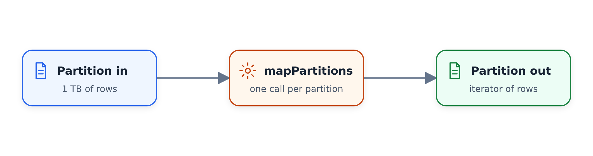

# Spark RDD mapPartition

In this unit we look at `mapPartitions`, an RDD transformation that
processes a whole partition at a time instead of one row at a time. We use
it to apply a machine learning model to the taxi data chunk by chunk. This
is the second optional unit on RDDs, and it continues in the notebook from
the previous unit: everything below lives in the second half of
[`code/08_rdds.ipynb`](code/08_rdds.ipynb).

## From map to mapPartitions

In the previous unit we used `map`: it takes one element of an RDD and
produces another element. `mapPartitions` works one level up. The input is
a partition - an entire chunk of the data - and the output is another
partition:



This is convenient when your function needs more than one row at a time.
Imagine a one-terabyte dataset that does not fit into the memory of any
machine you have. If the partitions are, say, 100 MB each, you can process
the dataset chunk by chunk: each partition fits in memory, and Spark
applies your function to one chunk after another.

Applying a machine learning model is the typical case. A model predicts
for a batch of rows at once, not row by row. So the plan is:

- Put the model call inside a `mapPartitions` function.
- Let Spark cut the big dataset into partitions.
- Apply the model to each partition.
- Combine the results and save them to a data lake.

## The example: predicting trip duration

For the example we go back to the green taxi dataset. Imagine we build a
service that predicts how long a trip will take. From the dataset we need
these columns:

- `VendorID` - some vendors may be faster than others.
- `lpep_pickup_datetime` - a trip that starts at midnight is probably
  faster than one that starts during rush hour.
- `PULocationID` and `DOLocationID` - the further apart the pickup and the
  drop-off are, the longer the trip takes.
- `trip_distance` - the longer the distance, the longer the trip.

We select the columns and look at the result:

```python
columns = ['VendorID', 'lpep_pickup_datetime', 'PULocationID',
           'DOLocationID', 'trip_distance']

df_green \
    .select(columns) \
    .show()
```

```text
VendorID | lpep_pickup_datetime | PULocationID | DOLocationID | trip_distance
2        | 2020-01-16 19:49:27  | 260          | 173          | 2.59
2        | 2020-01-19 01:55:32  | 181          | 211          | 6.25
2        | 2020-01-18 15:58:31  | 74           | 244          | 2.8
null     | 2020-01-03 09:37:00  | 51           | 185          | 2.55
2        | 2020-01-27 09:27:18  | 146          | 146          | 0.02
2        | 2020-01-14 09:33:35  | 129          | 226          | 2.21
2        | 2020-01-27 22:52:52  | 74           | 194          | 2.26
null     | 2020-01-19 07:35:00  | 51           | 116          | 10.0
2        | 2020-01-07 06:36:27  | 244          | 74           | 3.18
2        | 2020-01-17 21:06:51  | 66           | 132          | 1.22
2        | 2020-01-16 17:39:15  | 75           | 143          | 2.8
2        | 2020-01-24 22:33:24  | 75           | 74           | 3.07
2        | 2020-01-09 23:58:57  | 65           | 97           | 2.19
2        | 2020-01-17 08:48:46  | 95           | 135          | 2.31
null     | 2020-01-28 20:16:30  | 42           | 10           | 15.78
```

In practice, the pre-processing would happen in SQL, and by the time the
data reaches this point it would already contain only the prepared
information we want to feed to the model. That is already the case here.
Now we turn the DataFrame into an RDD:

```python
duration_rdd = df_green \
    .select(columns) \
    .rdd
```

## The first mapPartitions experiment

Before applying a real model, let us see what `mapPartitions` actually
does. We write a function that ignores its input and returns a list with a
single element:

```python
def apply_model_in_batch(partition):
    return [1]
```

Applying it and collecting the result gives a list of four ones:

The function ran once per partition, and the RDD has four partitions.
Spark then flattened the four one-element lists into one list. Note that
the function must return something iterable: if you return just `1`, Spark
fails with an error saying the int object is not iterable.

## Counting rows in each partition

Let us count how many rows each partition holds. One attempt would be
`len(partition)`, but that fails: a partition is not a Python list, it is
an iterator (of type `itertools.chain`). We cannot take its length, but we
can loop over it:

```python
def apply_model_in_batch(partition):
    cnt = 0
    for row in partition:
        cnt = cnt + 1
    return [cnt]

duration_rdd.mapPartitions(apply_model_in_batch).collect()
```

This takes a while, because Spark has to go through every record of every
partition:

The result is `[1141148, 436983, 433476, 292910]`. Our partitions are not
very balanced: the first one is three times larger than the next ones.
That is not great - the executor that gets the big partition will still be
working long after the others have finished, and they will have to wait.
To avoid this we could repartition the data, but repartitioning is an
expensive operation. This is something you learn to deal with in practice.

## From partitions to pandas DataFrames

Data scientists usually like pandas, and models usually expect a pandas
DataFrame, so let us turn each partition into one. First, what do the rows
look like? `duration_rdd.take(10)` returns a bunch of Row objects, and
feeding them to pandas works, but the columns get meaningless names:


We already have the column names in the `columns` variable, so we pass
them explicitly:

```python
import pandas as pd

def apply_model_in_batch(rows):
    df = pd.DataFrame(rows, columns=columns)
    cnt = len(df)
    return [cnt]
```

One caveat: `pd.DataFrame(rows)` materializes the entire partition in
memory, so the executor needs enough memory for it. If your partitions are
too big, you need to repartition or break them into smaller chunks - there
are Python packages that let you slice an iterator into sub-chunks of,
say, 100,000 rows and process them separately. We will not need that here.

While running this, we hit an error: five columns passed, but the data had
three columns. The reason is that the function was applied to the RDD from
the previous unit, which had only three columns, instead of
`duration_rdd`. With the right RDD it works, and we get the same four
partition counts as before.

## Adding predictions with a model

Now the machine learning part. The function that applies a model to a
DataFrame usually looks like this:

```python
def model_predict(df):
    y_pred = model.predict(df)
    return y_pred
```

We do not have a trained model here, so we pretend: our model estimates
five minutes of travel per mile:

```python
# model = ...

def model_predict(df):
    y_pred = df.trip_distance * 5
    return y_pred
```

The predictions come back as an array with one value per row of the
DataFrame. We put them into a new column:

```python
def apply_model_in_batch(rows):
    df = pd.DataFrame(rows, columns=columns)
    predictions = model_predict(df)
    df['predicted_duration'] = predictions
```

## Yielding the rows back

We cannot return the pandas DataFrame from `mapPartitions` - we need to
output the rows one by one. Pandas has `itertuples` for that: it returns
an iterator, and for each row it yields a tuple with the row values (plus
an index, which we can ignore for now).

```python
def apply_model_in_batch(rows):
    df = pd.DataFrame(rows, columns=columns)
    predictions = model_predict(df)
    df['predicted_duration'] = predictions

    for row in df.itertuples():
        yield row
```

If you have not seen `yield` before: a function with `yield` returns a
generator. A simple example is an infinite sequence of numbers:

```python
def infinite_seq():
    i = 0
    while True:
        yield i
        i = i + 1
```

Calling it does not run the loop - it gives you a generator object. Each
call to `next` produces the next value, and a `for` loop can consume it
the same way. This is exactly what Spark does with our function: it pulls
each yielded row into the resulting RDD, and in the end all the rows from
all the partitions are combined.

## Back to a Spark DataFrame

Let us run it. We do not `collect` - that would pull every prediction to
the driver - so we `take(10)` instead. Note that this still applies the
function to all partitions: Spark runs the whole job and only then takes
the first ten elements.

The rows come back as tuples, and we can turn them into a Spark DataFrame
and look at the predictions:

```python
df_predicts = duration_rdd \
    .mapPartitions(apply_model_in_batch) \
    .toDF() \
    .drop('Index')

df_predicts.select('predicted_duration').show()
```

We drop the `Index` column that `itertuples` added, and since we do not
specify a schema, Spark infers it:

For every row of our data we now have a predicted duration in minutes -
something we could show to a passenger who wants to know how long the
trip will take.

Of course, for this particular use case you would not use Spark: the
passenger wants the answer in real time, so in real life you would have a
web service that receives a request from the passenger's phone and replies
with the expected duration. The example is here to show how `mapPartitions`
is used in practice - chunk a big dataset, apply a model to each chunk,
combine the results. With this, our short section on Spark internals and
RDDs ends.

## Materials

* [`code/08_rdds.ipynb`](code/08_rdds.ipynb) - the second half: `mapPartitions`
  applying a model to each partition as a pandas DataFrame.
