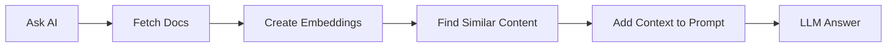

# AI Workflows and Agents

Welcome to the bonus module on AI Workflows and Agents! This module builds on what you learned in Module 2 (Workflow Orchestration) to show you how AI can accelerate workflow development and enable autonomous task automation.

> [!NOTE]  
> This is a bonus module. While not required for course completion, it introduces powerful concepts that can significantly improve your productivity as a data engineer.

---

# Module Structure

## Learning Objectives

By the end of this module, you will:
- Understand the importance of context engineering in AI applications
- Use AI Copilot to build Kestra flows faster and more accurately
- Implement Retrieval Augmented Generation (RAG) to ground AI responses in real data
- Build autonomous AI agents that can make decisions and use tools dynamically
- Design multi-agent systems where specialized agents collaborate to solve complex tasks
- Apply best practices for using AI in production data workflows

## Prerequisites

- Completion of Module 2 (Workflow Orchestration with Kestra)
- Kestra running locally (from Module 2 setup)
- Google Cloud account with access to Gemini API
- Basic understanding of YAML and workflow concepts

---

## 1. Introduction: Why AI for Workflows?

As data engineers, we spend significant time writing boilerplate code, searching documentation, and structuring data pipelines. AI tools can help us:

- **Generate workflows faster**: Describe what you want in natural language instead of writing YAML from scratch
- **Avoid errors**: Get syntax-correct, up-to-date code that follows best practices
- **Automate complex decisions**: Let AI agents dynamically orchestrate tasks based on changing conditions
- **Ground responses in data**: Use RAG to ensure AI provides accurate, contextual information

However, AI is only as good as the context we provide. This module teaches you how to engineer that context for reliable, production-ready workflows.

### What Makes This Different from AI Assistants?

Traditional AI assistants (like ChatGPT or Gemini in a browser) don't have context about:
- Your codebase and workflow patterns
- Real-time data from your systems
- Latest documentation and best practices

By integrating AI directly into Kestra and using techniques like RAG and specialized agents, we can provide this context and get much better results.

---

## 2. Context Engineering with ChatGPT

Let's start by seeing what happens when AI lacks proper context.

### Experiment: ChatGPT Without Context

1. **Open ChatGPT in a private browser window** (to avoid any existing chat context): https://chatgpt.com

2. **Enter this prompt:**
   ```
   Create a Kestra flow that loads NYC taxi data from a CSV file to BigQuery. The flow should extract data, upload to GCS, and load to BigQuery.
   ```

3. **Observe the results:**
   - ChatGPT will generate a Kestra flow, but it likely contains:
     - **Outdated plugin syntax** (e.g., old task types that have been renamed)
     - **Incorrect property names** (e.g., properties that don't exist in current versions)
     - **Hallucinated features** (e.g., tasks, triggers or properties that never existed)

### Why Does This Happen?

Large Language Models (LLMs) like GPT models from OpenAI are trained on data up to a specific point in time (knowledge cutoff). They don't automatically know about:
- Software updates and new releases
- Renamed plugins or changed APIs
- New best practices in your organization
- Specific configurations for your infrastructure

This is the fundamental challenge of using AI: **the model can only work with information it has access to.**

### Key Learning: Context is Everything

Without proper context:
- ❌ Generic AI assistants hallucinate outdated or incorrect code
- ❌ You can't trust the output for production use

With proper context:
- ✅ AI generates accurate, current, production-ready code
- ✅ You can iterate faster and focus on business logic

In the next section, we'll see how Kestra's AI Copilot solves this problem.

---

## 3. AI Copilot in Kestra

Kestra's AI Copilot is specifically designed to generate and modify Kestra flows with full context about the latest plugins, syntax, and best practices.

### Setup AI Copilot

Before using AI Copilot, you need to configure Gemini API access in your Kestra instance.

#### Step 1: Get Your Gemini API Key

1. Visit Google AI Studio: https://aistudio.google.com/app/apikey
2. Sign in with your Google account
3. Click "Create API Key"
4. Copy the generated key (keep it secure!)

> [!WARNING]  
> Never commit API keys to Git. Always use environment variables or Kestra's KV Store.

#### Step 2: Configure Kestra

Add the following to your Kestra configuration. You can do this by modifying your `docker-compose.yml` file from Module 2:

```yaml
services:
  kestra:
    environment:
      KESTRA_CONFIGURATION: |
        kestra:
          ai:
            type: gemini
            gemini:
              model-name: gemini-2.5-flash
              api-key: ${GEMINI_API_KEY}
```

Then restart Kestra:
```bash
cd 02-workflow-orchestration/docker/combined
export GEMINI_API_KEY="your-api-key-here"
docker compose up -d
```

Alternatively, you can store the API key in Kestra's KV Store for better security.

#### Step 3: Access AI Copilot

1. Open Kestra UI: http://localhost:8080
2. Create a new flow or open an existing one
3. Look for the **AI Copilot** button (sparkle icon ✨) in the top-right corner of the Flow Editor

### Hands-On: Compare Copilot vs. Raw ChatGPT

Now let's use the same prompt from Section 2, but with AI Copilot:

1. **Click the AI Copilot button** in Kestra's Flow Editor
2. **Enter the same prompt:**
   ```
   Create a Kestra flow that loads NYC taxi data from a CSV file to BigQuery. The flow should extract data, upload to GCS, and load to BigQuery.
   ```
3. **Observe the results:**
   - ✅ Correct, up-to-date plugin types 
   - ✅ Valid property names and configurations
   - ✅ Working, executable YAML

### Why Does Copilot Work Better?

Kestra's AI Copilot has access to:
- **Current plugin documentation**: All available plugins and their exact syntax
- **Flow context**: If you're editing an existing flow, it knows what's already there
- **Best practices**: Patterns and configurations recommended by Kestra
- **Version-specific details**: Exact task types, properties, and requirements for your Kestra version

This is **context engineering** in action: by giving the AI the right context, we get reliable, production-ready results.

### Iterative Refinement with Copilot

AI Copilot helps with both creating new flows and refining existing ones.

**Example conversation with Copilot:**

1. **You:** "Create a flow that downloads a CSV file and loads it to BigQuery"
   - Copilot generates basic flow

2. **You:** "Add a task that checks data quality of the data in BigQuery"
   - Copilot adds a data quality validation task with SQL queries to verify record counts, null checks, and data freshness

3. **You:** "Schedule the flow to run daily at 9 AM UTC"
   - Copilot adds a `Schedule` trigger

4. **You:** "Send a Slack notification if it fails"
   - Copilot adds a `SlackIncomingWebhook` task in an `errors` branch

Each iteration preserves the existing flow structure and only modifies what's needed. You're collaborating with AI, not starting from scratch each time.

### Example Use Cases for AI Copilot

- **Generate new flows**: "Create a flow that syncs data from Postgres to GCS"
- **Add tasks**: "Add an If-task performing conditional branching to determine whether to run a given list of tasks"
- **Configure triggers**: "Add a webhook trigger"
- **Add error handling**: "Add retry logic with exponential backoff"

---

## 4. Retrieval Augmented Generation (RAG)

Now let's explore how to provide dynamic context to AI using Retrieval Augmented Generation (RAG).

### What is RAG?

**RAG (Retrieval Augmented Generation)** is a technique that:
1. **Retrieves** relevant information from your data sources
2. **Augments** the AI prompt with this context
3. **Generates** a response grounded in real data

This solves the hallucination problem by ensuring the AI has access to current, accurate information at query time.

### How RAG Works in Kestra



**The Process:**
1. **Ingest documents**: Load documentation, release notes, or other data sources
2. **Create embeddings**: Convert text into vector representations using an LLM
3. **Store embeddings**: Save vectors in Kestra's KV Store (or a vector database)
4. **Query with context**: When you ask a question, retrieve relevant embeddings and include them in the prompt
5. **Generate response**: The LLM has real context and provides accurate answers

### RAG Example: Kestra Release Features

Let's demonstrate RAG with a practical example: asking about features in a specific Kestra release.

#### Step 1: Without RAG (The Problem)

Flow: [`1_chat_without_rag.yaml`](flows/1_chat_without_rag.yaml)

This flow asks Gemini: **"Which features were released in Kestra 1.1?"**

Without RAG, the model might:
- Hallucinate features that don't exist
- Provide outdated information
- Miss important features
- Give vague or generic answers

**Try it yourself:**
1. Import and run `1_chat_without_rag.yaml`
2. Check the output—notice it may be incorrect or vague

#### Step 2: With RAG (The Solution)

Flow: [`2_chat_with_rag.yaml`](flows/2_chat_with_rag.yaml)

This flow:
1. **Ingests** Kestra 1.1 release notes from GitHub
2. **Creates embeddings** using Gemini's embedding model
3. **Stores** embeddings in Kestra KV Store
4. **Queries** with RAG enabled, asking the same question
5. **Returns** accurate, detailed features from the actual release notes

**Try it yourself:**
1. Import and run `1_chat_without_rag.yaml`
2. Import and run `2_chat_with_rag.yaml` and compare the output with `1_chat_without_rag.yaml`
3. Notice the difference in accuracy and detail

### RAG Use Cases in Data Engineering

- **Documentation Q&A**: Answer questions about internal data pipelines
- **Data catalog**: Query metadata about tables, columns, and lineage
- **Compliance checks**: Verify data handling against policy documents
- **Onboarding**: Help new team members understand existing workflows

### RAG Best Practices

1. **Keep documents updated**: Regularly re-ingest to ensure current information
2. **Chunk appropriately**: Break large documents into meaningful sections
3. **Use quality embeddings**: Choose embedding models suited to your content
4. **Test retrieval quality**: Verify that the right documents are retrieved
5. **Consider costs**: Embedding and storage have costs, so balance accuracy vs. budget

---

## 5. AI Agents: Autonomous Task Execution

While AI Copilot helps you *build* workflows faster, AI Agents help you *run* workflows that can make autonomous decisions.

### What is an AI Agent?

An **AI Agent** is an autonomous system that:
- Uses an LLM to reason and make decisions
- Has access to tools (web search, task execution, etc.)
- Can remember context across executions (with memory)
- Dynamically decides which actions to take and in what order

**Traditional Workflow:** → Fixed sequence, predetermined logic

```yaml
tasks:
  - id: step1
    type: Task1
  - id: step2
    type: Task2
  - id: step3
    type: Task3
```


**AI Agent Workflow:** → Agent decides what to do, in what order, based on the goal

```yaml
tasks:
  - id: agent
    type: io.kestra.plugin.ai.agent.AIAgent
    prompt: "Research data engineering trends and create a report"
    tools:
      - WebSearch
      - TaskExecution
```

### When to Use AI Agents

**Use AI Agents when:**
- ✅ The exact sequence of steps isn't known in advance
- ✅ Decisions depend on dynamic, changing information
- ✅ You need to adapt to unexpected conditions
- ✅ Human-like reasoning and judgment are valuable

**Use Traditional Workflows when:**
- ✅ Steps are deterministic and repeatable
- ✅ Compliance requires exact, auditable processes
- ✅ Cost and latency must be minimized
- ✅ Predictability is more important than flexibility

### Anatomy of an AI Agent

```yaml
id: example_agent
namespace: zoomcamp

tasks:
  - id: agent
    type: io.kestra.plugin.ai.agent.AIAgent
    
    # Defines the agent's role and behavior
    systemMessage: |
      You are a data analyst. Analyze data and provide insights.
    
    # The actual task or question
    prompt: "What are the top 3 trends in this data?"
    
    # LLM provider configuration
    provider:
      type: io.kestra.plugin.ai.provider.GoogleGemini
      modelName: gemini-2.5-flash
      apiKey: "{{ kv('GEMINI_API_KEY') }}"
    
    # Tools the agent can use
    tools:
      - type: io.kestra.plugin.ai.tool.TavilyWebSearch
        apiKey: "{{ kv('TAVILY_API_KEY') }}"
    
    # Memory for context across executions
    memory:
      type: io.kestra.plugin.ai.memory.KestraKVStore
      memoryId: analyst_001
```

### Simple Agent Example

Flow: [`3_simple_agent.yaml`](flows/3_simple_agent.yaml)

This flow demonstrates a basic AI agent that summarizes text with controllable length and language:

**Features:**
- Inputs for summary length (short/medium/long) and language
- System message defining the agent's role
- Two agent tasks demonstrating sequential execution
- Token usage tracking for cost monitoring

**What you'll learn:**
- How to structure agent prompts
- How to chain agent tasks
- How to use `pluginDefaults` to avoid repetition
- How to observe token usage

### Advanced Agent Example: Web Research

Flow: [`4_web_research_agent.yaml`](flows/4_web_research_agent.yaml)

This flow demonstrates an agent with autonomous tool usage:

**What the agent does:**
1. Receives a research prompt (e.g., "Latest trends in workflow orchestration")
2. Decides to use the web search tool to gather information
3. Evaluates search results and determines if more searches are needed
4. Synthesizes findings into a structured markdown report
5. Saves the report to a file using the filesystem tool

**Key concepts:**
- The agent autonomously decides when to use tools
- It can loop (search → evaluate → search again) until satisfied
- You only specify the goal, not the exact steps
- The agent handles errors and adapts to what it finds

**What you'll learn:**
- How agents use tools dynamically
- How to mount volumes for file output
- How to guide agent behavior with system messages
- Trade-offs between autonomy and control

### Agent Tools Available in Kestra

| Tool | Purpose | Example Use |
|------|---------|-------------|
| `TavilyWebSearch` | Search the web for current information | Market research, news monitoring |
| `GoogleCustomWebSearch` | Search with Google Custom Search API | Google search |
| `CodeExecution` | Run code safely via Judge0 | Math calculations, data validation |
| `KestraTask` | Execute any Kestra task | Run tasks based on +1000 Kestra plugins, e.g. query databases |
| `KestraFlow` | Trigger other Kestra flows | Call other flows, great for modularity |
| `StreamableHttpMcpClient` | Use MCP servers via HTTP/SSE | Connect to remote MCP servers |
| `DockerMcpClient` | Use MCP servers in Docker | Connect to MCP servers spun up on-demand via Docker e.g. for file operations and custom tools |
| `StdioMcpClient` | Use MCP servers via stdio | Integration with external systems via a local process |
| `AIAgent` | Use another agent as a tool | Multi-agent systems, specialized sub-agents |

### Agent Observability

Kestra provides full observability for agent executions:

- **Token usage**: Track input/output tokens for cost monitoring
- **Tool calls**: See which tools were called and with what parameters
- **Logs**: View agent reasoning and decisions
- **Outputs**: Access structured outputs and files
- **Execution time**: Monitor performance

Enable detailed logging:
```yaml
provider:
  type: io.kestra.plugin.ai.provider.GoogleGemini
  modelName: gemini-2.5-flash
  apiKey: "{{ kv('GEMINI_API_KEY') }}"
  configuration:
    logRequests: true
    logResponses: true
```

---

## 6. Multi-Agent Systems

For complex tasks, you can design systems where multiple specialized agents collaborate.

### What is a Multi-Agent System?

A **Multi-Agent System** involves:
- **Multiple agents** with different specializations
- **Coordination** between agents (one agent uses another as a tool)
- **Modular design** where each agent has a clear responsibility
- **Emergent behavior** from agent collaboration

### Why Use Multiple Agents?

**Benefits:**
- **Separation of concerns**: Each agent focuses on one thing
- **Reusability**: Agents can be tools for different parent agents
- **Debugging**: Easier to isolate issues in specific agents
- **Scalability**: Add new agents without changing existing ones

**Example: Competitive Intelligence System**
```
Main Agent (Analyst)
  ├─> Research Agent (gathers web data)
  │     └─> Uses Tavily web search
  ├─> Analysis Agent (synthesizes findings)
  └─> Report Agent (formats output)
```

### Multi-Agent Example: Company Research

Flow: [`5_multi_agent_research.yaml`](flows/5_multi_agent_research.yaml)

This flow demonstrates a two-agent system for competitive intelligence:

**Agent 1: Research Agent (Tool)**
- Specialization: Web research and data gathering
- Tools: Tavily web search
- Responsibility: Find factual, current information

**Agent 2: Main Analyst Agent**
- Specialization: Analysis and synthesis
- Tools: Research agent (used as a tool)
- Responsibility: Create structured reports

**How it works:**

1. **Input**: Company name (e.g., "kestra.io")

2. **Main agent receives prompt**: "Research this company"

3. **Main agent calls research agent tool**: "Find information about kestra.io"

4. **Research agent searches the web**: Uses Tavily to gather data

5. **Research agent returns findings**: Raw data about the company

6. **Main agent synthesizes**: Structures findings into JSON:
   ```json
   {
     "company": "Kestra",
     "summary": "Open-source orchestration platform...",
     "recent_news": [
       {
         "title": "Kestra 1.0 — Declarative Orchestration with AI Agents and Copilot",
         "date": "2025-09-09",
         "description": "Kestra 1.0 delivers Declarative Orchestration as Code and from the UI. With AI Copilot and custom AI Agents, this LTS release sets the foundation for agentic automation."
       }
     ],
     "competitors": ["Airflow", "Prefect", "Temporal"]
   }
   ```

**What you'll learn:**
- How to use agents as tools for other agents
- How to structure multi-agent systems
- How to get structured JSON output
- When to break tasks into multiple agents

### Best Practices for Multi-Agent Systems

1. **Define clear responsibilities**: Each agent should have a specific role
2. **Minimize inter-agent communication**: Reduce complexity and cost
3. **Use structured output**: JSON or typed schemas for passing data
4. **Monitor token usage**: Multiple agents = multiple LLM calls
5. **Test agents independently**: Verify each agent works before combining
6. **Document agent purposes**: Make the system maintainable

---

## 7. Getting Started

Ready to run the examples? Here's how to set up everything you need.

### Step 1: Ensure Kestra is Running

From Module 2, you should have Kestra running. 

If not running, start it:
```bash
cd 02-workflow-orchestration/docker/combined
docker compose up -d
```

### Step 2: Obtain API Keys

#### Gemini API Key (Required)

1. Visit: https://aistudio.google.com/app/apikey
2. Sign in with your Google account
3. Click "Create API Key"
4. Copy your key

**Free Tier:** Generous quota suitable for learning (rate limits apply)

#### Tavily API Key (Optional, for web search examples)

1. Visit: https://tavily.com/
2. Sign up for free tier
3. Get API key from dashboard

**Free Tier:** 1,000 searches/month

### Step 3: Configure API Keys in Kestra

Store your API keys securely using Kestra's KV Store via the UI:

1. **Navigate to KV Store**:
   - In Kestra UI, click on **KV Store** in the left sidebar
   - Click **New Key-Value** button in the top right

2. **Add your Gemini API key**:
   - **Namespace**: `zoomcamp`
   - **Key**: `GEMINI_API_KEY`
   - **Type**: Select `STRING` from dropdown
   - **Value**: `your-gemini-api-key-here`
   - Click **Save**

3. **Add your Tavily API key** (for agent examples):
   - Click **New Key-Value** again
   - **Namespace**: `zoomcamp`
   - **Key**: `TAVILY_API_KEY`
   - **Type**: Select `STRING` from dropdown
   - **Value**: `your-tavily-api-key-here`
   - Click **Save**

> [!WARNING]  
> Never commit API keys to Git! Always use Kestra's KV Store (OSS) or Secrets (Enterprise) to store sensitive credentials.

### Step 4: Import Example Flows

```bash
cd 07-ai-workflows

# Import flows: assuming username admin@kestra.io and password Admin1234 (adjust to match your username and password)
curl -X POST -u 'admin@kestra.io:Admin1234' http://localhost:8080/api/v1/flows/import -F fileUpload=@flows/1_chat_without_rag.yaml
curl -X POST -u 'admin@kestra.io:Admin1234' http://localhost:8080/api/v1/flows/import -F fileUpload=@flows/2_chat_with_rag.yaml
curl -X POST -u 'admin@kestra.io:Admin1234' http://localhost:8080/api/v1/flows/import -F fileUpload=@flows/3_simple_agent.yaml
curl -X POST -u 'admin@kestra.io:Admin1234' http://localhost:8080/api/v1/flows/import -F fileUpload=@flows/4_web_research_agent.yaml
curl -X POST -u 'admin@kestra.io:Admin1234' http://localhost:8080/api/v1/flows/import -F fileUpload=@flows/5_multi_agent_research.yaml
```

Alternatively, copy-paste the flow YAML directly into Kestra's UI.

### Step 5: Configure AI Copilot (Optional)

To enable AI Copilot in the UI, edit your `docker-compose.yml`:

```yaml
services:
  kestra:
    environment:
      KESTRA_CONFIGURATION: |
        kestra:
          ai:
            type: gemini
            gemini:
              model-name: gemini-2.5-flash
              api-key: ${GEMINI_API_KEY}
```

Then restart Kestra:

```bash
cd 02-workflow-orchestration/docker/combined
docker compose up -d
```

### Step 6: Run Your First Agent

1. Open Kestra UI: http://localhost:8080
2. Navigate to `zoomcamp` namespace
3. Find `3_simple_agent` flow
4. Click "Execute"
5. Leave default inputs or customize
6. Watch the execution and review outputs

---

## 8. Best Practices

### When to Use What

| Scenario | Use This | Why |
|----------|----------|-----|
| Building/modifying flows | AI Copilot | Fastest way to generate correct YAML |
| Answering questions about your data | RAG | Grounds responses in real data |
| Fixed, repeatable ETL pipelines | Traditional workflows | Deterministic, predictable, compliant |
| Research and analysis tasks | AI Agents | Can adapt to findings and make decisions |
| Complex, multi-step objectives | Multi-agent systems | Modular, maintainable, specialized |

### Cost Considerations

AI features use LLM APIs, which have costs based on token usage:

**Gemini 2.5 Flash Pricing (as of 2025):**
- **Free Tier**: Free for both input and output (with rate limits)
- **Paid Tier** (per 1M tokens):
  - Input tokens: $0.30
  - Output tokens: $2.50

**Cost-Saving Tips:**
1. Start with the **free tier** for learning and development
2. Use smaller/cheaper models for simple tasks - check the pricing page: https://ai.google.dev/gemini-api/docs/pricing
3. Set `maxOutputTokens` to limit response size
4. Monitor token usage in execution outputs
5. Use traditional workflows when determinism is needed

**Example calculation** (assuming paid tier):
- Simple agent execution: ~1,000 input + 500 output tokens = $0.0013
- RAG query with documents: ~5,000 input + 1,000 output tokens = $0.004
- Multi-agent research: ~15,000 input + 5,000 output tokens = $0.017

For a data engineering team running 100 AI-assisted tasks per day:
- Daily cost: ~$0.40
- Monthly cost: ~$12
- **Still very affordable for the productivity gains!**

### Security Best Practices

1. **Never commit API keys to Git**
   ```yaml
   # ❌ WRONG
   apiKey: "sk-abc123def456"
   
   # ✅ CORRECT
   apiKey: "{{ kv('GEMINI_API_KEY') }}"
   ```

2. **Use namespaced KV Store**
   - Store keys in the namespace of your flows
   - Limits access scope

3. **Rotate keys regularly**
   - Change API keys every 90 days
   - Use key versioning

4. **Monitor usage**
   - Set up alerts for unusual API usage
   - Review token consumption regularly

5. **Limit agent permissions**
   - Only give agents the tools they need
   - Use least-privilege principle

### Observability and Debugging

**Enable detailed logging:**
```yaml
provider:
  configuration:
    logRequests: true
    logResponses: true
```

**What to monitor:**
- Token usage per execution
- Agent tool calls and decisions
- Execution time and costs
- Error rates and types
- Output quality metrics

**Debugging tips:**
1. Start with simple prompts and iterate
2. Check logs for LLM reasoning
3. Verify tool outputs separately
4. Test agents in isolation before combining
5. Use structured output formats for validation

### Production Readiness

**Before deploying AI workflows to production:**

1. **Test thoroughly**
   - Run multiple times with different inputs
   - Verify outputs are consistent and accurate
   - Test error scenarios

2. **Add fallbacks**
   - Handle API failures gracefully
   - Provide default behaviors
   - Implement retry logic

3. **Set limits**
   - Maximum tokens per execution
   - Timeout values
   - Cost budgets

4. **Document behavior**
   - Explain what the agent does
   - List expected outputs
   - Document edge cases

5. **Monitor in production**
   - Track success rates
   - Monitor costs
   - Review outputs periodically

---

## 9. Additional Resources

### Kestra Documentation

- [AI Tools Overview](https://kestra.io/docs/ai-tools)
- [AI Copilot](https://kestra.io/docs/ai-tools/ai-copilot)
- [AI Agents](https://kestra.io/docs/ai-tools/ai-agents)
- [RAG Workflows](https://kestra.io/docs/ai-tools/ai-rag-workflows)
- [AI Workflows](https://kestra.io/docs/ai-tools/ai-workflows)

### Plugin Documentation

- [AI Plugin](https://kestra.io/plugins/plugin-ai)
- [AI Agent Task](https://kestra.io/plugins/plugin-ai/agent)
- [RAG Tasks](https://kestra.io/plugins/plugin-ai/rag)

### Provider Documentation

- [Google Gemini](https://ai.google.dev/docs)
- [Google AI Studio](https://aistudio.google.com/)
- [Tavily Web Search](https://docs.tavily.com/)

### Community

- [Kestra Slack](https://kestra.io/slack) - Join the community for help and discussions
- [Kestra GitHub](https://github.com/kestra-io/kestra) - Report issues, contribute and give us a star ⭐
- [Kestra Blueprints](https://kestra.io/blueprints) - Pre-built workflow examples

---

## Homework

Complete the hands-on assignment to test your understanding of AI workflows and agents.

See: [Module 7 Homework](../cohorts/2025/07-ai-workflows/homework.md)

---

## Community Notes

Did you take notes? Share them here by creating a PR!

- Add your notes above this line

---

## Next Steps

Congratulations on completing the AI Workflows module! You now have powerful tools to:
- Generate workflows faster with AI Copilot
- Ground AI responses in real data with RAG
- Build autonomous agents for complex tasks
- Design multi-agent systems for specialized workflows

**Continue learning:**
- Experiment with different LLM providers
- Build custom agents for your data pipelines
- Integrate AI into your Module 2 workflows
- Share your learnings with the community

**Join the conversation:**
- Share your agent experiments in the Slack channel
- Help others troubleshoot AI workflows
- Suggest new AI use cases for data engineering

Happy orchestrating! 🚀

