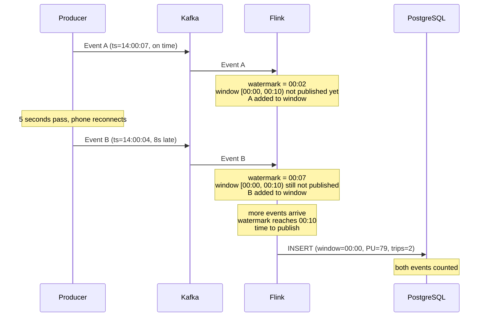
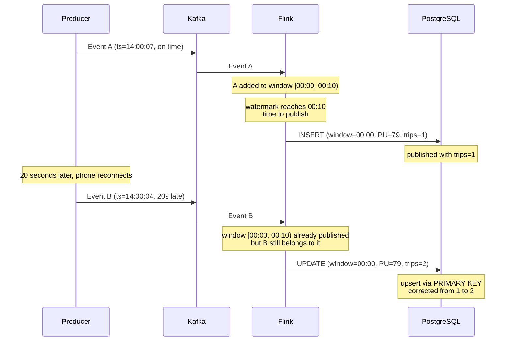

# Aggregation with tumbling windows

Now let's do something our plain Python consumer can't easily do - windowed
aggregation. We'll count taxi trips and sum revenue by pickup location per hour.

First, cancel any running jobs. Then create the aggregation table in PostgreSQL:

```sql
CREATE TABLE processed_events_aggregated (
    window_start TIMESTAMP,
    PULocationID INTEGER,
    num_trips BIGINT,
    total_revenue DOUBLE PRECISION,
    PRIMARY KEY (window_start, PULocationID)
);
```

Two important design choices:

1. `PULocationID` is included - we group by both time window and pickup
   location, so both appear in the output.
2. `PRIMARY KEY` - enables upsert behavior. When Flink sends updated counts
   for the same window, PostgreSQL updates the existing row instead of creating
   a duplicate. This matters because late-arriving events can cause Flink to
   re-evaluate a window it already emitted results for. With upsert, the
   corrected count replaces the old one automatically.

Now create `src/job/aggregation_job.py`:

```python
from pyflink.datastream import StreamExecutionEnvironment
from pyflink.table import EnvironmentSettings, StreamTableEnvironment

def create_events_source_kafka(t_env):
    table_name = "events"
    source_ddl = f"""
        CREATE TABLE {table_name} (
            PULocationID INTEGER,
            DOLocationID INTEGER,
            trip_distance DOUBLE,
            total_amount DOUBLE,
            tpep_pickup_datetime BIGINT,
            event_timestamp AS TO_TIMESTAMP_LTZ(tpep_pickup_datetime, 3),
            WATERMARK for event_timestamp as event_timestamp - INTERVAL '5' SECOND
        ) WITH (
            'connector' = 'kafka',
            'properties.bootstrap.servers' = 'redpanda:29092',
            'topic' = 'rides',
            'scan.startup.mode' = 'earliest-offset',
            'properties.auto.offset.reset' = 'earliest',
            'format' = 'json'
        );
        """
    t_env.execute_sql(source_ddl)
    return table_name

def create_events_aggregated_sink(t_env):
    table_name = 'processed_events_aggregated'
    sink_ddl = f"""
        CREATE TABLE {table_name} (
            window_start TIMESTAMP(3),
            PULocationID INT,
            num_trips BIGINT,
            total_revenue DOUBLE,
            PRIMARY KEY (window_start, PULocationID) NOT ENFORCED
        ) WITH (
            'connector' = 'jdbc',
            'url' = 'jdbc:postgresql://postgres:5432/postgres',
            'table-name' = '{table_name}',
            'username' = 'postgres',
            'password' = 'postgres',
            'driver' = 'org.postgresql.Driver'
        );
        """
    t_env.execute_sql(sink_ddl)
    return table_name

def log_aggregation():
    env = StreamExecutionEnvironment.get_execution_environment()
    env.enable_checkpointing(10 * 1000)
    env.set_parallelism(3)

    settings = EnvironmentSettings.new_instance().in_streaming_mode().build()
    t_env = StreamTableEnvironment.create(env, environment_settings=settings)

    try:
        source_table = create_events_source_kafka(t_env)
        aggregated_table = create_events_aggregated_sink(t_env)

        t_env.execute_sql(f"""
        INSERT INTO {aggregated_table}
        SELECT
            window_start,
            PULocationID,
            COUNT(*) AS num_trips,
            SUM(total_amount) AS total_revenue
        FROM TABLE(
            TUMBLE(TABLE {source_table}, DESCRIPTOR(event_timestamp), INTERVAL '1' HOUR)
        )
        GROUP BY window_start, PULocationID;

        """).wait()

    except Exception as e:
        print("Writing records from Kafka to JDBC failed:", str(e))

if __name__ == '__main__':
    log_aggregation()
```

The Kafka source table has two new lines compared to the pass-through job:

- `event_timestamp AS TO_TIMESTAMP_LTZ(tpep_pickup_datetime, 3)` - a computed
  column that converts epoch milliseconds to a timestamp. The `3` means
  milliseconds precision.
- `WATERMARK for event_timestamp as event_timestamp - INTERVAL '5' SECOND` -
  tells Flink when to publish window results.

The window defines WHAT you're counting - a 1-hour bucket of taxi trips.
But in a stream, events keep arriving. How does Flink know when to stop
waiting and publish the count for the 2 PM - 3 PM hour? It can't just
look at the clock because some events arrive late. Without a trigger,
Flink would accumulate data forever and never write anything to PostgreSQL.

The watermark is that trigger. It tells Flink when to publish. In the SQL:

```
WATERMARK FOR event_timestamp AS event_timestamp - INTERVAL '5' SECOND
                                                   ^^^^^^^^^^^^^^^^^^^
                                                   patience = 5 seconds
```

The watermark is always 5 seconds behind the latest event timestamp Flink
has seen. When the watermark passes the end of a window, Flink publishes
that window's results. The 5 seconds is patience for stragglers - events
that happened before the window ended but arrived a few seconds late.

Three pieces working together:

- Window = what bucket to count into (1 hour)
- Watermark = when to publish the result (the trigger)
- Upsert (PRIMARY KEY) = safety net that corrects the result if something
  arrives after publishing

Here's a concrete example. Two taxi pickups in East Village (PU=79) with
a 10-second window and 5-second watermark. Event A is on time, Event B is
8 seconds late (the rider's phone lost signal in a tunnel).

Event B arrives late, but Flink hasn't published yet - both events counted:



Event B arrived late, but within Flink's patience window. Flink hadn't
published the result yet, so B was included in the count.

Now what if Event B were 20 seconds late - arriving after Flink already
published?



Flink already published trips=1, but when Event B finally arrives, the
PRIMARY KEY lets Flink send a correction. PostgreSQL updates the row
from 1 to 2. Without the PRIMARY KEY (an append-only sink), Event B
would be lost - Flink can't re-open a published window in append mode.

The trade-off is latency vs completeness. A larger watermark means more
patience for late events, but you wait longer before seeing any results.
5 seconds is a reasonable default. In production, you'd tune this based
on how out-of-order your data actually is.

Other differences from the pass-through job:

- The sink has a `PRIMARY KEY` with `NOT ENFORCED` - this enables upsert
  behavior in the Flink JDBC connector.
- `earliest-offset` - reads all existing data from Kafka.
- `env.set_parallelism(3)` - runs 3 copies processing data in parallel.
- The `TUMBLE` function creates fixed-size, non-overlapping windows.
  `DESCRIPTOR(event_timestamp)` must reference the column with the `WATERMARK`
  defined on it, and `INTERVAL '1' HOUR` sets the window size.

Submit and test:

```bash
docker compose exec jobmanager ./bin/flink run \
    -py /opt/src/job/aggregation_job.py \
    --pyFiles /opt/src -d
```

Send data:

```bash
uv run python src/producers/producer.py
```

Wait ~15 seconds for the windows to close, then check:

```sql
SELECT window_start, count(*) as locations, sum(num_trips) as total_trips,
       round(sum(total_revenue)::numeric, 2) as revenue
FROM processed_events_aggregated
GROUP BY window_start
ORDER BY window_start;
```

```
     window_start     | locations | total_trips | revenue
----------------------+-----------+-------------+---------
 2025-11-01 00:00:00  |        ...
 2025-11-01 01:00:00  |        ...
 ...
```

The 1000 taxi trips were grouped into 1-hour tumbling windows by pickup
location. Each row shows how many locations had trips in that hour and the
total number of trips.

Try this with a plain Python consumer - you'd need to implement the windowing
logic, handle late events, manage state, and write the upsert SQL yourself.
With Flink, it's a SQL query.
