# Kafka theory (optional)

Video lectures covering Kafka concepts, with code examples in Java.

Code: [java/kafka_examples](java/kafka_examples)

## Stream processing

- [7.0.1 Introduction](https://youtu.be/hfvju3iOIP0&list=PL3MmuxUbc_hJed7dXYoJw8DoCuVHhGEQb&index=67)
- [7.0.2 What is stream processing](https://youtu.be/WxTxKGcfA-k&list=PL3MmuxUbc_hJed7dXYoJw8DoCuVHhGEQb&index=68)

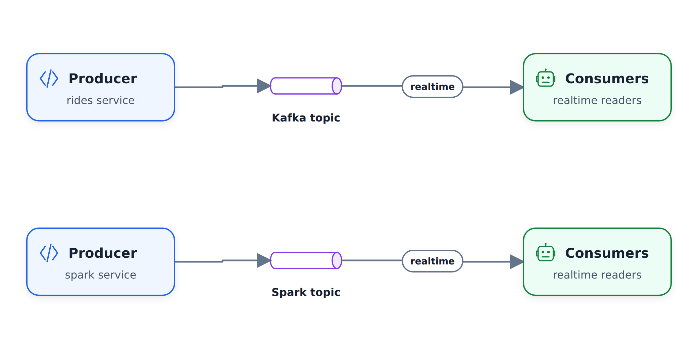

- [7.3 What is Kafka?](https://youtu.be/zPLZUDPi4AY&list=PL3MmuxUbc_hJed7dXYoJw8DoCuVHhGEQb&index=69)

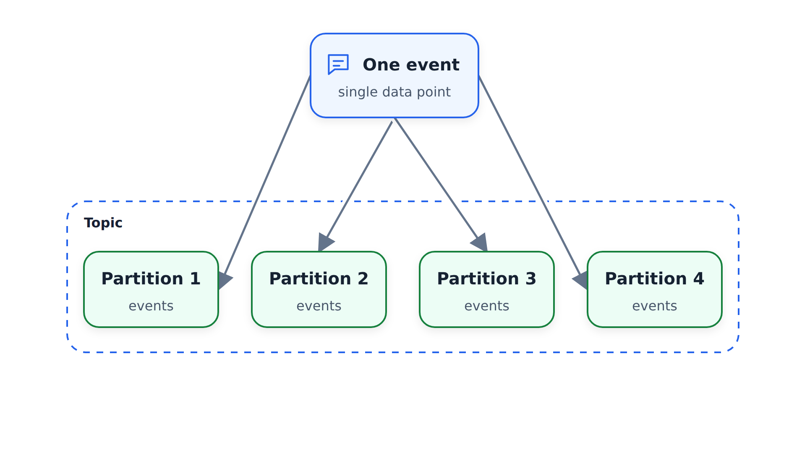

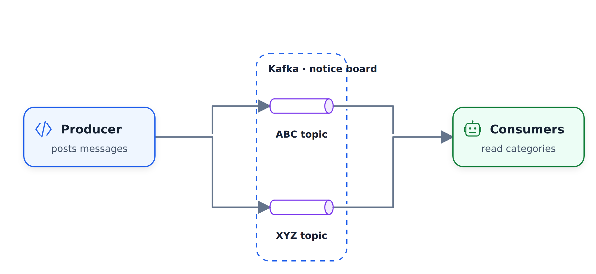

- [7.4 Confluent Cloud](https://youtu.be/ZnEZFEYKppw&list=PL3MmuxUbc_hJed7dXYoJw8DoCuVHhGEQb&index=70)
- [7.5 Kafka producer consumer](https://youtu.be/aegTuyxX7Yg&list=PL3MmuxUbc_hJed7dXYoJw8DoCuVHhGEQb&index=71)
- [7.6 Kafka configuration](https://youtu.be/SXQtWyRpMKs&list=PL3MmuxUbc_hJed7dXYoJw8DoCuVHhGEQb&index=72)

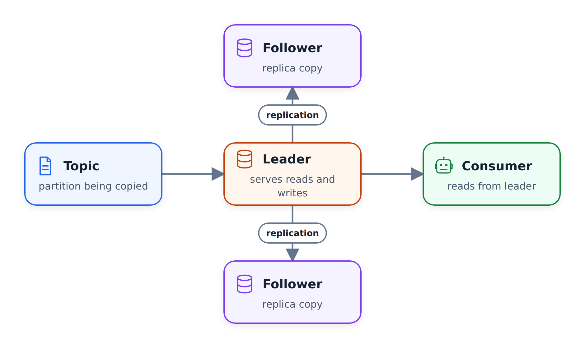

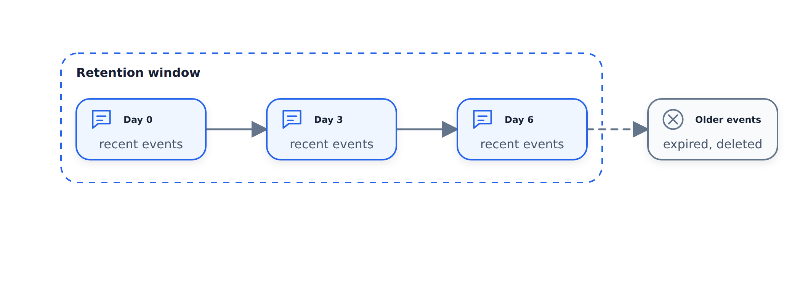

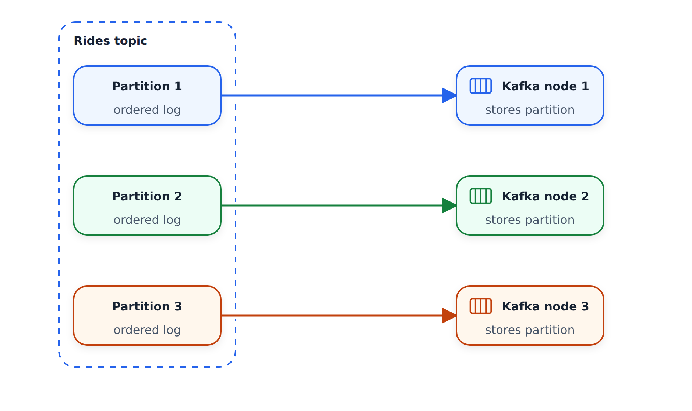

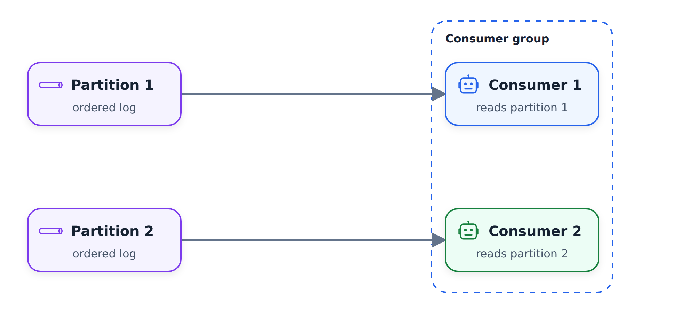

Links:

- [Slides](https://docs.google.com/presentation/d/1bCtdCba8v1HxJ_uMm9pwjRUC-NAMeB-6nOG2ng3KujA/edit?usp=sharing)
- [Kafka Configuration Reference](https://docs.confluent.io/platform/current/installation/configuration/)
- [Confluent Cloud trial](https://www.confluent.io/confluent-cloud/tryfree/)

## Kafka Streams

- [7.7 Kafka stream basics](https://youtu.be/dUyA_63eRb0&list=PL3MmuxUbc_hJed7dXYoJw8DoCuVHhGEQb&index=73)

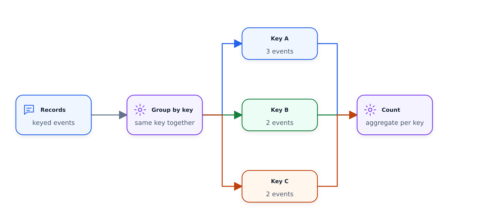

- [7.8 Kafka stream join](https://youtu.be/NcpKlujh34Y&list=PL3MmuxUbc_hJed7dXYoJw8DoCuVHhGEQb&index=74)
- [7.9 Kafka stream testing](https://youtu.be/TNx5rmLY8Pk&list=PL3MmuxUbc_hJed7dXYoJw8DoCuVHhGEQb&index=75)

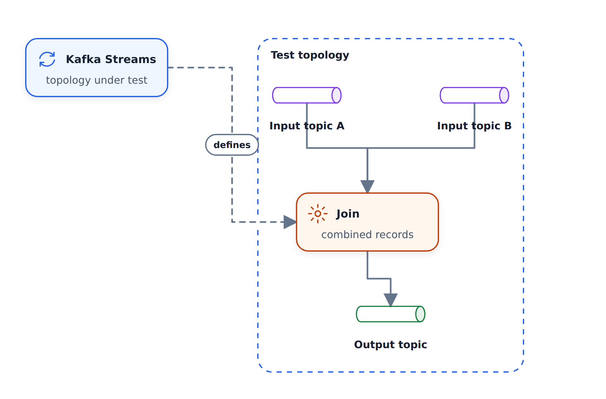

- [7.10 Kafka stream windowing](https://youtu.be/r1OuLdwxbRc&list=PL3MmuxUbc_hJed7dXYoJw8DoCuVHhGEQb&index=76)

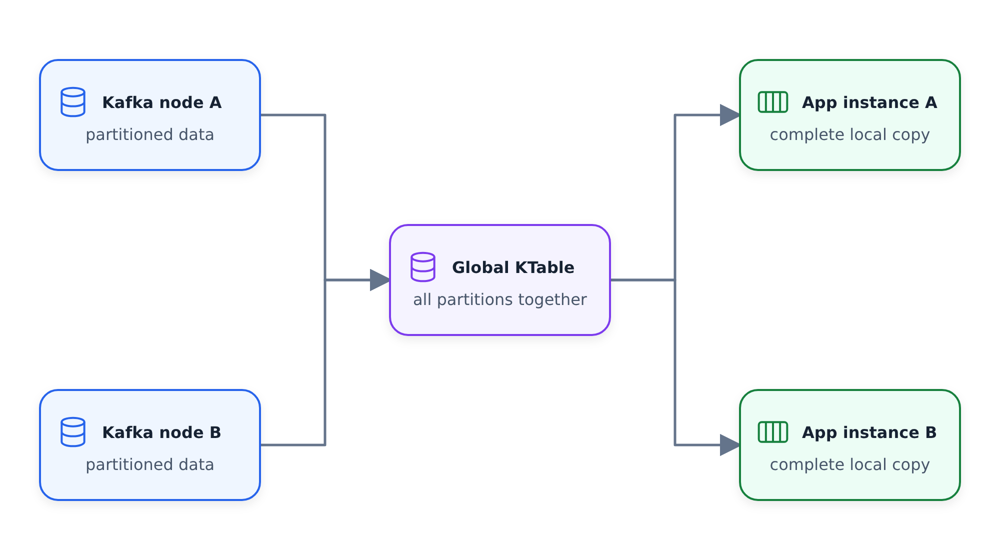

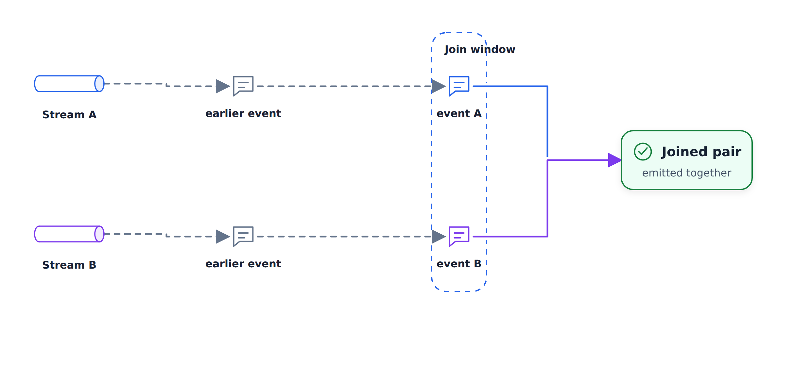

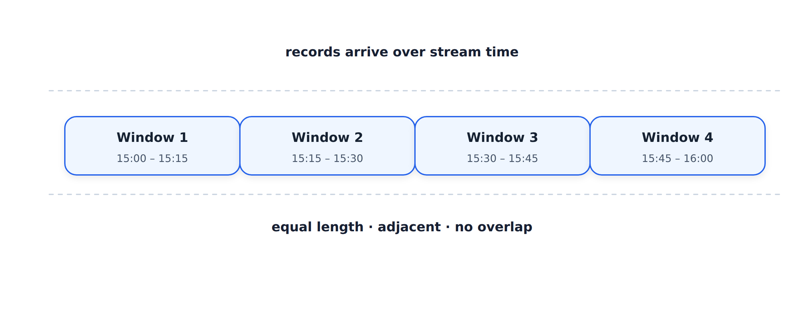

- [7.11 Kafka ksqlDB and Connect](https://youtu.be/DziQ4a4tn9Y&list=PL3MmuxUbc_hJed7dXYoJw8DoCuVHhGEQb&index=77)
- [7.12 Kafka Schema registry](https://youtu.be/tBY_hBuyzwI&list=PL3MmuxUbc_hJed7dXYoJw8DoCuVHhGEQb&index=78)

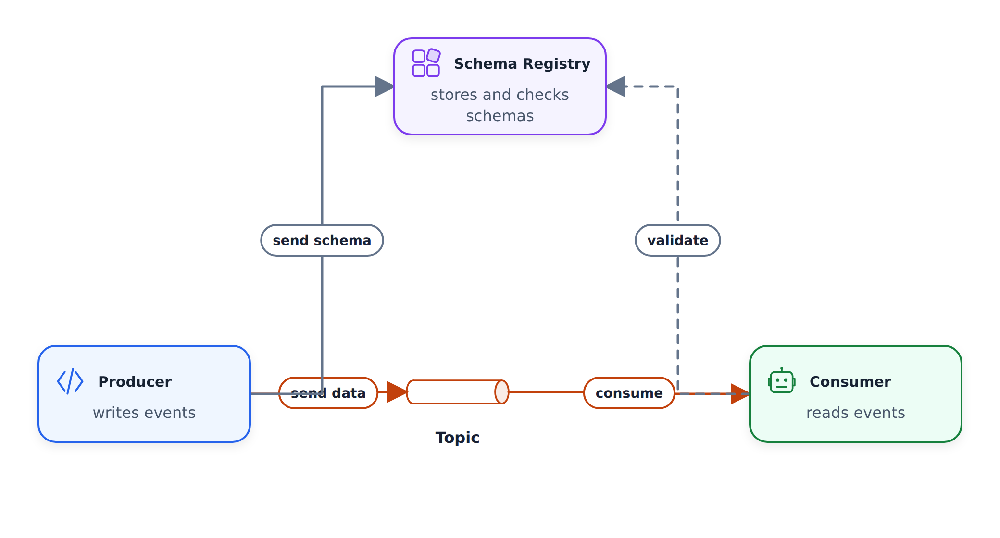

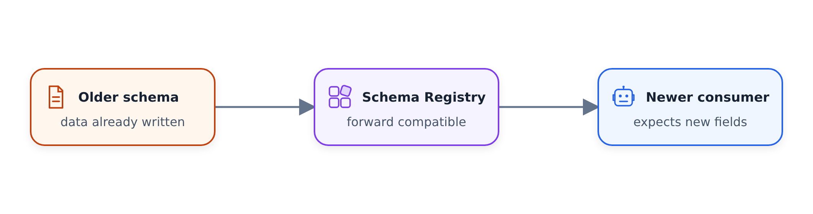

Links:

- [Slides](https://docs.google.com/presentation/d/1fVi9sFa7fL2ZW3ynS5MAZm0bRSZ4jO10fymPmrfTUjE/edit?usp=sharing)
- [Streams Concepts](https://docs.confluent.io/platform/current/streams/concepts.html)
