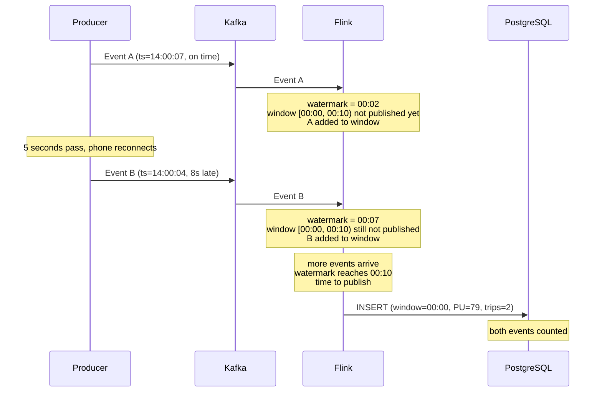
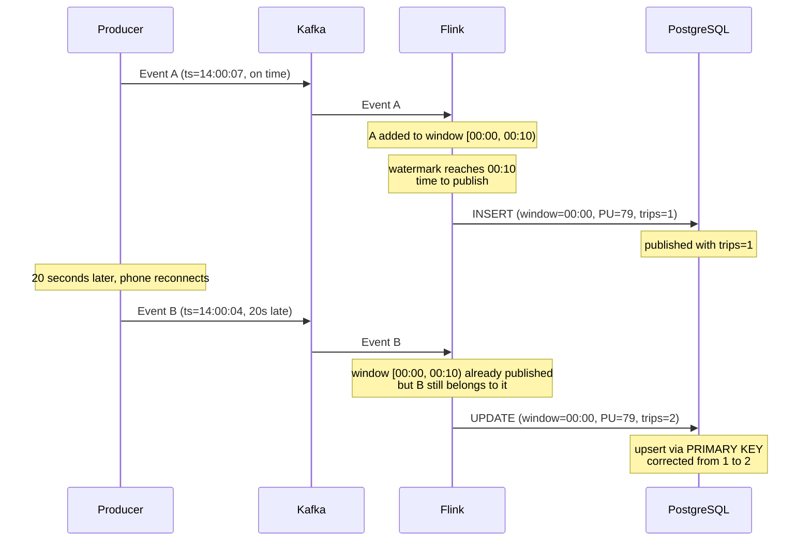

# PyFlink: Stream Processing Workshop

Video: https://www.youtube.com/watch?v=YDUgFeHQzJU

This workshop is based on the
[2025 stream with Zach Wilson](https://www.youtube.com/watch?v=P2loELMUUeI).

In this workshop, we build a real-time streaming pipeline step by step.
We start with the basics - a message broker, a producer, and a consumer -
then add a database and finally a stream processing framework.

We'll use NYC yellow taxi trip data as our data source.

What we'll build by the end:

```
Producer (Python) -> Kafka (Redpanda) -> Flink -> PostgreSQL
```

Prerequisites:

- Docker and Docker Compose
- [uv](https://docs.astral.sh/uv/)
- A SQL client - [pgcli](https://www.pgcli.com/) (`uvx pgcli`), DBeaver, pgAdmin, or DataGrip

Code:

- [Reference code](./) in this directory (`07-streaming/workshop/`)
- [Code created during the workshop](live/) by Alexey

The README walks through building everything from scratch - you can follow
along step by step or study the existing files and run the commands.


## Redpanda - a Kafka-compatible broker

Before we can produce or consume messages, we need a message broker -
a service that receives messages from producers, stores them, and delivers
them to consumers.

We use [Redpanda](https://redpanda.com/), a drop-in replacement for
Apache Kafka. Redpanda implements the same protocol, so any Kafka client
library works with it unchanged. The `kafka-python` library we'll use
doesn't know or care that Redpanda is running instead of Kafka.

Why Redpanda instead of Kafka?

- No JVM - Kafka runs on Java and needs significant memory for the JVM.
  Redpanda is written in C++ and starts in seconds with far less overhead.
- No ZooKeeper - Kafka traditionally required a separate ZooKeeper cluster
  for coordination (metadata, leader election). Redpanda handles this
  internally using the Raft consensus protocol - one less service to run.
- Single binary - just one container, nothing else to configure.

For this workshop, every time we say "Kafka" we mean the Kafka protocol
and concepts. Redpanda is the actual broker running underneath.

Create `docker-compose.yml` with the Redpanda service:

```yaml
services:
  redpanda:
    image: redpandadata/redpanda:v25.3.9
    command:
      - redpanda
      - start
      - --smp
      - '1'
      - --reserve-memory
      - 0M
      - --overprovisioned
      - --node-id
      - '1'
      - --kafka-addr
      - PLAINTEXT://0.0.0.0:29092,OUTSIDE://0.0.0.0:9092
      - --advertise-kafka-addr
      - PLAINTEXT://redpanda:29092,OUTSIDE://localhost:9092
      - --pandaproxy-addr
      - PLAINTEXT://0.0.0.0:28082,OUTSIDE://0.0.0.0:8082
      - --advertise-pandaproxy-addr
      - PLAINTEXT://redpanda:28082,OUTSIDE://localhost:8082
      - --rpc-addr
      - 0.0.0.0:33145
      - --advertise-rpc-addr
      - redpanda:33145
    ports:
      - 8082:8082
      - 9092:9092
      - 28082:28082
      - 29092:29092
```

The command has many parameters. Let's go through them.

Resource parameters:

| Parameter | What it does |
|---|---|
| `--smp 1` | Use 1 CPU core. Redpanda is built on [Seastar](http://seastar.io/), a framework that pins threads to cores for high performance. For development, 1 core is enough. |
| `--reserve-memory 0M` | Don't reserve extra memory for Redpanda's internal cache. In production, Redpanda reserves memory for its own page cache; we skip this in development. |
| `--overprovisioned` | Don't pin threads to specific CPU cores. On a shared development machine, this avoids contention with other processes. |
| `--node-id 1` | Unique identifier for this broker in the cluster. With a single broker it doesn't matter, but the parameter is required. |

Networking parameters:

Redpanda exposes two separate listeners for the Kafka protocol - one for
connections from inside Docker (other containers) and one for connections
from outside Docker (your laptop):

| Parameter | Internal (Docker) | External (your laptop) |
|---|---|---|
| `--kafka-addr` | `PLAINTEXT://0.0.0.0:29092` | `OUTSIDE://0.0.0.0:9092` |
| `--advertise-kafka-addr` | `PLAINTEXT://redpanda:29092` | `OUTSIDE://localhost:9092` |

Why two addresses? Kafka clients use a two-step connection process:

1. The client connects to a bootstrap server and asks for cluster metadata
2. The broker responds with advertised addresses - where the client should
   connect for actual data transfer

Inside Docker, containers find each other by service name, so the internal
advertised address is `redpanda:29092`. From your laptop, you connect via
the published port at `localhost:9092`. If we used only one address, either
Docker containers or your laptop wouldn't be able to connect.

The `--pandaproxy-addr` / `--advertise-pandaproxy-addr` follow the same
pattern for Redpanda's HTTP REST API (not used in this workshop).
The `--rpc-addr` / `--advertise-rpc-addr` are for internal cluster
communication between Redpanda nodes (not relevant with a single node).

Published ports:

| Port | What it's for |
|---|---|
| `9092` | Kafka protocol (external) - your Python producer/consumer connects here |
| `29092` | Kafka protocol (internal) - Flink containers will connect here later |
| `8082` / `28082` | HTTP Proxy - REST API access (not used in this workshop) |

Start Redpanda:

```bash
docker compose up redpanda -d
```

Verify it's running:

```bash
docker compose ps
```

```
NAME                IMAGE                           SERVICE    STATUS
workshop-redpanda   redpandadata/redpanda:v25.3.9   redpanda   Up
```


## Produce messages to Kafka

Initialize a Python project and add the dependencies we need:

```bash
uv init -p 3.12
uv add kafka-python pandas pyarrow
```

> If you cloned the repository, `pyproject.toml` already exists.
> Run `uv sync` instead.

We'll send NYC yellow taxi trip data to Kafka. You can run the code below
either as a Python script or in a Jupyter notebook (`uv add jupyter`,
then `uv run jupyter lab`).

First, download the data. We read a parquet file of yellow taxi trips and
take the first 1000 rows:

```python
import pandas as pd

url = "https://d37ci6vzurychx.cloudfront.net/trip-data/yellow_tripdata_2025-11.parquet"
columns = ['PULocationID', 'DOLocationID', 'trip_distance', 'total_amount', 'tpep_pickup_datetime']
df = pd.read_parquet(url, columns=columns).head(1000)
df.head()
```

We only read 5 columns to keep things focused. The full dataset has many
more (fare breakdown, rate codes, payment type, etc.).

Define a dataclass for our message. This gives us a clear schema for each
taxi trip:

```python
from dataclasses import dataclass

@dataclass
class Ride:
    PULocationID: int
    DOLocationID: int
    trip_distance: float
    total_amount: float
    tpep_pickup_datetime: int  # epoch milliseconds
```

Write a function to convert a DataFrame row into a `Ride`. We convert the
pandas Timestamp to epoch milliseconds - that's the format Flink expects
later:

```python
def ride_from_row(row):
    return Ride(
        PULocationID=int(row['PULocationID']),
        DOLocationID=int(row['DOLocationID']),
        trip_distance=float(row['trip_distance']),
        total_amount=float(row['total_amount']),
        tpep_pickup_datetime=int(row['tpep_pickup_datetime'].timestamp() * 1000),
    )
```

Test it:

```python
ride = ride_from_row(df.iloc[0])
ride
# Ride(PULocationID=186, DOLocationID=79, trip_distance=1.72,
#      total_amount=17.31, tpep_pickup_datetime=1730429702000)
```

Next, connect to Kafka. The `bootstrap_servers` is where the broker accepts
connections - `localhost:9092` because we're running this from our laptop
(outside Docker). In production with multiple brokers, you'd list several
for redundancy - if one is down, the client connects through another.

Kafka works with raw bytes, so we need a serializer that converts Python
dicts to JSON:

```python
import json
from kafka import KafkaProducer

def json_serializer(data):
    return json.dumps(data).encode('utf-8')

server = 'localhost:9092'

producer = KafkaProducer(
    bootstrap_servers=[server],
    value_serializer=json_serializer
)
```

Let's send a single ride to try it out. `dataclasses.asdict(ride)` converts
the dataclass to a plain dict, which the serializer turns into JSON bytes.
The broker auto-creates the `rides` topic on first use:

```python
import dataclasses

topic_name = 'rides'

producer.send(topic_name, value=dataclasses.asdict(ride))
producer.flush()
```

This works, but calling `dataclasses.asdict()` every time is tedious. We
can make a serializer that handles dataclasses directly:

```python
def ride_serializer(ride):
    ride_dict = dataclasses.asdict(ride)
    json_str = json.dumps(ride_dict)
    return json_str.encode('utf-8')
```

Now recreate the producer with the new serializer - we can pass `Ride`
objects directly without converting them to dicts first:

```python
producer = KafkaProducer(
    bootstrap_servers=[server],
    value_serializer=ride_serializer
)
```

Send one ride to verify:

```python
producer.send(topic_name, value=ride)
producer.flush()
```

That sent one record. Now let's send all 1000 rides in a loop:

```python
import time

t0 = time.time()

for _, row in df.iterrows():
    ride = ride_from_row(row)
    producer.send(topic_name, value=ride)
    print(f"Sent: {ride}")
    time.sleep(0.01)

producer.flush()

t1 = time.time()
print(f'took {(t1 - t0):.2f} seconds')
```

If you're building from scratch (not using the cloned repo files), create
the source directory structure and save the shared data model. The
producer and consumer scripts both import from this file:

```bash
mkdir -p src/producers src/consumers src/job
```

Create `src/models.py`:

```python
import json
from dataclasses import dataclass


@dataclass
class Ride:
    PULocationID: int
    DOLocationID: int
    trip_distance: float
    total_amount: float
    tpep_pickup_datetime: int  # epoch milliseconds


def ride_from_row(row):
    return Ride(
        PULocationID=int(row['PULocationID']),
        DOLocationID=int(row['DOLocationID']),
        trip_distance=float(row['trip_distance']),
        total_amount=float(row['total_amount']),
        tpep_pickup_datetime=int(row['tpep_pickup_datetime'].timestamp() * 1000),
    )


def ride_deserializer(data):
    json_str = data.decode('utf-8')
    ride_dict = json.loads(json_str)
    return Ride(**ride_dict)
```

`ride_deserializer` is introduced in the next step - we include it here so
the file is complete.

> The complete script is in `src/producers/producer.py`.

Run it:

```bash
uv run python src/producers/producer.py
```

You'll see 1000 taxi trips sent over ~10 seconds:

```
Sent: Ride(PULocationID=..., DOLocationID=..., trip_distance=..., total_amount=..., tpep_pickup_datetime=...)
...
took 10.23 seconds
```


## Consume messages with Python

Now let's read back the messages. The consumer receives raw bytes from
Kafka. Instead of deserializing to a dict and then constructing a `Ride`
manually, let's write a function that does both in one step:

```python
import json

def ride_deserializer(data):
    json_str = data.decode('utf-8')
    ride_dict = json.loads(json_str)
    return Ride(**ride_dict)
```

Test it with a sample JSON binary string (this is what Kafka delivers):

```python
test_bytes = json.dumps({
    'PULocationID': 186,
    'DOLocationID': 79,
    'trip_distance': 1.72,
    'total_amount': 17.31,
    'tpep_pickup_datetime': 1730429702000
}).encode('utf-8')

ride_deserializer(test_bytes)
# Ride(PULocationID=186, DOLocationID=79, trip_distance=1.72,
#      total_amount=17.31, tpep_pickup_datetime=1730429702000)
```

Now we can pass `ride_deserializer` directly as the `value_deserializer` -
Kafka calls it on every message, so `message.value` is already a `Ride`.

Connect to Kafka as a consumer. `auto_offset_reset='earliest'` means we
start reading from the beginning of the topic (without this, new consumers
default to `latest` and only see new messages). `group_id` identifies this
consumer group - Kafka tracks how far each group has read, so restarting
with the same group ID continues where it left off:

```python
from kafka import KafkaConsumer

server = 'localhost:9092'
topic_name = 'rides'

consumer = KafkaConsumer(
    topic_name,
    bootstrap_servers=[server],
    auto_offset_reset='earliest',
    group_id='rides-console',
    value_deserializer=ride_deserializer
)
```

Read messages and print them. Since `value_deserializer` returns a `Ride`,
`message.value` is already a `Ride` object - no extra conversion needed:

```python
from datetime import datetime

print(f"Listening to {topic_name}...")

count = 0
for message in consumer:
    ride = message.value
    pickup_dt = datetime.fromtimestamp(ride.tpep_pickup_datetime / 1000)
    print(f"Received: PU={ride.PULocationID}, DO={ride.DOLocationID}, "
          f"distance={ride.trip_distance}, amount=${ride.total_amount:.2f}, "
          f"pickup={pickup_dt}")
    count += 1
    if count >= 10:
        print(f"\n... received {count} messages so far (stopping after 10 for demo)")
        break

consumer.close()
```

> The complete script is in `src/consumers/consumer.py`.

Run it:

```bash
uv run python src/consumers/consumer.py
```

```
Listening to rides...
Received: PU=..., DO=..., distance=..., amount=$..., pickup=2025-...
...
... received 10 messages so far (stopping after 10 for demo)
```


## Save events to PostgreSQL

Printing to the screen is fine for debugging, but let's save events to a
database. Add the PostgreSQL service to `docker-compose.yml`:

```yaml
  postgres:
    image: postgres:18
    restart: on-failure
    environment:
      - POSTGRES_DB=postgres
      - POSTGRES_USER=postgres
      - POSTGRES_PASSWORD=postgres
    ports:
      - "5432:5432"
```

Start it:

```bash
docker compose up postgres -d
```

Connect to PostgreSQL. With `pgcli`:

```bash
uvx pgcli -h localhost -p 5432 -U postgres -d postgres
# password: postgres
```

Or via Docker:

```bash
docker compose exec postgres psql -U postgres -d postgres
```

Create a table for our events:

```sql
CREATE TABLE processed_events (
    PULocationID INTEGER,
    DOLocationID INTEGER,
    trip_distance DOUBLE PRECISION,
    total_amount DOUBLE PRECISION,
    pickup_datetime TIMESTAMP
);
```

Install the PostgreSQL client library:

```bash
uv add psycopg2-binary
```

Create `src/consumers/consumer_postgres.py`.

Set up the Kafka consumer. We reuse the same `ride_deserializer` from the
previous step. The `group_id` is different - each consumer group tracks its
offsets independently, so the console consumer and the PostgreSQL consumer
each read all messages:

```python
from kafka import KafkaConsumer

server = 'localhost:9092'
topic_name = 'rides'

consumer = KafkaConsumer(
    topic_name,
    bootstrap_servers=[server],
    auto_offset_reset='earliest',
    group_id='rides-to-postgres',
    value_deserializer=ride_deserializer
)
```

Connect to PostgreSQL:

```python
import psycopg2

conn = psycopg2.connect(
    host='localhost',
    port=5432,
    database='postgres',
    user='postgres',
    password='postgres'
)
conn.autocommit = True
cur = conn.cursor()
```

`autocommit = True` means each INSERT is committed immediately - no need
to call `conn.commit()` after every row.

Read messages and insert into PostgreSQL:

```python
from datetime import datetime

print(f"Listening to {topic_name} and writing to PostgreSQL...")

count = 0
for message in consumer:
    ride = message.value
    pickup_dt = datetime.fromtimestamp(ride.tpep_pickup_datetime / 1000)
    cur.execute(
        """INSERT INTO processed_events
           (PULocationID, DOLocationID, trip_distance, total_amount, pickup_datetime)
           VALUES (%s, %s, %s, %s, %s)""",
        (ride.PULocationID, ride.DOLocationID,
         ride.trip_distance, ride.total_amount, pickup_dt)
    )
    count += 1
    if count % 100 == 0:
        print(f"Inserted {count} rows...")

consumer.close()
cur.close()
conn.close()
```

Run it (press Ctrl+C after it processes the data):

```bash
uv run python src/consumers/consumer_postgres.py
```

Check PostgreSQL:

```sql
SELECT count(*) FROM processed_events;
```

```
 count
-------
  1000
```

This works, but think about what's missing:

- What if we want to aggregate by time window? We'd need to implement windowing
  logic ourselves.
- What if the consumer crashes? We'd need to track offsets ourselves to avoid
  reprocessing or missing data.
- What about parallelism? We'd need to manage multiple consumer instances and
  partition assignment.
- What about writing to different sinks? We'd need to write connector code for
  each destination.

This is where Flink comes in. Clear the table before moving on:

```sql
TRUNCATE processed_events;
```


## Why Flink?

Flink is a stream processing framework that handles all the hard parts:

- Windowing - built-in tumbling, sliding, and session windows
- Checkpointing - automatic state recovery after failures (no manual offset tracking)
- Parallelism - distribute processing across multiple workers
- Connectors - built-in JDBC, Kafka, filesystem sinks (no psycopg2 code)
- SQL interface - express stream processing with SQL queries

Flink can also connect to sources beyond Kafka - REST APIs, websockets,
filesystems, and more. But Kafka is the most common source in stream processing.

The trade-off is infrastructure complexity - we need the JobManager and
TaskManager containers. A streaming job is more like owning a server than
running a batch pipeline - it runs 24/7 and needs monitoring. But for anything
beyond simple consume-and-write, Flink pays for itself.


## The Flink image and services

Flink doesn't come with Python support out of the box. We need a custom
Docker image with Python, PyFlink, and connector JARs.

Download the Flink build files:

```bash
PREFIX="https://raw.githubusercontent.com/DataTalksClub/data-engineering-zoomcamp/main/07-streaming/workshop"

wget ${PREFIX}/Dockerfile.flink
wget ${PREFIX}/pyproject.flink.toml
wget ${PREFIX}/flink-config.yaml
```

> If you cloned the repository, these files are already in the
> `07-streaming/workshop/` directory.

You can look at
[`Dockerfile.flink`](https://github.com/DataTalksClub/data-engineering-zoomcamp/blob/main/07-streaming/workshop/Dockerfile.flink)
to see what it does:

- Starts from the official Flink image (`flink:2.2.0-scala_2.12-java17`)
- Installs Python 3.12 and PyFlink via uv
- Downloads connector JARs (Kafka, JDBC, PostgreSQL driver)
- Applies a custom Flink config to increase JVM metaspace for PyFlink

Now add the Flink services to `docker-compose.yml`. A Flink cluster has
two types of processes - let's add them one at a time.

The JobManager is the coordinator. It accepts jobs, manages checkpoints,
and assigns work to task managers. You interact with it through the web UI
(port `8081`) and submit jobs via its RPC port (`6123`):

```yaml
  jobmanager:
    build:
      context: .
      dockerfile: ./Dockerfile.flink
    image: pyflink-workshop
    pull_policy: never
    expose:
      - "6123"
    ports:
      - "8081:8081"
    volumes:
      - ./:/opt/flink/usrlib
      - ./src/:/opt/src
    command: jobmanager
    environment:
      - |
        FLINK_PROPERTIES=
        jobmanager.rpc.address: jobmanager
        jobmanager.memory.process.size: 1600m
```

- `build` + `image: pyflink-workshop` - builds our custom Docker image and
  tags it as `pyflink-workshop`. The taskmanager will reuse this same image
  without rebuilding.
- `pull_policy: never` - don't try to pull `pyflink-workshop` from Docker Hub
  (it doesn't exist there - we built it locally).
- `volumes` - mount the source code into the container so we can submit jobs
  without rebuilding the image.
- `FLINK_PROPERTIES` - Flink configuration passed as an environment variable.
  `jobmanager.rpc.address: jobmanager` tells Flink where the coordinator
  lives (`jobmanager` is the Docker service name).

The TaskManager is the worker. It executes the actual data processing:

```yaml
  taskmanager:
    image: pyflink-workshop
    pull_policy: never
    expose:
      - "6121"
      - "6122"
    volumes:
      - ./:/opt/flink/usrlib
      - ./src/:/opt/src
    depends_on:
      - jobmanager
    command: taskmanager --taskmanager.registration.timeout 5 min
    environment:
      - |
        FLINK_PROPERTIES=
        jobmanager.rpc.address: jobmanager
        taskmanager.memory.process.size: 1728m
        taskmanager.numberOfTaskSlots: 15
        parallelism.default: 3
```

- `image: pyflink-workshop` - reuses the image built by the jobmanager
  service, no `build` needed.
- `depends_on: jobmanager` - start after the jobmanager.
- `--taskmanager.registration.timeout 5 min` - give the task manager
  5 minutes to find the job manager on startup (useful when services start
  in parallel).
- `taskmanager.numberOfTaskSlots: 15` - this task manager has 15 slots.
- `parallelism.default: 3` - by default, each pipeline stage runs 3 copies
  processing data in parallel.

A task slot is a unit of resources (memory, CPU) that can run one parallel
instance of a pipeline stage. Think of slots like lanes on a highway - more
lanes means more data can flow through at once. If you submit a job with
parallelism 3, that job uses 3 slots. With 15 slots available, you can run
5 such jobs simultaneously on this single task manager. In production, you'd
have multiple task managers across different machines, each contributing
slots to the cluster. The job manager decides which slots run which parts
of which jobs.

Make sure `src/` exists before starting Docker - the volume mount
`./src/:/opt/src` will create it as root if it doesn't exist, causing
permission issues later when you try to create files inside it:

```bash
mkdir -p src/job
```

Build the Flink image and start all services:

```bash
docker compose up --build -d
```

The first build takes a few minutes - it installs Python, PyFlink, and downloads
the connector JARs.

Verify all four services are running:

```bash
docker compose ps
```

```
NAME                  IMAGE                           SERVICE        STATUS
workshop-jobmanager   pyflink-workshop                jobmanager     Up
workshop-taskmanager  pyflink-workshop                taskmanager    Up
workshop-postgres     postgres:18                     postgres       Up
workshop-redpanda     redpandadata/redpanda:v25.3.9   redpanda       Up
```

Check the Flink dashboard at [http://localhost:8081](http://localhost:8081) -
you should see 1 task manager with 15 available task slots.


## The pass-through Flink job

Now let's do the same thing our Python consumer did, but with Flink.

Unlike the producer and consumer scripts, Flink jobs can't run from a
Jupyter notebook. They are submitted to the Flink cluster as .py files
using `docker compose exec`. We cover how job submission works in
production in the "Flink in production" section at the end.

Create `src/job/pass_through_job.py`.

The Kafka source table:

```python
def create_events_source_kafka(t_env):
    table_name = "events"
    source_ddl = f"""
        CREATE TABLE {table_name} (
            PULocationID INTEGER,
            DOLocationID INTEGER,
            trip_distance DOUBLE,
            total_amount DOUBLE,
            tpep_pickup_datetime BIGINT
        ) WITH (
            'connector' = 'kafka',
            'properties.bootstrap.servers' = 'redpanda:29092',
            'topic' = 'rides',
            'scan.startup.mode' = 'latest-offset',
            'properties.auto.offset.reset' = 'latest',
            'format' = 'json'
        );
        """
    t_env.execute_sql(source_ddl)
    return table_name
```

This is a Flink SQL DDL statement. Breaking it down:

- `PULocationID`, `DOLocationID`, `trip_distance`, `total_amount`,
  `tpep_pickup_datetime` - the JSON fields from our producer
- `'properties.bootstrap.servers' = 'redpanda:29092'` - the internal Docker
  network address (not `localhost` - Flink runs inside Docker)
- `'scan.startup.mode' = 'latest-offset'` - only read new messages arriving
  after the job starts
- `'format' = 'json'` - Flink deserializes JSON automatically

The PostgreSQL sink table:

```python
def create_processed_events_sink_postgres(t_env):
    table_name = 'processed_events'
    sink_ddl = f"""
        CREATE TABLE {table_name} (
            PULocationID INTEGER,
            DOLocationID INTEGER,
            trip_distance DOUBLE,
            total_amount DOUBLE,
            pickup_datetime TIMESTAMP
        ) WITH (
            'connector' = 'jdbc',
            'url' = 'jdbc:postgresql://postgres:5432/postgres',
            'table-name' = '{table_name}',
            'username' = 'postgres',
            'password' = 'postgres',
            'driver' = 'org.postgresql.Driver'
        );
        """
    t_env.execute_sql(sink_ddl)
    return table_name
```

No psycopg2, no INSERT statements - just declare the table and Flink handles
the rest.

The execution:

```python
from pyflink.datastream import StreamExecutionEnvironment
from pyflink.table import EnvironmentSettings, StreamTableEnvironment

def log_processing():
    env = StreamExecutionEnvironment.get_execution_environment()
    env.enable_checkpointing(10 * 1000)  # checkpoint every 10 seconds

    settings = EnvironmentSettings.new_instance().in_streaming_mode().build()
    t_env = StreamTableEnvironment.create(env, environment_settings=settings)

    source_table = create_events_source_kafka(t_env)
    postgres_sink = create_processed_events_sink_postgres(t_env)

    t_env.execute_sql(
        f"""
        INSERT INTO {postgres_sink}
        SELECT
            PULocationID,
            DOLocationID,
            trip_distance,
            total_amount,
            TO_TIMESTAMP_LTZ(tpep_pickup_datetime, 3) as pickup_datetime
        FROM {source_table}
        """
    ).wait()

if __name__ == '__main__':
    log_processing()
```

- Streaming mode - the job runs continuously, waiting for new data
- The `INSERT INTO ... SELECT` is the pipeline - read from Kafka, convert the
  timestamp, write to PostgreSQL

`enable_checkpointing(10 * 1000)` tells Flink to take a snapshot of the
job's state every 10 seconds. A checkpoint captures the Kafka offsets (how
far Flink has read) and any in-flight data. If the job crashes, it resumes
from the last checkpoint instead of starting from the beginning.

Checkpointing gets especially important with windows. If you have a
5-minute window and the job fails 2 minutes in, Flink doesn't just track
the offset - it also serializes the open windows to disk. When it
restarts, it picks up right where it left off, with the partially-filled
window intact.

The trade-off is resilience versus efficiency. Checkpointing every 1 second
is expensive - Flink has to serialize and persist the entire state that
often. Checkpointing every 10 minutes means you could lose up to 10 minutes
of progress on failure. 10 seconds is a reasonable default for most jobs.

Submit the job:

```bash
docker compose exec jobmanager ./bin/flink run \
    -py /opt/src/job/pass_through_job.py \
    --pyFiles /opt/src -d
```

```
Job has been submitted with JobID 663cff6811b65e97fc1e068d641401f4
```

Check the Flink UI at [http://localhost:8081](http://localhost:8081) - you should
see a running job.

Since the job uses `latest-offset`, it's waiting for new messages. Send data:

```bash
uv run python src/producers/producer.py
```

Query PostgreSQL:

```sql
SELECT count(*) FROM processed_events;
```

Compare this to our Python consumer approach - same result, but Flink handles
checkpointing, offset management, and PostgreSQL writes automatically.


## Offsets - earliest vs latest

When Flink connects to Kafka, it needs to know where to start reading. This
is the `scan.startup.mode` setting:

| Mode | Behavior |
|---|---|
| `latest-offset` | Only read messages arriving after the job starts |
| `earliest-offset` | Read everything from the beginning of the topic |
| `timestamp` | Start from a specific point in time |

`earliest` is typically used for backfilling or restating data - you're
using Flink to process data that's been sitting in Kafka for a while, not
real-time data. `latest` is the more common production setting - the job
starts up and only processes new events as people click buttons on your
website or whatever event feed you're consuming.

Our pass-through job uses `latest-offset`. Let's see what happens with
`earliest-offset`:

1. Cancel the running job from the Flink UI (click on the job, then Cancel)
2. Clear the table:
   ```sql
   TRUNCATE processed_events;
   ```
3. Edit `src/job/pass_through_job.py` - change both offset settings:
   ```
   'scan.startup.mode' = 'earliest-offset',
   'properties.auto.offset.reset' = 'earliest',
   ```
4. Resubmit:
   ```bash
   docker compose exec jobmanager ./bin/flink run \
       -py /opt/src/job/pass_through_job.py \
       --pyFiles /opt/src -d
   ```
5. Wait 15 seconds, then check:
   ```sql
   SELECT count(*) FROM processed_events;
   ```

Flink reads all messages from the topic - including data from previous producer
runs. If you ran the producer twice before, you'll see ~2000 rows (duplicates
of everything already processed).

Why duplicates? Checkpoints are scoped to a specific job instance. When you
cancel and resubmit, it's a brand new job that knows nothing about previous
checkpoints. With `earliest-offset`, it starts from scratch. The offset
setting only matters at startup - once the job is running, checkpointing
takes over and tracks progress. But if you kill the job and create a new
one, those checkpoints are gone.

There is a third option - `timestamp` mode. If your job was running fine
until 2:00 PM and then crashed, you can restart it from exactly 2:00 PM.
This is useful for recovering from failures without reprocessing everything
from the beginning or missing the data that arrived while the job was down.

A common production pattern (Lambda architecture): run your streaming job with
`latest-offset` for real-time results, and if it goes down, use a separate
batch job to backfill the gap. This way the streaming job stays fast and you
don't lose data.

> Change the offset back to `latest-offset` when you're done experimenting.


## Aggregation with tumbling windows

Now let's do something our plain Python consumer can't easily do - windowed
aggregation. We'll count taxi trips and sum revenue by pickup location per hour.

First, cancel any running jobs. Then create the aggregation table in PostgreSQL:

```sql
CREATE TABLE processed_events_aggregated (
    window_start TIMESTAMP,
    PULocationID INTEGER,
    num_trips BIGINT,
    total_revenue DOUBLE PRECISION,
    PRIMARY KEY (window_start, PULocationID)
);
```

Two important design choices:

1. `PULocationID` is included - we group by both time window and pickup
   location, so both appear in the output.
2. `PRIMARY KEY` - enables upsert behavior. When Flink sends updated counts
   for the same window, PostgreSQL updates the existing row instead of creating
   a duplicate. This matters because late-arriving events can cause Flink to
   re-evaluate a window it already emitted results for. With upsert, the
   corrected count replaces the old one automatically.

Now create `src/job/aggregation_job.py`:

```python
from pyflink.datastream import StreamExecutionEnvironment
from pyflink.table import EnvironmentSettings, StreamTableEnvironment


def create_events_source_kafka(t_env):
    table_name = "events"
    source_ddl = f"""
        CREATE TABLE {table_name} (
            PULocationID INTEGER,
            DOLocationID INTEGER,
            trip_distance DOUBLE,
            total_amount DOUBLE,
            tpep_pickup_datetime BIGINT,
            event_timestamp AS TO_TIMESTAMP_LTZ(tpep_pickup_datetime, 3),
            WATERMARK for event_timestamp as event_timestamp - INTERVAL '5' SECOND
        ) WITH (
            'connector' = 'kafka',
            'properties.bootstrap.servers' = 'redpanda:29092',
            'topic' = 'rides',
            'scan.startup.mode' = 'earliest-offset',
            'properties.auto.offset.reset' = 'earliest',
            'format' = 'json'
        );
        """
    t_env.execute_sql(source_ddl)
    return table_name


def create_events_aggregated_sink(t_env):
    table_name = 'processed_events_aggregated'
    sink_ddl = f"""
        CREATE TABLE {table_name} (
            window_start TIMESTAMP(3),
            PULocationID INT,
            num_trips BIGINT,
            total_revenue DOUBLE,
            PRIMARY KEY (window_start, PULocationID) NOT ENFORCED
        ) WITH (
            'connector' = 'jdbc',
            'url' = 'jdbc:postgresql://postgres:5432/postgres',
            'table-name' = '{table_name}',
            'username' = 'postgres',
            'password' = 'postgres',
            'driver' = 'org.postgresql.Driver'
        );
        """
    t_env.execute_sql(sink_ddl)
    return table_name


def log_aggregation():
    env = StreamExecutionEnvironment.get_execution_environment()
    env.enable_checkpointing(10 * 1000)
    env.set_parallelism(3)

    settings = EnvironmentSettings.new_instance().in_streaming_mode().build()
    t_env = StreamTableEnvironment.create(env, environment_settings=settings)

    try:
        source_table = create_events_source_kafka(t_env)
        aggregated_table = create_events_aggregated_sink(t_env)

        t_env.execute_sql(f"""
        INSERT INTO {aggregated_table}
        SELECT
            window_start,
            PULocationID,
            COUNT(*) AS num_trips,
            SUM(total_amount) AS total_revenue
        FROM TABLE(
            TUMBLE(TABLE {source_table}, DESCRIPTOR(event_timestamp), INTERVAL '1' HOUR)
        )
        GROUP BY window_start, PULocationID;

        """).wait()

    except Exception as e:
        print("Writing records from Kafka to JDBC failed:", str(e))


if __name__ == '__main__':
    log_aggregation()
```

The Kafka source table has two new lines compared to the pass-through job:

- `event_timestamp AS TO_TIMESTAMP_LTZ(tpep_pickup_datetime, 3)` - a computed
  column that converts epoch milliseconds to a timestamp. The `3` means
  milliseconds precision.
- `WATERMARK for event_timestamp as event_timestamp - INTERVAL '5' SECOND` -
  tells Flink when to publish window results.

The window defines WHAT you're counting - a 1-hour bucket of taxi trips.
But in a stream, events keep arriving. How does Flink know when to stop
waiting and publish the count for the 2 PM - 3 PM hour? It can't just
look at the clock because some events arrive late. Without a trigger,
Flink would accumulate data forever and never write anything to PostgreSQL.

The watermark is that trigger. It tells Flink when to publish. In the SQL:

```
WATERMARK FOR event_timestamp AS event_timestamp - INTERVAL '5' SECOND
                                                   ^^^^^^^^^^^^^^^^^^^
                                                   patience = 5 seconds
```

The watermark is always 5 seconds behind the latest event timestamp Flink
has seen. When the watermark passes the end of a window, Flink publishes
that window's results. The 5 seconds is patience for stragglers - events
that happened before the window ended but arrived a few seconds late.

Three pieces working together:

- Window = what bucket to count into (1 hour)
- Watermark = when to publish the result (the trigger)
- Upsert (PRIMARY KEY) = safety net that corrects the result if something
  arrives after publishing

Here's a concrete example. Two taxi pickups in East Village (PU=79) with
a 10-second window and 5-second watermark. Event A is on time, Event B is
8 seconds late (the rider's phone lost signal in a tunnel).

Event B arrives late, but Flink hasn't published yet - both events counted:



Event B arrived late, but within Flink's patience window. Flink hadn't
published the result yet, so B was included in the count.

Now what if Event B were 20 seconds late - arriving after Flink already
published?



Flink already published trips=1, but when Event B finally arrives, the
PRIMARY KEY lets Flink send a correction. PostgreSQL updates the row
from 1 to 2. Without the PRIMARY KEY (an append-only sink), Event B
would be lost - Flink can't re-open a published window in append mode.

The trade-off is latency vs completeness. A larger watermark means more
patience for late events, but you wait longer before seeing any results.
5 seconds is a reasonable default. In production, you'd tune this based
on how out-of-order your data actually is.

Other differences from the pass-through job:

- The sink has a `PRIMARY KEY` with `NOT ENFORCED` - this enables upsert
  behavior in the Flink JDBC connector.
- `earliest-offset` - reads all existing data from Kafka.
- `env.set_parallelism(3)` - runs 3 copies processing data in parallel.
- The `TUMBLE` function creates fixed-size, non-overlapping windows.
  `DESCRIPTOR(event_timestamp)` must reference the column with the `WATERMARK`
  defined on it, and `INTERVAL '1' HOUR` sets the window size.

Submit and test:

```bash
docker compose exec jobmanager ./bin/flink run \
    -py /opt/src/job/aggregation_job.py \
    --pyFiles /opt/src -d
```

Send data:

```bash
uv run python src/producers/producer.py
```

Wait ~15 seconds for the windows to close, then check:

```sql
SELECT window_start, count(*) as locations, sum(num_trips) as total_trips,
       round(sum(total_revenue)::numeric, 2) as revenue
FROM processed_events_aggregated
GROUP BY window_start
ORDER BY window_start;
```

```
     window_start     | locations | total_trips | revenue
----------------------+-----------+-------------+---------
 2025-11-01 00:00:00  |        ...
 2025-11-01 01:00:00  |        ...
 ...
```

The 1000 taxi trips were grouped into 1-hour tumbling windows by pickup
location. Each row shows how many locations had trips in that hour and the
total number of trips.

Try this with a plain Python consumer - you'd need to implement the windowing
logic, handle late events, manage state, and write the upsert SQL yourself.
With Flink, it's a SQL query.


## Late events and upserts

The CSV producer sends events in order, so the watermark never has to
handle late arrivals. Let's use a real-time producer that generates
synthetic events with occasional delays to see what happens.

Download and run the real-time producer:

```bash
PREFIX="https://raw.githubusercontent.com/DataTalksClub/data-engineering-zoomcamp/main/07-streaming/workshop"
wget ${PREFIX}/src/producers/producer_realtime.py -P src/producers/
```

```bash
uv run python src/producers/producer_realtime.py
```

It generates random taxi trips with current timestamps, but ~20% of events
are sent with a timestamp 3-10 seconds in the past (simulating network
delays). The output labels each event:

```
  on time   -> PU=79 ts=14:23:05
  on time   -> PU=107 ts=14:23:05
  LATE (8s) -> PU=234 ts=14:22:58
  on time   -> PU=48 ts=14:23:06
```

With our 5-second watermark and 1-hour windows, no events will be dropped -
even an event 10 seconds late lands well within the current hour window.
But the watermark + upsert behavior is still visible: Flink first emits
window results when the watermark passes the window end, then late events
update those results via the PRIMARY KEY.

To see this in action, open two terminals:

Terminal 1 - run the real-time producer:

```bash
uv run python src/producers/producer_realtime.py
```

Terminal 2 - watch aggregation counts change:

```bash
watch -n 1 'PGPASSWORD=postgres docker compose exec postgres psql -U postgres -d postgres -c "SELECT window_start, sum(num_trips) as trips, round(sum(total_revenue)::numeric, 2) as revenue FROM processed_events_aggregated GROUP BY window_start ORDER BY window_start;"'
```

You'll see the counts for older windows increase as late events arrive
and update the aggregation via upsert. This is why we set up the PRIMARY
KEY - without it, late events would either be dropped or create duplicates.


## Understanding window types

We used tumbling windows above. Flink supports three types:

### Tumbling windows

Fixed-size, non-overlapping. Every event belongs to exactly one window.
If you come from the batch world, tumbling windows are the most familiar -
they just cut up your data into fixed segments. It's essentially a way to
speed up batch processing.

```
|  Window 1  |  Window 2  |  Window 3  |
|  1 hour    |  1 hour    |  1 hour    |
```

Use case: Counting trips per hour, daily revenue summaries.

### Sliding windows

Fixed-size, overlapping. An event can belong to multiple windows. When you
think of a 1-hour window, most people think of 00:00-01:00. But there's
also 00:15-01:15, 00:30-01:30 - those are also 1-hour windows, just
starting at different points. Sliding windows capture all of them.

```
|--- Window 1 (1 hour) ---|
      |--- Window 2 (1 hour) ---|
            |--- Window 3 (1 hour) ---|
      <- 15 min slide ->
```

```sql
HOP(TABLE events, DESCRIPTOR(event_timestamp), INTERVAL '15' MINUTE, INTERVAL '1' HOUR)
```

Use case: finding peaks and valleys - "what was our peak traffic in any
1-hour window?" These overlapping windows let you find the moment in time
where you have the highest or lowest values. Good for min-maxing, moving
averages, and surge detection (e.g., ride-share surge pricing).

### Session windows

Dynamic windows based on inactivity gaps. Unlike tumbling and sliding
windows, the window size isn't fixed - the window doesn't close at a
specified time, it closes after a specified amount of inactivity.

```
|--events--| gap |--events------| gap |--events--|
| Session 1|     |  Session 2   |     | Session 3|
```

Use case: grouping user behavior together. Imagine a user logs into an app,
clicks a bunch of buttons, leaves for 2 minutes, then comes back - that's
still technically the same session. You set a session gap (say, 30 minutes
of inactivity) and Flink groups all the events within that session together.
Sessionization is very powerful for behavioral analytics.


## Cleanup

Stop and remove all containers:

```bash
docker compose down
```

To also remove the PostgreSQL data volume:

```bash
docker compose down -v
```


## Q&A

Questions and answers from the
[2025 stream with Zach Wilson](https://www.youtube.com/watch?v=P2loELMUUeI).

### What happens when a Flink job dies and restarts? Does it reprocess everything?

The `earliest` offset setting is only for the initial startup. If the job
restarts (not re-submitted as a new job), it uses checkpointing to resume
from the last snapshot. Without checkpointing, you either reprocess
everything (with `earliest`) or skip data (with `latest`).

The catch: checkpoints are scoped to a specific job instance. If you
completely kill a job and submit a new one, the new job has no knowledge of
the previous checkpoints. To preserve state across redeployments, restart
the existing job rather than creating a new one.

### Why can't we just use Kafka consumers? What does Flink actually add?

For simple pass-through (read a message, write it somewhere), a Kafka
consumer is fine. For anything involving time windows, watermarks,
checkpointing, or parallel processing, Flink saves you from building all
that yourself.

You can do windowing, watermarking, late data handling, and job recovery
with a plain consumer - go ahead and manage it yourself. But as Zach puts
it: "good luck." With a plain consumer, you'd also need to track
checkpoints yourself - save the latest processed timestamp to a file or
database and manage it on every restart. Flink keeps the state for you.

It's like asking "why use Spark when you can use Pandas?" You can, but
Pandas won't work at higher scale in a distributed way.

### What happens with events delayed beyond the watermark (the "tunnel" scenario)?

There are two types of lateness. The watermark handles acceptable lateness -
small delays where events arrive a few seconds late. For events arriving
much later (like after a 5-minute tunnel), Flink has an allowed lateness
parameter.

By default, allowed lateness is zero - events arriving after the watermark
closes a window are discarded. If you set allowed lateness to 10 minutes,
Flink will go back, find the old closed window, create a new aggregation
with the late event, and send it to the sink as a brand new record. This
means you need deduplication logic on the sink side (a primary key with
upsert behavior - exactly what we set up in the aggregation section).

The trade-off: allowed lateness requires Flink to hold all those windows
on disk for the duration of the tolerance.

### When do we actually need streaming? For many things micro-batch is enough.

The key question: is something going to happen in real time on the other
side? If there is an automated process that will change something based on
the data, streaming is a great choice. If a human is just looking at data,
real-time is unnecessary and micro-batch is easier to maintain.

In 10 years as a data engineer, Zach had literally two use cases that
genuinely needed streaming - Netflix fraud/security detection (5 minutes of
delay means 5 more minutes of a hacked account) and Airbnb surge pricing
(supply and demand changes rapidly). Everything else was daily batch, or
hourly/every-15-minute micro-batch for lower latency needs.

Before committing to streaming, consider the operational cost. A streaming
job runs 24/7 - if it breaks at 3 AM, someone needs to fix it. If you're
the only person on the team who understands Flink, you'll be on-call for
it forever. Talk to your manager before implementing streaming - you'll
need to teach your entire team before you can share the on-call burden.

### Spark Streaming vs Flink Streaming?

They are fundamentally different today but will likely converge. The key
difference: Spark Streaming is micro-batch - it pulses every 15-30 seconds,
pulling data in small batches (pull architecture). Flink is genuine
continuous processing - events flow through as they arrive (push
architecture). For most use cases the difference is negligible, but Flink
has lower latency for truly real-time needs.

For micro-batch intervals, Zach finds every-5-minutes too frequent with
Spark because startup alone takes about a minute, making the
overhead-to-work ratio poor. His sweet spots are hourly and every 15
minutes.

### How does job submission work in production?

In this workshop we mount local files into Docker and submit jobs with
`docker compose exec` - that's a development convenience. In production,
job submission looks different depending on the deployment:

- Managed services (AWS Kinesis Data Analytics, Google Cloud Dataflow,
  Confluent Cloud) - you upload a JAR or Python zip through a web console
  or CLI. The service handles the cluster.
- Self-hosted Flink on Kubernetes - you typically build a Docker image with
  your job code baked in, or use the Flink Kubernetes Operator which pulls
  job artifacts from S3/GCS at startup.
- Standalone Flink cluster - you use the `flink run` CLI pointing to a
  local file or an HTTP/S3 URL. CI/CD pipelines often upload the job
  artifact to S3 and then call `flink run` with that URL.

The common pattern: your code lives in git, CI builds an artifact (JAR,
Python zip, or Docker image), pushes it to a registry or object store, and
then triggers the Flink cluster to pick it up.
