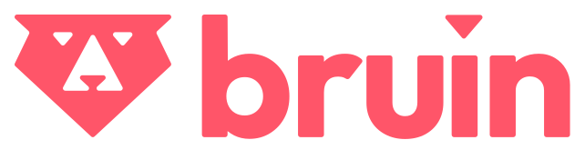

  

<h1 align="center">
    <strong>Data Engineering Zoomcamp: A Free 9-Week Course on Data Engineering Fundamentals</strong>
</h1>

Master the fundamentals of data engineering by building an end-to-end data pipeline from scratch. Gain hands-on experience with industry-standard tools and best practices.

<a href="https://datatalks.club/slack.html">Join Slack</a> •
<a href="https://app.slack.com/client/T01ATQK62F8/C01FABYF2RG">#course-data-engineering Channel</a> •
<a href="https://t.me/dezoomcamp">Telegram Announcements</a> •
<a href="https://www.youtube.com/playlist?list=PL3MmuxUbc_hJed7dXYoJw8DoCuVHhGEQb">Course Playlist</a> •
<a href="https://datatalks.club/faq/data-engineering-zoomcamp.html">FAQ</a>

## How to Enroll

### 2026 Cohort
- **Start Date**: 12 January 2026
- **Register Here**: [Sign up](https://airtable.com/shr6oVXeQvSI5HuWD)

### Self-Paced Learning
All course materials are freely available for independent study. Follow these steps:
1. Watch the course videos.
2. Join the [Slack community](https://datatalks.club/slack.html).
3. Refer to the [FAQ document](https://datatalks.club/faq/data-engineering-zoomcamp.html) for guidance.

## Syllabus Overview
The course consists of structured modules, hands-on workshops, and a final project to reinforce your learning.

### **Prerequisites**
To get the most out of this course, you should have:
- Basic coding experience
- Familiarity with SQL
- Experience with Python (helpful but not required)

No prior data engineering experience is necessary.

### **Modules**

#### [Module 1: Containerization and Infrastructure as Code](01-docker-terraform/)
- Introduction to GCP
- Docker and Docker Compose
- Running PostgreSQL with Docker
- Infrastructure setup with Terraform
- Homework

#### [Module 2: Workflow Orchestration](02-workflow-orchestration/)
- Data Lakes and Workflow Orchestration
- Workflow orchestration with Kestra
- Homework

#### [Workshop 1: Data Ingestion](cohorts/2025/workshops/dlt/README.md)
- API reading and pipeline scalability
- Data normalization and incremental loading
- Homework

#### [Module 3: Data Warehousing](03-data-warehouse/)
- Introduction to BigQuery
- Partitioning, clustering, and best practices
- Machine learning in BigQuery

#### [Module 4: Analytics Engineering](04-analytics-engineering/)
- Analytics Engineering and Data Modeling
- dbt (data build tool) with DuckDB & BigQuery
- Testing, documentation, and deployment

#### [Module 5: Batch Processing](05-batch/)
- Introduction to Apache Spark
- DataFrames and SQL
- Internals of GroupBy and Joins

#### [Module 6: Streaming](06-streaming/)
- Introduction to Kafka
- Kafka Streams and KSQL
- Schema management with Avro

#### [Final Project](projects/)
- Apply all concepts learned in a real-world scenario
- Peer review and feedback process

## Testimonials
> Thank you for what you do! The Data Engineering Zoomcamp gave me skills that helped me land my first tech job.
> 
> — [Tim Claytor](https://www.linkedin.com/in/claytor/) ([Source](https://www.linkedin.com/feed/update/urn:li:activity:7396882073308938240?commentUrn=urn%3Ali%3Acomment%3A%28activity%3A7396882073308938240%2C7396889959711793152%29&dashCommentUrn=urn%3Ali%3Afsd_comment%3A%287396889959711793152%2Curn%3Ali%3Aactivity%3A7396882073308938240%29))

> Three months might seem like a long time, but the growth and learning during this period are truly remarkable. It was a great experience with a lot of learning, connecting with like-minded people from all around the world, and having fun. I must admit, this was really hard. But the feeling of accomplishment and learning made it all worthwhile. And I would do it again!
>
> — [Nevenka Lukic](https://www.linkedin.com/in/nevenka-lukic/) ([Source](https://www.linkedin.com/posts/nevenka-lukic_data-engineering-zoomcamp-final-project-activity-7181985646033461248-Lc1O?utm_source=share&utm_medium=member_desktop&rcm=ACoAADJu9vMBW6iyIYswCQnN6t8UJLkXH2tQPi4))

> One of the significant things I inferred from the Zoomcamp is to prioritize fundamentals and principles over ever-evolving tools and tech stacks. Hugely grateful to Alexey Grigorev for putting together this incredible course and offering it for free.
>
> — [Siddhartha Gogoi](https://www.linkedin.com/in/siddhartha-gogoi/) ([Source](https://www.linkedin.com/posts/activity-7325692407675604992-XSKI?utm_source=share&utm_medium=member_desktop&rcm=ACoAADJu9vMBW6iyIYswCQnN6t8UJLkXH2tQPi4))

> Such a fun deep dive into data engineering, cloud automation, and orchestration. I learned so much along the way. Big shoutout to Alexey Grigorev and the DataTalksClub team for the opportunity and guidance throughout the 3 months of the free course.
>
> — [Assitan NIARE](https://www.linkedin.com/in/assitan-niar%C3%A9-data/) ([Source](https://www.linkedin.com/posts/activity-7317441554023874561-E3wm?utm_source=share&utm_medium=member_desktop&rcm=ACoAADJu9vMBW6iyIYswCQnN6t8UJLkXH2tQPi4))

> If you’re serious about breaking into data engineering, start here. The repo’s structure, community, and hands-on focus make it unparalleled.
> 
> — [Wady Osama](https://www.linkedin.com/in/wadyosama/) ([Source](https://www.linkedin.com/posts/wadyosama_dataengineering-zoomcamp-dezoomcamp-activity-7292126824711520258-puJm?utm_source=share&utm_medium=member_desktop&rcm=ACoAADJu9vMBW6iyIYswCQnN6t8UJLkXH2tQPi4))

## Community & Support

### **Getting Help on Slack**
Join the [`#course-data-engineering`](https://app.slack.com/client/T01ATQK62F8/C01FABYF2RG) channel on [DataTalks.Club Slack](https://datatalks.club/slack.html) for discussions, troubleshooting, and networking.

To keep discussions organized:
- Follow [our guidelines](asking-questions.md) when posting questions.
- Review the [community guidelines](https://datatalks.club/slack/guidelines.html).

## Meet the Instructors

- [Alexey Grigorev](https://linkedin.com/in/agrigorev)
- [Michael Shoemaker](https://www.linkedin.com/in/michaelshoemaker1/)
- [Will Russell](https://www.linkedin.com/in/wrussell1999/)
- [Anna Geller](https://www.linkedin.com/in/anna-geller-12a86811a/)
- [Juan Manuel Perafan](https://www.linkedin.com/in/jmperafan/)
- [Diana Gromakovskaia](https://www.linkedin.com/in/diana-gromakovskaia/)

Past instructors:

- [Victoria Perez Mola](https://www.linkedin.com/in/victoriaperezmola/)
- [Ankush Khanna](https://linkedin.com/in/ankushkhanna2)
- [Sejal Vaidya](https://www.linkedin.com/in/vaidyasejal/)
- [Irem Erturk](https://www.linkedin.com/in/iremerturk/)
- [Luis Oliveira](https://www.linkedin.com/in/lgsoliveira/)
- [Zach Wilson](https://www.linkedin.com/in/eczachly)

## Sponsors & Supporters
A special thanks to our course sponsors for making this initiative possible!

  

  

  

Interested in supporting our community? Reach out to [alexey@datatalks.club](mailto:alexey@datatalks.club).

## About DataTalks.Club

  

<a href="https://datatalks.club/">DataTalks.Club</a> is a global online community of data enthusiasts. It's a place to discuss data, learn, share knowledge, ask and answer questions, and support each other.

<a href="https://datatalks.club/">Website</a> •
<a href="https://datatalks.club/slack.html">Join Slack Community</a> •
<a href="https://us19.campaign-archive.com/home/?u=0d7822ab98152f5afc118c176&id=97178021aa">Newsletter</a> •
<a href="http://lu.ma/dtc-events">Upcoming Events</a> •
<a href="https://www.youtube.com/@DataTalksClub/featured">YouTube</a> •
<a href="https://github.com/DataTalksClub">GitHub</a> •
<a href="https://www.linkedin.com/company/datatalks-club/">LinkedIn</a> •
<a href="https://twitter.com/DataTalksClub">Twitter</a>

All the activity at DataTalks.Club mainly happens on [Slack](https://datatalks.club/slack.html). We post updates there and discuss different aspects of data, career questions, and more.

At DataTalksClub, we organize online events, community activities, and free courses. You can learn more about what we do at [DataTalksClub Community Navigation](https://www.notion.so/DataTalksClub-Community-Navigation-bf070ad27ba44bf6bbc9222082f0e5a8?pvs=21).

