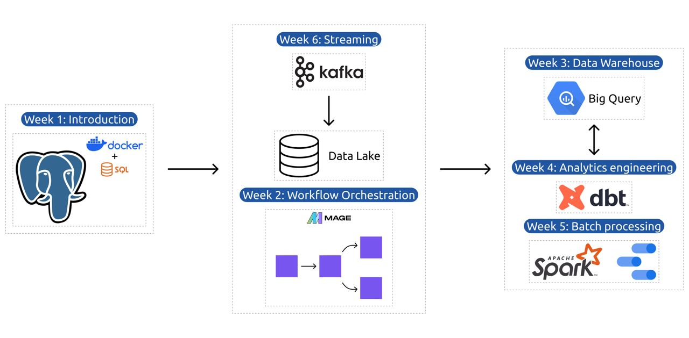
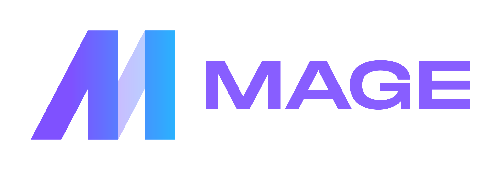

# Data Engineering Zoomcamp

  

- Register in [DataTalks.Club's Slack](https://datatalks.club/slack.html)
- Join the [`#course-data-engineering`](https://app.slack.com/client/T01ATQK62F8/C01FABYF2RG) channel
- Join the [course Telegram channel with announcements](https://t.me/dezoomcamp)
- The videos are published on [DataTalks.Club's YouTube channel](https://www.youtube.com/c/DataTalksClub) in [the course playlist](https://www.youtube.com/playlist?list=PL3MmuxUbc_hJed7dXYoJw8DoCuVHhGEQb)
- [Frequently asked technical questions](https://docs.google.com/document/d/19bnYs80DwuUimHM65UV3sylsCn2j1vziPOwzBwQrebw/edit?usp=sharing)

Syllabus

* [Module 1: Containerization and Infrastructure as Code](#module-1-containerization-and-infrastructure-as-code)
* [Module 2: Workflow Orchestration](#module-2-workflow-orchestration)
* [Workshop 1: Data Ingestion](#workshop-1-data-ingestion)
* [Module 3: Data Warehouse](#module-3-data-warehouse)
* [Module 4: Analytics Engineering](#module-4-analytics-engineering)
* [Module 5: Batch processing](#module-5-batch-processing)
* [Module 6: Streaming](#module-6-streaming)
* [Workshop 2: Stream Processing with SQL](#workshop-2-stream-processing-with-sql)
* [Project](#project)

## Taking the course

### 2024 Cohort

* **Start**: 15 January 2024 (Monday) at 17:00 CET
* **Registration link**: https://airtable.com/shr6oVXeQvSI5HuWD
* [Cohort folder](cohorts/2024/) with homeworks and deadlines 

### Self-paced mode

All the materials of the course are freely available, so that you
can take the course at your own pace

* Follow the suggested syllabus (see below) week by week
* You don't need to fill in the registration form. Just start watching the videos and join Slack
* Check [FAQ](https://docs.google.com/document/d/19bnYs80DwuUimHM65UV3sylsCn2j1vziPOwzBwQrebw/edit?usp=sharing) if you have problems
* If you can't find a solution to your problem in FAQ, ask for help in Slack

## Syllabus

> **Note:** NYC TLC changed the format of the data we use to parquet.
> In the course we still use the CSV files accessible [here](https://github.com/DataTalksClub/nyc-tlc-data).

### [Module 1: Containerization and Infrastructure as Code](01-docker-terraform/)

* Course overview
* Introduction to GCP
* Docker and docker-compose
* Running Postgres locally with Docker
* Setting up infrastructure on GCP with Terraform
* Preparing the environment for the course
* Homework

[More details](01-docker-terraform/)

### [Module 2: Workflow Orchestration](02-workflow-orchestration/)

* Data Lake
* Workflow orchestration
* Workflow orchestration with Mage
* Homework

[More details](02-workflow-orchestration/)

### [Workshop 1: Data Ingestion](cohorts/2024/workshops/dlt.md)

[More details](cohorts/2024/workshops/dlt.md)

### [Module 3: Data Warehouse](03-data-warehouse/)

* Data Warehouse
* BigQuery
* Partitioning and clustering
* BigQuery best practices
* Internals of BigQuery
* BigQuery Machine Learning

[More details](03-data-warehouse/)

### [Module 4: Analytics engineering](04-analytics-engineering/)

* Basics of analytics engineering
* dbt (data build tool)
* BigQuery and dbt
* Postgres and dbt
* dbt models
* Testing and documenting
* Deployment to the cloud and locally
* Visualizing the data with google data studio and metabase

[More details](04-analytics-engineering/)

### [Module 5: Batch processing](05-batch/)

* Batch processing
* What is Spark
* Spark Dataframes
* Spark SQL
* Internals: GroupBy and joins

[More details](05-batch/)

### [Module 6: Streaming](06-streaming/)

* Introduction to Kafka
* Schemas (avro)
* Kafka Streams
* Kafka Connect and KSQL

[More details](06-streaming/)

### [Workshop 2: Stream Processing with SQL](cohorts/2024/workshops/rising-wave.md)

[More details](cohorts/2024/workshops/rising-wave.md)

### [Project](projects)

Putting everything we learned to practice

* Week 1 and 2: working on your project
* Week 3: reviewing your peers

[More details](projects)

## Overview

### Prerequisites

To get the most out of this course, you should feel comfortable with coding and command line
and know the basics of SQL. Prior experience with Python will be helpful, but you can pick
Python relatively fast if you have experience with other programming languages.

Prior experience with data engineering is not required.

## Instructors

- [Ankush Khanna](https://linkedin.com/in/ankushkhanna2)
- [Victoria Perez Mola](https://www.linkedin.com/in/victoriaperezmola/)
- [Alexey Grigorev](https://linkedin.com/in/agrigorev)
- [Matt Palmer](https://www.linkedin.com/in/matt-palmer/)
- [Luis Oliveira](https://www.linkedin.com/in/lgsoliveira/)
- [Michael Shoemaker](https://www.linkedin.com/in/michaelshoemaker1/)

Past instructors:

- [Sejal Vaidya](https://www.linkedin.com/in/vaidyasejal/)
- [Irem Erturk](https://www.linkedin.com/in/iremerturk/)

## Course UI

Alternatively, you can access this course using the provided UI app, the app provides a user-friendly interface for navigating through the course material. 

* Visit the following link: [DE Zoomcamp UI](https://dezoomcamp.streamlit.app/)

## Asking for help in Slack

The best way to get support is to use [DataTalks.Club's Slack](https://datatalks.club/slack.html). Join the [`#course-data-engineering`](https://app.slack.com/client/T01ATQK62F8/C01FABYF2RG) channel.

To make discussions in Slack more organized:

* Follow [these recommendations](asking-questions.md) when asking for help
* Read the [DataTalks.Club community guidelines](https://datatalks.club/slack/guidelines.html)

## Supporters and partners

Thanks to the course sponsors for making it possible to run this course

  

  

  

Do you want to support our course and our community? Please reach out to [alexey@datatalks.club](alexey@datatalks.club)

