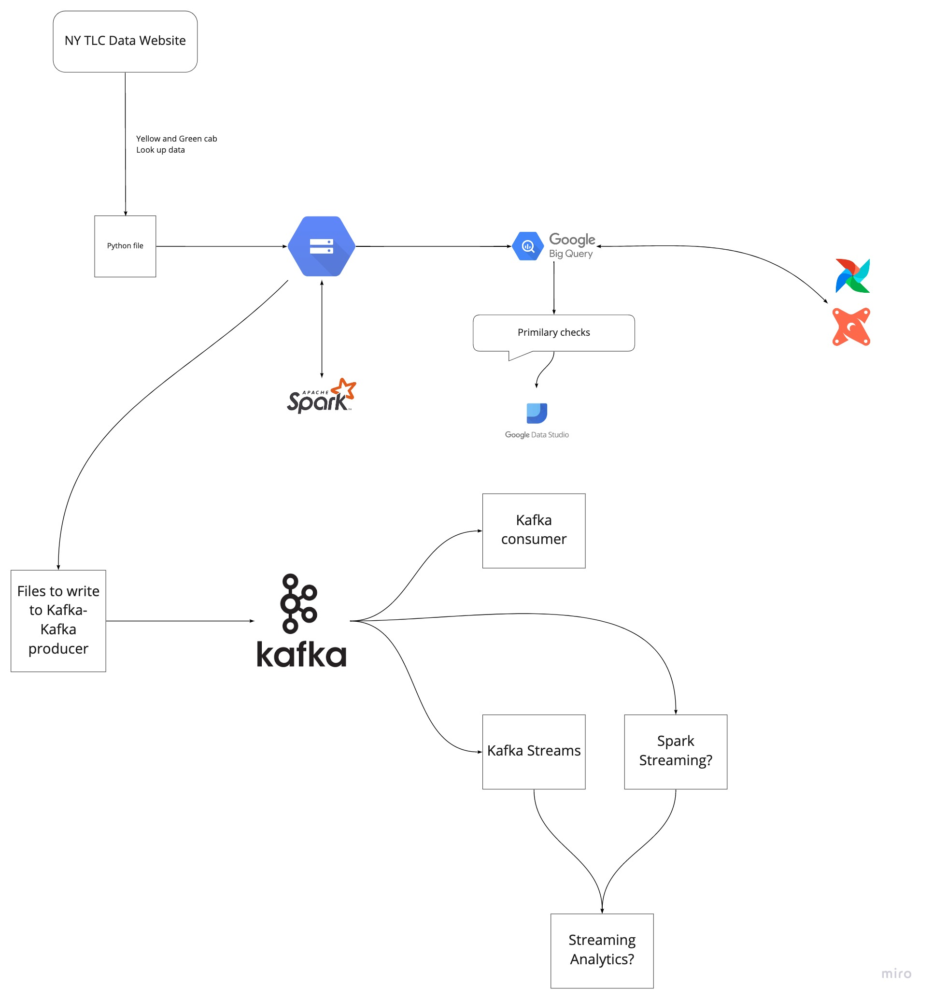

# Data Engineering Zoomcamp

- **Start**: 17 January 2022
- **Registration link**: https://airtable.com/shr6oVXeQvSI5HuWD
- Register in [DataTalks.Club's Slack](https://datatalks.club/slack.html)
- Join the [`#course-data-engineering`](https://app.slack.com/client/T01ATQK62F8/C01FABYF2RG) channel
- Subscribe to our [public Google Calendar](https://calendar.google.com/calendar/?cid=ZXIxcjA1M3ZlYjJpcXU0dTFmaG02MzVxMG9AZ3JvdXAuY2FsZW5kYXIuZ29vZ2xlLmNvbQ) (it works from Desktop only)
- The videos will be published to [DataTalks.Club's YouTube channel](https://www.youtube.com/c/DataTalksClub) in [the course playlist](https://www.youtube.com/playlist?list=PL3MmuxUbc_hJed7dXYoJw8DoCuVHhGEQb) 

## Syllabus

> **Note**: This is preliminary and may change

### [Week 1: Introduction & Prerequisites](week_1_basics_n_setup)

* Course overview
* Introduction to GCP
* Docker and docker-compose 
* Running Postgres locally with Docker
* Setting up infrastructure on GCP with Terraform
* Preparing the environment for the course
* Homework

[Details](week_1_basics_n_setup)

Duration: 2-2.5h

### [Week 2: Data ingestion](week_2_data_ingestion)

Goal: Orchestrating a job to ingest web data to a Data Lake in its raw form.

Instructor: Sejal & Alexey

* Data Lake (GCS) -- 10 mins
  * Basics, What is a Data Lake
  * ELT vs. ETL
  * Alternatives to components (S3/HDFS, Redshift, Snowflake etc.)
* Orchestration (Airflow) -- 15 mins
  * Basics
    * What is an Orchestration Pipeline?
    * What is a DAG?

* Demo:
  * Setup: (15 mins)
    * [ ] Docker pre-reqs (refresher)
    * [x] Airflow env with Docker
  * Data ingestion DAG - Demo (30 mins): 
    * [x] Extraction: Download and unpack the data
    * [ ] Pre-processing: Convert this raw data to parquet, partition (raw/yy/mm/dd)
    * [x] Load: Raw data to GCS
    * [x] Exploration: External Table for BigQuery -- Taking a look at the data
    * [ ] Further Enhancements: Transfer Service (AWS -> GCP)
   
Duration: 1.5h

### [Week 3: Data Warehouse](week_3_data_warehouse)

Goal: Structuring data into a Data Warehouse

Instructor: Ankush

* Data warehouse (BigQuery) (25 minutes)
    * What is a data warehouse solution
    * What is big query, why is it so fast, Cost of BQ,  (5 min)
    * Partitoning and clustering, Automatic re-clustering (10 min)
    * Pointing to a location in google storage (5 min)
    * Loading data to big query & PG (10 min) -- using Airflow operator?
    * BQ best practices
    * Misc: BQ Geo location, BQ ML 
    * Alternatives (Snowflake/Redshift)

Duration: 1-1.5h

### [Week 4: Analytics engineering](week_4_analytics_engineering/taxi_rides_ny/)

Goal: Transforming Data in DWH to Analytical Views

Instructor: Victoria

* Basics (15 mins)
    * What is DBT?
    * ETL vs ELT 
    * Data modeling
    * DBT fit of the tool in the tech stack
* Usage (Combination of coding + theory) (1:30-1:45 mins)
    * Anatomy of a dbt model: written code vs compiled Sources
    * Materialisations: table, view, incremental, ephemeral  
    * Seeds 
    * Sources and ref  
    * Jinja and Macros 
    * Tests  
    * Documentation 
    * Packages 
    * Deployment: local development vs production 
    * DBT cloud: scheduler, sources and data catalog (Airflow)
* Google data studio -> Dashboard
* Extra knowledge:
    * DBT cli (local)

Duration: 2h    

### [Week 5: Batch processing](week_5_batch_processing)

Goal: 

Instructor: Alexey

* Distributed processing (Spark) (40 + ? minutes)
    * What is Spark, spark cluster (5 mins)
    * Explaining potential of Spark (10 mins)
    * What is broadcast variables, partitioning, shuffle (10 mins)
    * Pre-joining data (10 mins)
    * use-case
    * What else is out there (Flink) (5 mins)
* Extending Orchestration env (airflow) (30 minutes)
    * Big query on airflow (10 mins)
    * Spark on airflow (10 mins)

Duration: 1-1.5h

### [Week 6: Streaming](week_6_stream_processing)

Goal: 

Instructor: Ankush

* Basics
    * What is Kafka
    * Internals of Kafka, broker
    * Partitoning of Kafka topic
    * Replication of Kafka topic
* Consumer-producer
* Schemas (avro)
* Streaming
    * Kafka streams
* Kafka connect
* Alternatives (PubSub/Pulsar)

Duration: 1.5h

### [Week 7, 8 & 9: Project](project)

* Putting everything we learned to practice

Duration: 2-3 weeks

* Upcoming buzzwords
  *  Delta Lake/Lakehouse
    * Databricks
    * Apache iceberg
    * Apache hudi
  * Data mesh
  * KSQLDB
  * Streaming analytics
  * Mlops
  
Duration: 30 mins

## Overview

### Architecture diagram

### Technologies
* *Google Cloud Platform (GCP)*: Cloud-based auto-scaling platform by Google
  * *Google Cloud Storage (GCS)*: Data Lake
  * *BigQuery*: Data Warehouse
* *Terraform*: Infrastructure-as-Code (IaC)
* *Docker*: Containerization
* *SQL*: Data Analysis & Exploration
* *Airflow*: Pipeline Orchestration
* *DBT*: Data Transformation
* *Spark*: Distributed Processing
* *Kafka*: Streaming

### Prerequisites

To get most out of this course, you should feel comfortable with coding and command line,
and know the basics of SQL. Prior experience with Python will be helpful, but you can pick 
Python relatively fast if you have experience with other programming languages.

Prior experience with data engineering is not required.

## Instructors

- Ankush Khanna (https://linkedin.com/in/ankushkhanna2)
- Sejal Vaidya (https://linkedin.com/in/vaidyasejal)
- Victoria Perez Mola (https://www.linkedin.com/in/victoriaperezmola/)
- Alexey Grigorev (https://linkedin.com/in/agrigorev)

## FAQ

* **Q**: I registered, but haven't received a confirmation email. Is it normal?
  **A**: Yes, it's normal. It's not automated. But you will receive an email eventually 
* **Q**: At what time of the day will it happen?
  **A**: Office hours will happen on Mondays at 17:00 CET. But everything will be recorded, so you can watch it whenever it's convenient for you
* **Q**: Will there be a certificate?
  **A**: Yes, if you complete the project
* **Q**: I'm 100% not sure I'll be able to attend. Can I still sign up?
  **A**: Yes, please do! You'll receive all the updates and then you can watch the course at your own pace. 
* **Q**: Do you plan to run a ML engineering course as well? **A**: Glad you asked. [We do](https://github.com/alexeygrigorev/mlbookcamp-code/tree/master/course-zoomcamp) :)

## Our friends 

Big thanks to other communities for helping us spread the word about the course: 

* [DPhi](https://dphi.tech/)
* [MLOps.community](https://mlops.community/)

Check them out - they are cool!
