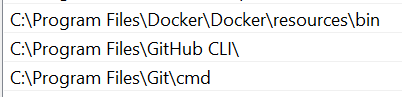

# Module-01 Walkthrough (2)

Start-to-Finish environment setup.

## Expectations

Set your expectations correctly! This is a free course. 
The materials are free, the videos are free, the help rendered is free. Everything is free, as in free beer...

Everyone is offering their effort and time voluntarily. Please respect their time, there's no need to tag the instructors. They visit the channel as a matter of course. I know it is *my* daily routine...

No one is required to come on the Slack channel and help anyone resolve their programming issues. Especially, if the "asker" is not willing to put in the work to supply information or answer questions, to help themselves. This is not everyone, of course. Just a small minority. Most are really good folks, getting frustrated by the learning process of unfamiliar materials.
But it is good form to engage in a community and pass the knowledge forward. We learn faster when we teach. The act of helping others benefits both the helper and the asker.

## What is Data Engineering

If you jump straight in before answering this essential question, then maybe that's why you're confused. You need to research the field to see if this is right for you and if this free course is the right one for you to start with.

If you lack the knowledge mentioned in the [pre-requisites](#pre-requisite-knowledge), perhaps you need to start with those subjects first, to fill in your knowledge gaps.

[Coursera](https://www.coursera.org/articles/what-does-a-data-engineer-do-and-how-do-i-become-one)'s definition:
> Data engineering is the practice of designing and building systems for collecting, storing, and analyzing data at scale. 

[Datacamp](https://www.datacamp.com/blog/what-is-data-engineering)'s definition:
> (the task of) design(ing) the systems that provide data to data scientists in an organized and consistent manner, (by using automated pipelines).

[Wikipedia](https://en.wikipedia.org/wiki/Data_engineering)'s definition: 
> refers to the building of systems to enable the collection and usage of data. This data is usually used to enable subsequent analysis and data science; which often involves machine learning. Making the data usable usually involves substantial compute and storage, as well as data processing.


## Goals of Module-01

The Goals and Prerequisites of this course was covered in the previous [video](https://youtu.be/VUZshlVAnk4). Get the slides [here](walkthrough-01.pdf). Here's a quick summary.

- docker_sql
  - setup and access database
  - populate database by ingesting data NYC Taxi 2021-01 yellow
  - query database <--- main focus
- gcp_terraform
  - setup gcp + service account
  - setup terraform
  - build terraform infrastructure <--- main focus, tie back to docker + database
    - init, plan, apply
  - tear-down infrastructure: destroy 

## Your tasks

- Understand the repository's organizational structure, in order to know what is where
- Watch the video playlist of lessons
- While it is not mandatory, reinforce the above lessons by completing homework as a milestone to determine if you've learn enough to work on a capstone project (you'll have 2 chances to submit project). 
- Submit a capstone project (plus evaluate 3 peers), to earn the certificate.
- Please refer to [FAQ](https://docs.google.com/document/d/19bnYs80DwuUimHM65UV3sylsCn2j1vziPOwzBwQrebw/edit?usp=sharing) if you have further questions.


## Pre-requisite knowledge

Assumed to already know the following. Also covered in  previous video.

- concept of server and client, port mapping, networks
- how to use command line 
- how to use git and github
- how to use conda, (or venv, pipenv, poetry, etc), aka environment managers etc
- how to write and read Markdown
- how to write and read code in Python
- how to write and read SQL statements
- how to read documentation, error messages
- how to ask for help when stuck
  - "rubber duck debugging": research it if never heard before
  - "3 before me": perform below actions before asking in slack and be sure to include pertinent info
    1. repo+videos, 
    1. search FAQ/Slack, 
    1. GPTs
  - [Zoomcamp's asking-questions](../../../asking-questions.md)
  - [Stackoverflow how-to-ask](https://stackoverflow.com/help/how-to-ask)
  - [LCHW how-to-ask-for-help](https://learncodethehardway.com/blog/03-how-to-ask-for-help/)


## Tools to install

Most of the time, instructions provided are for Windows system and if in terminal, it is in a WSL+Ubuntu CLI terminal, since that is what I have.

Download the installers for these apps/tools as standalone applications, unless otherwise specified. As much as possible, the sequence is arranged such that the subsequent items have dependencies on some of the previous ones (above it).

- terminal
- wsl2 + ubuntu 
- a code editor: vs code, pycharm, spyder, vim, nano
- docker desktop
- git + git-credential-manager
- gcp sdk
- a venv manager: anaconda, miniconda3, micromamba, etc

For the GCP + Terraform section, 

- prepare debit/credit card info
- google account
- google cloud platform account
- terraform client download & install

Not covered here, please refer to videos. It is very straightforward.

In Terminal, we setup the following

- git: gh auth or ssh (or git-credential-manager)
- virtual environment
- python libraries


## Setup environment for dezoomcamp

After all apps have been installed and ensure Docker Desktop (service) is running, we're ready to prepare our computer to start learning DEZoomcamp, by first creating the environment. 

### SSH keys
[connecting-to-github-with-ssh](https://docs.github.com/en/authentication/connecting-to-github-with-ssh)

In WSL2 terminal (or where you'll be doing the `git <command>` in). 
Note that the file must match the private key file that you created to authenticate with github.com for your git account. One private-public key pair is setup per host. Which means at this time, we need one pair for Github and one pair for GCP.

Check with `ls ~/.ssh/` if you forgot. The private key is the file without the .pub extension. By default, `ssh-keygen` uses the `ed25519` algorithm.

```bash
ssh-keygen -t <key-name> -C "your_email@example.com"
eval "$(ssh-agent -s)"
ssh-add ~/.ssh/<key-name>
```

Add the `<key-name>.pub` to github --> settings --> [SSH section](https://github.com/settings/keys). Keep the private `<key-name>` SECRET! Keep it SAFE! Don't upload to version control.

### Virtual Environment

- Ensure `conda init` is done and any other instructions completed for Docker install.
- Ensure the PATH is set. Don't need the `Github CLI` if not dealing with Issues, Pull Requests, etc.

- can confirm with the `-v` or `--version` flags to verify all the apps are installed and working properly, before we proceed:
  - `git -v`
  - `docker -v`
  - `conda --version`
- create the virtual environment with `conda create -n <env_name> python=3.9 <additional packages separated by space>`. This would ensure packages are verified to work together and has no incompatibilities. Do not install packages individually. And don't mix `conda install ...` with `pip install ...`; stick to one. Only as a last resort, if the `conda-forge` channel does not carry the package, do we use `pip`.
```bash
conda create -n dezoomcamp python=3.9 pandas pgcli
```
- activate this new environment with `conda activate <env_name>`
```bash
conda activate dezoomcamp
```

- can omit the `<additional packages>` if using an *environment.yaml* or *requirements.txt* file. This is the contents of my *yaml* file at the start of module-01.
```yaml
name: dezoomcamp
channels:
  - conda-forge
dependencies:
  - python >=3.9,<3.10
  - ipykernel
  - jupyter
  - pandas
  - pyarrow
  - sqlalchemy
  - pgcli
  - psycopg2-binary 
  - pip
```
- Use the *yaml* like this: `conda install -f environment.yaml`
- Installation of packages is done only after the venv has been activated!
- Actually, when using a *yaml* file, can combine the creation of environment and installation of packages in one step : `conda env create -f environment.yaml` and then just activate it when installation is done.
- When *not* using a *yaml* file is when the creation and installation is separated, like for other venv managers using *requirements.txt* file.


### Clone repo

- fork the DTC repo. We don't have permissions to edit the DTC repo as we are not a contributor or author of this repo. 
  - The act of forking means, we are taking a snapshot of the state of the files at this point of time and creating a clone under our username. 
  - If you had already cloned without forking, use the `git set-url` command to change `origin` to `upstream` and add your own as `origin`. Forking does this step for us.
- clone the repo, using either SSH or HTTP/S in your terminal. HTTP method requires that you input your  username and password for each `pull`/`fetch` and `push` command.
  1. If the folder is not yet created, do `git clone <url.to.repo>`. Folder would have the repo-name.
  1. If you had already created a folder using your preferred `<folder-name>`, different from the repo-name, 
     - `cd <folder-name>`
     - `git clone <url.to.repo> .` Notice the `<dot>` at the end, this signifies current path, so the cloned repo is not created as a sub-folder in this `<folder-name>`.


### Open the project folder in vs-code

- Multiple ways to open folder
  1. Right-click from Windows Explorer - note the consequences of `'/'`  versus `'\'` or `'\\'` in lessons for path and other strings. 
  1. If path contains a space, need to surround it with quotes
  1. Open from WSL+Ubuntu project folder in terminal using `code .` This requires OS to know where the PATH to vscode app is.
  1. Subsequent Open using vs-code shortcut would open from recent history of last-opened-project-folder-in-connected-host
- If you're not at the correct host, click the bottom-left-corner showing the connection or [Ctrl+Shift+P] to open the `Command Palette` and connect to host of your choice.
- Install these useful extensions
  - jupyter (working in jupyter)
  - docker (start and stop containers and list them)
  - git-graph (commit history in GUI)
  - terraform (you'd be prompted anyway when you do the setup)


#### Tips and Tricks of VSCode

- right-click on file within a folder to create an interactive terminal instead of changing directories several folders deep.
- utilise the Outline and Timeline panels.
- always perform a `git fetch` before you commit and push new content.
- use the Docker extension to start/stop containers or perform housekeeping of bad/stale images.
- port-forwarding in VS code: can delete and verify creation of ports when we spin up containers.
- can directly connect to Github Codespaces from within app, without going to browser first.


## Commands Glossary

A compilation of all the CLI commands used frequently. These are not comprehensive, of course. And only the ones used in module-01, so far.

If I'm so inclined I'll keep it updated for the whole course. But that would mean this section would live in its own markdown document.

You're welcome to help me keep it updated by sending me Pull Requests.

| OS   | purpose  | command |
|:---- |:---     |:---     |
| Win  | check path of [package] install | where [package]<br>eg: where git |
| *nix / macOS | check path of [package] install | which [package]<br>eg: which python |
| any  | check version of [package] <br>- *some has alias -v*<br>- *some uses -V uppercase*<br>- *check docs for correct syntax if common ones don't work*  | [package] --version|
| any  | verify versions examples |   - `git -v`<br>- `conda --version`<br>- `docker -v` |
| *nix*  | list ssh keys  | ls ~/.ssh/ |
| *nix | update *nix OS                  | sudo apt-get update && sudo apt-get |
| *nix | upgrade *nix OS                  | sudo apt-get upgrade |
| *nix | get info on *nix                | lsb_release -a |
| *nix | install `lsb-core` in order to run above command  | sudo apt-get install lsb-core | 
| any | info of conda install            | conda info |
| any | remove env by name               | conda remove --name [env-name] --all |
| any | activate env by name               | conda activate [env-name] |
| any | deactivate currently activated env            | conda deactivate  |
| any | install packages by channel<br>- *install only after an env has been activated*<br>- *never install in (base)*      | conda install -c conda-forge [packages list] |
| any  | open docs in browser            | git help git |
| any  | display working tree status | git status |
| any  | clone a repo by URL [path] <br>*if no [path] is provided, the repo will be cloned into a new folder using the repo name* | git clone [url.of.repo.to.clone]|
| any  | fetch a repo source-branch target-branch, <br>*if not specified it is assumed to be [origin] [main]* | git fetch [branch-remote] [branch-local]  |
| any  | get remote(s) info | git remote -v |
| any  | git add all files, modified and untracked<br>- *be careful with this one as it would commit ALL files!* | git add . |
| any  | git add files by mask pattern, only markdown files will be added to staging | git add *.md |
| any  | git add files by filename, exactly one file matching filename would be added to staging | git add homework-01-solution.md |
| any  | commit files added with `git add` | git commit -m "commit message" |
| any  | build Dockerfile in current path | docker build . | 
| any  | build docker-compose.yaml in current path | docker compose build . | 
| any  | spin up container using docker-compose.yaml in current path | docker compose up | 
| any  | tear-down/remove container spinned by `up`| docker compose down | 
| any  | spin up container by image name, use owner and tag if not unique | docker run -it <owner/image:tag> | 
| any  | spin up container by image name in detached mode, and enter the interactive terminal | docker run -it <owner/image:tag> -d | 
| any  | spin up container by image name in detached mode, and enter the interactive terminal, and remove container when stopped | docker run -it --rm <owner/image:tag> -d | 
| any  | spin up container by `image` name (`owner` & `tag` are optional, use for precision) in `detached` mode, and enter the `interactive terminal`, and `remove` container when stopped, and give it a specific name defined in `--name` flag | docker run -it --rm [owner/image:tag] -d --name [container-name]| 
| any  | start a container by id/or name if --name provided | docker start [the-container-id]| 
| any  | stop a container by id | docker stop [the-container-id] |
| any  | remove a container by id | docker rm [the-container-id] |
| any | Create a docker volume  | docker volume create --name [vol_name]  -d local |
| any | if using volume, add this entry to `yaml` file, under `pgdatabase` services, after `environment` |`  volumes:`<br>`  - "vol_name:/var/lib/postgresql/data:rw"` |
| any | if using volume, add this entry to `yaml` file, at the end | `volumes:`<br>`  vol_name:`<br>`    external: true` | 
| any | Using `pgcli` to connect to Postgres from local CLI | pgcli -h [host] -p [port#] -u [db-username] -d [db-name] |
| any | Create a network | docker network create [network_name] |
| any | if using network, add this entry to `yaml` file, at the end, for Github Codespaces | see `yaml` file contents below | 
| any | ingest csv using python in local CLI connecting to postgres container |`URL="https://github.com/DataTalksClub/nyc-tlc-data/releases/download/yellow/yellow_tripdata_2021-01.csv.gz"`<br><br>`python ingest_data.py \`<br>`--user=root \`<br>`--password=root \`<br>`--host=localhost \`<br>`--port=5432 \`<br>`--db=ny_taxi \`<br>`--table_name=yellow_taxi_trips \`<br>`--url=${URL}` |
| any | ingest csv using docker `taxi_ingest` image | `URL="https://github.com/DataTalksClub/nyc-tlc-data/releases/download/yellow/yellow_tripdata_2021-01.csv.gz"`<br><br>`docker run -it \`<br>`  --network=pg-network \`<br>`  taxi_ingest:v001 \`<br>`  --user=root \`<br>`  --password=root \`<br>`  --host=pg-database \`<br>`  --port=5432 \`<br>`  --db=ny_taxi \`<br>`  --table_name=yellow_taxi_trips \`<br>`  --url=${URL}` |
| | |
| | |

## Docker compose yaml 

At the end of these 2 walkthrough sessions, these are the contents of my docker-compose.yaml

### version that works for me for WSL+Ubuntu

```yaml
services:
  pgdatabase:
    image: postgres:13
    env_file:
      - database.env  # Load environment variables from database.env
    environment:
      - POSTGRES_USER=${POSTGRES_USER}
      - POSTGRES_PASSWORD=${POSTGRES_PASSWORD}
      - POSTGRES_DB=${POSTGRES_DB}
    volumes:
      - "dtc_postgres_volume_local:/var/lib/postgresql/data:rw"
    ports:
      - "5432:5432"
  pgadmin:
    image: dpage/pgadmin4
    environment:
      - PGADMIN_DEFAULT_EMAIL=admin@admin.com
      - PGADMIN_DEFAULT_PASSWORD=root
    ports:
      - "8080:80"
volumes:
  dtc_postgres_volume_local:
    external: true
```

contents of `database.env`
```yaml
POSTGRES_USER=root
POSTGRES_PASSWORD=root
POSTGRES_DB=ny_taxi
```

### version that works for me for codespaces

`*dollop*` was the name Codespaces generated for me when I spin up the Virtual Machine, during the demo. So, I just use it as a name...it doesn't have any significance otherwise.

```yaml
services:
  pgdatabase:
    image: postgres:13
    environment:
      - POSTGRES_USER=root
      - POSTGRES_PASSWORD=root
      - POSTGRES_DB=ny_taxi
    volumes:
      - "dollop_volume:/var/lib/postgresql/data:rw"
    ports:
      - "5432:5432"
    networks:
      - pg-network      
  pgadmin:
    image: dpage/pgadmin4
    environment:
      - PGADMIN_DEFAULT_EMAIL=admin@admin.com
      - PGADMIN_DEFAULT_PASSWORD=root
    ports:
      - "8080:80"
    networks:
      - pg-network
networks:
  pg-network:
    name: pg-network
    external: true  
volumes:
  dollop_volume:
    external: true    
```
