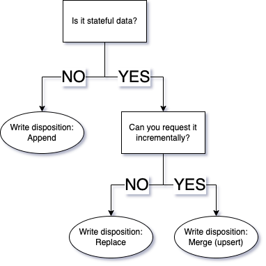

# Intro

What is data loading, or data ingestion?

Data ingestion is the process of extracting data from a producer, transporting it to a convenient environment, and preparing it for usage by normalising it, sometimes cleaning, and adding metadata.

### “A wild dataset magically appears!”

In many data science teams, data magically appears - because the engineer loads it.

- Sometimes the format in which it appears is structured, and with explicit schema
    - In that case, they can go straight to using it; Examples: Parquet, Avro, or table in a db,
- Sometimes the format is weakly typed and without explicit schema, such as csv, json
    - in which case some extra normalisation or cleaning might be needed before usage

> 💡 **What is a schema?** The schema specifies the expected format and structure of data within a document or data store, defining the allowed keys, their data types, and any constraints or relationships.


### Be the magician! 😎

Since you are here to learn about data engineering, you will be the one making datasets magically appear. 

Here’s what you need to learn to build pipelines

- Extracting data
- Normalising, cleaning, adding metadata such as schema and types
- and Incremental loading, which is vital for fast, cost effective data refreshes.

### What else does a data engineer do? What are we not learning, and what are we learning?

- It might seem simplistic, but in fact a data engineer’s main goal is to ensure data flows from source systems to analytical destinations.
- So besides building pipelines, running pipelines and fixing pipelines, a data engineer may also focus on optimising data storage, ensuring data quality and integrity, implementing effective data governance practices, and continuously refining data architecture to meet the evolving needs of the organisation.
- Ultimately, a data engineer's role extends beyond the mechanical aspects of pipeline development, encompassing the strategic management and enhancement of the entire data lifecycle.
- This workshop focuses on building robust, scalable, self maintaining pipelines, with built in governance - in other words, best practices applied.

# Extracting data

### The considerations of extracting data

In this section we will learn about extracting data from source systems, and what to care about when doing so.

Most data is stored behind an API 

- Sometimes that’s a RESTful api for some business application, returning records of data.
- Sometimes the API returns a secure file path to something like a json or parquet file in a bucket that enables you to grab the data in bulk,
- Sometimes the API is something else (mongo, sql, other databases or applications) and will generally return records as JSON - the most common interchange format.

As an engineer, you will need to build pipelines that “just work”. 

So here’s what you need to consider on extraction, to prevent the pipelines from breaking, and to keep them running smoothly.

- Hardware limits: During this course we will cover how to navigate the challenges of managing memory.
- Network limits: Sometimes networks can fail. We can’t fix what could go wrong but we can retry network jobs until they succeed. For example, dlt library offers a requests “replacement” that has built in retries. [Docs](https://dlthub.com/docs/reference/performance#using-the-built-in-requests-client). We won’t focus on this during the course but you can read the docs on your own.
- Source api limits: Each source might have some limits such as how many requests you can do per second. We would call these “rate limits”. Read each source’s docs carefully to understand how to navigate these obstacles. You can find some examples of how to wait for rate limits in our verified sources repositories
    - examples: [Zendesk](https://developer.zendesk.com/api-reference/introduction/rate-limits/), [Shopify](https://shopify.dev/docs/api/usage/rate-limits)

### Extracting data without hitting hardware limits

What kind of limits could you hit on your machine? In the case of data extraction, the only limits are memory and storage. This refers to the RAM or virtual memory, and the disk, or physical storage.

### **Managing memory.**

- Many data pipelines run on serverless functions or on orchestrators that delegate the workloads to clusters of small workers.
- These systems have a small memory or share it between multiple workers - so filling the memory is BAAAD: It might lead to not only your pipeline crashing, but crashing the entire container or machine that might be shared with other worker processes, taking them down too.
- The same can be said about disk - in most cases your disk is sufficient, but in some cases it’s not. For those cases, mounting an external drive mapped to a storage bucket is the way to go. Airflow for example supports a “data” folder that is used just like a local folder but can be mapped to a bucket for unlimited capacity.

### So how do we avoid filling the memory?

- We often do not know the volume of data upfront
- And we cannot scale dynamically or infinitely on hardware during runtime
- So the answer is: Control the max memory you use

### Control the max memory used by streaming the data

Streaming here refers to processing the data event by event or chunk by chunk instead of doing bulk operations. 

Let’s look at some classic examples of streaming where data is transferred chunk by chunk or event by event

- Between an audio broadcaster and an in-browser audio player
- Between a server and a local video player
- Between a smart home device or IoT device and your phone
- between google maps and your navigation app
- Between instagram live and your followers

What do data engineers do? We usually stream the data between buffers, such as 

- from API to local file
- from webhooks to event queues
- from event queue (Kafka, SQS) to Bucket

### Streaming in python via generators

Let’s focus on how we build most data pipelines:

- To process data in a stream in python, we use generators, which are functions that can return multiple times - by allowing multiple returns, the data can be released as it’s produced, as stream, instead of returning it all at once as a batch.

Take the following theoretical example: 

- We search twitter for “cat pictures”. We do not know how many pictures will be returned - maybe 10, maybe 10.000.000. Will they fit in memory? Who knows.
- So to grab this data without running out of memory, we would use a python generator.
- What’s a generator? In simple words, it’s a function that can return multiple times. Here’s an example of a regular function, and how that function looks if written as a generator.

### Generator examples:

Let’s look at a regular returning function, and how we can re-write it as a generator.

**Regular function collects data in memory.** Here you can see how data is collected row by row in a list called `data`before it is returned. This will break if we have more data than memory.

```python
def search_twitter(query):
	data = []
	for row in paginated_get(query):
		data.append(row)
	return data

# Collect all the cat picture data
for row in search_twitter("cat pictures"):
  # Once collected, 
  # print row by row
	print(row)
```

When calling `for row in search_twitter("cat pictures"):` all the data must first be downloaded before the first record is returned

Let’s see how we could rewrite this as a generator.

**Generator for streaming the data.** The memory usage here is minimal.

As you can see, in the modified function, we yield each row as we get the data, without collecting it into memory. We can then run this generator and handle the data item by item.

```python
def search_twitter(query):
	for row in paginated_get(query):
		yield row

# Get one row at a time
for row in extract_data("cat pictures"):
	# print the row
	print(row)
  # do something with the row such as cleaning it and writing it to a buffer
	# continue requesting and printing data
```

When calling `for row in extract_data("cat pictures"):` the function only runs until the first data item is yielded, before printing - so we do not need to wait long for the first value. It will then continue until there is no more data to get.

If we wanted to get all the values at once from a generator instead of one by one, we would need to first “run” the generator and collect the data. For example, if we wanted to get all the data in memory we could do `data = list(extract_data("cat pictures"))` which would run the generator and collect all the data in a list before continuing.

## 3 Extraction examples:

### Example 1: Grabbing data from an api

> 💡 This is the bread and butter of data engineers pulling data, so follow along in the colab or in your local setup.


For these purposes we created an api that can serve the data you are already familiar with, the NYC taxi dataset.

The api documentation is as follows:

- There are a limited nr of records behind the api
- The data can be requested page by page, each page containing 1000 records
- If we request a page with no data, we will get a successful response with no data
- so this means that when we get an empty page, we know there is no more data and we can stop requesting pages - this is a common way to paginate but not the only one - each api may be different.
- details:
    - method: get
    - url: `https://us-central1-dlthub-analytics.cloudfunctions.net/data_engineering_zoomcamp_api`
    - parameters: `page`  integer. Represents the page number you are requesting. Defaults to 1.
    

So how do we design our requester? 

- We need to request page by page until we get no more data. At this point, we do not know how much data is behind the api.
- It could be 1000 records or it could be 10GB of records. So let’s grab the data with a generator to avoid having to fit an undetermined amount of data into ram.

In this approach to grabbing data from apis, we have pros and cons:

- Pros: **Easy memory management** thanks to api returning events/pages
- Cons: **Low throughput**, due to the data transfer being constrained via an API.

```bash
import requests

BASE_API_URL = "https://us-central1-dlthub-analytics.cloudfunctions.net/data_engineering_zoomcamp_api"

# I call this a paginated getter
# as it's a function that gets data
# and also paginates until there is no more data
# by yielding pages, we "microbatch", which speeds up downstream processing

def paginated_getter():
    page_number = 1

    while True:
        # Set the query parameters
        params = {'page': page_number}

        # Make the GET request to the API
        response = requests.get(BASE_API_URL, params=params)
        response.raise_for_status()  # Raise an HTTPError for bad responses
        page_json = response.json()
        print(f'got page number {page_number} with {len(page_json)} records')

        # if the page has no records, stop iterating
        if page_json:
            yield page_json
            page_number += 1
        else:
            # No more data, break the loop
            break

if __name__ == '__main__':
    # Use the generator to iterate over pages
    for page_data in paginated_getter():
        # Process each page as needed
        print(page_data)
```

### Example 2: Grabbing the same data from file - simple download


> 💡 This part is demonstrative, so you do not need to follow along; just pay attention.


- Why am I showing you this? so when you do this in the future, you will remember there is a best practice you can apply for scalability.

Some apis respond with files instead of pages of data. The reason for this is simple: Throughput and cost. A restful api that returns data has to read the data from storage and process and return it to you by some logic - If this data is large, this costs time, money and creates a bottleneck. 

A better way is to offer the data as files that someone can download from storage directly, without going through the restful api layer. This is common for apis that offer large volumes of data, such as ad impressions data.

In this example, we grab exactly the same data as we did in the API example above, but now we get it from the underlying file instead of going through the API.

- Pros: **High throughput**
- Cons: **Memory** is used to hold all the data

This is how the code could look. As you can see in this case our `data`and  `parsed_data` variables hold the entire file data in memory before returning it. Not great.

```python
import requests
import json

url = "https://storage.googleapis.com/dtc_zoomcamp_api/yellow_tripdata_2009-06.jsonl"

def download_and_read_jsonl(url):
    response = requests.get(url)
    response.raise_for_status()  # Raise an HTTPError for bad responses
    data = response.text.splitlines()
    parsed_data = [json.loads(line) for line in data]
    return parsed_data
   

downloaded_data = download_and_read_jsonl(url)

if downloaded_data:
    # Process or print the downloaded data as needed
    print(downloaded_data[:5])  # Print the first 5 entries as an example
```

### Example 3: Same file, streaming download


> 💡 This is the bread and butter of data engineers pulling data, so follow along in the colab

Ok, downloading files is simple, but what if we want to do a stream download?

That’s possible too - in effect giving us the best of both worlds. In this case we prepared a jsonl file which is already split into lines making our code simple. But json (not jsonl) files could also be downloaded in this fashion, for example using the `ijson` library.

What are the pros and cons of this method of grabbing data?

Pros: **High throughput, easy memory management,** because we are downloading a file

Cons: **Difficult to do for columnar file formats**, as entire blocks need to be downloaded before they can be deserialised to rows. Sometimes, the code is complex too.

Here’s what the code looks like - in a jsonl file each line is a json document, or a “row” of data, so we yield them as they get downloaded. This allows us to download one row and process it before getting the next row.

```bash
import requests
import json

def download_and_yield_rows(url):
    response = requests.get(url, stream=True)
    response.raise_for_status()  # Raise an HTTPError for bad responses

    for line in response.iter_lines():
        if line:
            yield json.loads(line)

# Replace the URL with your actual URL
url = "https://storage.googleapis.com/dtc_zoomcamp_api/yellow_tripdata_2009-06.jsonl"

# Use the generator to iterate over rows with minimal memory usage
for row in download_and_yield_rows(url):
    # Process each row as needed
    print(row)
```

In the colab notebook you can also find a code snippet to load the data - but we will load some data later in the course and you can explore the colab on your own after the course. 

What is worth keeping in mind at this point is that our loader library that we will use later, `dlt`or data load tool, will respect the streaming concept of the generator and will process it in an efficient way keeping memory usage low and using parallelism where possible.

Let’s move over to the Colab notebook and run examples 2 and 3, compare them, and finally load examples 1 and 3 to DuckDB

# Normalising data

You often hear that data people spend most of their time “cleaning” data. What does this mean? 

Let’s look granularly into what people consider data cleaning. 

Usually we have 2 parts: 

- Normalising data without changing its meaning,
- and filtering data for a use case, which changes its meaning.

### Part of what we often call data cleaning is just metadata work:

- Add types (string to number, string to timestamp, etc)
- Rename columns: Ensure column names follow a supported standard downstream - such as no strange characters in the names.
- Flatten nested dictionaries: Bring nested dictionary values into the top dictionary row
- Unnest lists or arrays into child tables: Arrays or lists cannot be flattened into their parent record, so if we want flat data we need to break them out into separate tables.
- We will look at a practical example next, as these concepts can be difficult to visualise from text.

### **Why prepare data? why not use json as is?**

- We do not easily know what is inside a json document due to lack of schema
- Types are not enforced between rows of json - we could have one record where age is `25`and another where age is `twenty five` , and another where it’s `25.00`.  Or in some systems, you might have a dictionary for a single record, but a list of dicts for multiple records. This could easily lead to applications downstream breaking.
- We cannot just use json data easily, for example we would need to convert strings to time if we want to do a daily aggregation.
- Reading json loads more data into memory, as the whole document is scanned - while in parquet or databases we can scan a single column of a document. This causes costs and slowness.
- Json is not fast to aggregate - columnar formats are.
- Json is not fast to search.
- Basically json is designed as a "lowest common denominator format" for "interchange" / data transfer and is unsuitable for direct analytical usage.

### Practical example


> 💡 This is the bread and butter of data engineers pulling data, so follow along in the colab notebook.

In the case of the NY taxi rides data, the dataset is quite clean - so let’s instead use a small example of more complex data. Let’s assume we know some information about passengers and stops.

For this example we modified the dataset as follows

- We added nested dictionaries
    
    ```json
    "coordinates": {
                "start": {
                    "lon": -73.787442,
                    "lat": 40.641525
                    },
    ```
    
- We added nested lists
    
    ```json
    "passengers": [
                {"name": "John", "rating": 4.9},
                {"name": "Jack", "rating": 3.9}
                  ],
    ```
    
- We added a record hash that gives us an unique id for the record, for easy identification
    
    ```json
    "record_hash": "b00361a396177a9cb410ff61f20015ad",
    ```
    

We want to load this data to a database. How do we want to clean the data?

- We want to flatten dictionaries into the base row
- We want to flatten lists into a separate table
- We want to convert time strings into time type

```python
data = [
    {
        "vendor_name": "VTS",
		"record_hash": "b00361a396177a9cb410ff61f20015ad",
        "time": {
            "pickup": "2009-06-14 23:23:00",
            "dropoff": "2009-06-14 23:48:00"
        },
        "Trip_Distance": 17.52,
        "coordinates": {
            "start": {
                "lon": -73.787442,
                "lat": 40.641525
            },
            "end": {
                "lon": -73.980072,
                "lat": 40.742963
            }
        },
        "Rate_Code": None,
        "store_and_forward": None,
        "Payment": {
            "type": "Credit",
            "amt": 20.5,
            "surcharge": 0,
            "mta_tax": None,
            "tip": 9,
            "tolls": 4.15,
			"status": "booked"
        },
        "Passenger_Count": 2,
        "passengers": [
            {"name": "John", "rating": 4.9},
            {"name": "Jack", "rating": 3.9}
        ],
        "Stops": [
            {"lon": -73.6, "lat": 40.6},
            {"lon": -73.5, "lat": 40.5}
        ]
    },
]
```

Now let’s normalise this data.

## Introducing dlt

dlt is a python library created for the purpose of assisting data engineers to build simpler, faster and more robust pipelines with minimal effort. 

You can think of dlt as a loading tool that implements the best practices of data pipelines enabling you to just “use” those best practices in your own pipelines, in a declarative way. 

This enables you to stop reinventing the flat tyre, and leverage dlt to build pipelines much faster than if you did everything from scratch.

dlt automates much of the tedious work a data engineer would do, and does it in a way that is robust. dlt can handle things like:

- Schema: Inferring and evolving schema, alerting changes, using schemas as data contracts.
- Typing data, flattening structures, renaming columns to fit database standards.  In our example we will pass the “data” you can see above and see it normalised.
- Processing a stream of events/rows without filling memory. This includes extraction from generators.
- Loading to a variety of dbs or file formats.

Let’s use it to load our nested json to duckdb:

Here’s how you would do that on your local machine. I will walk you through before showing you in colab as well.

First, install dlt

```bash
# Make sure you are using Python 3.8-3.11 and have pip installed
# spin up a venv
python -m venv ./env
source ./env/bin/activate
# pip install
pip install dlt[duckdb]
```

Next, grab your data from above and run this snippet

- here we define a pipeline, which is a connection to a destination
- and we run the pipeline, printing the outcome

```python
# define the connection to load to. 
# We now use duckdb, but you can switch to Bigquery later
pipeline = dlt.pipeline(pipeline_name="taxi_data",
						destination='duckdb', 
						dataset_name='taxi_rides')

# run the pipeline with default settings, and capture the outcome
info = pipeline.run(data, 
                    table_name="users", 
                    write_disposition="replace")

# show the outcome
print(info)
```

If you are running dlt locally you can use the built in streamlit app by running the cli command with the pipeline name we chose above.

```bash
dlt pipeline taxi_data show
```

Or explore the data in the linked colab notebook. I’ll switch to it now to show you the data.

# Incremental loading

Incremental loading means that as we update our datasets with the new data, we would only load the new data, as opposed to making a full copy of a source’s data all over again and replacing the old version.

By loading incrementally, our pipelines run faster and cheaper.

- Incremental loading goes hand in hand with incremental extraction and state, two concepts which we will not delve into during this workshop
    - `State` is information that keeps track of what was loaded, to know what else remains to be loaded. dlt stores the state at the destination in a separate table.
    - Incremental extraction refers to only requesting the increment of data that we need, and not more. This is tightly connected to the state to determine the exact chunk that needs to be extracted and loaded.
- You can learn more about incremental extraction and state by reading the dlt docs on how to do it.

### dlt currently supports 2 ways of loading incrementally:

1. Append: 
    - We can use this for immutable or stateless events (data that doesn’t change), such as taxi rides - For example,  every day there are new rides, and we could load the new ones only instead of the entire history.
    - We could also use this to load different versions of stateful data, for example for creating a “slowly changing dimension” table for auditing changes. For example, if we load a list of cars and their colors every day, and one day one car changes color, we need both sets of data to be able to discern that a change happened.
2. Merge: 
    - We can use this to update  data that changes.
    - For example, a taxi ride could have a payment status, which is originally “booked” but could later be changed into “paid”, “rejected” or “cancelled”

Here is how you can think about which method to use:



* If you want to keep track of when changes occur in stateful data (slowly changing dimension) then you will need to append the data

### Let’s do a merge example together:


> 💡 This is the bread and butter of data engineers pulling data, so follow along.


- In our previous example, the payment status changed from "booked" to “cancelled”. Perhaps Jack likes to fraud taxis and that explains his low rating. Besides the ride status change, he also got his rating lowered further.
- The merge operation replaces an old record with a new one based on a key. The key could consist of multiple fields or a single unique id. We will use record hash that we created for simplicity. If you do not have a unique key, you could create one deterministically out of several fields, such as by concatenating the data and hashing it.
- A merge operation replaces rows, it does not update them. If you want to update only parts of a row, you would have to load the new data by appending it and doing a custom transformation to combine the old and new data.

In this example, the score of the 2 drivers got lowered and we need to update the values. We do it by using merge write disposition, replacing the records identified by  `record hash` present in the new data.

```python
data = [
    {
        "vendor_name": "VTS",
		"record_hash": "b00361a396177a9cb410ff61f20015ad",
        "time": {
            "pickup": "2009-06-14 23:23:00",
            "dropoff": "2009-06-14 23:48:00"
        },
        "Trip_Distance": 17.52,
        "coordinates": {
            "start": {
                "lon": -73.787442,
                "lat": 40.641525
            },
            "end": {
                "lon": -73.980072,
                "lat": 40.742963
            }
        },
        "Rate_Code": None,
        "store_and_forward": None,
        "Payment": {
            "type": "Credit",
            "amt": 20.5,
            "surcharge": 0,
            "mta_tax": None,
            "tip": 9,
            "tolls": 4.15,
			"status": "cancelled"
        },
        "Passenger_Count": 2,
        "passengers": [
            {"name": "John", "rating": 4.4},
            {"name": "Jack", "rating": 3.6}
        ],
        "Stops": [
            {"lon": -73.6, "lat": 40.6},
            {"lon": -73.5, "lat": 40.5}
        ]
    },
]

# define the connection to load to. 
# We now use duckdb, but you can switch to Bigquery later
pipeline = dlt.pipeline(destination='duckdb', dataset_name='taxi_rides')

# run the pipeline with default settings, and capture the outcome
info = pipeline.run(data, 
					table_name="users", 
					write_disposition="merge", 
					merge_key="record_hash")

# show the outcome
print(info)
```

As you can see in your notebook, the payment status and Jack’s rating were updated after running the code.

### What’s next?

- You could change the destination to parquet + local file system or storage bucket. See the colab bonus section.
- You could change the destination to BigQuery. Destination & credential setup docs: https://dlthub.com/docs/dlt-ecosystem/destinations/, https://dlthub.com/docs/walkthroughs/add_credentials
or See the colab bonus section.
- You could use a decorator to convert the generator into a customised dlt resource: https://dlthub.com/docs/general-usage/resource
- You can deep dive into building more complex pipelines by following the guides:
    - https://dlthub.com/docs/walkthroughs
    - https://dlthub.com/docs/build-a-pipeline-tutorial
- You can join our [Slack community](https://dlthub.com/community) and engage with us there.