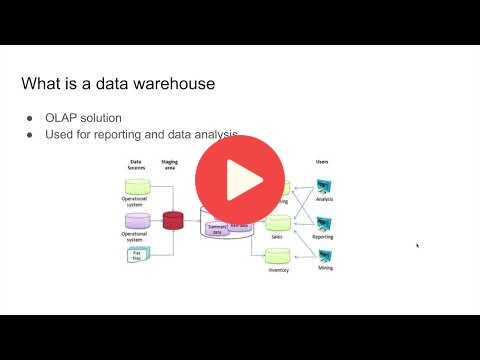
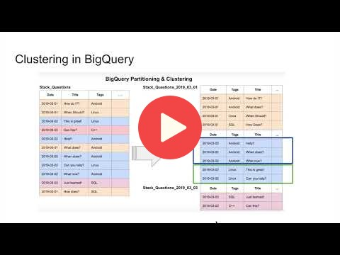
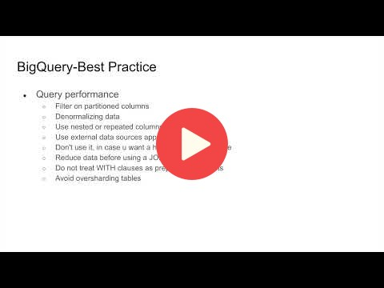
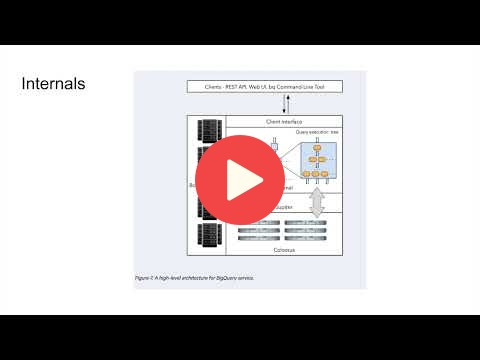
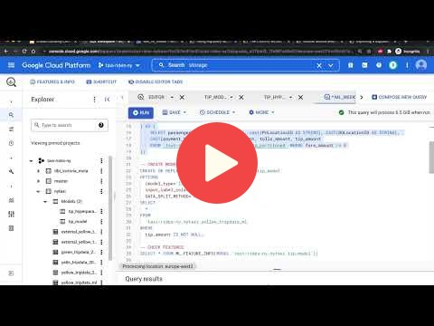
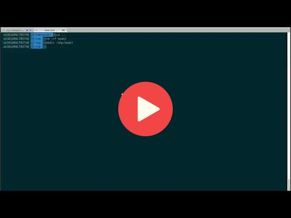

# Data Warehouse and BigQuery

- [Slides](https://docs.google.com/presentation/d/1a3ZoBAXFk8-EhUsd7rAZd-5p_HpltkzSeujjRGB2TAI/edit?usp=sharing)
- [Big Query basic SQL](big_query.sql)

## Videos
### Data Warehouse
- Data Warehouse and BigQuery

### Partitioning and clustering
- Partitioning vs Clustering

### Best practices

### Internals of BigQuery

### Advanced topics
#### Machine Learning in Big Query

* [SQL for ML in BigQuery](big_query_ml.sql)

**Important links**

- [BigQuery ML Tutorials](https://cloud.google.com/bigquery-ml/docs/tutorials)
- [BigQuery ML Reference Parameter](https://cloud.google.com/bigquery-ml/docs/analytics-reference-patterns)
- [Hyper Parameter tuning](https://cloud.google.com/bigquery-ml/docs/reference/standard-sql/bigqueryml-syntax-create-glm)
- [Feature preprocessing](https://cloud.google.com/bigquery-ml/docs/reference/standard-sql/bigqueryml-syntax-preprocess-overview)

#### Deploying Machine Learning model from BigQuery

- [Steps to extract and deploy model with docker](02-model-deployment.md)
