# Batch Processing

## 6.1 Introduction
* :movie_camera: 6.1.1 Introduction to Batch Processing

[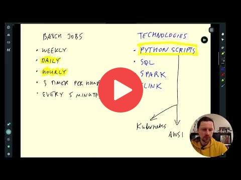](https://youtu.be/dcHe5Fl3MF8&list=PL3MmuxUbc_hJed7dXYoJw8DoCuVHhGEQb&index=51)

* :movie_camera: 6.1.2 Introduction to Spark

[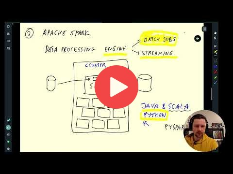](https://youtu.be/FhaqbEOuQ8U&list=PL3MmuxUbc_hJed7dXYoJw8DoCuVHhGEQb&index=52)

## 6.2 Installation
Follow [these instructions](setup/) to install Spark:

* [Windows](setup/windows.md)
* [Linux](setup/linux.md)
* [MacOS](setup/macos.md)

:movie_camera: 6.2.1 (Optional) Installing Spark (Linux)

Alternatively, if the setups above don't work, you can run Spark in Google Colab.
> [!NOTE]
> It's advisable to invest some time in setting things up locally rather than immediately jumping into this solution

* [Google Colab Instructions](https://medium.com/gitconnected/launch-spark-on-google-colab-and-connect-to-sparkui-342cad19b304)
* [Google Colab Starter Notebook](https://github.com/aaalexlit/medium_articles/blob/main/Spark_in_Colab.ipynb)

## 6.3 Spark SQL and DataFrames
* :movie_camera: 6.3.1 First Look at Spark/PySpark

[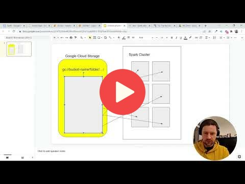](https://youtu.be/r_Sf6fCB40c&list=PL3MmuxUbc_hJed7dXYoJw8DoCuVHhGEQb&index=54)

* :movie_camera: 6.3.2 Spark Dataframes

[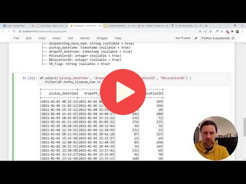](https://youtu.be/ti3aC1m3rE8&list=PL3MmuxUbc_hJed7dXYoJw8DoCuVHhGEQb&index=55)

* :movie_camera: 6.3.3 (Optional) Preparing Yellow and Green Taxi Data

[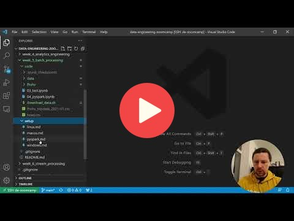](https://youtu.be/CI3P4tAtru4&list=PL3MmuxUbc_hJed7dXYoJw8DoCuVHhGEQb&index=56)

Script to prepare the Dataset [download_data.sh](code/download_data.sh)

> [!NOTE]
> The other way to infer the schema (apart from pandas) for the csv files, is to set the `inferSchema` option to `true` while reading the files in Spark.

* :movie_camera: 6.3.4 SQL with Spark

[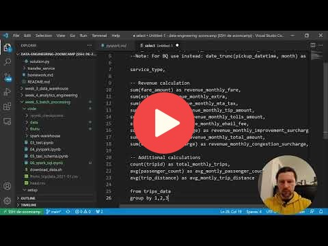](https://youtu.be/uAlp2VuZZPY&list=PL3MmuxUbc_hJed7dXYoJw8DoCuVHhGEQb&index=57)

## 6.4 Spark Internals
* :movie_camera: 6.4.1 Anatomy of a Spark Cluster

[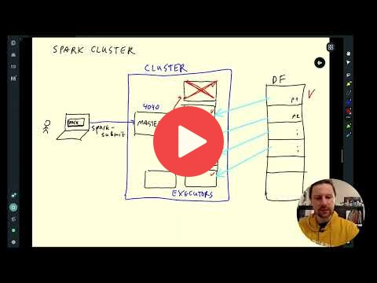](https://youtu.be/68CipcZt7ZA&list=PL3MmuxUbc_hJed7dXYoJw8DoCuVHhGEQb&index=58)

* :movie_camera: 6.4.2 GroupBy in Spark

[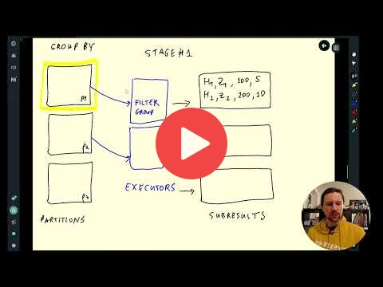](https://youtu.be/9qrDsY_2COo&list=PL3MmuxUbc_hJed7dXYoJw8DoCuVHhGEQb&index=59)

* :movie_camera: 6.4.3 Joins in Spark

[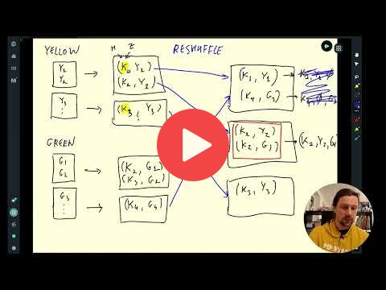](https://youtu.be/lu7TrqAWuH4&list=PL3MmuxUbc_hJed7dXYoJw8DoCuVHhGEQb&index=60)

## 6.5 (Optional) Resilient Distributed Datasets
* :movie_camera: 6.5.1 Operations on Spark RDDs

[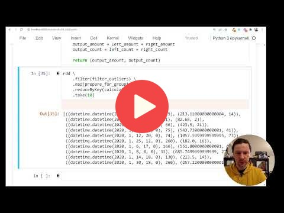](https://youtu.be/Bdu-xIrF3OM&list=PL3MmuxUbc_hJed7dXYoJw8DoCuVHhGEQb&index=61)

* :movie_camera: 6.5.2 Spark RDD mapPartition

[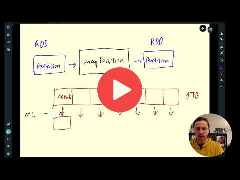](https://youtu.be/k3uB2K99roI&list=PL3MmuxUbc_hJed7dXYoJw8DoCuVHhGEQb&index=62)

## 6.6 Running Spark in the Cloud
* :movie_camera: 6.6.1 Connecting to Google Cloud Storage

[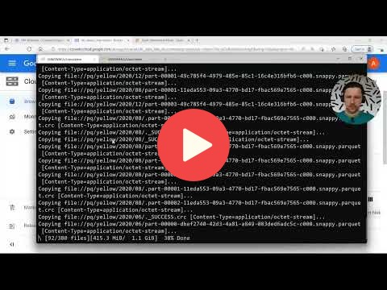](https://youtu.be/Yyz293hBVcQ&list=PL3MmuxUbc_hJed7dXYoJw8DoCuVHhGEQb&index=63)

* :movie_camera: 6.6.2 Creating a Local Spark Cluster

[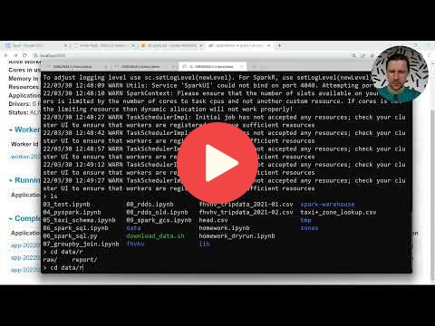](https://youtu.be/HXBwSlXo5IA&list=PL3MmuxUbc_hJed7dXYoJw8DoCuVHhGEQb&index=64)

* :movie_camera: 6.6.3 Setting up a Dataproc Cluster

[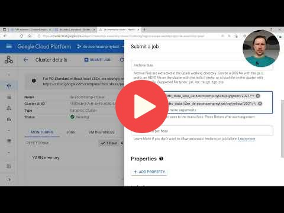](https://youtu.be/osAiAYahvh8&list=PL3MmuxUbc_hJed7dXYoJw8DoCuVHhGEQb&index=65)

* :movie_camera: 6.6.4 Connecting Spark to Big Query

[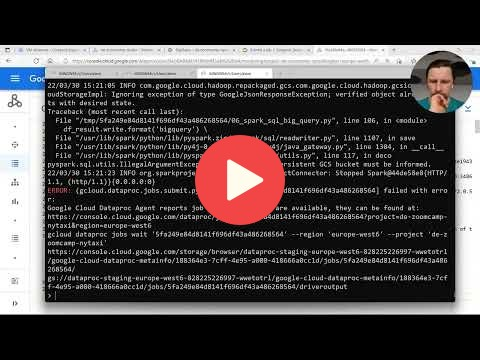](https://youtu.be/HIm2BOj8C0Q&list=PL3MmuxUbc_hJed7dXYoJw8DoCuVHhGEQb&index=66)
