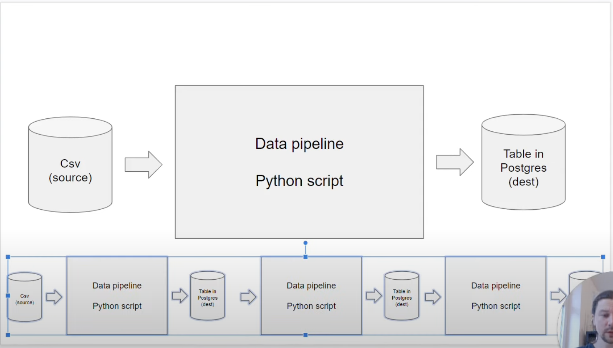
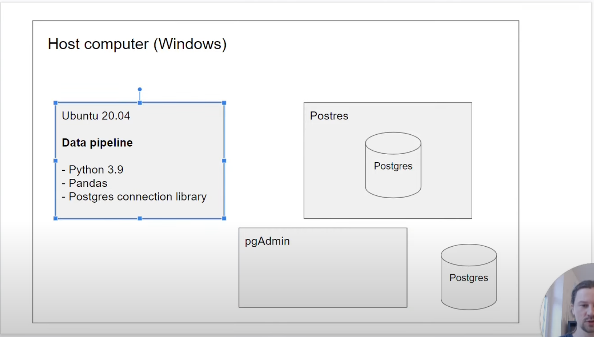
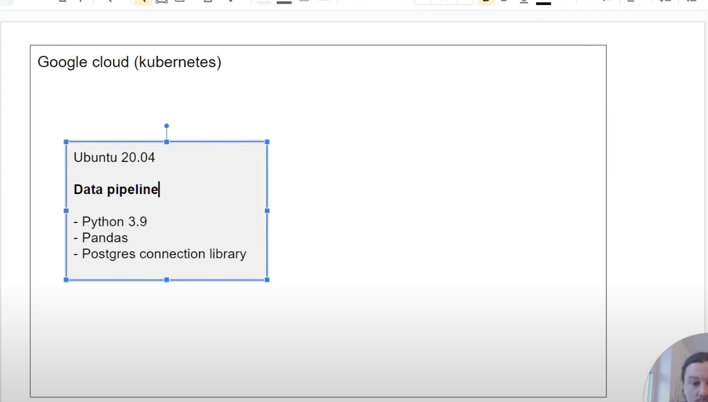
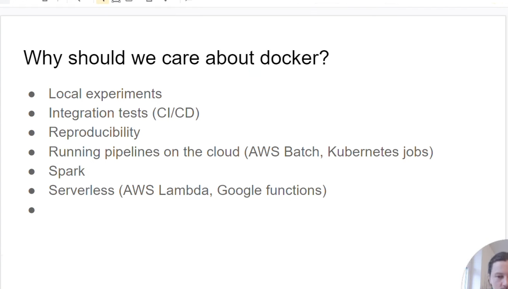

# Github Codespaces
After codespace is up. Check if below are installed:
```bash
python --version
pip list
docker --version
terraform --version
jupyter notebook
```

For terraform installation: 
```bash
wget -O- https://apt.releases.hashicorp.com/gpg | sudo gpg --dearmor -o /usr/share/keyrings/hashicorp-archive-keyring.gpg
echo "deb [signed-by=/usr/share/keyrings/hashicorp-archive-keyring.gpg] https://apt.releases.hashicorp.com $(lsb_release -cs) main" | sudo tee /etc/apt/sources.list.d/hashicorp.list
sudo apt update && sudo apt install terraform
```

For jupyter notebook installation:
```bash
pip install jupyter
```


# Introduction to Docker









## Docker practise

```bash
docker run -it ubuntu bash
```
-it: iteractive mode
ubuntu: image name
bash: command

```bash
docker run -it --entrypoint=bash python:3.9
```
--entrypoint: the inital mode

## Dockerfile
- Dockerfile example:
```Dockerfile
FROM python:3.9
RUN pip install pandas

WORKDIR /app
COPY pipeline.py pipeline.py

ENTRYPOINT [ "bash" ]
```
WORKDIR /app: the intial directory in docker


- Dockerfile build image cmd:
```bash
docker build -t test:pandas .
```
test:pandas is the image name.

# Ingesting NY Taxi Data to Postgres

```bash
docker run -it \
    -e POSTGRES_USER="root"
    -e POSTGRES_PASSWORD="root" \
    -e POSTGRES_DB="ny_taxi" \
    -v ny_taxi_postgres_data:/var/lib/postgressql/data \
    -p 5432:5432 \
    postgres:13
```
ny_taxi_postgres_data: the local volume of postgres in local machine. This will save data if container restart.
/var/lib/postgressql/data: docker postgres data for import


docker run -it -e POSTGRES_USER="postgres" -e POSTGRES_PASSWORD="postgres" -e POSTGRES_DB="ny_taxi" -p 5432:5432 postgres:13


# Connecting pgAdmin and Postgres
To connect pgAdmin and Postgres, the two docker containers needs to be in the same network

Run Postgres (change the path)
```bash
docker run -it \
  -e POSTGRES_USER="root" \
  -e POSTGRES_PASSWORD="root" \
  -e POSTGRES_DB="ny_taxi" \
  -v c:/Users/alexe/git/data-engineering-zoomcamp/week_1_basics_n_setup/2_docker_sql/ny_taxi_postgres_data:/var/lib/postgresql/data \
  -p 5432:5432 \
  --network=pg-network \
  --name pg-database \
  postgres:13
```
--network: the name of the network
--name: the name of the service for idenitification

Run pgAdmin

```bash
docker run -it \
  -e PGADMIN_DEFAULT_EMAIL="admin@admin.com" \
  -e PGADMIN_DEFAULT_PASSWORD="root" \
  -p 8080:80 \
  --network=pg-network \
  --name pgadmin-2 \
  dpage/pgadmin4
```

# Putting the ingestion script into Docker

# Running Postgres and pgAdmin with Docker-Compose

# SQL refresher

# Introduction Terraform: Concepts and Overview


# Terraform Basics: Simple one file Terraform Deployment

```bash
# format the main.tf
terraform fmt 
# inital terraform based on main.tf
terraform init
# Prepare the change
terraform plan
# Apply the change
terraform apply
# Destory the change
terraform destroy
```